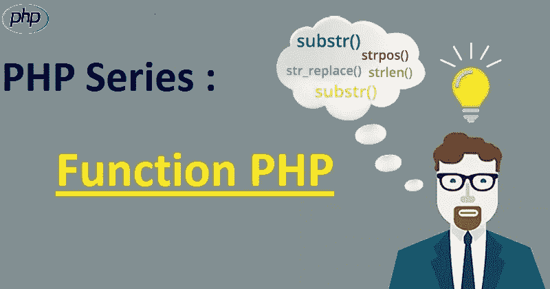

# PHP Series — Fungsi

> 原文：<https://medium.easyread.co/php-series-fungsi-4f44b612ab96?source=collection_archive---------0----------------------->

## Part 9 — Built-in Functions & User-Defined Functions



# PHP Series List

[**0\. PHP Series — Kita Mulai Dari 0, ya!**](https://medium.com/easyread/php-series-kita-mulai-dari-0-ya-25533e6d087e)[**1\. PHP Series — “Know First, then Act”**](https://medium.com/easyread/php-series-think-first-then-act-f1345edc3dea)[**2\. PHP Series — Protokol HTTP**](https://medium.com/easyread/php-series-protokol-http-6f1303940115)[**3\. PHP Series — HTTP Lanjutan**](https://medium.com/@jansutris10/php-series-http-lanjutan-a55e8ab4637d)[**4\. PHP Series — Instalasi XAMPP**](https://medium.com/easyread/php-series-instalasi-xampp-c19f1bf106a9)[**5\. PHP Series — Syntax PHP**](https://medium.com/easyread/php-series-belajar-php-dasar-27221541978c)[**6\. PHP Series — Variabel**](https://medium.com/easyread/php-series-variabel-3986f58b88d1)[**7\. PHP Series — Tipe Data**](https://medium.com/easyread/php-series-tipe-data-7d389bd5d5eb)[**8\. PHP Series — Kondisi**](https://medium.com/easyread/php-series-kondisi-33f8812a380d)**9\. PHP Series — Fungsi — You are here!** [**10\. PHP Series — Perulangan**](https://medium.com/easyread/php-series-perulangan-385d952e9c8a)

Kekuatan nyata PHP terdapat pada fungsi/ *function* .

PHP memiliki lebih dari 1000 fungsi bawaan, dan selain itu anda dapat membuat fungsi kustom anda sendiri.

# PHP Built-in Functions/Fungsi Bawaan PHP

PHP memiliki lebih dari 1000 fungsi bawaan yang dapat dipanggil langsung, dari dalam skrip, untuk melakukan tugas tertentu.

Karena kita pada series ini hanya berfokus pada fungsi yang dibuat oleh pengguna, maka anda dapat melihat referensi PHP untuk gambaran umum lengkap dari fungsi bawaan PHP [**disini**](https://www.w3schools.com/php/php_ref_overview.asp) .

# PHP User Defined Functions/Fungsi Buatan Pengguna PHP

Selain fungsi PHP bawaan, anda juga dimungkinkan untuk membuat fungsi anda sendiri.

***Fungsi*** adalah blok pernyataan yang dapat digunakan berulang kali dalam suatu program. Suatu fungsi tidak akan dieksekusi secara otomatis ketika sebuah halaman dimuat. Suatu fungsi akan dieksekusi oleh panggilan ke fungsi tersebut. Buat fungsi yang ditentukan pengguna dalam PHP deklarasi fungsi yang ditentukan pengguna, dimulai dengan fungsi kata:

**Sintaksis**

```
**function *functionName*() {
 *code to be executed*;
}**
```

***Catatan:*** *Nama fungsi harus dimulai dengan huruf atau garis bawah. Nama fungsi* ***TIDAK*** *peka case-sensitive/huruf besar dan huruf kecil.*

**Tips: Beri nama fungsi yang mencerminkan fungsi itu!**

Pada contoh di bawah ini, kita membuat fungsi bernama **“writeMsg ()”.** Kurung kurawal buka `**{**` menunjukkan awal dari kode fungsi, dan kurung kurawal penutup `**}**` menunjukkan akhir dari fungsi. Fungsi ini menampilkan `**“Hello world!”**` . Untuk memanggil fungsi, cukup tulis namanya diikuti dengan tanda kurung `**()**` :

## PHP Function Arguments/Argumen Fungsi PHP

Informasi dapat diteruskan ke fungsi melalui argumen. Argumen seperti variabel.

Argumen ditentukan setelah nama fungsi, di dalam tanda kurung. Anda dapat menambahkan argumen sebanyak yang Anda inginkan, cukup pisahkan dengan koma.

Contoh berikut memiliki fungsi dengan satu argumen `**($ fname)**` . Saat fungsi `**familyName()**` dipanggil, kita juga perlu memberikan nama misalnya `**(Jansutris)**` , dan nama tersebut digunakan di dalam fungsi tersebut, yang menampilkan beberapa nama depan yang berbeda, tetapi nama belakang yang sama:

Contoh berikut memiliki fungsi dengan dua argumen `**($fname dan $year)**` :

## **PHP adalah** Loosely Typed Language/ **Bahasa yang Diketik Secara Bebas**

Pada contoh di atas, perhatikan bahwa kita tidak perlu memberi tahu PHP tipe data variabelnya.

PHP secara otomatis mengaitkan tipe data ke variabel, tergantung pada nilainya. Karena tipe data tidak diatur dalam arti yang *strict* , anda dapat melakukan hal-hal seperti menambahkan *string* ke *integer* tanpa menyebabkan kesalahan.

Di PHP 7, ketika deklarasi ditambahkan. Ini memberi kita opsi untuk menentukan tipe data yang diharapkan saat mendeklarasikan suatu fungsi, dan dengan menambahkan deklarasi `**strict**` , ia akan melempar ***“Fatal Error/Kesalahan Fatal”*** jika tipe data tidak sesuai.

Pada contoh berikut, kami mencoba mengirim nomor dan *string* ke fungsi tanpa menggunakan `**strict**` :

Untuk menentukan `**strict**` , kita perlu mengatur menyatakan `**(strict_types = 1);**` **.** Ini harus di baris pertama dari *file* PHP.

Dalam contoh berikut ini kami mencoba mengirim nomor dan *string* ke fungsi, tetapi di sini kami telah menambahkan deklarasi `**strict**` :

***Tips:*** *Deklarasi* `***strict***` *memaksa hal-hal untuk digunakan dengan cara yang sesuai.*

## Default Argument Value/Nilai Argumen Default PHP

Contoh berikut menunjukkan cara menggunakan parameter *default* . Jika kita memanggil fungsi `**setHeight()**` tanpa argumen, dibutuhkan nilai *default* sebagai argumen:

## Fungsi PHP — Returning values/Mengembalikan nilai

Untuk membiarkan suatu fungsi mengembalikan nilai, gunakan pernyataan `**return**` :

## Return Type Declarations/Deklarasi Jenis Pengembalian PHP

PHP 7 juga mendukung deklarasi tipe untuk pernyataan `**return**` . Seperti dengan deklarasi tipe untuk argumen fungsi, dengan mengaktifkan persyaratan ketat, itu akan melempar ***“Fatal Error/Kesalahan Fatal”*** pada tipe ketidakcocokan.

Untuk mendeklarasikan tipe untuk fungsi kembali, tambahkan titik dua `**:**` dan tipe tepat sebelum braket keriting pembuka `**{**` saat mendeklarasikan fungsi.

Dalam contoh berikut ini, kita menentukan jenis kembali untuk fungsi:

Anda dapat menentukan jenis pengembalian yang berbeda, dari jenis argumen, tetapi pastikan yang dikembalikan adalah jenis yang benar.