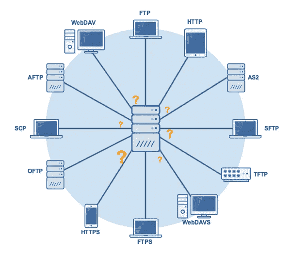
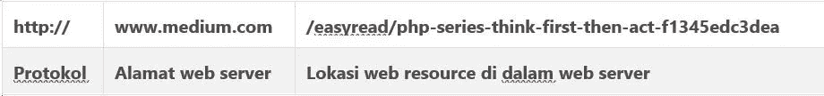
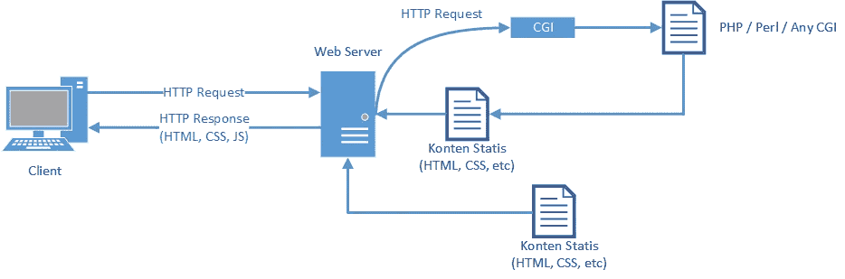

# PHP Series — HTTP Lanjutan

> 原文：<https://medium.easyread.co/php-series-http-lanjutan-a55e8ab4637d?source=collection_archive---------2----------------------->

## Part 3 — Cara Kerja HTTP

Photo by [Ashwini Chaudhary](https://unsplash.com/@suicide_chewbacca?utm_source=unsplash&utm_medium=referral&utm_content=creditCopyText) on [Unsplash](https://unsplash.com/s/photos/http?utm_source=unsplash&utm_medium=referral&utm_content=creditCopyText)

# PHP Series List

[**0\. PHP Series — Kita Mulai Dari 0, ya!**](https://medium.com/easyread/php-series-kita-mulai-dari-0-ya-25533e6d087e)[**1\. PHP Series — “Know First, then Act”**](https://medium.com/easyread/php-series-think-first-then-act-f1345edc3dea)[**2\. PHP Series — Protokol HTTP**](https://medium.com/easyread/php-series-protokol-http-6f1303940115) **3\. PHP Series — HTTP Lanjutan — You’re here** [**4\. PHP Series — Instalasi XAMPP**](https://medium.com/easyread/php-series-instalasi-xampp-c19f1bf106a9)[**5\. PHP Series — Syntax PHP**](https://medium.com/easyread/php-series-belajar-php-dasar-27221541978c)[**6\. PHP Series — Variabel**](https://medium.com/easyread/php-series-variabel-3986f58b88d1)[**7\. PHP Series — Tipe Data**](https://medium.com/easyread/php-series-tipe-data-7d389bd5d5eb)[**8\. PHP Series — Kondisi**](https://medium.com/easyread/php-series-kondisi-33f8812a380d)[**9\. PHP Series — Fungsi**](https://medium.com/easyread/php-series-fungsi-4f44b612ab96)[**10\. PHP Series — Perulangan**](https://medium.com/easyread/php-series-perulangan-385d952e9c8a)

Membicarakan cara kerja HTTP tidak pernah lepas dari bagaimana aplikasi web bekerja. Maka dari itu, supaya lebih mudah memahami, mari bahas terlebih dahulu apa itu aplikasi web, browser, dan protokol.

# Aplikasi Web dan Browser

Web Client

Aplikasi *web* adalah sebuah perangkat lunak ( *software* ) yang dapat diakses menggunakan *browser* . Anda tahu apa itu *browser* ? *Browser* adalah aplikasi yang Anda gunakan untuk mengakses data ( *browsing* ) di internet. Contoh *web browser* seperti F *irefox, Chrome, Safari, Internet Explorer,* dan sejenisnya.

*Nah* ! Supaya lebih mudah, anggap saja aplikasi *web* itu adalah **web server** –meskipun secara teknis di dalam satu *web server* terdapat beberapa aplikasi *web* . **Web server sendiri merupakan sebuah aplikasi jaringan yang berjalan di dalam mesin ( *server* ) yang terhubung dengan port jaringan.**

*Web server* inilah yang menyimpan dan menjalankan kode program aplikasi yang anda buat dengan bahasa pemrograman PHP nanti sehingga bisa diakses melalui *browser* yang beragam.

Sedangkan *browser* pada kasus seperti ini lebih dikenal dengan nama **web client** . Namun secara teknis *web client* bukan hanya *browser* saja melainkan seluruh aplikasi yang dapat berkomunikasi dengan *server* seperti cURL dan Telnet.

# Protokol

Protokol di Internet

*Web-client (browser)* dengan *web-server* (aplikasi web) membutuhkan aturan yang baku untuk bisa saling berkomunikasi yang dikenal dengan nama protokol. **Masih ingat apa itu protokol?**

Protokol merupakan media yang bisa mengkomunikasikan antara dua buah bagian. Contohnya komunikasi antara dua orang yang membutuhkan bahasa atau *grammar* yang sama supaya bisa saling berkomunikasi.

*Nah* , di dalam *computer science* , ketika dua aplikasi ingin saling berkomunikasi membutuhkan kumpulan aturan-aturan yang dikenal dengan nama protokol. Saat ini browser dapat mengenali beberapa standar protokol, seperti FTP, WebSocket, dan HTTP.

# Cara Kerja HTTP Memproses Data

Pertama yang perlu Anda ketahui adalah *web resource* . Contoh dari *web resource* tersebut seperti dokumen HTML, PDF, JSON, dan file-file lainnya yang tersimpan di dalam *web server* .

Supaya *web client* dapat mengakses berbagai macam *resource* di dalam *web server* , mereka menggunakan URL. Nah! Protokol HTTP membantu koneksi yang membantu *web client* untuk mengambil *web resource* yang ada di aplikasi *web* .

Contohnya ketika Anda ingin mengakses: `[***https://medium.com/easyread/php-series-think-first-then-act-f1345edc3dea***](https://medium.com/easyread/php-series-think-first-then-act-f1345edc3dea)` , maka aturannya seperti di tabel berikut ini.

Melalui URL tersebut, protokol HTTP bertugas untuk mengirimkan permintaan ( *request* ) dan memberikan respon ( *response* ) dari request URL yang diberikan. Contohnya seperti menghapus ( *deleted* ), memperbarui ( *update* ), atau mengganti ( *replace* ) file yang ada di dalam *server* .

Setelah permintaan dan respon sudah selesai dijalankan, *web server* tidak mengingat apapun koneksi yang sudah terjadi. Jadi, ketika HTTP mengirimkan permintaan ulang, *web server* akan memprosesnya seperti permintaan awal, itulah mengapa protokol HTTP disebut sebagai *stateless protocol* .

Mekanisme Request dan Response pada HTTP

Sedangkan seluruh proses pengiriman permintaan dari web client sampai dengan respon yang diberikan oleh *web server* merupakan HTTP Transaction.

# Penutup

HTTP adalah komponen *website* yang mengatur pertukaran data yang terjadi di dalam internet. Protokol inilah yang membuat *web-client* (browser) dan *web-server* (aplikasi web) dapat terhubung. Protokol HTTP mengatur proses transmisi dan bagaimana format data dikirimkan. Itulah mengapa protokol HTTP merupakan bagian yang penting. Saking pentingnya HTTP terus dikembangkan ditandai dengan munculnya protokol HTTPS yang menggantikan versi HTTP lama.

Itulah tadi gambaran pengertian, fungsi, dan cara kerja HTTP. Semoga tulisan ini mudah anda pahami. Selamat menikmati!