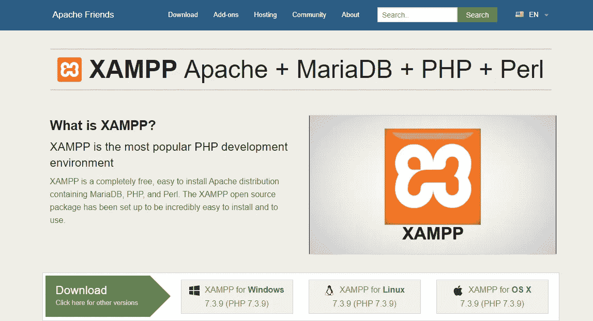
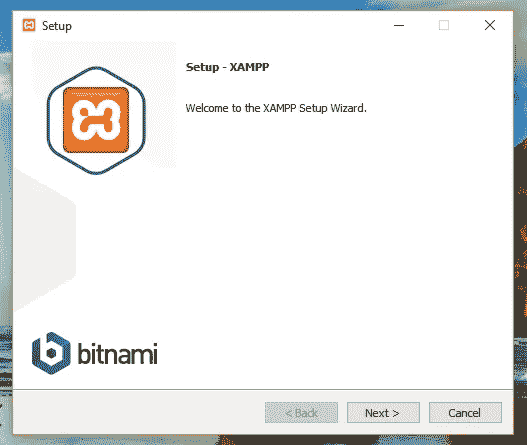
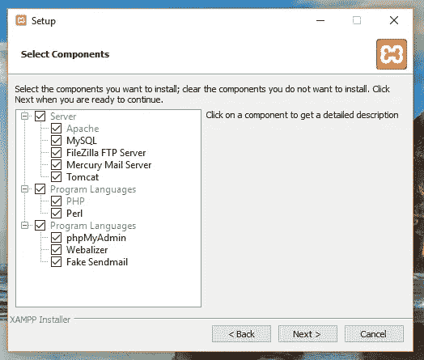
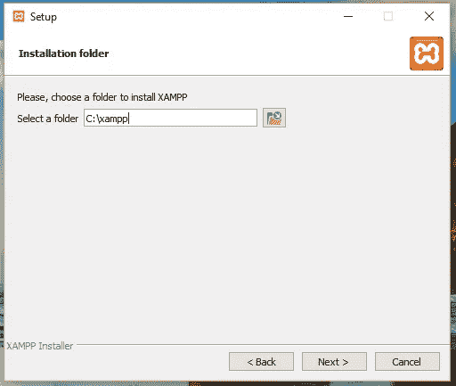
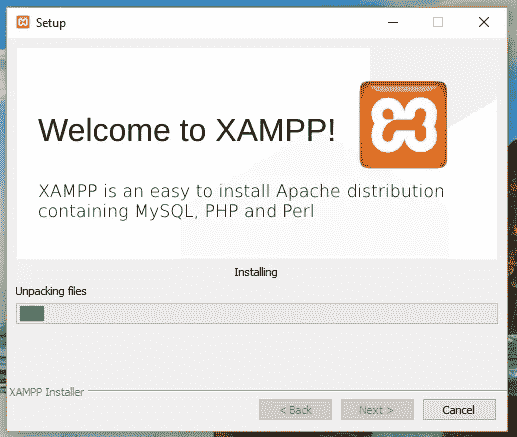

# PHP Series — Instalasi XAMPP

> 原文：<https://medium.easyread.co/php-series-instalasi-xampp-c19f1bf106a9?source=collection_archive---------0----------------------->

## Part 4 — Fungsi dan Instalasi XAMPP

The image was taken from Google Image

# PHP Series List

[**0\. PHP Series — Kita Mulai Dari 0, ya!**](https://medium.com/easyread/php-series-kita-mulai-dari-0-ya-25533e6d087e)[**1\. PHP Series — “Know First, then Act”**](https://medium.com/easyread/php-series-think-first-then-act-f1345edc3dea)[**2\. PHP Series — Protokol HTTP**](https://medium.com/easyread/php-series-protokol-http-6f1303940115)[**3\. PHP Series — HTTP Lanjutan**](https://medium.com/@jansutris10/php-series-http-lanjutan-a55e8ab4637d) **4\. PHP Series — Instalasi XAMPP — You are here!** [**5\. PHP Series — Syntax PHP**](https://medium.com/easyread/php-series-belajar-php-dasar-27221541978c)[**6\. PHP Series — Variabel**](https://medium.com/easyread/php-series-variabel-3986f58b88d1)[**7\. PHP Series — Tipe Data**](https://medium.com/easyread/php-series-tipe-data-7d389bd5d5eb)[**8\. PHP Series — Kondisi**](https://medium.com/easyread/php-series-kondisi-33f8812a380d)[**9\. PHP Series — Fungsi**](https://medium.com/easyread/php-series-fungsi-4f44b612ab96)[**10\. PHP Series — Perulangan**](https://medium.com/easyread/php-series-perulangan-385d952e9c8a)

> Bagi anda yang sedang memperdalam ilmu pembuatan website, mempelajari tentang apa itu XAMPP adalah tahapan awal yang wajib dilakukan jika ingin menghemat anggaran. Karena, XAMPP mampu menggantikan peran web hosting dengan cara menyimpan file website kedalam hosting lokal **(localhost)** agar bisa dipanggil lewat lewat browser.

# Pengertian XAMPP

[**XAMPP**](https://www.apachefriends.org/index.html) adalah sebuah paket perangkat lunak (software) komputer yang sistem penamaannya diambil dari akronim kata Apache, MySQL (dulu)/MariaDB (sekarang), PHP, dan Perl. Sementara imbuhan huruf **“X”** yang terdapat pada awal kata berasal dari istilah ***cross platform*** sebagai simbol bahwa aplikasi ini bisa dijalankan di empat sistem operasi berbeda, seperti OS Linux, OS Windows, Mac OS, dan juga Solaris.

Sejarah mencatat, *software* XAMPP pertama kali dikembangkan oleh tim proyek bernama Apache Friends dan sampai saat ini sudah masuk dalam rilis versi **7.3.9** yang bisa didapatkan secara gratis dengan label GNU (General Public License).

Jika dijabarkan secara gamblang, masing-masing huruf yang ada di dalam nama XAMPP memiliki arti sebagai berikut ini:

## X = Cross Platform

Merupakan kode penanda untuk *software cross platform* atau yang bisa berjalan di banyak sistem operasi.

## A = Apache

Apache adalah aplikasi web server yang bersifat gratis dan bisa dikembangkan oleh banyak orang ( *open source* ).

## M = MySQL / MariaDB

MySQL atau MariaDB merupakan aplikasi database server yang dikembangkan oleh orang yang sama. MySQL berperan dalam mengolah, mengedit, dan menghapus daftar melalui database.

## P = PHP

Huruf “P” yang pertama dari akronim kata XAMPP adalah inisial untuk menunjukkan eksistensi bahasa pemrograman PHP. Bahasa pemrograman ini biasanya digunakan untuk membuat website dinamis, contohnya dalam website berbasis CMS WordPress.

## P = Perl

Sementara itu, untuk huruf P selanjutnya merupakan singkatan dari bahasa pemrograman Perl yang kerap digunakan untuk memenuhi berbagai macam kebutuhan. Perl ini bisa berjalan di dalam banyak sistem operasi sehingga sangat fleksibel dan banyak digunakan.

# Fungsi XAMPP

Program aplikasi XAMPP berfungsi sebagai server lokal untuk mengampu berbagai jenis data website yang sedang dalam proses pengembangan. Dalam prakteknya, XAMPP bisa digunakan untuk menguji kinerja fitur ataupun menampilkan konten yang ada didalam website kepada orang lain tanpa harus terkoneksi dengan internet, atau istilahnya website offline.

XAMPP bekerja secara *offline* layaknya *web hosting* biasa namun tidak bisa diakses oleh banyak orang. Maka dari itu, XAMPP biasanya banyak digunakan oleh para mahasiswa maupun pelajar untuk melihat hasil desain website sebelum akhirnya dibuat online menggunakan web hosting yang biasa dijual dipasaran.

# Cara Menginstall XAMPP pada Windows

Setelah mengenal lebih jauh lewat pengertian XAMPP, anda tentu penasaran dong bagaimana langkah-langkah cara menginstall XAMPP di Laptop atau PC? Caranya tidak jauh berbeda *kok* dibandingkan dengan cara menginstall aplikasi komputer pada umumnya. Berikut panduan instalasi XAMPP selengkapnya:

Anda harus menyiapkan file XAMPP terlebih dahulu dengan cara mengunduh lewat link berikut ini [*http://www.apachefriends.org/en/index.html* .](http://www.apachefriends.org/en/index.html..) File ini bersifat gratis, jadi anda tidak perlu mengeluarkan biaya lisensi sepeserpun.

*Halaman download aplikasi XAMPP*

Jalankan file `**xampp-windows-x64–7.3.9–0-VC15-installer**` atau versi lainnya yang lebih mutakhir.

Akan ada jendela baru yang terbuka sebagai indikasi dimulainya proses instalasi. Pada proses ini anda akan diminta untuk memilih bahasa Indonesia atau English, pilih saja yang bahasa Indonesia kemudian klik next.

*langkah pertama install xampp*

Setelah itu, anda akan diminta untuk memilih komponen yang akan digunakan. Standar untuk server web berbasis CMS WordPress menggunakan MySQL, FileZilla FTP server, dan Apache, sedangkan dari bahasa pemrograman bisa menceklist pilihan phpMyAdmin, PHP, dan Perl. Kemudian klik next.

Pada tahap ini kita diminta untuk memilih lokasi file XAMPP yang akan diinstal, gunakan saja pengatuan default lalu klik next/install.

*menentukan lokasi file XAMPP akan disimpan*

Tunggu beberapa menit sampai proses instalasi XAMPP selesai yang ditandai dengan bar progress seluruhnya berubah menjadi warna hijau.

*proses instalasi XAMPP*

Anda sudah bisa menjalankan program XAMPP di laptop atau PC Windows untuk membuat website secara *offline* menggunakan localhost.

# Bagian-bagian Penting di dalam XAMPP

## 1\. Htdocs

Htdocs merupakan nama sebuah folder bagian dari XAMPP yang berfungsi untuk menyimpan berbagai file dan dokumen yang akan ditampilkan kedalam website. Kapasitas penyimpanan di dalam menu htdocs sendiri bergantung kepada harddisk yang terpasang di perangkat komputer.

## 2\. Control Panel

Seperti namanya, Control Panel memberikan kita akses lebih leluasa dalam mengatur database, mengunggah file, atau melakukan setting lebih detail terkait jeroan website. Dari dalam Control Panel kita juga bisa mengatur stop dan star aplikasi XAMPP agar tidak memberatkan kinerja komputer.

## 3\. PhpMyAdmin

Sama seperti fungsi PhpMyAdmin pada web hosting sesungguhnya, peran PhpMyAdmin dalam aplikasi XAMPP juga diplot sebagai pengatur konfigurasi MySQL. Untuk membuka phpMyAdmin di XAMPP caranya anda bisa langsung mengetikkan URL [http://localhost/phpMyAdmin](http://localhost/phpMyAdmin) .

Sampai sini penjelasan mengenai “Instalasi XAMPP”, semoga bermanfaat!