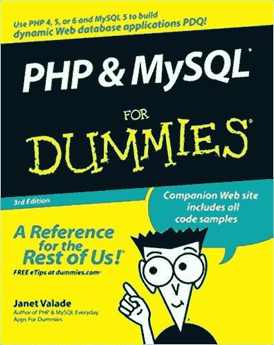

# PHP Series — Kita Mulai Dari 0, ya!

> 原文：<https://medium.easyread.co/php-series-kita-mulai-dari-0-ya-25533e6d087e?source=collection_archive---------0----------------------->

## Part 0 — Motivation

Photo by [http://www.satuharapan.com/read-detail/read/mulai-dari-nol](http://www.satuharapan.com/read-detail/read/mulai-dari-nol)

Kali ini saya akan membuat sebuah series tentang PHP dan akan dibagi kedalam beberapa part yang akan membahas dimulai dari motivasi, sejarah, tahapan instalasi *tools* pengembangan, pembuatan *Hello Word* , Request Method, Kondisi ( *if* ), Perulangan ( *loop* ), Fungsi, format data dan yang terakhir adalah membuat dan menggunakan API di PHP.

# PHP Series List

**0\. PHP Series — Kita Mulai Dari 0, ya! — You’re here** [**1\. PHP Series — “Know First, then Act”**](https://medium.com/easyread/php-series-think-first-then-act-f1345edc3dea)[**2\. PHP Series — Protokol HTTP**](https://medium.com/easyread/php-series-protokol-http-6f1303940115)[**3\. PHP Series — HTTP Lanjutan**](https://medium.com/easyread/php-series-http-lanjutan-a55e8ab4637d)[**4\. PHP Series — Instalasi XAMPP**](https://medium.com/easyread/php-series-instalasi-xampp-c19f1bf106a9)[**5\. PHP Series — Syntax PHP**](https://medium.com/easyread/php-series-belajar-php-dasar-27221541978c)[**6\. PHP Series — Variabel**](https://medium.com/easyread/php-series-variabel-3986f58b88d1)[**7\. PHP Series — Tipe Data**](https://medium.com/easyread/php-series-tipe-data-7d389bd5d5eb)[**8\. PHP Series — Kondisi**](https://medium.com/easyread/php-series-kondisi-33f8812a380d)[**9\. PHP Series — Fungsi**](https://medium.com/easyread/php-series-fungsi-4f44b612ab96)[**10\. PHP Series — Perulangan**](https://medium.com/easyread/php-series-perulangan-385d952e9c8a)

# Begin

Ijinkan saya memulai motivasi ini dengan sedikit perkenalan dan cerita. Perkenalkan, nama saya Jansutris. Sekarang dipercaya sebagai asisten dosen di salah satu kampus IT terbaik di Sumatera Utara. Saya mengampu beberapa matakuliah yang berhubungan dengan topik yang lagi *hype* sekarang yaitu DevOps (Development and Operation) mulai dari Pengembangan Aplikasi berbasis Internet, Virtualisasi Komputer, *System Programming* dan Sistem Tertanam (cikal bakal *Internet of Things* ).

# **Dari Mana Motivasi itu berasal?**

Motivasi pertama saya adalah karena takjubnya saya dengan tulisan teman kampus saya dahulu, yang secara kebetulan orang tua kami bersahabat cukup lama. Nama beliau adalah [Eko Simanjuntak](https://medium.com/u/efc3b4ea41af?source=post_page-----25533e6d087e--------------------------------) . Dia menulis tutorial mengenai Laravel, salah satu framework PHP yang lumayan terkenal dalam bentuk series. Kamu dapat membacanya di [***Laravel Series by Eko***](https://medium.com/easyread/laravel-series/home) .

Bagi kamu yang penasaran seperti apa orangnya, berikut profil Linked-In nya yah.

 [## Eko Simanjuntak - Cloud Platform Engineer - Gojek | LinkedIn

### View Eko Simanjuntak's profile on LinkedIn, the world's largest professional community. Eko has 5 jobs listed on their…

www.linkedin.com](https://www.linkedin.com/in/ecojuntak/) 

Mudah-mudahan artikel kami bisa *engage* ya. Sebab, secara garis besar sama- sama membahas bahasa pemrograman PHP. Jadi, jika kamu telah selesai mengikuti series saya, saya rekomendasikan kamu untuk mengikuti series Laravel beliau.

> “Thanks lae Eko.. udah motivasi aku untuk re-learn and share again!”

# **Motivasi Kedua**

Saya sering menjadi tempat curhat mahasiswa, terutama mahasiswa Informatika tempat saya mengajar, mereka ngomong seperti berikut:

> ***“Bang, kenapa yaa belajar sesuatu itu harus lompat-lompat, baru seminggu kami belajar PHP sudah langsung array dan function topiknya, maunya kan bang dari awal diajari trus kalau boleh berurut gitu bang. jadi bingung kami bang dibuat si PHP ini. aslilah udah berapa week awak masuk bang, tapi macam gak ada pengetahuan ku yang tambah, kekmananya itu bang? ajari dulu kami bang….”***

Curhat salah satu mahasiswa kepada saya. Ya, memang ujung-ujungnya minta diajari juga. Dari titik inilah, saya merasa terbeban sekaligus termotivasi untuk buat PHP series yang mudah-mudahan cukup komprehensif dan sederhana. Kalau boleh dikasi judul kedua, series ini mirip dengan nama buku yang pernah saya baca.

[https://www.goodreads.com/book/show/40549.PHP_MySQL_For_Dummies](https://www.goodreads.com/book/show/40549.PHP_MySQL_For_Dummies)

# FOR DUMMIES?

Sebenarnya apa sih yang dimaksud *For Dummies* ini?

Pada kamus online tersebut dijelaskan bahwa kata *Dummies* berarti *One who is dumb* (seseorang yang bisu), *A thick-witted person* ; *ADolt* (Orang bodoh; tolol), dan masih ada beberapa pengertian lagi.

Di sini saya lebih menyukai kata bodoh dan tolol (belum bisa) sebagai terjemahan kata *Dummies* ke dalam bahasa Indonesia.

Jika kata Dummies digabungkan dengan kata *For* maka akan terbentuk sebuah pengertian yaitu *untuk orang bodoh, untuk orang tolol,* atau kalau pengertian yang lebih sopan adalah *untuk orang yang belum bisa* .

Dari penjelasan saya di atas, jika kita mengartikan sebuah judul Buku yang mengandung kata *For Dummies* ini, maka buku tersebut mengacu kepada orang yang tidak bisa. Dengan kata lain series ini juga saya buat untuk seorang pemula atau yang baru belajar.

# Tetaplah “Merasa Bodoh”!

Mungkin judul kedua saya diatas terkesan kasar. Tapi percayalah, kata-kata kasar itu lebih ampuh dari pada kata-kata yang lembut untuk memantik semangat anda untuk **“Back to Track”** . Bisa anda pakai terus, ketika anda mulai malas belajar atau kehilangan gairah untuk mengeksplorasi sesuatu hal. Kamu dapat berkata dalam hati seperti berikut.

> “Sekarang aku bodoh, walaupun aku mempelajari sesuatu hal dan aku mengerti, aku tetap saja masih merasa bodoh, oleh karena itu, aku harus terus belajar…”

Motivasi saya juga diatas juga sejalan dengan *quote* -nya Bang Steve Jobs dalam sebuah pidatonya di Stanford University tentang pengalaman hidup yang dialaminya selama 56 tahun. Inilah 5 pelajaran hidup dari Steve Jobs.

Photo from [https://en.wikipedia.org/wiki/Steve_Jobs](https://en.wikipedia.org/wiki/Steve_Jobs)

## 1\. Ikuti kata hati dan percaya dengan apa yang ingin dilakukan

> “Saya tidak tahu apa yang ingin saya lakukan dan tidak tahu bagaimana kuliah membantu saya. Di sini saya menghabiskan semua uang orang tua saya yang dikumpulkan sepanjang hidup mereka. Jadi saya memutuskan untuk drop out dan percaya bahwa semuanya akan baik-baik saja. Sangat menakutkan pada saat itu, namun juga merupakan salah satu keputusan terbaik yang pernah saya buat.”

## 2\. Semua itu ada hikmahnya

> Saya bahkan berpikir untuk lari dari Sillicon Valley. Tetapi perlahan saya sadar bahwa Saya masih menyukai pekerjaan ini dan memutuskan untuk memulai ulang dari awal.

***Note: Jadi bagi mahasiswa yang pengen resign karena kerasnya kehidupan kampus, percayalah semua itu ada hikmahnya dan mulailah kembali dari awal, anda belum terlambat.* cmiiw!**

## 3\. Lakukanlah sesuatu seakan-akan kamu akan mati besok

> Ketika berusia 17 tahun, Steve membaca sebuah catatan yang sangat mengesankan, isinya kurang lebih seperti di atas. Sejak saat itu, setiap hari Steve bercermin di depan kaca dan bertanya pada dirinya sendiri.
> 
> “Jika hari ini adalah hidup terakhir saya, Apa saya bisa melakukan apa yang ingin saya dapatkan? jawabannya selalu ‘Tidak’. Namun, setelah beberapa hari mengulang pertanyaan yang sama, akhirnya saya sadar bahwa saya harus mengubah sesuatu,” kata Steve.

## 4\. Ikuti kata hatimu

> Jangan sia-siakan hidup untuk mengikuti hidup orang lain. Jangan terperangkap dengan dogma yang hidup dari hasil pemikiran orang lain. Jangan biarkan kebisingan pendapat orang lain menenggelamkan suara batinmu sendiri. Dan, yang paling penting, kamu harus memiliki keberanian untuk mengikuti kata hati dan intuisi sendiri. Entah bagaimana, mereka sudah tahu apa yang benar-benar kamu ingin lakukan. Segala sesuatu yang lain adalah sekunder.

## 5\. Stay hungry. Stay foolish

> Steve mengakhiri pidatonya dengan kalimat yang ia ambil dari sampul belakang edisi terakhir dari katalog Whole Earth Catalog. ”Stay hungry stay foolish!”, yang memiliki arti agar kita terus memiliki ambisi dan jangan pernah takut mengambil sebuah risiko dalam hidup.

# End

Inti dari semua motivasi diatas adalah:

## *Jadi, supaya anda bisa jago PHP, teruslah belajar* ***.***