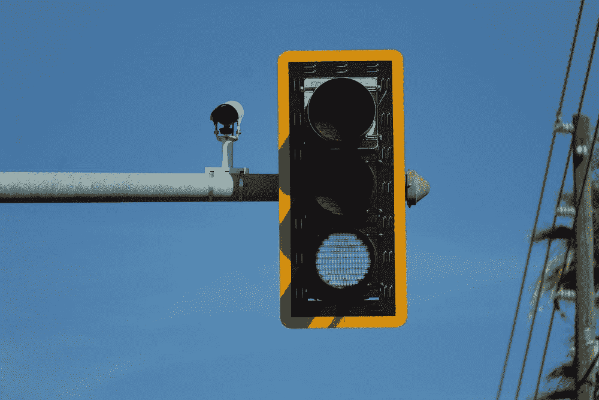
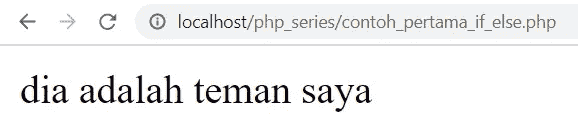
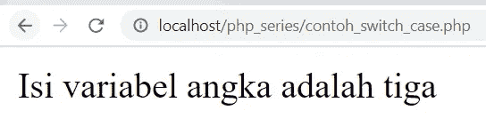

# PHP Series — Kondisi

> 原文：<https://medium.easyread.co/php-series-kondisi-33f8812a380d?source=collection_archive---------0----------------------->

## Part 8 — IF, Else, Switch-Case

[**0\. PHP Series — Kita Mulai Dari 0, ya!**](https://medium.com/easyread/php-series-kita-mulai-dari-0-ya-25533e6d087e)
[**1\. PHP Series — “Know First, then Act”**](https://medium.com/easyread/php-series-think-first-then-act-f1345edc3dea)
[**2\. PHP Series — Protokol HTTP**](https://medium.com/easyread/php-series-protokol-http-6f1303940115)
[**3\. PHP Series — HTTP Lanjutan**](https://medium.com/easyread/php-series-http-lanjutan-a55e8ab4637d)
[**4\. PHP Series — Instalasi XAMPP**](https://medium.com/easyread/php-series-instalasi-xampp-c19f1bf106a9)
[**5\. PHP Series — Syntax PHP**](https://medium.com/@jansutris10/php-series-belajar-php-dasar-27221541978c)
[**6\. PHP Series — Variabel**](https://medium.com/@jansutris10/php-series-variabel-3986f58b88d1)[**7\. PHP Series — Tipe Data**](https://medium.com/@jansutris10/php-series-tipe-data-7d389bd5d5eb)
**8\. PHP Series — Kondisi — You are here!** [**9\. PHP Series — Fungsi**](https://medium.com/easyread/php-series-fungsi-4f44b612ab96)[**10\. PHP Series — Perulangan**](https://medium.com/easyread/php-series-perulangan-385d952e9c8a)

Traffic light from Unsplash

# IF-ELSE

Kondisi *If Else* bisa anda ibaratkan dengan pengecekan jika maka pada kenyataannya. Fungsi *if else* sangat dibutuhkan pada saat Anda ingin memeriksa sebuah kondisi.

Pada setiap logika terkadang kita memerlukan pengecekan suatu nilai yang jika terpenuhi untuk melakukan sesuatu dan jika pengecekan pertama tidak terpenuhi maka ada pengecekan kedua yaitu *else* . Dapat kita bayangkan tentang kondisi *if else* ini seperti misalnya anda memiliki seorang teman.

Jika nama teman Anda tersebut adalah **Andi** maka dia adalah laki-laki jika tidak maka dia adalah perempuan. Berikut adalah contoh dari kondisi *if else* PHP.

## Mengenal Kondisi If-Else

Kondisi *If-Else* di perlukan untuk memeriksa suatu nilai untuk melakukan suatu aksi. Berikut ini adalah format cara penulisan *if else* pada PHP.

Contoh sederhana penggunaan kondisi *if else* pada PHP. Buat sebuah file PHP dengan nama **belajar.php.**

Hasilnya:

Perhatikan pada contoh di atas, *variabel* teman berisi “andi”, kemudian kita melakukan pengecekan pada variabel **teman** . Jika variabel teman sama dengan **budi** , maka tampilkan dia adalah teman saya. Jika tidak tampilkan dia bukan teman saya.

kondisi **“else-if”** di gunakan jika anda membutuhkan pengecekan kondisi kedua atau seterusnya jika kondisi pertama tidak terpenuhi.

# Switch-Case

Perintah *Switch* di gunakan untuk memeriksa kebenaran suatu nilai dengan memiliki banyak pemilihan atau nilai pengecekannya.

Berikut contoh penulisan dan penggunaan *Switch Case* pada PHP.

Hasilnya:

Perhatikan pada contoh di atas. Variabel yang ingin di periksa adalah variabel angka. Variabel angka berisi angka 3\. Jika variabel angka sama dengan 1 maka di tampilkan “isi variabel angka adalah satu”, jika variabel angka sama dengan 2 maka di tampilkan “isi variabel angka adalah dua”, jika variabel angka sama dengan 3 maka di tampilkan “isi variabel angka adalah tiga”, sampai seterusnya.

Jika suatu nilai di temukan maka akan di jalankan perintahnya masing-masing. Perintah **break** di sini berfungsi untuk menghentikan pengecekan jika suatu pengecekan sudah terpenuhi kebutuhannya.

Jika seluruh pengecekan tidak terpenuhi atau tidak ada yang sesuai maka akan di jalankan nilai default yang menampilkan **“isi variabel tidak di temukan”.**