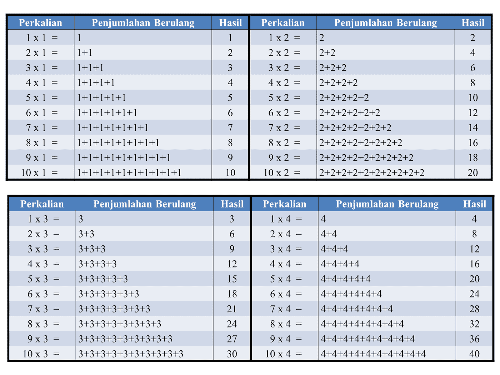

# PHP Series — Perulangan

> 原文：<https://medium.easyread.co/php-series-perulangan-385d952e9c8a?source=collection_archive---------1----------------------->

## Part 10— While, Do…While, For dan Foreach



sumber foto: [https://azmi648.blogspot.com/](https://azmi648.blogspot.com/)

# PHP Series List

[**0\. PHP Series — Kita Mulai Dari 0, ya!**](https://medium.com/easyread/php-series-kita-mulai-dari-0-ya-25533e6d087e)[**1\. PHP Series — “Know First, then Act”**](https://medium.com/easyread/php-series-think-first-then-act-f1345edc3dea)[**2\. PHP Series — Protokol HTTP**](https://medium.com/easyread/php-series-protokol-http-6f1303940115)[**3\. PHP Series — HTTP Lanjutan**](https://medium.com/@jansutris10/php-series-http-lanjutan-a55e8ab4637d)[**4\. PHP Series — Instalasi XAMPP**](https://medium.com/easyread/php-series-instalasi-xampp-c19f1bf106a9)[**5\. PHP Series — Syntax PHP**](https://medium.com/easyread/php-series-belajar-php-dasar-27221541978c)[**6\. PHP Series — Variabel**](https://medium.com/easyread/php-series-variabel-3986f58b88d1)[**7\. PHP Series — Tipe Data**](https://medium.com/easyread/php-series-tipe-data-7d389bd5d5eb)[**8\. PHP Series — Kondisi**](https://medium.com/easyread/php-series-kondisi-33f8812a380d)[**9\. PHP Series — Fungsi**](https://medium.com/easyread/php-series-fungsi-4f44b612ab96) **10\. PHP Series — Perulangan — You are here!**

# Perulangan/Loop

Seringkali ketika anda menulis kode, anda ingin blok kode yang sama terus berulang beberapa kali. Jadi, daripada anda menambahkan beberapa baris kode yang hampir sama dalam sebuah skrip, kita dapat menggunakan *loop* .

*Loop* digunakan untuk mengeksekusi blok kode yang sama berulang kali, selama kondisi tertentu benar.

Di series ini, kita akan membahas jenis *loop* berikut:

```
**while — loop** melalui blok kode selama kondisi yang ditentukan benar.**do … while — loop** melalui blok kode minimal sekali, dan kemudian mengulangi loop selama kondisi yang ditentukan benar.**for — loop** melalui blok kode beberapa kali**foreach — loop** melalui blok kode untuk setiap elemen dalam array.
```

Series berikut akan menjelaskan dan memberikan contoh dari masing-masing jenis *loop* .

## While — Loop

```
**Syntax:***while (kondisi adalah benar) {
 kode program akan dieksekusi;
}*
```

## Contoh 1

Contoh di bawah ini menampilkan angka dari 1 hingga 5:

## Penjelasan

`**$x = 1;**` — Inisialisasi penghitung lingkaran `**$x**` , dan tetapkan nilai awal ke 1
`**$x <= 5**` — Lanjutkan *loop* selama `**$x**` kurang dari atau sama dengan 5
`**$x++;**` — Tingkatkan nilai penghitung *loop* dengan 1 untuk setiap iterasi

## Contoh 2

## Penjelasan

`**$x = 0;**` — Inisialisasi penghitung lingkaran `**$x**` , dan tetapkan nilai awal ke 0
`**$x <= 100**` — Lanjutkan loop selama `**$x**` kurang dari atau sama dengan 100
`**$x+ = 10;**` — Tingkatkan nilai penghitung *loop* sebesar 10 untuk setiap iterasi

# Do…while Loop

*Do* … *while* akan selalu menjalankan blok kode sekali, kemudian akan memeriksa kondisinya, dan mengulangi *loop* sementara kondisi yang ditentukan benar.

```
**Syntax:***do {
 kode program yang akan dieksekusi;
} while (kondisi terpenuhi);*
```

## **Catatan:**

Dalam **do … while** , kondisinya diuji **SETELAH** mengeksekusi pernyataan dalam *loop* . Ini berarti bahwa *loop do* … *while* akan menjalankan pernyataannya **setidaknya satu kali** , walaupun kondisinya salah. Lihat contoh di bawah ini.

# For Loop

```
**Syntax***for (init counter; test counter; increment counter) {
  kode program yang akan dieksekusi di tiap perulangan;
}*
```

## Parameter:

`**init counter:**` Menginisialisasi nilai penghitung loop
`**test counter:**` Dievaluasi untuk setiap iterasi loop. Jika bernilai TRUE, *loop* berlanjut. Jika mengevaluasi ke FALSE, *loop* berakhir.
`**increment counter:**` Meningkatkan nilai *loop counter*

## Contoh 1

Contoh di bawah ini menampilkan angka dari 0 hingga 10:

**Penjelasan**
`**$x = 0;**` — Inisialisasi penghitung lingkaran `**$x**` , dan tetapkan nilai awal ke 0
`**$x <= 10;**` — Lanjutkan *loop* selama `**$x**` kurang dari atau sama dengan 10
`**$x++**` — Tambahkan nilai penghitung lingkaran sebanyak 1 untuk setiap iterasi

## Contoh 2

Contoh ini perulangan hingga100 dengan puluhan:

**Penjelasan**
`**$x = 0;**` — Inisialisasi penghitung lingkaran `**$x**` , dan tetapkan nilai awal ke 0
`**$x <= 100;**` — Lanjutkan *loop* selama `**$x**` kurang dari atau sama dengan 100
`**$x + = 10**` — Tingkatkan nilai penghitung *loop* sebesar 10 untuk setiap iterasi

# Foreach Loop

*Foreach loop* hanya bekerja pada **array** , dan digunakan untuk *loop* melalui setiap pasangan kunci / nilai dalam *array* .

```
**Syntax***foreach ($array as $value) {
 code to be executed;
}*
```

**Penjelasan**

Untuk setiap iterasi *loop* , nilai elemen *array* saat ini ditetapkan ke **$value** dan *pointer array* digerakkan oleh satu, sampai mencapai elemen *array* terakhir.

## **Contoh 1**

Contoh berikut akan menampilkan nilai *array* yang diberikan ( `**$colors**` ):

## **Contoh 2**

Contoh berikut akan menampilkan **kunci** dan **nilai array** yang diberikan ( `**$age**` ):