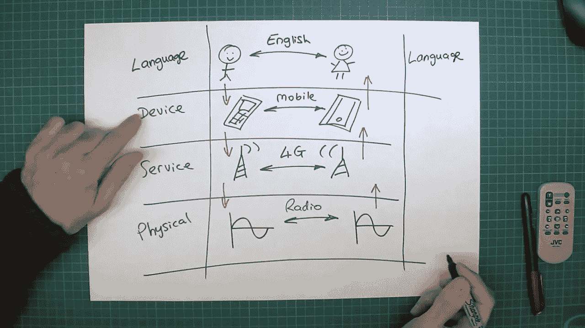
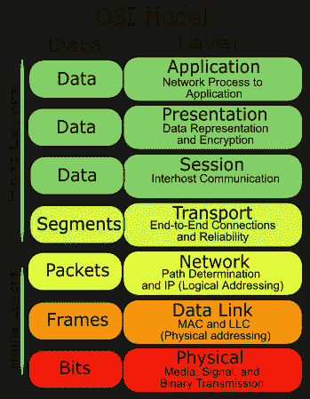
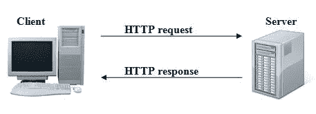
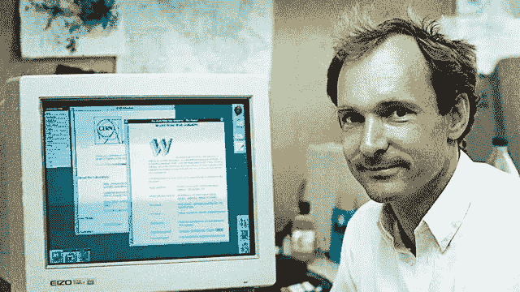
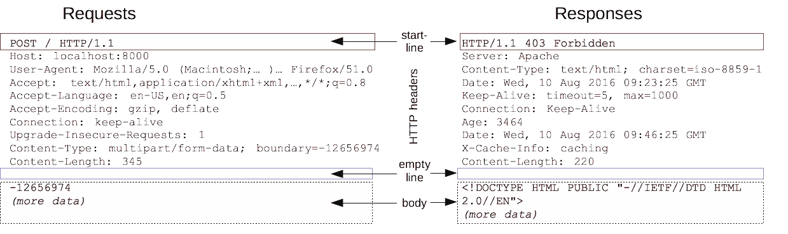
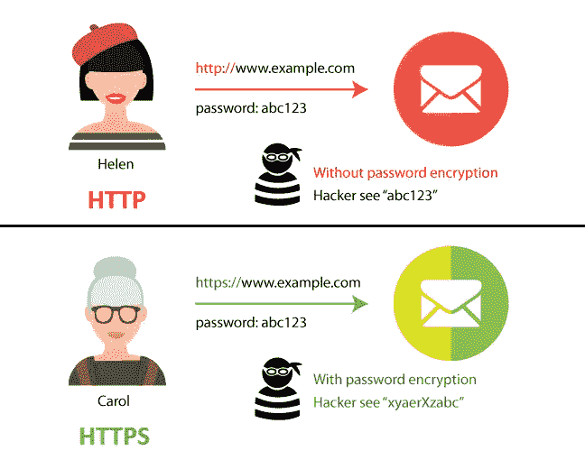

# PHP Series — Protokol HTTP

> 原文：<https://medium.easyread.co/php-series-protokol-http-6f1303940115?source=collection_archive---------0----------------------->

## Part 2 — Pengenalan dan Fungsi HTTP

Photo by [Caspar Camille Rubin](https://unsplash.com/@casparrubin?utm_source=unsplash&utm_medium=referral&utm_content=creditCopyText) on [Unsplash](https://unsplash.com/s/photos/http?utm_source=unsplash&utm_medium=referral&utm_content=creditCopyText)

# PHP Series List

[**0\. PHP Series — Kita Mulai Dari 0, ya!**](https://medium.com/easyread/php-series-kita-mulai-dari-0-ya-25533e6d087e)[**1\. PHP Series — “Know First, then Act”**](https://medium.com/easyread/php-series-think-first-then-act-f1345edc3dea) **2\. PHP Series — Protokol HTTP — You’re here** [**3\. PHP Series — HTTP Lanjutan**](https://medium.com/easyread/php-series-http-lanjutan-a55e8ab4637d)[**4\. PHP Series — Instalasi XAMPP**](https://medium.com/easyread/php-series-instalasi-xampp-c19f1bf106a9)[**5\. PHP Series — Syntax PHP**](https://medium.com/easyread/php-series-belajar-php-dasar-27221541978c)[**6\. PHP Series — Variabel**](https://medium.com/easyread/php-series-variabel-3986f58b88d1)[**7\. PHP Series — Tipe Data**](https://medium.com/easyread/php-series-tipe-data-7d389bd5d5eb)[**8\. PHP Series — Kondisi**](https://medium.com/easyread/php-series-kondisi-33f8812a380d)[**9\. PHP Series — Fungsi**](https://medium.com/easyread/php-series-fungsi-4f44b612ab96)[**10\. PHP Series — Perulangan**](https://medium.com/easyread/php-series-perulangan-385d952e9c8a)

Ketemu lagi dengan saya [**Jansutris**](https://www.linkedin.com/in/jansutris-apriten-purba/) di PHP *Series* . Pada PHP *series* kali ini saya akan membahas salah satu protokol bernama **HTTP** . Tujuan saya membahas protokol ini untuk menjelaskan bahwa setiap *Software Engineer* (SE) terutama *web developer* harus mengetahui proses *logic* bagaimana aplikasi itu bisa diakses.

Tak jarang saya temukan SE yang menguasai banyak bahasa pemrograman bahkan *framework* kalah dalam tes magang atau *full time* hanya karena mereka tidak bisa menjelaskan apa itu HTTP. Beberapa pertanyaan seperti termasuk dalam *layer* apakah HTTP pada OSI? Bagaimana proses *request* dan *response* pada HTTP? dan sebagainya, tidak dapat mereka jawab.

Seketika SE ini merasa tidak ada gunanya menguasai banyak bahasa *pemrograman* dan *framework* . Ada juga SE yang bahkan menghujat *interviewer* dengan berkata seperti berikut:

> “Kenapa ya, yang muncul pertanyaan seperti itu? Kenapa ya kita gak ditanya pertanyaan yang lebih susah aja? Bukannya ini dulu dipelajari di mata kuliah jaringan komputer ya? Pastilah sudah lupa aku!”

*Image taken from Google Images*

Maka berangkat dari kasus ini, saya berinisiatif melanjutkan PHP *series* dengan topik HTTP.

Pernahkah muncul pertanyaan di benak Anda kenapa halaman website dapat diakses hanya menggunakan alamat *domain* ? Tahukah Anda bahwa itu semua bisa terjadi berkat adanya HTTP? Ya, semua itu berhubungan dengan HTTP. HTTP adalah bagian yang penting dan tidak terpisahkan pada proses *browsing* , pengiriman *file* , dan berbagai hal yang berhubungan dengan aplikasi *web* . Kenapa penting? **Yuk simak ulasan lengkapnya pada PHP *series* ini.**

**Melalui part ini, saya akan coba untuk mengenalkan kepada teman-teman beberapa hal berikut:** 1\. Apa yang dimaksud dengan *protocol* ?2 *.* Apa yang dimaksud dengan TCP/IP?
3\. Apa yang dimaksud dengan OSI *layer* ?
4\. Analogi Model OSI
5 *. Application Layer* 6\. Pengertian HTTP dan Sejarahnya
7\. Fungsi HTTP
8\. Cara kerja HTTP

# Apa itu Protocol?

Analoginya, ketika ingin membuat sebuah bangunan, tentunya kita butuh yang namanya *blueprint* , bagaimana pondasinya, desain internal, desain external, tata letak ruangan, hingga alur-alur kelistrikan, gas, pembuangan asap, dan lain sebagainya.

*Image taken from Google Images*

Dengan adanya *blueprint* tersebut, semua pihak yang mengerjakan bangunan tersebut akan bisa bekerja dengan baik, dari tukang listrik, tukang cat, *desainer interior* , dan seterusnya sudah mengikuti acuan yang sama.

> Jadi, protocol merupakan cara agar setiap perangkat yang berbeda-beda bisa saling berkomunikasi dengan efektif baik secara perangkat lunak maupun perangkat keras.

# Apa itu TCP/IP?

TCP/IP bisa di analogikan seperti bahasa. Ketika manusia bertukar informasi, manusia akan berbicara dengan bahasa yang bisa dimengerti oleh pembicara maupun pendengar. Begitu juga halnya dengan komputer atau *host* dalam sebuah jaringan.

Agar komunikasi dan pertukaran informasi bisa terjalin dengan baik, dibutuhkan bahasa yang sama. Walaupun merk *host* jaringan tersebut berbeda-beda, *host* masih bisa berkomunikasi dengan *host* lain karena menggunakan standart komunikasi yang sama, yakni TCP/IP.

*Image taken from Google Images*

Protokol internet pertama kali dirancang pada tahun 1980-an. Akan tetapi di tahun 1990-an dimana internet semakin populer dan *host* yang semakin banyak, mulai bermunculan protokol yang hanya bisa digunakan oleh kalangan tertentu, atau protokol yang dibuat oleh pabrik tertentu yang belum tentu kompatibel dengan protokol lain dari pabrik yang lain pula.

Sehingga pada akhirnya badan **International Standart Organization (ISO)** membuat standarisasi protokol yang saat ini dikenal dengan protokol model *Open System Interconnection* atau disingkat OSI. Model OSI ini menjadi referensi dan konsep dasar teori tentang cara kerja sebuah protokol. Dalam perkembangannya TCP/IP digunakan sebagai **standart de facto.**

# **Apa itu OSI Layer?**

Ketika ISO (International Standart Organization) membuat standarisasi protokol, maka terciptalah sebuah standar model referensi yang berisi cara kerja protokol. Model referensi yang kemudian disebut dengan *Open System Interconnection* (OSI). Berdasarkan dokumen rekomendasi X.200, standart OSI ini memiliki 7 *layer* . Tiap *layer* ini memiliki definisi fungsi yang berbeda.

Lapisan/Model OSI

## Analogi Model OSI — Pengiriman Surat

Proses pengiriman data melewati tiap layer ini bisa kita analogikan seperti ketika kita mengirim surat.

1.  Isi surat adalah data yang akan kita kirim ( *layer* 7 - > 5).
2.  Kemudian sesuai standart pengiriman, isi surat tersebut kita masukkan kedalam sebuah amplop ( *layer* — 4).
3.  Agar surat kita bisa terkirim, kita perlu menambahkan alamat kemana surat tersebut akan dikirim, juga siapa pengirim surat tadi ( *layer* — 3).
4.  Selanjutnya surat tersebut kita serahkan ke pihak ekspedisi, dan pihak ekspedisi yang nanti akan mengirimkan surat kita tadi ( *layer* — 2 & 1).

# ***Layer 7: Application Layer***

Merupakan *layer* dimana terjadi interaksi antarmuka *end user* dengan aplikasi yang bekerja menggunakan fungsionalitas jaringan, melakukan pengaturan bagaimana aplikasi bekerja menggunakan *resource* jaringan, untuk kemudian memberikan pesan ketika terjadi kesalahan. Beberapa *service* dan protokol yang berada di *layer* ini misalnya HTTP, FTP, SMTP, dll.

Dikarenakan kita sekarang sedang membahas protokol HTTP maka kita terfokus pada Application Layer.

# Pengertian HTTP

**Apa itu HTTP?**

HTTP adalah protokol jaringan lapisan aplikasi ( *application layer* ) yang dikembangkan untuk membantu proses transfer antar komputer. Protokol ini berguna untuk mentransfer informasi seperti dokumen, *file* , gambar, dan video antar komputer.

Sesuai dengan namanya, penggunaan protokol HTTP ( *Hypertext Transfer Protocol* ) berhubungan dengan *hypertext* sehingga banyak mengambil sumber daya dari sebuah tautan-sebuah jenis berkas yang bertindak sebagai referensi ke berkas lainnya atau direktori.

Protokol HTTP menyediakan kumpulan perintah di dalam komunikasi antar jaringan. Komunikasi tersebut berlangsung antara *web server* dengan komputer *client* atau sebaliknya. Di dalam komunikasi ini, komputer *client* melakukan permintaan dengan mengakses alamat IP atau domain (URL). Kemudian *web server* mengelola permintaan tersebut sesuai dengan kode yang dimasukkan.

Mekanisme Request dan Response

Contoh yang paling sederhana penggunaan protokol HTTP adalah komunikasi antara komputer *client* dengan *web server* .

Komputer melakukan permintaan menggunakan *browser* ke *web server.* Kemudian *web server* menanggapi permintaan tersebut dengan mengirimkan data/dokumen yang tersedia di dalam *web server* sesuai dengan permintaan komputer *client* .

Sebenarnya, ada protokol lain untuk bertukar data dan informasi seperti SMTP, FTP, IMAP atau POP3\. Namun protokol HTTP yang paling banyak digunakan dibanding dengan yang lainnya. Alasannya karena HTTP pertama kali memang didesain untuk mengelola dokumen HTML dan mengirimkannya kepada *client* .

## Sejarah HTTP

HTTP atau *Hypertext Transfer Protocol* pertama kali digunakan dalam WWW yaitu sekitar tahun 1990\. Protokol HTTP yang digunakan pada saat itu adalah versi 0.9 yang merupakan protokol transfer data dengan data mentah yang dikirimkan tanpa melihat tipe dari dokumen itu sendiri. Selanjutnya pada tahun 1996, protokol HTTP mengalami perkembangan sehingga menjadi protokol HTTP versi 1.0\. Dan pada tahun 1999 dikeluarkan HTTP versi selanjutnya yaitu 1.1 untuk mengakomodasi *proxy, cache* dan koneksi yang persisten.

Tim Berners-Lee

Sebuah *client* HTTP biasanya memulai permintaan dengan menciptakan sebuah hubungan ke *port* tertentu di sebuah *server web hosting* tertentu. Umumnya *port* yang digunakan adalah port 80\. *Client* juga sering dikenal dengan **user agent** , sedangkan *server* yang meresponnya dan juga menyimpan sumber daya seperti berkas HTML dan gambar disebut dengan **origin server** .

Diantara kedua *user agent* dan origin *server* bisa saja ada penghubung, seperti misalnya *geteway, tunnel* dan *proxy* . Selanjutnya, sumber yang ingin diakses dengan menggunakan HTTP diidentifikasi dengan menggunakan **URL (Uniform Resource Locator)** dengan skema URL http: atau https:.

# Fungsi HTTP

Fungsi HTTP, yaitu:

## **Mengatur format dan bagaimana data ditransmisikan.**

HTTP juga berfungsi untuk mengatur bagaimana *web server* dan *browser* memproses berbagai macam perintah yang masuk.

Format pengiriman dan penerimaan data pada HTTP

Contohnya saja, ketika Anda memasukkan domain (URL) di dalam *browser* . URL yang Anda masukkan tersebut merupakan sebuah perintah ke dalam *web server* untuk memberikan data halaman *website* sesuai dengan alamat yang diakses. Hasil dari perintah ini adalah tampilan halaman *website* yang muncul melalui *web browser* .

## **Mengamankan data dari pencurian dan cracker** .

Hal ini ditandai dengan munculnya HTTPS ( *Hypertext Transfer Protocol Secure* ). Secara fungsi sama, yaitu mengatur bagaimana data diproses. Hanya saja HTTPS lebih aman dibandingkan dengan HTTP.

HTTP vs HTTPS

Data yang diproses menggunakan HTTPS akan dienkripsi terlebih dahulu. Cara ini bertujuan menghalangi *hacker* atau *user* yang mencoba mencuri atau memata-matai proses pertukaran data yang sedang berlangsung. Data yang tidak dienkripsi akan lebih mudah dibaca dan tentu saja itu akan merugikan. Apalagi data tersebut merupakan data penting seperti *username* , *password* , PIN, identitas pribadi, dan lain sebagainya.

***Cara kerja HTTP akan dilanjutkan pada part berikutnya.***