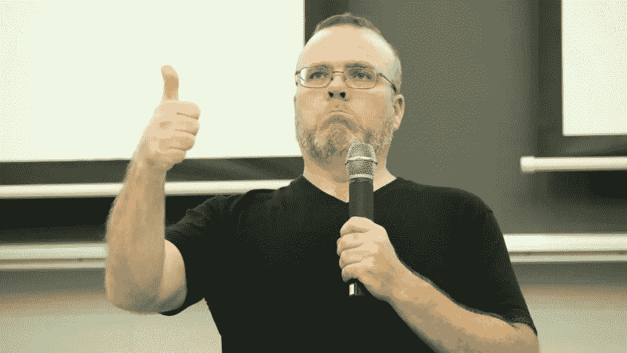
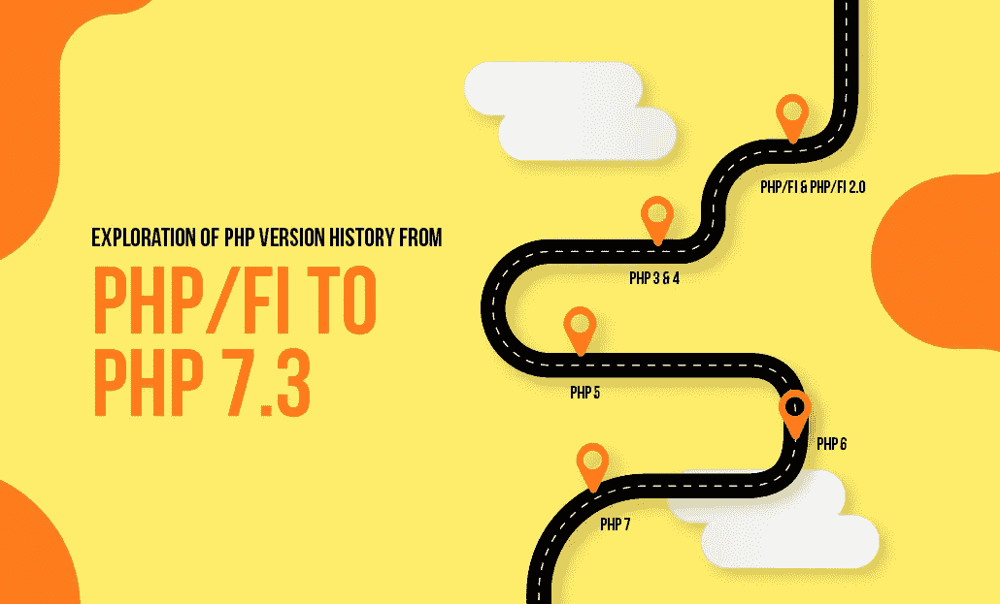
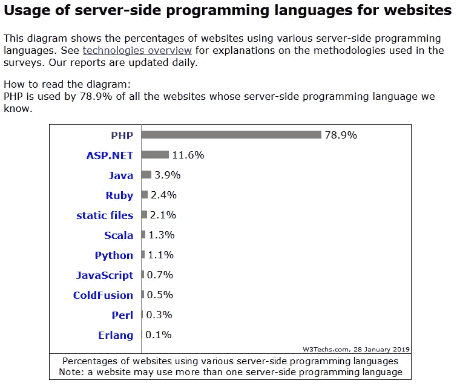

# PHP Series — “Know First, then Act”

> 原文：<https://medium.easyread.co/php-series-think-first-then-act-f1345edc3dea?source=collection_archive---------0----------------------->

## Part 1 — Pengenalan dan Perbandingan

Photo by [Element5 Digital](https://unsplash.com/@element5digital?utm_source=unsplash&utm_medium=referral&utm_content=creditCopyText) on [Unsplash](https://unsplash.com/s/photos/learning?utm_source=unsplash&utm_medium=referral&utm_content=creditCopyText)

# PHP Series List

[**0\. PHP Series — Kita Mulai Dari 0, ya**](https://medium.com/easyread/php-series-kita-mulai-dari-0-ya-25533e6d087e) **!
1\. PHP Series — “Know First, then Act” — You’re here** [**2\. PHP Series — Protokol HTTP**](https://medium.com/easyread/php-series-protokol-http-6f1303940115)[**3\. PHP Series — HTTP Lanjutan**](https://medium.com/easyread/php-series-http-lanjutan-a55e8ab4637d)[**4\. PHP Series — Instalasi XAMPP**](https://medium.com/easyread/php-series-instalasi-xampp-c19f1bf106a9)[**5\. PHP Series — Syntax PHP**](https://medium.com/easyread/php-series-belajar-php-dasar-27221541978c)[**6\. PHP Series — Variabel**](https://medium.com/easyread/php-series-variabel-3986f58b88d1)[**7\. PHP Series — Tipe Data**](https://medium.com/easyread/php-series-tipe-data-7d389bd5d5eb)[**8\. PHP Series — Kondisi**](https://medium.com/easyread/php-series-kondisi-33f8812a380d)[**9\. PHP Series — Fungsi**](https://medium.com/easyread/php-series-fungsi-4f44b612ab96)[**10\. PHP Series — Perulangan**](https://medium.com/easyread/php-series-perulangan-385d952e9c8a)

# Begin

***OpenSesame!***

Ketemu lagi dengan saya [Jansutris](https://www.linkedin.com/in/jansutris-apriten-purba/) di PHP Series. Kali ini, saya akan coba untuk mengenalkan kepada teman-teman beberapa hal berikut:
1\. Apa yang wajib anda ketahui ( **Prerequisites** )?
2\. Apa itu PHP?
3\. Siapa yang membuat PHP?
4\. Bagaimana proses kelahiran PHP?
5\. Seberapa populerkah PHP?
6\. Kenapa harus mempelajari atau memakai bahasa pemrograman PHP?

# **Apa Yang Wajib Anda Ketahui**

## 1\. HTML

 [## HTML Tutorial

### HTML is the standard markup language for Web pages. With HTML you can create your own Website. HTML is easy to learn …

www.w3schools.com](https://www.w3schools.com/html/default.asp) 

## 2\. CSS

 [## CSS Tutorial

### Well organized and easy to understand Web building tutorials with lots of examples of how to use HTML, CSS, JavaScript…

www.w3schools.com](https://www.w3schools.com/css/default.asp) 

## 3\. JavaScript

 [## JavaScript Tutorial

### JavaScript is the programming language of HTML and the Web. JavaScript is easy to learn. This tutorial will teach you…

www.w3schools.com](https://www.w3schools.com/js/default.asp) 

Supaya proses belajar PHP kita lancar, maka ada baiknya kamu pelajari dahulu ketiga point diatas ya. “Tak kenal maka tak sayang. Tak sayang maka tak cinta”. Maka mari kita kenalan dengan si PHP ini.

# Apa itu PHP

**PHP** adalah *bahasa pemrograman script server-side yang didesain untuk pengembangan web.*

PHP disebut bahasa pemrograman **server-side (server-side programming)** karena PHP diproses pada komputer server. Hal ini berbeda dibandingkan dengan bahasa pemrograman client-side seperti *JavaScript* yang diproses pada web browser (client).

Maksudnya adalah, ketika Anda mengakses sebuah URL, maka web browser akan melakukan request ke sebuah web server dan web server akan memberi response.

> Apa itu server-side programming? Bedanya apa ya bang dengan client side-programming? Trus web server itu apa bang? Pusyiiing pala barbiiie~

Baiklah, saya akan jelaskan perbedaan kedua insan ini secara khusus pada series selanjutnya. ***So, keep watching buddies!***

# Siapa yang membuat PHP?

PHP di kembangkan pada tahun 1995 oleh **Rasmus Lerdorf** , dan sekarang dikelola oleh **The PHP Group** . Situs resmi PHP dapat kamu akses di [http://www.php.net](http://www.php.net/) .

Rasmus Lerdorf

## ***Personal Home Page***

Pada awalnya **PHP** merupakan singkatan dari ***Personal Home Page.*** Sesuai dengan namanya, PHP digunakan oleh opung **Rasmus Lerdorf** pertama kali untuk membuat website pribadinya. Kalau di zaman sekarang ini, website tersebut sejenis [**LinkedIn**](https://www.linkedin.com/) .

Dalam beberapa tahun perkembangannya, PHP tidak hanya digunakan untuk membuat halaman web sederhana, tetapi juga website populer yang digunakan oleh jutaan orang seperti facebook, wikipedia, wordpress, joomla, dll.

## **Hypertext Preprocessor**

Saat ini PHP adalah singkatan dari **PHP: Hypertext Preprocessor** , sebuah kepanjangan *rekursif* , yakni permainan kata dimana kepanjangannya terdiri dari singkatan itu sendiri: **P** HP **: H** ypertex **t P** reprocessor.

PHP digunakan dengan ***gratis (free)*** dan ***bersifat Open Source*** .

# **Bagaimana proses kelahiran PHP?**

Pada awalnya PHP merupakan kependekan dari Personal Home Page (Situs personal). PHP pertama kali dibuat oleh [**Rasmus Lerdorf**](https://en.wikipedia.org/wiki/Rasmus_Lerdorf) pada tahun 1995\. Pada waktu itu PHP masih bernama Form Interpreted (FI), yang wujudnya berupa sekumpulan skrip yang digunakan untuk mengolah data formulir dari web.

Selanjutnya Rasmus merilis kode sumber tersebut untuk umum dan menamakannya PHP/FI. Dengan perilisan kode sumber ini menjadi sumber terbuka, maka banyak pemrogram yang tertarik untuk ikut mengembangkan PHP.

Perkembangan PHP

Pada November 1997, dirilis **PHP/FI 2.0** . Pada rilis ini, interpreter PHP sudah diimplementasikan dalam **program C** . Dalam rilis ini disertakan juga modul-modul ekstensi yang meningkatkan kemampuan **PHP/FI** secara signifikan.

Pada tahun 1997, sebuah perusahaan bernama **Zend** menulis ulang interpreter PHP menjadi lebih bersih, lebih baik, dan lebih cepat.

Kemudian pada Juni 1998, perusahaan tersebut merilis interpreter baru untuk PHP dan meresmikan rilis tersebut sebagai **PHP 3.0** dan singkatan PHP diubah menjadi akronim berulang PHP: Hypertext Preprocessing.

Pada pertengahan tahun 1999, Zend merilis interpreter PHP baru dan rilis tersebut dikenal dengan **PHP 4.0\.**

PHP 4.0 adalah versi PHP yang paling banyak dipakai pada awal abad ke-21\. Versi ini banyak dipakai disebabkan kemampuannya untuk membangun aplikasi web kompleks tetapi tetap memiliki kecepatan dan stabilitas yang tinggi.

Pada Juni 2004, Zend merilis **PHP 5.0** . Dalam versi ini, inti dari interpreter PHP mengalami perubahan besar. Versi ini juga memasukkan model pemrograman berorientasi objek ke dalam PHP untuk menjawab perkembangan bahasa pemrograman ke arah paradigma berorientasi objek.

Server web bawaan ditambahkan pada **versi 5.4** untuk mempermudah pengembang menjalankan kode PHP tanpa menginstall software server.

Versi terbaru dan stabil dari bahasa pemograman PHP saat ini adalah **versi 7.0.16 dan 7.1.2** yang resmi dirilis pada tanggal 17 Februari 2017.

# Seberapa populerkah PHP?

Kemudahan dan kepopuleran **PHP** sudah menjadi standar bagi programmer web di seluruh dunia. Menurut [Wikipedia](http://en.wikipedia.org/wiki/PHP#Use) pada februari 2014, sekitar 82% dari web server di dunia menggunakan PHP. PHP juga menjadi dasar dari *aplikasi CMS (Content Management System)* populer seperti *Joomla, Drupal,* dan *WordPress.*

Dikutip dari situs [w3techs.com](http://w3techs.com/technologies/overview/programming_language/all) , (diakses pada 28 Januari 2019), berikut adalah market share penggunaan bahasa pemrograman server-side untuk mayoritas website di seluruh dunia :

Penggunaan bahasa pemrograman server-side

Dapat dilihat dari tampilan di atas bahwa mayoritas website modern saat ini menggunakan PHP.

# Kenapa harus mempelajari atau memakai bahasa pemrograman PHP?

Sebenarnya PHP bukanlah bahasa pemrograman yang wajib digunakan. Kita bisa saja membuat website hanya menggunakan HTML saja. Web yang dihasilkan dengan HTML (dan CSS) ini dikenal dengan website statis, dimana konten dan halaman web bersifat tetap.

Sebagai perbandingan, website dinamis yang bisa dibuat menggunakan PHP adalah situs web yang bisa menyesuaikan tampilan konten tergantung situasi. Website dinamis juga bisa menyimpan data ke dalam database, membuat halaman yang berubah-ubah sesuai input dari *user* , memproses form, dll.

Untuk pembuatan web, kode **PHP** biasanya di sisipkan ke dalam dokumen HTML. Karena fitur inilah PHP disebut juga sebagai **Scripting Language** atau bahasa pemrograman **script** .

Sebagai contoh penggunaan PHP, misalkan kita ingin membuat list dari nomor 1 sampai nomor 10\. Dengan menggunakan HTML murni, kita bisa membuatnya secara manual seperti kode berikut ini:

perulangan elemen HTML manual tanpa PHP

Halaman HTML tersebut dapat dibuat dengan mudah dengan cara men- *copy-paste* tag **< li >** sebanyak 10 kali dan mengubah sedikit angka-angka no urut di belakangnya. Namun jika yang kita inginkan adalah menambahkan list tersebut menjadi 100 atau 1000 list, cara *copy-paste* tersebut menjadi tidak efektif.

Jika menggunakan **PHP** , kita tinggal membuat perulangan **for** sebanyak 1000 kali dengan perintah yang lebih singkat seperti berikut ini:

Perulangan elemen HTML otomatis dengan PHP

Dengan menggunakan kode baris yang bahkan lebih sedikit, kita dapat membuat list tersebut menjadi 1000 kali, bahkan 100.000 kali dengan hanya mengubah sebuah variabel **$i** .

# End.

Barusan anda telah berkenalan dengan si PHP. Gimana? Menarik gak? Saya harap sih kalian *excited.*

Sekarang kalau ditanya, apa itu PHP? Bagaimana proses perkembangan si PHP dari lahir hingga dewasa ini? Dan kenapa kita harus pakai bahasa pemrograman PHP? Kakak, abang dan adik semua yang kusayangi sudah taulah ya!

## **FYI**

**PHP** tidak hanya dapat melakukan pengulangan tersebut, masih banyak hal lain yang bisa kita lakukan dengan PHP, seperti menginput data ke **database** , menghasilkan gambar, menkonversi halaman text menjadi **PDF** , management **cookie** dan **session** , dan hal lainnya yang akan kita pelajari di dalam series selanjutnya. **So, stay tune on my series ya!**