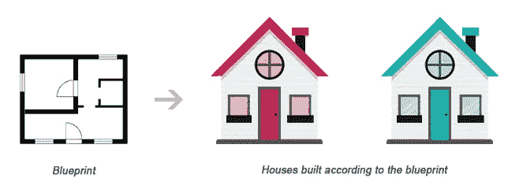
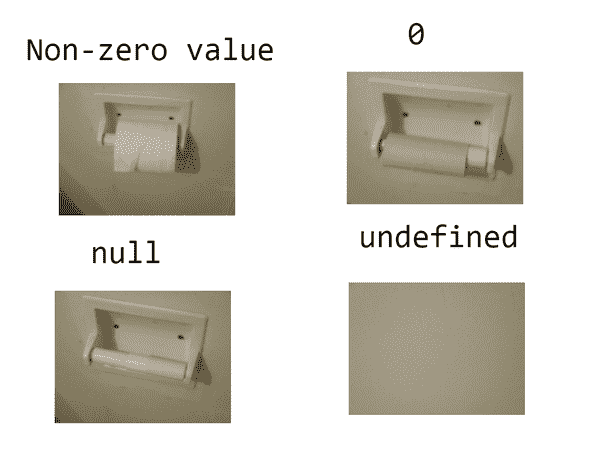

# PHP Series — Tipe Data

> 原文：<https://medium.easyread.co/php-series-tipe-data-7d389bd5d5eb?source=collection_archive---------0----------------------->

## Part 7 — String, Integer, Float, Boolean dan Array

# PHP Series List

[**0\. PHP Series — Kita Mulai Dari 0, ya!**](https://medium.com/easyread/php-series-kita-mulai-dari-0-ya-25533e6d087e)[**1\. PHP Series — “Know First, then Act”**](https://medium.com/easyread/php-series-think-first-then-act-f1345edc3dea)[**2\. PHP Series — Protokol HTTP**](https://medium.com/easyread/php-series-protokol-http-6f1303940115)[**3\. PHP Series — HTTP Lanjutan**](https://medium.com/@jansutris10/php-series-http-lanjutan-a55e8ab4637d)[**4\. PHP Series — Instalasi XAMPP**](https://medium.com/easyread/php-series-instalasi-xampp-c19f1bf106a9)[**5\. PHP Series — Syntax PHP**](https://medium.com/easyread/php-series-belajar-php-dasar-27221541978c)[**6\. PHP Series — Variabel**](https://medium.com/easyread/php-series-variabel-3986f58b88d1) **7\. PHP Series — Tipe Data** **— You Are Here!** [**8\. PHP Series — Kondisi**](https://medium.com/easyread/php-series-kondisi-33f8812a380d)[**9\. PHP Series — Fungsi**](https://medium.com/easyread/php-series-fungsi-4f44b612ab96)[**10\. PHP Series — Perulangan**](https://medium.com/easyread/php-series-perulangan-385d952e9c8a)


Analogi ragam tipe manusia dengan tipe data

Seperti manusia pada umumnya yang memiliki tipe yang beragam. Ada yang *dominance, steadiness, compliance* dan *influence* . Maka, tiap bahasa pemrograman termasuk PHP juga memiliki tipe yang beragam yang dikenal dengan nama tipe data.

Tipe data dikatakan juga sebagai tipe dari isi *variabel* . Ada yang berbentuk angka yang disebut juga *integer* , dan yang berbentuk kalimat atau kata disebut dengan *string* dan tipe data lainnya. Berikut ini adalah beberapa tipe data pada PHP.

Tipe data pada PHP:

1.  String
2.  Integer
3.  Float
4.  Boolean
5.  Array
6.  Object
7.  NULL

Tipe data PHP di atas hampir semua sering digunakan dalam membangun sebuah aplikasi. Berikut akan dijelaskan pengertian dan cara penggunaan masing-masing tipe data PHP di atas.

# String

Tipe data *string* adalah tipe data yang berbentuk *text* dan untuk cara penulisan tipe data string di letakkan di tengah-tengah tanda petik. di awali dengan tanda petik dan di akhiri dengan tanda petik juga. Berikut ini adalah contoh penulisan tipe data *string* di PHP.

Pada contoh tipe data string di atas kita misalkan terdapat sebuah variabel dengan nama tes yang berisi kalimat `**“Usia Saya Sekarang 23 Tahun”.**` Walaupun ada angka/ *integer* didalam tanda petik tersebut, tipe data variabel itu tetap saja string. Maka, *variabel* tes tersebut merupakan *variabel* yang bertipe data *string* .

# Integer

Tipe data *integer* adalah tipe data yang berbentuk angka yang berbentuk bilangan asli atau bilangan bulat. Seperti yang saya jelaskan sebelumnya pada tipe data *string* , untuk penulisan tipe data *integer* tidak perlu menambahkan tanda petik, karena akan dibaca sebagai *string* jika Anda menambahkan tanda petik pada tipe data *integer* . Berikut ini adalah contoh penulisan tipe data integer pada PHP.

Terdapat dua buah *variabel* yang bernama `**$bilangan_pertama**` dan `**$bilangan_kedua**` . Kedua variabel tersebut berisikan angka yang berbentuk bilangan bulat atau bilangan asli. Oleh sebab itu kedua *variabel* di atas di sebut sebagai *variabel* yang bertipe data *integer* .

# Float

Tipe data *float* atau di sebut juga tipe data *double* adalah tipe data yang berisi bilangan desimal. Cara penulisannya hampir sama dengan tipe data *integer* karena tidak memerlukan tanda petik di awal dan di akhir isi variabel *float* . Berikut ini adalah contoh penulisan *variabel* yang bertipe data *float* pada PHP.

# Boolean

Tipe data *boolean* adalah tipe data yang hanya memiliki dua buah *value* atau isi. yaitu `***true***` dan `***false***` , atau `**0**` dan `**1**` . *True* yang di sebut dengan 1 dan *false* di sebut 0\. Tipe data *boolean* sering di gunakan untuk memeriksa ketersediaan atau memeriksa nilai kebenaran pada sebuah data. Berikut ini adalah cara penulisan *variabel* yang bertipe data *boolean* .

Pada contoh kode diatas pada **baris nomor 2** terdapat *variabel* `**$x**` dengan nilai `**true**` , dan pada **baris nomor 3** terdapat *variabel* `**$y**` dengan nilai `**false**` . *Variabel* `**$x**` dan `**$y**` itulah disebut *variabel* yang memiliki tipe data *boolean* .

Apabila kedua *variabel* itu dipaksa untuk ditampilkan dengan perintah `**echo**` maka variabel `**$x**` yang memiliki nilai *true* akan menampilkan angka **1** , dan variabel `**$y**` yang memiliki nilai false tidak menampilkan apa-apa. Biasanya tipe data *boolean* ini digunakan untuk menguji apakah *button login* sudah di set/di-klik yang akan kita pelajari lebih jauh kelak pada *series login* dan *register* pada PHP.

# Array

*Array* adalah sebuah tipe data yang menyimpan banyak isi di dalam sebuah *variabel* . **Array seperti sebuah tas yang di dalamnya bisa saja berisi pulpen, buku, penggaris dan lainnya** . Isi dari pada *variabel array* di tandai dengan masing-masing angka yang sudah di terapkan menurut urutannya. Berikut adalah contoh penulisan *variabel* yang bertipe data *array* . Pada *series* selanjutnya kita akan membahas lebih dalam jenis-jenis *array* berserta cara penggunaannya pada PHP.

Untuk menggunakan tipe data *array* bisa menggunakan fungsi *array* (). Kemudian diisi dan di pisahkan dengan tanda koma pada tiap-tiap isi *variabel* . Pada contoh *variabel array* tas di atas terdapat pulpen, buku tulis dan penggaris. Dimana pulpen berada pada urutan/ *index 0* , buku tulis berada pada urutan/ *index 1* , dan penggaris berada pada urutan/ *index 2* . Angka yang diberikan pada tiap-tiap isi *array* di mulai dari 0 dan bertambah 1 (++) sesuai urutan.

# Object



Ilustrasi Class dan Object

Penggunaan tipe data *object* ini sering digunakan dalam konsep *Object Oriented Programming* (OOP). Contoh nyatanya seperti pada gambar ilustrasi *class* dan *object* diatas. Dimana sebuah *object* (dalam hal ini rumah secara fisik) terbentuk dari proses instansiasi sebuah *class* (dalam hal ini *blueprint* /rancangan bangunan). Untuk pemahaman lebih lanjut tentang konsep *Object* dapat dipelajari pada series PHP khusus yang akan membahas OOP pada PHP.

## *Apa itu tipe data object?*

Tipe data *object* adalah tipe data yang tidak sekedar menyimpan data tetapi berisikan juga informasi bagaimana untuk mengolah data tersebut. Maksudnya, pada tipe data data lain seperti : *integer, float, string* hanya berisikan tipe data dia sendiri, sedangkan pada tipe data *object* dapat berisikan tipe-tipe data lain.

**Contoh 1:**

**Contoh 2:**

Kalau kita lihat **Contoh 1** dan **Contoh 2** menghasilkan output yang sama namun dengan cara pengolahan data yang berbeda. Pada **Contoh 1** *object* pesan memberikan nilai untuk *property* `**str**` dengan mengakses langsung *property* -nya, kemudian untuk mencetak nilainya juga langsung mengakses *property* -nya.

Pada **Contoh 2** , *object* pesan memanggil *method* tampung untuk memberikan nilai bagi *property* str, kemudian untuk mencetak nilainya *object* pesan memanggil *method* cetak dimana pada *method* cetak terjadi proses pencetakan nilai *property* nya.

# NULL

Tipe data *null* adalah sebuah tipe data spesial yang menunjukkan sebuah variabel belum memiliki nilai/data. Tipe data null pada PHP mirip dengan tipe data **none** pada *python* .



Ilustrasi tipe data NULL dibandingkan tipe data lain

Untuk menggunakan tipe data *null* pada sebuah variabel dapat langsung diset :

```
**$var1 = NULL;**
atau
**$var1 = null**
```

Penulisan NULL bisa berupa huruf besar atau kecil maupun keduanya, karena pada dasarnya bersifat *case-insensitive* .

**Catatan:**

```
Ketika kita mengdeklarasikan sebuah variabel tanpa memberikan nilai atau data, bisa dikatakan juga variabel tersebut bersifat NULL
**Misal : $x;**Namun begitu variabel tersebut diproses seperti dicetak atau dilakukan proses lainnya, maka akan keluar peringantan:
**“Notice : undefined variabel :x “**
```

## Contoh penggunaan tipe data NULL

Dalam contoh ini kita akan menunjukkan salah satu efek apabila sebuah *variabel* diset nilai NULL.

Dari contoh diatas, pertama kali nilai *variabel* $x diberi nilai 2, sehingga begitu dibandingkan dengan instruksi if($x > 0) maka dapat diputuskan bahwa 2 > 0 dan hasilnya bernilai TRUE, sehingga dicetak **“Bisa dibandingkan karena tidak null”.**

Untuk kasus *variabel* $x yang diset *null* , pada saat membandingkan apakah nilai $x lebih besar dari 0 pada instruksi *if* ($x > 0), instruksi tersebut tidak dapat membandingkannya sehingga akan bernilai FALSE.