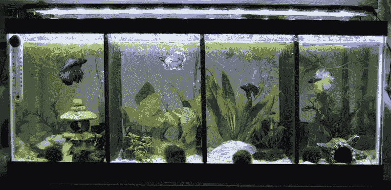
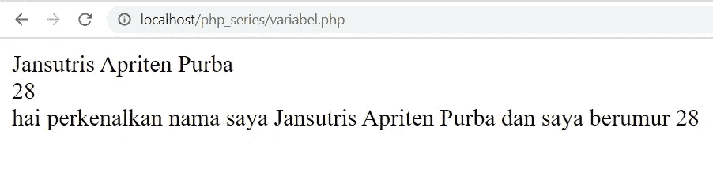
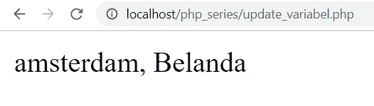

# PHP Series — Variabel

> 原文：<https://medium.easyread.co/php-series-variabel-3986f58b88d1?source=collection_archive---------0----------------------->

## Part 6 — Penulisan Variabel dan Mengubah Nilai Variabel

# PHP Series List

[**0\. PHP Series — Kita Mulai Dari 0, ya!**](https://medium.com/easyread/php-series-kita-mulai-dari-0-ya-25533e6d087e)[**1\. PHP Series — “Know First, then Act”**](https://medium.com/easyread/php-series-think-first-then-act-f1345edc3dea)[**2\. PHP Series — Protokol HTTP**](https://medium.com/easyread/php-series-protokol-http-6f1303940115)[**3\. PHP Series — HTTP Lanjutan**](https://medium.com/@jansutris10/php-series-http-lanjutan-a55e8ab4637d)[**4\. PHP Series — Instalasi XAMPP**](https://medium.com/easyread/php-series-instalasi-xampp-c19f1bf106a9)[**5\. PHP Series — Syntax PHP**](https://medium.com/easyread/php-series-belajar-php-dasar-27221541978c) **6\. PHP Series— Variabel — You are here!** [**7\. PHP Series — Tipe Data**](https://medium.com/easyread/php-series-tipe-data-7d389bd5d5eb)[**8\. PHP Series — Kondisi**](https://medium.com/easyread/php-series-kondisi-33f8812a380d)[**9\. PHP Series — Fungsi**](https://medium.com/easyread/php-series-fungsi-4f44b612ab96)[**10\. PHP Series — Perulangan**](https://medium.com/easyread/php-series-perulangan-385d952e9c8a)

# Variabel pada PHP

Analogi Variabel dengan Aquarium

Coba lihat 4 aquarium diatas. Jika kita perhatikan, tiap aquarium menampung ikan dengan jenis yang berbeda-beda. Begitu juga dengan variabel, kita bisa analogikan tiap-tiap aquarium sebagai variabel dan masing-masing ikan yang berada didalamnya sebagai nilai/isi. Artinya, setiap aquarium yang ada pasti berisi ikan dengan jenis yang berbeda-beda dan warna yang berbeda-beda pula.

Jadi dapat kita tarik kesimpulan, bahwa ***variabel*** berfungsi sebagai tempat atau wadah untuk menyimpan data sementara. *Variabel* bisa dikatakan sebagai penyimpanan informasi atau data sementara di dalam pemrograman.

## Pengertian Variabel pada PHP

Variabel bisa menyimpan data berupa *integer, string* dan lainnya. Nilai atau isi dari pada variabel sendiri bisa di *update* atau di ubah yang akan kita praktekkan di dalam series PHP ini.

*Variabel* memiliki namanya masing-masing dengan tujuan untuk memudahkan *programmer* untuk menandai masing-masing *variabel* tersebut dan pemanggilan *variabel* nya tersebut.

## Cara Penulisan Variabel di PHP

Penulisan *variabel* di PHP mempunyai ketentuan tersendiri. Pada subjudul ini, akan dijelaskan tentang bagaimana cara penulisan *variabel* yang benar di PHP sesuai dengan ketentuan dari PHP. Berikut adalah cara penulisan variabel di PHP yang saya buat dalam beberapa poin.

1.  Penulisan variabel PHP di awali dengan tanda `**$**` .
2.  Variabel PHP bersifat ***Case Sensitiv*** e artinya sensitif terhadap huruf besar dan kecil.
3.  Kemudian untuk mengisi suatu *variabel* bisa langsung menambahkan tanda sama dengan `**=**` .

Poin-poin di atas adalah cara penulisan dari **variabel di PHP** . Penulisan variabel di PHP harus di awali dengan tanda dolar `**$**` dan kemudian di lanjutkan dengan nama dari variabelnya. Misalnya:

Contoh di atas adalah salah satu contoh penulisan variabel di PHP. Diawali degan membuat tanda dolar `**$**` kemudian di lanjutkan dengan nama dari *variabel* tersebut. Pada contoh di atas berarti *variabel* tersebut adalah *variabel* **nama** .

Jangan lupa untuk cara penulisan *syntax* PHP yang benar seperti yang sudah di jelaskan pada tutorial sebelumnya yang terdapat pada [**Part 5 — Syntax PHP**](https://medium.com/@jansutris10/php-series-belajar-php-dasar-27221541978c) bahwa penulisan syntax PHP **harus diawali dengan** **tag PHP pembuka(** `**<?php**` **)** dan **diakhiri dengan** **tag PHP penutup (** `**?>**` **)** . Kemudian di akhir baris di tutup dengan tanda **semicolon (** `**;**` **)** .

Pada contoh kedua di jelaskan bahwa *variabel* di PHP memiliki sifat *case-sensitive* berarti penulisan *variabel* PHP sangat peka terhadap huruf besar dan kecil. Misalnya Anda membuat *variabel* `**$namaSaya**` , maka untuk memanggil *variabel* tersebut harus sesuai *case sensitive* nya seperti `**$namaSaya**` **.**

Poin ketiga mengatakan untuk mengisi suatu nilai atau informasi yang ingin di simpan kedalam *variabel* PHP bisa menggunakan tanda sama dengan `**=**` . Contohnya:

Perlu di perhatikan bahwa untuk mengisi data yang berupa *string* maka data harus di apit dengan petik ganda atau petik satu. Tetapi jika nilai dari *variabel* tersebut berupa angka maka tidak menggunakan tanda petik.

Karena pada series sebelumnya Anda sudah belajar tentang perintah `**“echo”**` di PHP yang berfungsi untuk menampilkan data maka pada series ini kita akan menerapkannya juga sebagai contoh dari penggunaan variabel di PHP.

Buat sebuah file PHP dan simpan pada *localhost* . Di sini *file* PHP tersebut, saya beri nama `**belajar.php**` . Kemudian isi dengan *syntax* berikut:

Kemudian akses di *browser* dengan alamat `**http://localhost/belajar.php**` . Jangan lupa mengaktifkan *apache* terlebih dahulu.

Tanda titik ( `**.**` ) di gunakan untuk memisahkan *string* dan *variabel* dan syntax `** **` adalah *syntax* *break* pada HTML.

## Mengupdate/Mengubah Nilai Variabel

Ikan cupang sedang beradu

Kita ketahui bersama, anda tidak boleh menggabungkan 1 aquarium yang sama dengan 2 ikan cupang, akibatnya mereka akan berkelahi. Tentunya, solusi untuk mengganti ikan yang lama dengan ikan yang baru pada aquarium yang sama adalah keluarkan ikan yang lama dan masukkan ikan yang baru.

Analogi ini bisa kita umpamakan ketika kita ingin meng *update* nilai dari sebuah *variabel* . Sederhananya, tentu nilai yang ditampung hanya boleh satu nilai dan satu tipe data. **(disini kita belum membahas *variabel* penampung pada tipe data *array* ).**

*Variabel* pada PHP juga bisa di *update* isinya/nilainya. Perhatikan contoh berikut:

Dan hasilnya akan muncul: **amsterdam, Belanda.**

Dapat di lihat bahwa pertama isi dari *variabel* alamat adalah **Tanjung Balai.** kemudian buat lagi *variabel* dengan isi yang berbeda, yaitu mengubah isi *variabel* menjadi **amsterdam, belanda.** Maka hasilnya isi *variabel* alamat menjadi amsterdam, Belanda.