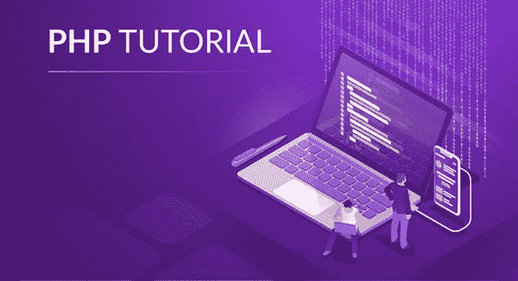
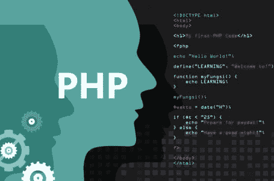
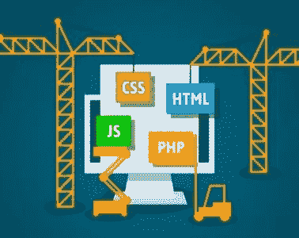
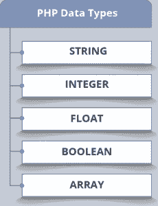
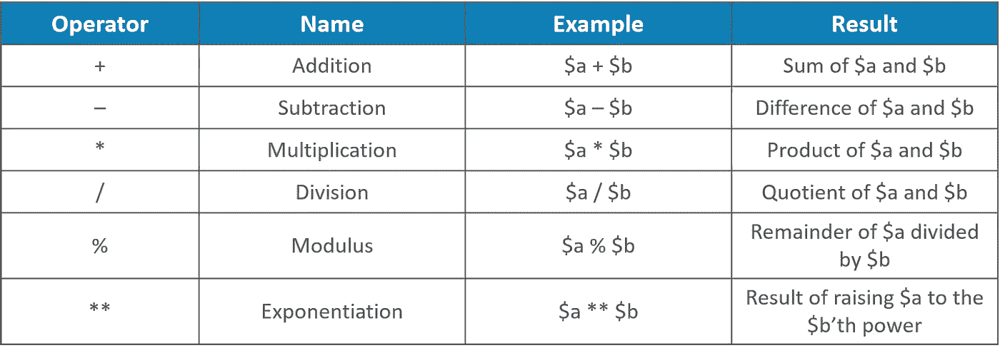
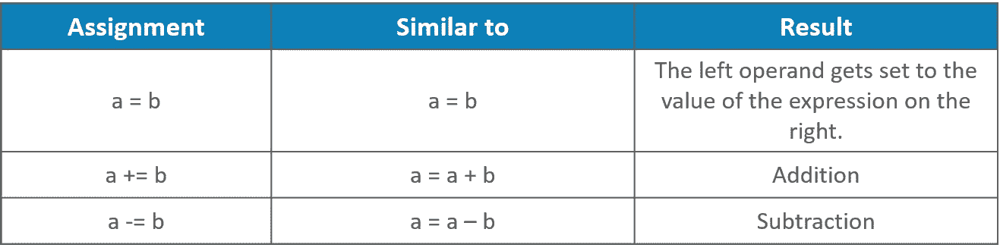
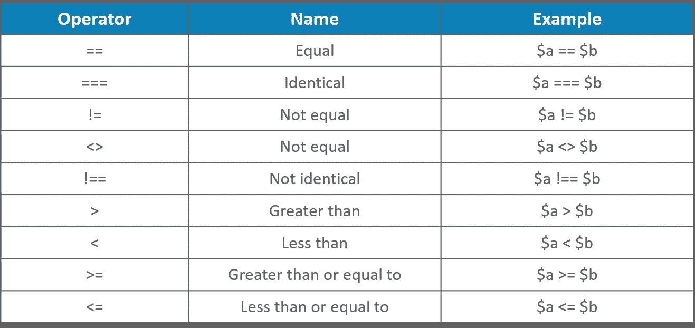
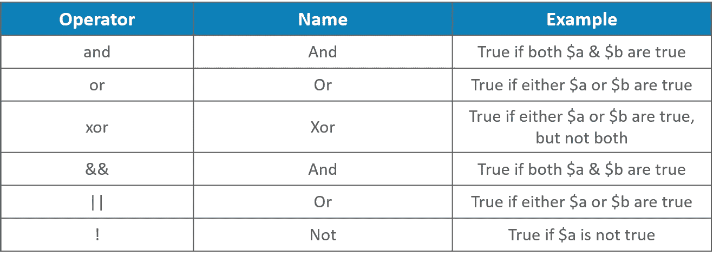
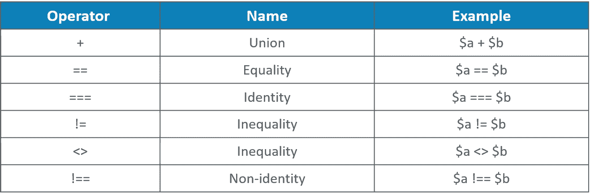
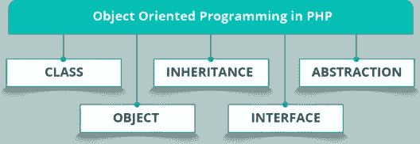

# PHP 教程——了解从基本到复杂的 PHP 概念

> 原文：<https://medium.com/edureka/php-tutorial-beginners-guide-to-php-f78a189de6f?source=collection_archive---------0----------------------->



PHP Tutorial — Edureka

脚本语言是一种在运行时解释脚本的语言。脚本的目的通常是增强应用程序的性能或执行日常任务。这篇 **PHP 教程**将按以下顺序为您提供关于服务器端脚本语言的全面知识:

*   PHP 简介
*   学习 PHP 的先决条件
*   我们为什么需要 PHP？
*   如何运行 PHP？
*   PHP 集成开发环境
*   PHP 数据类型
*   PHP 变量
*   PHP 操作符
*   PHP 中的面向对象编程
*   PHP 数组
*   PHP 条件语句
*   PHP 循环
*   PHP 函数
*   PHP Cookies
*   PHP 会话

# PHP 简介

PHP 代表**超文本预处理器**，它是一种服务器端脚本语言，用于开发静态网站或动态网站或**网络应用**。它是脸书、维基百科和 Tumblr 等科技巨头的首选脚本语言，尽管全栈 JavaScript 在未来的开发者中越来越受欢迎。这篇 PHP 教程将帮助你了解学习 PHP 的各个方面。



## **HTML&PHP 有什么区别？**

现在你们中的许多人可能会问，我们已经有了 HTML，为什么还需要 PHP？与 HTML 不同，PHP 允许编码者动态创建 HTML 页面或页面的一部分。PHP 还能够获取数据，并使用或操作它来创建用户想要的输出。

在 HTML 中，你输入的任何东西都会产生一个输出，但是如果你的代码有问题，PHP 不会给你输出。与 HTML 相比，PHP 的学习曲线也更加陡峭。PHP 脚本可以放在文档中的任何地方。

从开始:

**语法**

```
<?php // PHP code goes here ?>
```

现在你已经知道了 PHP 的基本语法，让我们继续学习 PHP 教程，看看学习 PHP 的先决条件。

# 学习 PHP 的先决条件

学习一门新的编程语言可能有点让人不知所措。很多人不知道从哪里开始，还没开始就放弃了。学习 PHP 并不像看起来那么困难。PHP 成功的原因之一是它有非常棒的文档。一个人可以不需要任何特殊的技能就可以钻研文档并开始工作。

但是一旦你掌握了一些 PHP 知识，你将需要学习其他语言来有效地使用 PHP。这些语言包括:

*   **HTML**
*   **MySQL**
*   **CSS**
*   **JavaScript**



# 我们为什么需要 PHP？

你一定想知道，当我们已经有了像 HTML 这样的脚本语言时，为什么我们还需要 **PHP** 来进行 **web 编程**。

因此，让我们继续学习 PHP 教程，找出一些使用 PHP 的令人信服的理由:

*   它是一种**开源**和**免费**的脚本语言
*   与 JSP、ASP 等其他语言相比，它的学习曲线较短。
*   大多数虚拟主机服务器默认支持 PHP
*   它是一种服务器端脚本语言，所以你需要把它安装在服务器和客户端上。从服务器请求资源的计算机不需要安装 PHP
*   PHP 内置了对与 MySQL 协同工作的支持。
*   它是跨平台的，所以你可以在许多不同的操作系统上部署你的应用程序，比如 Windows、Linux、Mac OS 等等。

# **我们在哪里使用 PHP？**

我们使用 PHP 的主要领域有三个:

1.  **服务器端脚本**——这是 PHP 最传统和主要的目标领域。完成这项工作所需的三样东西包括一个 **PHP 解析器、一个 web 服务器和一个 web 浏览器**。web 服务器通过连接的 PHP 安装运行。您可以使用 web 浏览器访问 PHP 程序输出，通过服务器查看 PHP 页面。
2.  **命令行脚本**–PHP 脚本也可以在没有任何服务器或浏览器的情况下运行。您只需要 PHP 解析器来使用命令行脚本。这种用法非常适合于在 Linux 上使用 cron 或在 Windows 上使用任务调度器定期执行的脚本。这些脚本也可以用于简单的文本处理任务。
3.  编写桌面应用程序—PHP 可能不是创建带有图形用户界面的桌面应用程序的最佳语言。但是如果你精通 PHP，你可以在你的**客户端应用**中使用一些高级的 PHP 特性，也可以使用 PHP-GTK 编写这样的程序。您还可以用这种方式编写跨平台的应用程序。

到目前为止，在这篇 PHP 教程中，我们已经了解了何时何地应该使用 PHP。现在让我们看看如何运行脚本语言

# **如何运行 PHP？**

手动安装 Web 服务器和 PHP 需要深入的配置知识，但是由 Apache Friends 创建的 XAMPP Web 开发工具套件使运行 PHP 变得很容易。在 Windows 上安装 XAMPP 只需要运行一个**安装包**，而不需要将所有内容上传到在线网络服务器。这个 PHP 教程给你一个 XAMPP 的概念，以及如何使用它来执行 PHP 程序。

# 什么是 XAMPP？

这是一个由 Apache Friends 开发的**免费**和**开源**跨平台 web 服务器解决方案堆栈包，由 Apache HTTP Server、MariaDB & MySQL 数据库和用 PHP 和 Perl 编程语言编写的脚本解释器组成。XAMPP 代表跨平台(X)、Apache (A)、MariaDB & MySQL (M)、PHP (P)和 Perl (P)。它是一个简单、轻量级的 Apache 发行版，使得开发人员创建用于测试和部署目的的本地 web 服务器变得极其简单**。**

# ****使用 WAMP 服务器的 PHP****

**如果你正在进行一个生产环境的项目，并且有一台运行 Windows 操作系统的 PC，那么你应该选择 **WAMP 服务器**，因为它是在考虑安全性的基础上构建的。您可以使用这种方法来运行您可能从某处获得的 PHP 脚本，并且需要在很少或没有 PHP 知识的情况下运行。你可以通过一个 **web 服务器**来执行你的脚本，其中的输出是一个 web 浏览器。**

**让我们来看看使用 WAMP 服务器的步骤:**

*   ****安装服务器软件****
*   ****设置服务器****
*   ****保存 PHP 脚本****
*   ****运行 PHP 脚本****
*   ****故障排除****

**现在让我们继续我们的 PHP 教程，找出适合 PHP 的 IDE。**

# ****PHP IDE****

**为了保持竞争力和生产力，在最短的时间内编写好的代码是每个软件开发人员必须掌握的基本技能。随着编写代码的数量和风格的增加以及新编程语言的频繁出现，软件开发人员必须选择正确的 IDE 来实现目标，这一点很重要。**

*   **集成开发环境是一个独立的包，允许你在同一个地方编写、编译、执行和调试代码。因此，让我们来看看一些最好的 PHP IDE:**
*   ****PHPStorm****
*   ****Netbeans****
*   ****Aptana 工作室****
*   ****月食****
*   ****Visual Studio(带 Xamarin)****
*   ****ZendStudio****

# ****PHP 数据类型****

**变量可以存储不同类型的数据。让我们来看看 PHP 支持的一些数据类型:**

****

## ****PHP 字符串****

**字符串是一系列字符。在 PHP 中，您可以将字符串写在单引号或双引号中。**

```
<?php 
$a = “Hello Edureka!”; 
$b = ‘Hello Edureka!’; 
echo $a; 
echo “<br>”; 
echo $b; 
?>
```

## ****PHP 整数****

**整数数据类型是介于-2，147，483，648 和 2，147，483，647 之间的非十进制数。整数必须至少有一位数字，可以是正数也可以是负数。
下面的例子以$a 为整数。PHP var_dump()函数返回数据类型和值。**

```
<?php 
$a = 0711; 
var_dump($a); 
?>
```

## ****PHP 浮动****

*   **浮点数或浮点数是带小数点的数字或指数形式的数字。**
*   **以下示例将$a 作为浮点数，PHP var_dump()函数返回数据类型和值。**

```
<?php 
$a = 14.763;
var_dump($a);
?>
```

## ****PHP 布尔型****

**布尔值表示两种可能的状态:真或假。它们通常用于条件测试。**

```
$a = true; 
$b = false;
```

## ****PHP 对象****

**对象是一种数据类型，它存储数据和关于如何处理该数据的信息。在 PHP 中，对象必须显式声明。我们需要使用 class 关键字声明一个对象的类。**

```
<?php 
class Student 
{ 
function Student() 
{ 
$this->name = “XYZ”; 
} 
} 
// create an object 
$Daniel = new Student(); 
// show object properties
echo $Daniel->name; 
?>
```

## ****PHP 数组****

**数组在一个变量中存储多个值。在下面的例子中，PHP var_dump()函数返回数据类型和值。**

```
<?php 
$students = array(“Daniel”,”Josh”,”Sam”);
var_dump($students); 
?
```

**既然您已经了解了各种数据类型，让我们继续学习 PHP 教程，看看不同的 PHP 变量。**

## ****PHP 变量****

**变量是**存储信息**的容器。PHP 中的所有变量都用前导美元符号($)表示。与其他编程语言不同，PHP 没有声明变量的命令。它是在您第一次为其赋值时创建的。**

****声明 PHP 变量:****

```
<?php 
$txt = “Hello Edureka!”; 
$a = 7; 
$b = 11.5; 
?>
```

**PHP echo 语句通常用于向屏幕输出数据。**

****PHP 变量范围****

**在 PHP 中，变量可以在脚本的任何地方声明。变量的作用域是脚本中可以使用变量的部分。**

**在 PHP 中，我们有三种不同的变量范围:**

*   ****局部**–在函数中声明的变量具有局部作用域，并且只能在该函数中访问:**

```
<?php 
function myTest() 
{ 
$a = 7; // local scope 
echo “<p>Variable a inside function is: $a</p>”; 
} 
myTest(); 
// using x outside the function will generate an error 
echo “<p>Variable a outside function is: $a</p>”; 
?>
```

*   ****全局**–在函数外部声明的变量具有全局范围，只能在函数外部访问。global 关键字用于从函数中访问全局变量:**

```
<?php 
$a = 9; // global scope 
function myTest() {
// using a inside this function will generate an error 
echo “<p>Variable a inside function is: $a</p>”; 
} 
myTest(); 
echo “<p>Variable a outside function is: $a</p>”; 
?>
```

*   ****静态**–当一个函数被执行时，它的所有变量都被删除。但是如果您希望不删除任何变量，那么在第一次声明该变量时使用 static 关键字:**

```
<?php 
function myTest() {
static $a = 0; 
echo $a; 
$a++; 
} 
myTest(); 
myTest(); 
myTest(); 
?>
```

**现在你已经知道了变量的声明，让我们继续学习 PHP 教程，看看 PHP 中的操作符。**

# ****PHP 操作符****

**运算符用于对变量执行不同的运算。让我们来看看 PHP 中的不同操作符:**

*   ****算术运算符****
*   ****赋值运算符****
*   ****比较运算符****
*   ****逻辑运算符****
*   ****数组运算符****

## ****算术运算符****

**PHP 算术运算符与数值一起用于执行常见的算术运算，如加、减、乘等。**

****

## ****赋值运算符****

**PHP 赋值操作符与数值一起使用，将值写入变量。**

****

## ****比较运算符****

**PHP 比较运算符用于比较两个数字或字符串**

****

## ****逻辑运算符****

**PHP 逻辑运算符用于组合条件语句。**

****

## ****数组运算符****

**PHP 数组操作符用于比较数组。**

****

**现在让我们继续我们的 PHP 教程，看看 PHP 中的各种 **OOP** 概念。**

# ****PHP 中的面向对象编程****

**面向对象的编程概念假设一切都是对象，并使用不同的对象实现软件。这是一个使用**对象**和它们的**交互**来设计应用程序的编程范例。**

**PHP 中面向对象的概念包括:**

****

## ****类****

**这是程序员定义的数据类型，包括本地函数和本地数据。类是创建对象的构造或原型，它定义了使类实例具有状态和行为的组成成员。**

```
<?php 
class Books{ 
public function name(){ 
echo “Dans Books”; 
} 
public function price(){ 
echo “500 Rs/-”; 
} 
} 
To create php object we have to use a new operator. Here php object is the object of the Books Class. 
$obj = new Books(); 
$obj->name(); 
$obj->price(); 
?>
```

## ****对象****

**对象是 PHP OOP 程序的基本构件。对象是数据和方法的组合。在面向对象程序中，我们创建对象。这些对象通过方法相互通信。每个对象都可以接收消息、发送消息和处理数据。**

```
<?php 
class Data {} 
$object = new Data(); 
print_r($object); 
echo gettype($object), "\n"; 
?>
```

## ****继承****

**继承是一种使用已经定义的类来形成新类的方法。新形成的类称为派生类，我们从中派生的类称为基类。**

**为了声明一个类从另一个类继承代码，我们使用 extends 关键字。有两种类型的继承:**

1.  **单级继承**
2.  **多级遗传**

****单级继承的例子:****

```
<?php 
class X { 
public function printItem($string) { 
echo ' Hello : ' . $string;  
}  
public function printPHP() {
echo 'I am from Edureka' . PHP_EOL; 
} 
}
class Y extends X { 
public function printItem($string) {
echo 'Hello: ' . $string . PHP_EOL; 
} 
public function printPHP() { 
echo "I am from Bangalore"; 
} 
} 
$x = new X(); 
$y = new Y(); 
$x->printItem('Sam'); 
$x->printPHP();  
$y->printItem('Josh');  
$y->printPHP();  
?>
```

****多级继承的例子:****

```
<?php 
class A { 
public function myage() { 
return ' age is 70'; 
} 
} 
class B extends A {  
public function mysonage() { 
return ' age is 50'; 
} 
} 
class C extends B { 
public function mygrandsonage() { 
return 'age is 20'; 
} 
public function myHistory() { 
echo "Class A " .$this->myage(); 
echo "Class B ".$this-> mysonage(); 
echo "Class C " . $this->mygrandsonage(); 
} 
} 
$obj = new C(); 
$obj->myHistory(); 
?>
```

## **连接**

**接口是对一个对象可以做的动作的描述。它的编写方式与用**接口**关键字声明的类相同。**

```
<?php 
interface A { 
public function setProperty($x); 
public function description(); 
} 
class Mangoes implements A { 
public function setProperty($x) { 
$this->x = $x; 
} 
public function description() { 
echo 'Describing' . $this->x . tree; 
} 
} 
$Apple = new Apples(); 
$Apple->setProperty(apple); 
$Apple->description(); 
?>
```

## **抽象**

**抽象类是包含至少一个抽象方法的类。抽象方法是一个没有任何人的函数声明，它只有**方法**及其**参数**的名称。**

```
<?php 
abstract class Cars { 
public abstract function getCompanyName(); 
public abstract function getPrice(); 
} 
class Baleno extends Cars { 
public function getCompanyName() { 
return "Maruti Suzuki" . '<br/>'; 
} 
public function getPrice() { 
return 850000 . '<br/>'; 
} 
} 
class Santro extends Cars { 
public function getCompanyName() { 
return "Hyundai" . '<br/>'; 
} 
public function getPrice() { 
return 380000 . '<br/>'; 
} 
} 
$car = new Baleno(); 
$car1 = new Santro(); 
echo $car->getCompanyName(); 
echo $car->getPrice(); 
echo $car1->getCompanyName(); 
echo $car1->getPrice(); 
?>
```

# **PHP 数组**

**数组是一个一次保存多个值的变量。一个数组可以在一个名称下保存许多值，您可以通过引用一个**索引号**来访问这些值。这篇 PHP 教程将让你了解 PHP 中不同类型的数组。**

```
<?php 
$cars = array("Volvo", "BMW", "Toyota"); 
echo "I like " . $cars[0] . ", " . $cars[1] . " and " . $cars[2] . "."; 
?>
```

**PHP 中有三种类型的数组:**

*   ****索引数组** —带有数字索引的数组**
*   ****关联数组** —带有命名键的数组**
*   ****多维数组** —包含一个或多个数组的数组**

## **索引数组**

**在 PHP 中，可以自动或手动分配索引。以下示例创建一个名为$cars 的索引数组，为其分配三个元素，然后打印包含数组值的文本:**

```
<?php 
$cars = array("Audi", "Toyota", "Ferrari"); 
echo "I like " . $cars[0] . ", " . $cars[1] . " and " . $cars[2] . "."; 
?>
```

## **关联数组**

**关联数组是使用指定给它们的命名键的数组。以下示例显示了如何创建关联数组:**

```
<?php 
$age = array(“Sam”=>”32", “Ben”=>”37", “Josh”=>”41"); 
echo “Sam is “ . $age[‘Sam’] . “ years old.”; 
?>
```

# **多维数组**

**多维数组是包含一个或多个数组的数组。**

## ****PHP —二维数组****

**二维数组是数组的数组。以下示例显示了如何在 PHP 中初始化二维数组:**

```
<?php 
echo $cars[0][0].": In stock: ".$cars[0][1].", sold: ".$cars[0][2].".<br>"; 
echo $cars[1][0].": In stock: ".$cars[1][1].", sold: ".$cars[1][2].".<br>"; 
echo $cars[2][0].": In stock: ".$cars[2][1].", sold: ".$cars[2][2].".<br>"; 
echo $cars[3][0].": In stock: ".$cars[3][1].", sold: ".$cars[3][2].".<br>"; 
?>
```

# **PHP 条件语句**

**条件语句用于针对不同的条件执行不同的操作。在 PHP 中，我们有以下条件语句:**

*   ****if 语句** —如果一个条件为真，则执行一些代码**
*   ****if…else 语句** —如果条件为真，则执行一些代码，如果条件为假，则执行另一个代码**
*   ****if…elseif…else 语句** —针对两个以上的条件执行不同的代码**
*   ****switch 语句** —选择要执行的多个代码块中的一个**

## **if 语句**

**如果一个条件为真，if 语句将执行一些代码。**

```
<?php 
$t = date("H"); 
if ($t < "15") { 
echo "Have a good day!"; 
} 
?>
```

## **if…else 语句**

**if…else 语句在条件为真时执行一些代码，在条件为假时执行另一个代码。**

```
<?php 
$t = date("H"); 
if ($t < "15") { 
echo "Have a good day!"; 
} else { 
echo "Have a good night!"; 
} 
?>
```

## **if…elseif…else 语句**

**if…elseif…else 语句针对两个以上的条件执行不同的代码。**

```
<?php 
$t = date("H"); 
if ($t < "15") { 
echo "Have a good morning!"; 
} elseif ($t < "25") { 
echo "Have a good day!"; 
} else { 
echo "Have a good night!"; 
} 
?>
```

## **Switch 语句**

**switch 语句用于根据不同的条件执行不同的操作。它用于选择要执行的许多代码块中的一个。**

```
<?php 
$favcolor = "blue"; 
switch ($favcolor) { 
case "blue": 
echo "Your favorite color is blue!"; 
break; 
case "green": 
echo "Your favorite color is green!"; 
break; 
case "black": 
echo "Your favorite color is black!"; 
break; 
default: 
echo "Your favorite color is neither blue, green nor black!"; 
} 
?>
```

# **PHP 循环**

**当我们编写代码时，我们希望同一代码块在一行中反复运行。我们可以使用**循环**来执行相同的任务，而不是在脚本中添加几行几乎相同的代码。在这个 PHP 教程中，我们将学习三个循环语句。**

**在 PHP 中，我们有以下循环语句:**

*   ****while** —只要指定的条件为真，就在代码块中循环**
*   ****do…while** —在代码块中循环一次，然后只要指定的条件为真，就重复循环**
*   ****for** —在代码块中循环指定的次数**

## **While 循环**

**只要指定的条件为真，while 循环就会执行一段代码。**

```
<?php  
$a = 3; 
while($a <= 5) { 
echo "The number is: $a <br>"; 
$a++; 
}  
?>
```

## **do..while 循环**

**do…while 循环将始终执行一次代码块，然后检查条件，并在指定条件为真时重复循环。**

```
<?php  
$a = 3; 
do { 
echo "The number is: $a <br>"; 
$a++; 
} while ($a <= 5); 
?>
```

## **For 循环**

**PHP for 循环将一段代码执行指定的次数。当您预先知道脚本应该运行多少次时，可以使用它。**

```
<?php  
for ($x = 0; $x <= 10; $x++) { 
echo "The number is: $x <br>"; 
}  
?>
```

**现在你已经学习了 PHP 中的条件语句和循环，让我们继续学习 PHP 教程，学习 PHP 中的函数。**

# **PHP 函数**

**PHP 的真正威力来自于它的内置函数。除了内置的 PHP 函数，我们还可以创建自己的函数。函数是一个可以在程序中重复使用的**语句块**，并且不会在页面加载时立即执行。**

## **在 PHP 中创建用户自定义函数**

**用户定义的函数声明以单词 function 开头。函数名可以以字母或下划线开头，但不能以数字开头。**

```
<?php 
function writeMsg() { 
echo "Hello edureka!"; 
} 
writeMsg(); // call the function 
?>
```

## **PHP 函数参数**

**信息可以通过参数传递给函数，它就像一个变量。参数在函数名后面的括号内指定。我们可以添加任意多的参数。**

```
<?php 
function familyName($fname) { 
echo "$fname Refsnes.<br>"; 
} 
familyName("Dash"); 
familyName("Dev"); 
familyName("Stale"); 
familyName("Jim"); 
familyName("Sandin"); 
?>
```

**我希望到目前为止你已经理解了 PHP 的基础知识，并对涉及的各种函数有了深入的了解。现在让我们继续学习 PHP 教程，学习 PHP 中的 Cookies 和会话。**

# ****PHP cookie****

**cookie 通常用于识别用户。它是服务器嵌入在用户计算机上的一个小文件。每当同一台计算机用浏览器请求一个页面时，它也会发送 cookie。使用 PHP，我们既可以**创建**又可以**检索** cookie 值。在这个 PHP 教程中，我们将学习如何创建、修改和删除一个 cookie。**

## ****用 PHP 创建 cookie****

****语法****

**setcookie(名称、值、过期时间、路径、域、安全、http only)；**

****示例****

```
<?php 
$cookie_name = "user"; 
$cookie_value = "Smith Joe"; 
setcookie($cookie_name, $cookie_value, time() + (86400 * 30), "/"); // 86400 = 1 day 
?> 
<html> 
<body> 
<?php 
if(!isset($_COOKIE[$cookie_name])) { 
echo "Cookie named '" . $cookie_name . "' is not set!"; 
} else { 
echo "Cookie '" . $cookie_name . "' is set!<br>"; 
echo "Value is: " . $_COOKIE[$cookie_name]; 
} 
?> 
</body> 
</html>
```

## **修改 Cookie**

**要修改 cookie，只需使用 setcookie()函数(再次)设置 cookie:**

```
<?php 
$cookie_name = "user"; 
$cookie_value = "Hannah"; 
setcookie($cookie_name, $cookie_value, time() + (86400 * 30), "/"); 
?> 
<html> 
<body> 
<?php 
if(!isset($_COOKIE[$cookie_name])) { 
echo "Cookie named '" . $cookie_name . "' is not set!"; 
} else { 
echo "Cookie '" . $cookie_name . "' is set!<br>"; 
echo "Value is: " . $_COOKIE[$cookie_name]; 
} 
?> 
</body> 
</html>
```

## **删除 Cookie**

**要删除 cookie，请使用过期日期在过去的 setcookie()函数:**

```
<?php 
// set the expiration date to one hour ago 
setcookie("user", "", time() - 3600); 
?> 
<html> 
<body> 
<?php 
echo "Cookie 'user' is deleted."; 
?> 
</body> 
</html>
```

# **PHP 会话**

**会话是存储跨多个页面使用的信息的一种方式。与 cookie 不同，这些信息不会存储在用户的计算机上。默认情况下，会话变量持续到用户关闭浏览器。在这个 PHP 教程中，我们将学习如何启动、修改和销毁一个会话。**

## **启动 PHP 会话**

**使用 session_start()函数启动一个会话。会话变量是用 PHP 全局变量:$_SESSION 设置的。**

```
<?php 
// Start the session 
session_start(); 
?> 
<!DOCTYPE html> 
<html> 
<body> 
<?php 
// Set session variables 
$_SESSION["favcolor"] = "blue"; 
$_SESSION["favanimal"] = "dog"; 
echo "Session variables are set."; 
?> 
</body> 
</html>
```

## **修改 PHP 会话**

**要修改会话变量，只需覆盖它:**

```
<?php 
session_start(); 
?> 
<!DOCTYPE html> 
<html> 
<body> 
<?php 
// to change a session variable, just overwrite it  
$_SESSION["favcolor"] = "green"; 
print_r($_SESSION); 
?> 
</body> 
</html>
```

## **销毁 PHP 会话**

**要删除所有全局会话变量并销毁会话，请使用 session_unset()和 session_destroy():**

```
<?php 
session_start(); 
?> 
<!DOCTYPE html> 
<html> 
<body> 
<?php 
// remove all session variables 
session_unset(); 
// destroy the session  
session_destroy();  
?> 
</body> 
</html>
```

**至此，我们已经结束了 PHP 教程。我希望你们喜欢这篇文章并理解 PHP 的概念。因此，随着本 PHP 教程的结束，您不再是脚本语言的新手。**

**如果你想查看更多关于人工智能、Python、道德黑客等市场最热门技术的文章，那么你可以参考 [Edureka 的官方网站](https://www.edureka.co/blog/?utm_source=medium&utm_medium=content-link&utm_campaign=php-tutorial-for-beginners)。**

**请留意本系列中的其他文章，它们将解释 PHP 的各个方面。**

> **1.PHP 中的[plit](/edureka/php-str-split-c16abd038bb7)**
> 
> **2.[PHP 中如何解密 md5 密码？](/edureka/decrypt-md5-password-php-c9cb0f927922)**

***原载于 2018 年 7 月 28 日*[*https://www.edureka.co*](https://www.edureka.co/blog/top-10-javascript-frameworks/)*。***