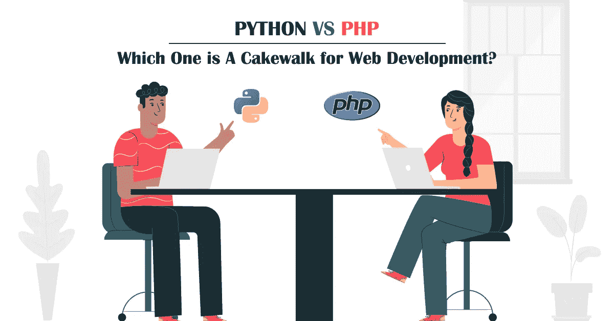
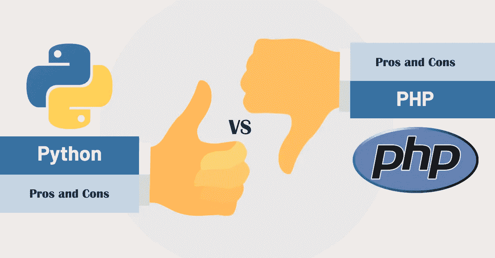

# PHP Vs Python:2021 年 Web 应用哪个最好？

> 原文：<https://medium.com/quick-code/php-vs-python-which-is-best-for-web-applications-in-2021-b7ad3fe0743a?source=collection_archive---------0----------------------->

## 看看这个博客，了解一下这种比较，这将有助于你为下一个 web 开发项目选择合适的编程语言

今天的市场都是关于互动网站和移动应用。每 5 家企业中就有 3 家拥有量身定制的商业网站和移动应用。感谢 web 和 [**移动应用开发公司**](https://www.suntecindia.com/mobile-app-development-services.html) 开发优秀的功能性应用。当构建移动或网络应用时，后端开发扮演着最关键的角色；它就像是开发过程的支柱或基础。

功能性后端导致交互式应用程序开发。在后端开发中，两种语言获得了极大的流行；这些被称为 **Python 和 PHP 的语言一直是开发者社区和企业讨论的热门话题。**

这些是最广泛使用的编程语言，几乎每个开发人员都非常喜欢。这种巨大的受欢迎程度是因为它们的特性、功能以及它们在 web 开发中提供的其他因素。然而，web 开发市场充满了不同的编程语言，但是 PHP 和 Python 之间的竞争总是人们谈论的话题。这两种语言在市场规模、历史、特性、功能和用法方面都有很强的竞争力。这种健壮性造成了一场重要的战斗，即在 web 开发的 **Python 和** [**PHP 之间选择哪一个。**](https://www.suntecindia.com/php-development-services.html)

因此，这篇文章描述了这两种强大的编程语言之间的区别以及它们的特性、优点和缺点。我们写这篇文章是为了帮助你更好地理解这些语言，并帮助你为下一个 web 开发项目做出有见地的决策。

# PHP 与 Python 在 Web 开发中的比较

在详细讨论之前，我们先来快速回顾一下 PHP 和 Python-

## PHP:

PHP，也称为超文本预处理器，是 1994 年发现的最古老的编程语言之一。这种语言在全球范围内被广泛用于构建交互式网站。**根据** [**市场报道**](https://w3techs.com/technologies/details/pl-php) **，** PHP 被 **79.2%的已知服务器端编程语言网站**使用。因此，你在互联网上访问的每 10 个网站中几乎有 8 个以某种方式使用 PHP。

这种服务器端语言带有强大的工具和类似 C 的语法，允许构建动态网页；它是完全免费的。它是全球众多开发者和社区高度推崇和采用的主要语言之一。这种语言在不断发展，因此，大多数现代网站仍然运行在 PHP 上。

> PHP 8.0.7 是最新的稳定版本，发布于 2021 年 6 月 3 日。

## Python:

Python 是一种面向对象、通用的高级编程语言，专为移动和 web 应用程序开发而设计。这种语言是在 1989 年开发的，但在 2000 年 Python 版发布后发展势头迅猛。它经常被软件开发人员用作构建、控制、管理、测试和其他方式的支持语言。此外，Python 2.0 中的 Unicode 支持特性使得这种语言在 web 开发市场上需求很大。因此，它是初学者和有经验的开发人员最喜欢的编程语言之一。

Python 已经非常受欢迎，以至于今天许多成功的技术巨头都选择 Python 作为他们的后端开发语言。使用 Python 建立网站的一些最好的例子是 Instagram、Spotify、网飞、优步、Dropbox、Pinterest、Google、Reddit 和 Lyft。

> **Python 3.9.5 是稳定版，发布于 2021 年 5 月 3 日。**

> 接下来，我们来讨论一下:

# PHP 与 Python:哪个更好？

为了更好地理解 PHP 和 Python 中哪一个更好，我们比较了这些语言的一些参数。所以，我们来讨论一下-

## **#1 表现:**

几年前，Python 被认为是最快的编程语言，但是 PHP 第 7 版已经完全改变了这一局面。今天 PHP 比 Python 和其他语言快 3 倍。现在有了 PHP，开发人员可以一口气高速快速处理海量数据。速度和可伸缩性最终增强了 PHP 相对于 Python 的性能。这里 PHP 胜出。

## **#2 库支持:**

在库支持方面，Python 胜过 PHP，因为它附带了许多库。今天，许多组织都在投资机器学习 web 应用程序，Python 包含了广泛的机器学习库，包括 TensorFlow、Scikit、Learn 等等。与 Python 相比，PHP 没有足够的库支持。

因此，要构建 ML 支持的 web 应用程序，Python 是开发人员和组织的最佳选择。

## **#3 社区支持:**

谈到社区支持，两种语言的立场几乎相同。作为最古老和最流行的服务器端语言之一，PHP 拥有广泛的社区支持。80%的网站都在 PHP 上，所以很明显 PHP 社区是多么的巨大。

另一方面，Python 也接近 PHP 当谷歌开始在 YouTube 等应用程序中使用这种语言时，它受到了关注。在那之后，许多其他科技巨头，如 Instagram 和优步，已经将这种语言用于他们的后端。

## **#4 复杂度:**

两种语言都是面向对象的，与操作系统兼容。但是说到易用性，Python 胜过 PHP。PHP 带有严格的语法，这使得这种语言很复杂，很难理解。PHP 以前的版本有点复杂。

而 Python 具有很高的可读性，这使得它非常容易理解。用 Python 编写的代码易于阅读和解释，这也有助于简化调试过程。

## **#5 文档:**

PHP 附带了一个完整的文档站点，允许开发人员在文档页面上发表评论。这些文档是用浅显易懂的语言编写的，初学者和经验丰富的开发人员都很容易理解。额外的概念使这些文档更有价值，因为它以独特的对话语气阐述了这些概念。但是这些注释有时会变成缺点，因为在文档网站上，你很容易看到旧的注释在上面，这会让任何开发人员非常困惑。

而使用 Python，不存在这样的问题，因为它不允许注释。在 Python 中，文档更少对话，这有时会使它们难以阅读和理解。这里 PHP 胜过 Python，因为开发人员可以很容易地理解它的文档。

## **#6 调试:**

在调试方面，Python 和 PHP 打成了平手，因为 Python 的 PDB (Python Debugger)和 PHP 的 XDebug 自带强大的调试功能，包括堆栈、断点、路径映射等。这些调试器很容易使用；它们之间唯一的区别是它们的设置。在 Python 中不需要任何设置；你只需要按下“调试”按钮来检查 Python 代码。

你需要额外的 PHP 设置工作，你可以很容易地做到这一点。所以调试没有赢家，因为两者都有强大而优秀的调试器来保证应用程序的安全和平稳运行。

## **#7 语法:**

无语法错误的编程一直是开发人员在学习一门语言时通常要考虑的一个关键点，在这里 Python 胜过了 PHP。这是因为 Python 为开发人员提供了一种便利，他们可以编写代码，而不用考虑在构建过程中导致代码失败的限制。此外，Python 的可读性很高，这也有助于开发人员进行调试。

而 PHP 有复杂的语法，这意味着在编码过程中有一定的限制。因此，开发人员选择 Python 进行简单的语法编程。

## **#8 渲染:**

大量的社区支持和简单的文档使 PHP 在渲染方面受益匪浅。这种服务器端语言遵循决定性的呈现方法，这使它在 Python 上一枝独秀。另一方面，Python 在渲染过程中发现了困难，因为它不像 PHP 那样清晰和直接；因此 PHP 是渲染的完美选择。

*那么，现在我们来看看 PHP 和 Python 的特性。*

# PHP 与 Python:特性

## **PHP 的特点:**

1.  与其他脚本语言相比，它易于使用且简单明了。
2.  它具有灵活和嵌入的特性，因为它可以很容易地用 XML、HTML、Javascript 等进行解释。
3.  它与几乎所有领先的操作系统高度兼容，包括 Windows、Mac OS、Linux、Unix 等。
4.  它是一种开源的服务器端编程语言，所以不需要支付高额费用。用户可以轻松下载并免费使用。
5.  它支持广泛的数据库，包括 MySQL、Oracle、Informix、SQLite、Sybase 等等。
6.  PHP 支持一个错误报告常量，它在运行时生成错误和相关的警告。

## **Python 的特点:**

1.  与 C、C#、Javascript 和 Java 等其他语言相比，Python 易于学习和编码。
2.  PyQt5、PyQt4、wxPython 或 Tk 等 Python 模块支持图形用户界面(GUI)的开发。
3.  它是一种可移植的语言，允许在任何平台上运行它的代码，比如 Windows、Unix、Linux 和 Mac。
4.  它很容易与其他语言如 C，C++集成。
5.  它提供了大量的标准库支持，有丰富的模块和函数。这对于开发基于 ML 和其他技术的高级应用程序是非常可取的。
6.  它是一种高级编程语言，开发人员不需要它来管理内存和系统架构。

> 接下来，让我们快速了解一下 PHP 和 Python 的优缺点:

# PHP 与 Python:利弊

## Python 的优点

1.  它提高了开发人员的生产力，因为它提供了广泛的库支持和清晰的面向对象设计，可以帮助程序员编写整洁干净的代码。
2.  Python 增强了应用程序的性能，因为它结合了健壮的流程集成特性、单元测试框架，并改进了控制能力，最终提高了应用程序的速度和生产率。
3.  它是开源的，因此程序员很容易访问。
4.  它是一种可扩展语言，允许开发人员甚至用其他语言编写代码，包括 C、C++。
5.  由于 WORA 功能，它是便携式的。

## Python 的缺点

1.  Python 在移动计算和浏览器方面比较弱；因此它在客户端很少出现。
2.  由于设计限制，它会引发运行时错误。
3.  与 Java 数据库连接相比，Python 的数据库访问层还不太发达。
4.  它在应用程序构建期间使用大量内存，如果需要内存优化，这可能是一个缺点。

## **PHP 的优点**

1.  它是一种开源的服务器端编程语言，并且是免费的，因此每个用户都可以很容易地下载它并使用它来构建动态网页。
2.  它是独立于平台的；在 PHP 上开发的应用程序可以高效地运行在各种操作系统上，比如 Linux、Windows 和 Unix。
3.  代码在 PHP 中很容易管理。
4.  开发者不需要编写任何额外的代码。
5.  它自动化了常见的 web 开发任务。
6.  强大的安全功能可以防止网站受到有针对性的安全攻击。

## **PHP 的缺点**

1.  程序员不需要学习 PHP，而是需要理解它的框架，比如 CakePHP、Yii、CodeIgniter 等等。
2.  每一个 PHP 框架的质量都各不相同。
3.  开发人员没有找到足够的选项来改变框架的核心行为。
4.  框架有一个有缺陷的错误处理方法。
5.  它在处理大型应用程序方面很弱。
6.  PHP 的高级特性有时会影响小型或简单网站的速度和性能。

# PHP Vs Python:选哪个？

的确，这是一篇很长的文章，但我希望你喜欢它。在对这两种语言的每个关键参数进行比较之后，仍然很难从中选择一种编程语言。PHP 和 Python 各有所长。无论是特性、功能、文档、库支持，还是其他因素，两者都非常优秀。不是关于**PHP Vs Python**；web 开发语言的选择完全取决于您的业务需求。如果你的应用想法需要机器学习代码， [**Python 应用开发**](https://www.suntecindia.com/python-development-services.html) 是最终的选择。

简而言之，您的需求决定了 web 开发项目的编程语言。所以，确保你有精确的需求，因为完整的后端开发依赖于它。

如果您正在为您的需求寻求专家帮助，我们将随时为您提供帮助。我们是一家领先的移动和 [**web 开发公司**](https://www.suntecindia.com/web-development-services.html) ，在创建优秀的移动和 web 应用程序方面拥有丰富的经验。我们专门的开发团队已经开发了几个基于多种编程语言的独特应用程序。我们可以为您提供最佳的 web 开发解决方案。你还在等什么？与我们联系。我们将很高兴收到你的来信。