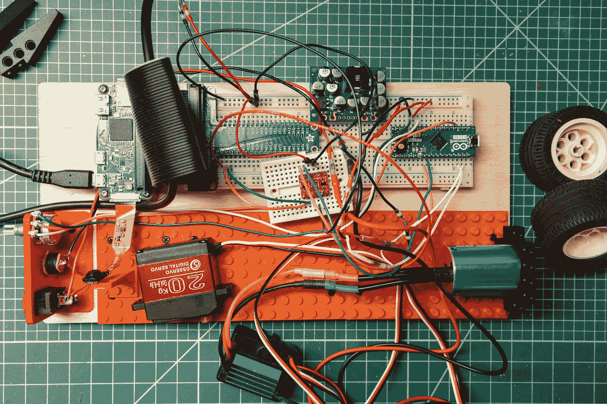
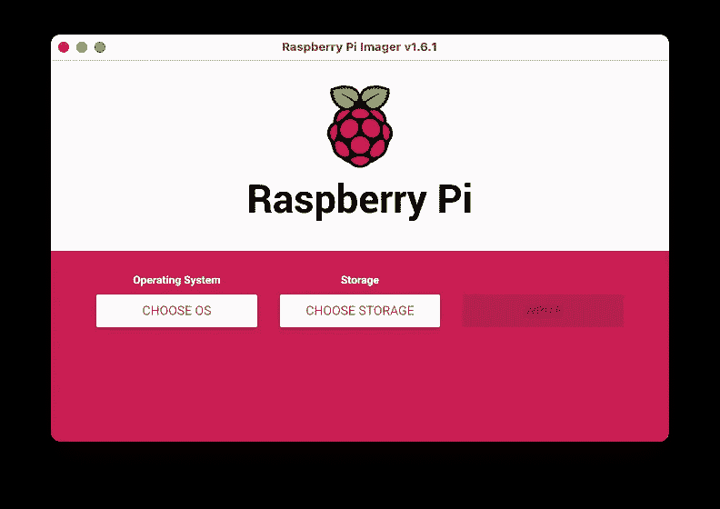

# Pi 控制电机

> 原文：<https://medium.com/oracledevs/pi-controlled-motors-b5cf81eea42f?source=collection_archive---------0----------------------->

克里斯·本森



Pi, Arduino, IC2, Brushless Motors

如果你愿意，你可以在 GitHub [这里](https://github.com/chrisbensen/chris-blogs/blob/main/π-racer/season1/episode2/pi-motors.md)阅读这篇博文。

# 兔子洞

经常有人展示他们做的东西，也许是一个简短的视频或关于如何做的博客帖子，但方向远未完成，选择背后的基本原理也缺乏。我做这个系列的原因是展示选择背后的过程和基本原理。最后我们会有一些很酷的东西。相信我。问题是事情总是比预期的要花更多的时间。我原以为我会比现在走得更远一点，但是在这一路上已经有了一些发现和研究。如果一切顺利，那么我已经做了一个了。

在构建这个的时候，我必须平衡一些事情。首先是让它发挥作用。其次是性能。如果我能同时做到这两点，那是一个额外的奖励，但是我可以并且将会回头评估我的表现。对于这个项目，性能表现在两个方面:响应时间和电池使用。这必须进行调整，因此让事情运行起来进行真实世界的评估是最重要的。第三，也是最重要的，是记录过程。有时候事情进展顺利，按计划进行。其他时候他们不会。我想这就是我这么做的原因。展示构建东西是混乱的，并提供一些见解、教育和可能的一些娱乐(因为在这一点上没有很多事情是正确的)。

现在，我只有一个人，我什么都不知道。任何声称自己无所不知的人都在撒谎。我所知道的是我能想出办法--让自己陷入困境。我也知道如何阅读说明，向朋友和专家寻求建议，如果失败了，就尝试，尝试，再尝试。两者各有一点点。

我说这些的原因是我遇到了一些问题，确切地说是五个。你会读到我在这个过程中的旅程，所有的决定，以及错误。这里值得一提的是，您可以在文章中找到它们:

*   电源
*   共同点
*   Pi 运行在 3.3v，Arduino 运行在 5v
*   很少有开发工具在 Pi Zero 上运行
*   更新的试验板:

[](https://www.thingiverse.com/thing:4896228) [## 克里斯本森定制乐高面包板

### 我创建了这个[bread board[(https://www . thingiverse . com/thing:4868187)但是没有地方放相机。所以这个…

www.thingiverse.com](https://www.thingiverse.com/thing:4896228) 

# 设置 Pi

在这一点上，我有一个 Pi 零，Pi 间谍相机，伺服和 ESC 连接到一个无刷电机。最终会添加更多的东西，但这足以开始。我想我们应该从建立 Pi 开始。

有很多方法可以将操作系统映像写入 SD 卡，但我发现 [Raspberry Pi Imager](https://www.raspberrypi.org/software/) 是最简单的，尤其是如果你想使用标准的 Pi 操作系统。我通常使用 [Oracle Linux](https://www.oracle.com/linux/downloads/linux-arm-downloads.html) ，因为我有一整个操作系统团队来帮我，但不幸的是 Oracle Linux 不支持 Raspberry Pi Zero(因为 Oracle Linux 是 64 位的，而 Pi Zero 是 32 位的)，所以我使用 Pi OS。



Pi Zero 非常慢，不像 Pi 4，所以你不会想在这个设备上开发。这就是 Visual Studio 代码的闪光点。但是，VS Code 远程 SSH 扩展不支持 Pi。我有两种方法可以做到这一点:

1.  创建一个 GitHub repo 并在我的桌面上本地编辑，推送更改，并在 Pi 上拉动它们。
2.  结合使用本地编辑器和 scp 将本地文件复制到 pi，将 ssh 复制到 Pi，并运行脚本。

另一个问题，也是我没有想到的，是 GraalVM 不支持 Pi。对于 Pi 3 或 Pi 4，您可以下载 GraalVM for Pi (ARM)并运行其 Java 二进制文件:

```
> wget [https://github.com/graalvm/graalvm-ce-builds/releases/download/vm-21.1.0/graalvm-ce-java16-linux-aarch64-21.1.0.tar.gz](https://github.com/graalvm/graalvm-ce-builds/releases/download/vm-21.1.0/graalvm-ce-java16-linux-aarch64-21.1.0.tar.gz)> tar -xzf graalvm-ce-java16-linux-aarch64–21.1.0.tar.gz
export PATH=/home/pi/graalvm-ce-java16–21.1.0/bin:$PATH
> java
-bash: /home/pi/graalvm-ce-java16–21.1.0/bin/java: cannot execute binary file: Exec format error
```

啊，对了，32 位操作系统上的 ARM-7。我开始明白为什么没有多少开发人员使用 Pi Zero。它可能很小，但它没有常规 Pi 所具有的支持，并且它的 CPU 和内存有点低。

好吧，反正每个人都用 Python 编写 Pi，对吧？

Episode 2 — Pi Controlled Motors

# 意外的硬件:Arduino

此时我摇了摇头。就像任何事情一样，平衡一个大项目需要多任务处理。我一直在处理项目中太多的其他部分，没有给电子产品太多的关注。Pi Zero 没有 PWM 引脚，在用 Pi 4 进行了几次测试后，PWM 信号不够可靠。这是因为 Pi 运行的是抢占式多任务操作系统，所以 PWM 信号— —必须是干净的— —有点不稳定，或者我喜欢称之为“不稳定”我需要一个专用微控制器。

在这个项目中引入 Arduino 并不简单。我实际上来回走了一段时间，但(目前)决定使用 Arduino Micro。我身边就有几个这样的，它们很小，功能相当强大。关于我为什么选择这个 Arduino 的更多信息。

我使用的电压调节器额定为 2.5 安培，当我添加 Arduino 时，Pi 由于功率不足而卡在了重启周期中。让我困惑的是，它一直在工作，直到我配置了需要重启的东西，所以我没有看电压调节器。我没有看电压调节器的另一个原因是，2.5 安培实际上应该足够了，但事实证明，显示器，USB 集线器，鼠标和键盘的组合比这多。为什么班长拉 2amp 是我理解不了的；它有自己的电源！这就是为什么我花了这么长时间来建立一个定制的原型试验板。

我遇到的一个问题是，当在我的办公桌和车库工作台上的设备之间进行调试时，电源和接地会发生一些变化，从而导致问题。当我把试验板搬到我的电脑上调试时，电源从只有电源变成了电源*加*电脑的 USB。现在理由不一样了。所有正在通信的设备必须有相同的接地，但我发现在运行我正在制作的设备和插入 USB 电缆进行编程/调试之间切换会影响事情或需要轻微的布线变化。如果你对此有解决方案，我很想听听你是如何解决的。

我换了电压调节器，解决了电源问题。在最后的项目中，我应该可以回到原来的单元，但我正在考虑设计一个定制的 PCB，这样更容易开发和组装。

【Raspberry Pi 和 Arduino 之间的通信

如果你使用“Wire.h”库，在 I2C 的 RPi 和 Arduino 之间的通信有点混乱。简而言之，RPi 使用的是重复启动信号，而 Arduino 不是。I2C 接口上的重复开始信号告诉设备开始应答呼叫。在 Arduino 的情况下，询问和回答是在两个独立的呼叫中进行的。因此，您不能发送块。然而，我发现我可以毫无问题地使用“SMBus.write_i2c_block_data()”,因为它的发送方式有点不同。这很好，因为如果我不得不单独发送每个字节，事情会非常慢。看完这个之后，我做了一些优化；如果你能发现它们，请在评论中告诉我。

这是 Arduino `carduino.ini`草图:

```
#include <Wire.h>
#include <Servo.h>int servoPin = 10;
int escPin = 11;int i2cAddress = 0x8;Servo esc;
Servo servo;int status = 0;#define ERROR_READING 1
#define INVALID_RANGE 2void setup() {
  Serial.begin(9600); Wire.begin(i2cAddress);
  Wire.onReceive(receiveEvent);
  Wire.onRequest(requestEvent); // pin, min pulse width, max pulse width in microseconds
  servo.attach(servoPin, 0, 180); // pin, min pulse width, max pulse width in microseconds
  esc.attach(escPin, 1500, 2000);
  esc.write(1500); // initialize the ESC
  delay(3000); Serial.println(“starting”);
}void loop() {
}boolean range(int min, int max, int value) {
  return (min <= value) && (value <= max);
}void receiveEvent(int byteCount) {
  Serial.print(“receiveEvent: “);
  Serial.println(byteCount); if (byteCount > 1) {
    byte message = Wire.read();switch (message) {
      case 1: {
        byte degrees = Wire.read();
        Serial.print(“servo: “);
        Serial.println(degrees); if (range(0, 180, degrees)) {
          servo.write(degrees);
        }
        else {
          status = INVALID_RANGE;
        } break;
      } case 2: {
        int speed = 0; if (byteCount == 3) {
          byte high = Wire.read();
          byte low = Wire.read();
          Serial.println(high);
          Serial.println(low);
          speed = 0;
          speed = (high << 4) | low;
        }
        else {
          speed = Wire.read();
        } Serial.print(“esc: “);
        Serial.println(speed); if (range(1000, 2000, speed)) {
          esc.write(speed);
        }
        else {
          status = INVALID_RANGE;
        } break;
      } default: {
        status = ERROR_READING;
      }
    }
  }
}void requestEvent() {
  Serial.print(“requestEvent “);
  Serial.println(status);
  Wire.write(status);
}
```

一旦 Arduino 设置好并插入 Pi 的 I2C 引脚，哦，等等，Arduino 是 5v，Pi 是 3.3v。逻辑可以发送到 Arduino，但 Arduino 不能发送逻辑到 Pi。[逻辑电平转换器](https://learn.sparkfun.com/tutorials/bi-directional-logic-level-converter-hookup-guide/all)来救场了！这个小板子可以双向转换，不需要油炸任何东西。试验板比最初预期的要多一些零碎的东西，但它正在出现。

一旦您知道如何连接，将 I2C 设备连接到 Pi 是相当简单的。Adafruit 有一个[详细的步骤列表](https://learn.adafruit.com/adafruits-raspberry-pi-lesson-4-gpio-setup/configuring-i2c):

1.  `> sudo apt-get install -y python-smbus`
2.  `> sudo apt-get install -y i2c-tools`
3.  `> sudo raspi-config`
4.  选择接口选项->高级选项-> I2C ->是
5.  重启 Pi: `>sudo reboot`
6.  等到 Pi 启动后，再次登录并打开终端。启动 Arduino 并检查 Pi 是否正在检测 I2C 设备:

```
> sudo i2cdetect -y 1
 0 1 2 3 4 5 6 7 8 9 a b c d e f
00: — — — — — 08 — — — — — — — 
10: — — — — — — — — — — — — — — — — 
20: — — — — — — — — — — — — — — — — 
30: — — — — — — — — — — — — — — — — 
40: — — — — — — — — — — — — — — — — 
50: — — — — — — — — — — — — — — — — 
60: — — — — — — — — — — — — — — — — 
70: — — — — — — — —
```

请注意，Arduino 出现在地址 8。

回到码头。我在桌面上打开两个终端窗口，创建一个名为‘pi’的目录，并把两个终端都‘CD’到这个目录中。在一个窗口中，我“ssh”进入 Pi，在第二个窗口中，我设置了一个“scp”命令。这里有两个命令:

```
> ssh pi@192.168.1.165
> scp testservo.py pi@192.168.1.165:/home/pi
```

接下来，我打开一个文件夹编辑器，创建一个名为`testbot.py`的文件(我最初是用电位计开始工作的，还没有来得及重命名这个文件):

```
from smbus import SMBus
import time
import sysif (len(sys.argv) != 3):
 print(“Error: Not enough arguments”)
 exit()device = int(sys.argv[1])
value = int(sys.argv[2])
print(“device “ + str(device))
print(“value “ + str(value))bus = SMBus(1) # 512M Pi use i2c port 1, 256M Pi use i2c port 0
time.sleep(1)
address = 0x8if (value < 256):
 bus.write_i2c_block_data(address, device, [value])
else:
 high, low = value >> 4, value & 0x0FF
 print(high)
 print(low)
 bus.write_i2c_block_data(address, device, [high, low])bus.close()
```

用法:

```
python3 testpot.py [device] [value]
```

示例:

```
python3 testpot.py 1 180
```

第一个参数是器件，1 是伺服电机，2 是无刷电机。伺服电机的值为 0–180。无刷电机的值为 1000–2000，其中 1500 表示停止，2000 表示节气门全开。

Episode 2 — Pi Controlled Motors Extended Edition

# 结论

我用一个 Pi Zero、Arduino Micro、5v 电压调节器、连接到无刷电机的 ESC 和一个伺服电机来结束这一集。因为 Pi 与 Arduino 通信，我还需要一个逻辑电平转换器。我不打算提供这些部件的链接，因为我不能 100%确定我喜欢我所拥有的(例如，无刷 DC 电机不会反转)。我花了几天时间试图找出原因，但没有成功。

我不愿意添加 Arduino，但当我意识到有必要添加一个微控制器来为无刷电机产生干净的 PWM 信号时，唯一的决定就是选择哪个微控制器。有很多微控制器，但我决定使用 Arduino 微控制器，因为它可以完成这项工作；它很小，没有很大的动力。其他选择 Arduino Pro Mini 和 Teensy。Arduino Pro Mini 采用 3.3v 的变体，这将使生活变得简单得多，因为它在与 Pi 相同的电压下工作，因此不需要线路电平转换器。但是，5v 和 3.3v 中的 Pro Min 不够快。Teensy 甚至比 Arduino Micro 更快，价格也很合理，大约在 20 美元左右，但我对 Arduino Micro 更有经验，所以我选择了它。在我完成这个项目之前，我会考虑换一个十几岁的孩子。

我以前和 ESC 合作过。它们很容易使用，但是方向需要说明一些我的方向没有说明的东西。这就是你试图使用低预算的电潜泵和电机的结果。在这一点上，我实际上做了一个搜索，一页一页地阅读和尝试每一页上的每一件事— —包括评论— —直到我发现汽车和多电脑的 ESC 是不同的。飞机和大多数多翼电子稳定控制系统— —这是我用过的— —用 1000 来停止，用 2000 来全油门。其中一些还有反向装置，这样飞行器就可以倒飞。汽车和船只的电子稳定控制系统使用 1000 作为完全倒退，1500 作为停止，2000 作为完全前进。

在这一点上，我会向您展示一个接线图，但由于事情变得混乱(没有双关语缩进)，我将只列出我所做的连接，您可以参考本页顶部的照片:

* Arduino 微 VCC -> 5v 稳压器 VCC
* Arduino 微 GND - > 5v 稳压器 GND
* Arduino 微 SDA 2- >电平转换器 HV1
* Arduino 微 SCL 3- >电平转换器 HV2
* Arduino 微 10 - >伺服数据(白线)
* Arduino 微 11 - > ESC 数据(白线)
* Arduino 微 A0 - >电位器

— -

* Pi SDA ->电平转换器 LV1
* Pi SCL - >电平转换器 LV2
* Pi 3.3v - >电平转换器 HV

— -

*电平转换器 GND(两者都有)->公共地
*电平转换器 HV - > 5v 稳压器 VCC

— -

* 5v 稳压器 VIN -> 12v 电源+
* 5v 稳压器 GND - > 12v 电源-
* 5v 稳压器 VCC - >微型 USB 为 Pi、Arduino 微型 VCC
* 5v 稳压器 GND - >微型 USB 为 Pi、Arduino 微型 GND

# 参考

*   关于圆周率上的 I2C[的一点轻松阅读](https://stackoverflow.com/questions/24812185/python-smbus-write-byte-and-values-greater-than-1-byte-255)
*   [write _ I2C _ block _ data 中 cmd 参数的含义](https://raspberrypi.stackexchange.com/questions/8469/meaning-of-cmd-param-in-write-i2c-block-data)
*   [编程 ESC](https://www.instructables.com/ESC-Programming-on-Arduino-Hobbyking-ESC/)