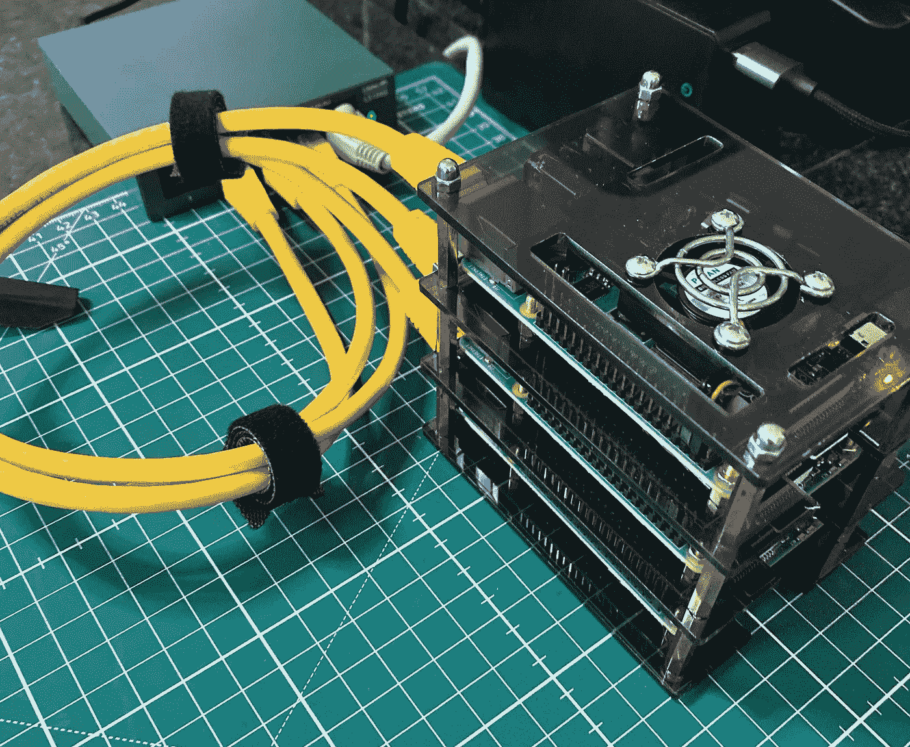
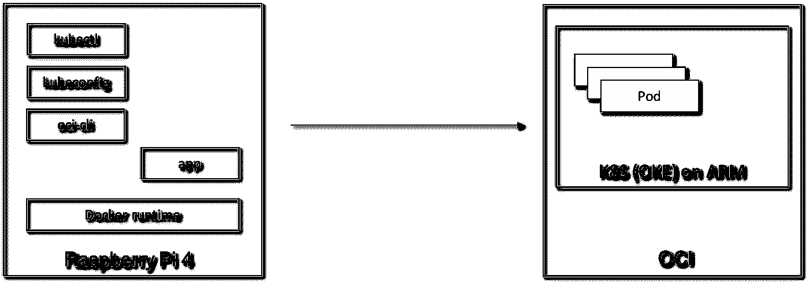
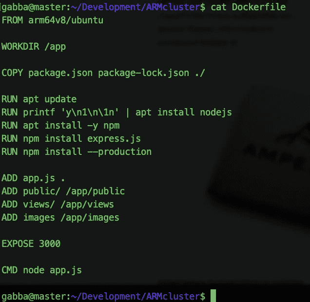
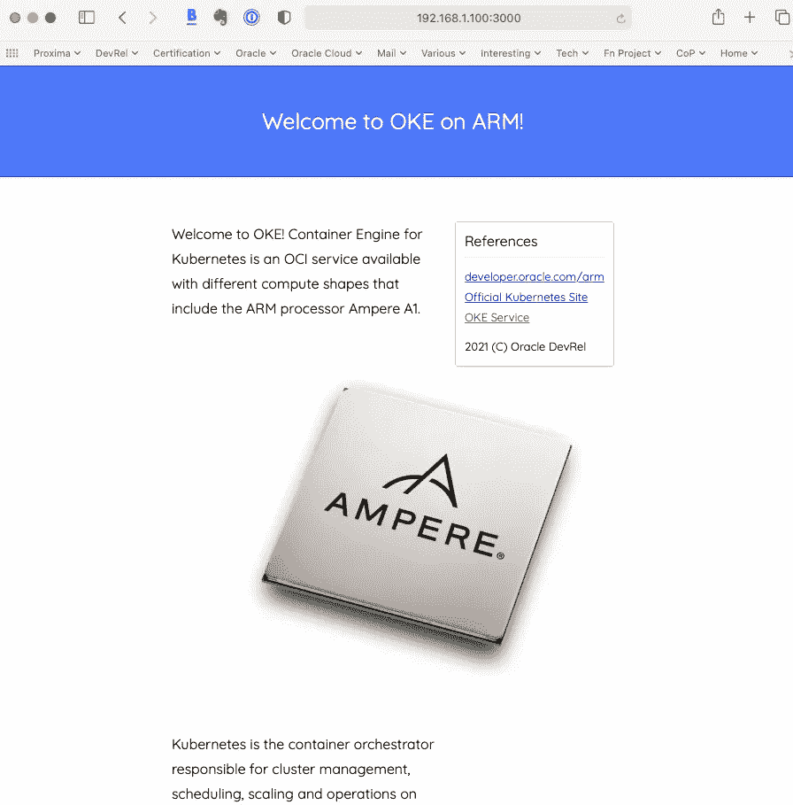
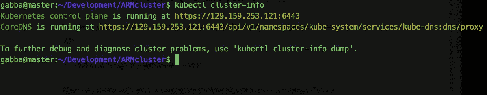
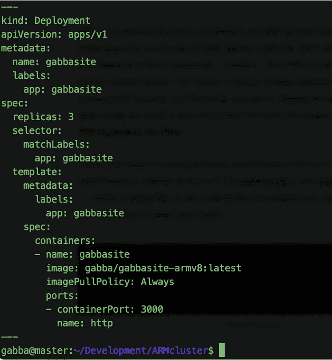
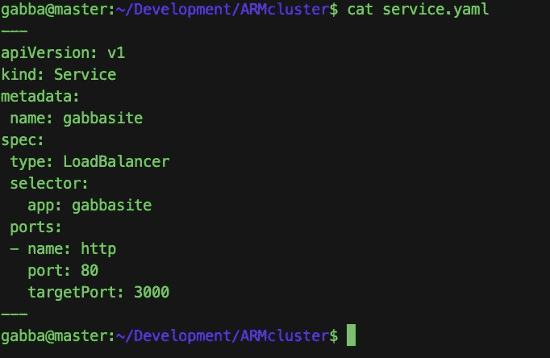
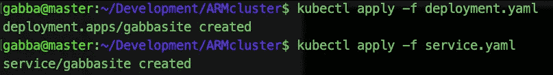
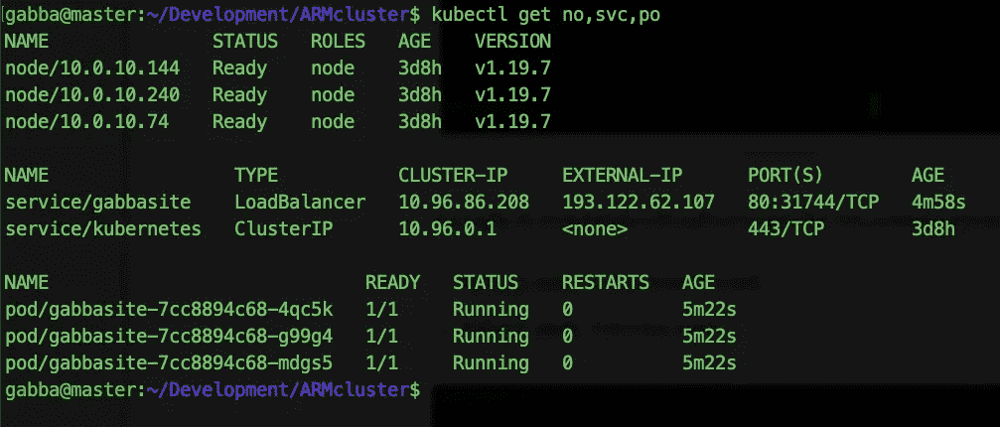
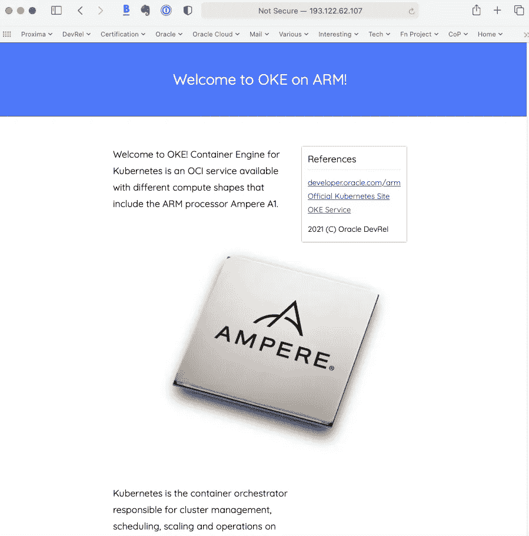

# 从 Pi 到 OCI:使用 ARM 开发和部署应用到 Kubernetes (OKE)

> 原文：<https://medium.com/oracledevs/pi-to-oci-using-arm-to-develop-and-deploy-apps-to-kubernetes-oke-18ddd2a6ffc3?source=collection_archive---------1----------------------->

**手臂上的 OKE**

最近，我对[宣布](https://blogs.oracle.com/cloud-infrastructure/arm-based-cloud-computing-is-the-next-big-thing-introducing-arm-on-oci?source=:ex:tb:::::RC_WWMK210625P00070:PItoIOCI&SC=:ex:tb:::::RC_WWMK210625P00070:PItoIOCI&pcode=WWMK210625P00070)OCI 上的 Ampere A1 的可用性感到兴奋，更一般地说，基于 ARM 的计算是我们过去处理的 RISC 架构的更新实例。ARM 可用于基础设施层面，尤其是在使用世界领先的编排引擎设计和实施云和容器原生应用程序时:无处不在的 K8S，可通过 Kubernetes ( [OKE](https://docs.oracle.com/en-us/iaas/Content/ContEng/Concepts/contengoverview.htm/?source=:ex:tb:::::RC_WWMK210625P00070:PItoOCI&SC=:ex:tb:::::RC_WWMK210625P00070:PItoOCI&pcode=WWMK210625P00070) )的容器引擎在 OCI 获得。

**块圆周率**

紧接着这个消息，我想到我的一个本地 Raspberry Pi 栈(RPi 4，8 GB RAM)，目前托管着 [microK8S](https://microk8s.io) 集群的一个节点，也可以作为 ARM 开发者工作站。此外，检查兼容性问题或我可能遇到的任何其他问题也很有趣。



The Pi

所需组件的简化模式如下:



Yes, it’s that simple.

首先，我需要为这个测试找到一个合适的 Docker 图像。我比较了 Ampere A1 和 RPi CPU 的规格，两者都采用 64 位的 ARM v8 架构，所以我选择了这个修补会议的 [arm64v8/ubuntu](https://hub.docker.com/r/arm64v8/ubuntu) 映像。

在预订我的 OKE 集群之前，我尝试了一个用 node.js、express.js 和 [Jade](http://jade-lang.com) 制作的简单应用程序，只是在我的 RPi 上有 Docker。这是 Dockerfile 文件:



Docker build 命令使用了该 Docker 文件:

```
docker build -t gabba/gabbasite-armv8 .
```

然后，我通过 Docker run 命令在本地运行应用程序:

```
docker run --rm -d --name gabbasite -p 3000:3000 gabba/gabbasite-armv8:latest
```

在端口 3000 上公开了 web 应用程序后，我访问了它:



**臂上的 OKE**

所以，第一部分还可以。我们只需要将映像推送到一个 repo 以备将来使用:

```
docker push gabba/gabbasite-armv8
```

然后，在 ARM-OKE power combo 上尝试这个应用程序。

现在，我需要在 Oracle 云基础架构上启动 OKE 快速创建，以创建一个具有可用臂形状的 K8S 集群(我们将坚持这种最少三个节点的设置)。

OKE 服务允许通过快速创建选项，预留必要的计算和网络资源，在几分钟内创建一个集群。方便开发者！跟随指南[这里](https://docs.oracle.com/en/learn/arm_oke_cluster_oci/index.html?source=:ex:tb:::::RC_WWMK210625P00070:PItoOCI&SC=:ex:tb:::::RC_WWMK210625P00070:PItoOCI&pcode=WWMK210625P00070#introduction)了解详情，记得选择名为 **VM 的形状。标准. A1.Flex** 。

然后，我用 RPi shell 配置本地环境来访问 K8S 集群，这意味着设置 oci-cli [配置](https://docs.oracle.com/en-us/iaas/Content/API/SDKDocs/cliconfigure.htm?source=:ex:tb:::::RC_WWMK210625P00070:PitoOCI&SC=:ex:tb:::::RC_WWMK210625P00070:PitoOCI&pcode=WWMK210625P00070)和[生成](https://docs.oracle.com/en-us/iaas/Content/ContEng/Tasks/contengdownloadkubeconfigfile.htm?source=:ex:tb:::::RC_WWMK210625P00070:PitoOCI&SC=:ex:tb:::::RC_WWMK210625P00070:PitoOCI&pcode=WWMK210625P00070)~/。kube/配置文件。在过程的最后，可以从 RPi shell 访问 OKE 集群:



Good old kubectl…

**编写部署文件**

旧习难改。我没有将部署指令与服务定义混合在一起:两者都是 yaml 文件，可以组合在一起发出一个命令，但是我在生产环境中使用 OKE/K8S 部署的经验告诉我应该有单独的文件。不管怎样，这是部署:



deployment.yaml

这是 service.yaml，它通过负载平衡器将应用程序暴露给残酷的世界:



service.yaml

一些简单的命令就足以测试这两种配置:

```
kubectl apply -f deployment.yamlkubectl apply -f service.yaml
```



Results…

检查我们的部署状态:



Nodes, services and pods

OKE 非常友好地向我提供了一个与负载平衡器相关联的公共 IP 地址，我将通过 web 浏览器访问这个地址。结果似乎很有希望:



**结果**

*   您可以轻松地使用 RPi 4 来构建软件和在 ARM 上运行 OKE 所需的 Docker 映像。这种方法可能没有你最喜欢的水果品牌的基于 ARM 的笔记本电脑那么花哨和快速(而且价格过高)，但它便宜一个数量级。
*   在使用有效的 OCI 和 K8S 凭证对其进行配置之后，您可以将应用程序直接部署到 OKE (ARM 到 ARM)。
*   ARM 是下一件大事。使用 OCI 的[免费层](https://www.oracle.com/cloud/free/?source=:ex:tb:::::RC_WWMK210625P00070:PitoOCI&SC=:ex:tb:::::RC_WWMK210625P00070:PitoOCI&pcode=WWMK210625P00070)和[永远免费层](https://www.oracle.com/cloud/free/?source=:ex:tb:::::RC_WWMK210625P00070:PItoOCI&SC=:ex:tb:::::RC_WWMK210625P00070:PItoOCI&pcode=WWMK210625P00070#always-free)来查看。

快乐修补！