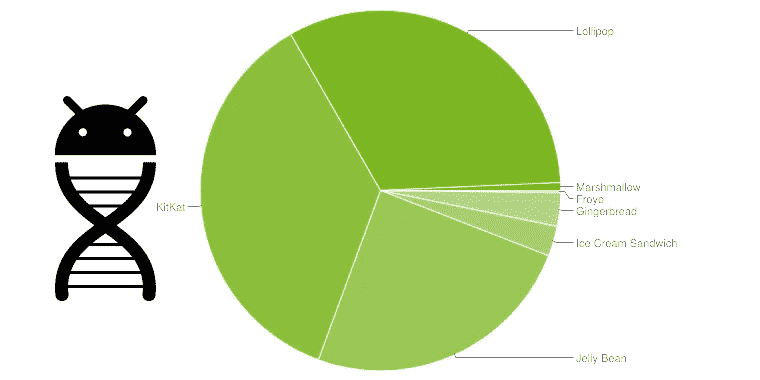

# 选择您的编译器版本、最小版本和目标版本

> 原文：<https://medium.com/androiddevelopers/picking-your-compilesdkversion-minsdkversion-targetsdkversion-a098a0341ebd?source=collection_archive---------0----------------------->



根据一年中的不同时间，可能在你发布一个应用程序几个月后，一个新版本的 Android 就发布了。这对你的应用意味着什么——一切都要崩溃了吗？

你会很高兴地知道**向前兼容性**是 Android 的一个重点——当用户更新到新版本的 Android 时，基于以前的 SDK 构建的现有应用不应中断。这就是 **compileSdkVersion** 、 **minSdkVersion** 和 **targetSdkVersion** 的用武之地:它们分别控制可用的 API、所需的 API 级别以及应用的兼容模式。

# 编译版本

compileSdkVersion 是你告诉 Gradle 用哪个版本的 Android SDK 来编译你的应用的方式。使用新的 Android SDK 是使用该级别中添加的任何新 API 的要求。

应该强调的是**改变你的 compileSdkVersion 并不会改变运行时行为**。虽然在更改您的 compileSdkVersion 时可能会出现新的编译器警告/错误，但您的 compileSdkVersion 不包括在您的 APK 中:它纯粹是在编译时使用的。(不过，您确实应该修复这些警告——添加它们是有原因的！)

因此，强烈建议您始终使用最新的 SDK 进行编译。您将获得对现有代码进行新编译检查的所有好处，避免新弃用的 API，并准备好使用新的 API。

注意，如果您使用[支持库](http://developer.android.com/tools/support-library/index.html?utm_campaign=adp_series_sdkversion_010616&utm_source=medium&utm_medium=blog)，使用最新的 SDK 进行编译是使用最新支持库版本的要求。例如，要使用 23.1.1 支持库，您必须拥有至少 23 的 compileSdkVersion(前几个数字需要匹配！).一般来说，支持库的新版本与新平台版本一起发布，为新添加的 API 和新特性提供了兼容性垫片。

# minSdkVersion

如果 compileSdkVersion 为你设置了最新可用的 API， **minSdkVersion 就是你的 app** 的下限。minSdkVersion 是谷歌 Play 商店用来确定可以在用户的哪个设备上安装应用程序的信号之一。

它在开发过程中也起着重要的作用:默认情况下, [lint](http://developer.android.com/tools/debugging/improving-w-lint.html?utm_campaign=adp_series_sdkversion_010616&utm_source=medium&utm_medium=blog) 针对您的项目运行，当您使用 minSdkVersion 之上的任何 API 时，它会警告您，帮助您避免试图调用不存在的 API 的运行时问题。[在运行时检查系统版本](http://developer.android.com/training/basics/supporting-devices/platforms.html?utm_campaign=adp_series_sdkversion_010616&utm_source=medium&utm_medium=blog#version-codes)是仅在较新的平台版本上使用 API 时的常用技术。

请记住，您使用的库，如任何一个[支持库](http://developer.android.com/tools/support-library/features.html?utm_campaign=adp_series_sdkversion_010616&utm_source=medium&utm_medium=blog)或 [Google Play 服务](https://developers.google.com/android/guides/overview?utm_campaign=adp_series_sdkversion_010616&utm_source=medium&utm_medium=blog)，可能有自己的 minSdkVersion——您的应用程序的 minSdkVersion 必须至少与您的依赖项的 minSdkVersion 一样高——如果您有需要 4、7 和 9 的库，您的 minSdkVersion 必须至少是 9。在极少数情况下，如果您想继续使用比您的应用程序更高的 minSdkVersion 的库(并处理所有边缘情况/确保该库只在较新的平台版本上使用)，您可以使用[工具:overrideLibrary marker](http://tools.android.com/tech-docs/new-build-system/user-guide/manifest-merger?utm_campaign=adp_series_sdkversion_010616&utm_source=medium&utm_medium=blog#TOC-tools:overrideLibrary-marker) ，但请确保彻底测试！

在决定一个 minSdkVersion 时，你应该**考虑** [**仪表盘**](http://developer.android.com/about/dashboards/index.html) 上的统计数据，这些数据让你对过去 7 天访问过谷歌 Play 商店的所有设备有一个全局的了解——这是你在 Google Play 上放置应用程序时的潜在受众。这最终是一项业务决策，即支持额外 3%的设备是否值得为确保最佳体验而花费开发和测试时间。

当然，如果一个新的 API 是整个应用程序的关键，那么 minSdkVersion 的讨论就变得容易多了。请记住，即使 14 亿台设备中的 0.7%也是非常多的设备。

# 目标版本

然而，这三者中最有趣的是 targetSdkVersion。 **targetSdkVersion 是 Android 提供向前兼容性的主要方式**，除非更新 targetSdkVersion，否则不应用行为更改。这允许您使用新的 API(就像您更新 compileSdkVersion 一样，对吗？)在进行行为改变之前。

targetSdkVersion 暗示的许多行为变化直接记录在[版本代码](http://developer.android.com/reference/android/os/Build.VERSION_CODES.html?utm_campaign=adp_series_sdkversion_010616&utm_source=medium&utm_medium=blog)中，但所有血淋淋的细节也列在每个版本的平台亮点上，在 [API 级别表](http://developer.android.com/guide/topics/manifest/uses-sdk-element.html?utm_campaign=adp_series_sdkversion_010616&utm_source=medium&utm_medium=blog#ApiLevels)中很好地链接。

例如， [Android 6.0 更改](http://developer.android.com/about/versions/marshmallow/android-6.0-changes.html?utm_campaign=adp_series_sdkversion_010616&utm_source=medium&utm_medium=blog)讲述了目标 API 23 如何将您的应用过渡到[运行时权限模型](http://android-developers.blogspot.com/2015/08/building-better-apps-with-runtime.html?utm_campaign=adp_series_sdkversion_010616&utm_source=medium&utm_medium=blog)以及 [Android 4.4 行为更改](http://developer.android.com/about/versions/android-4.4.html?utm_campaign=adp_series_sdkversion_010616&utm_source=medium&utm_medium=blog#Behaviors)详细说明了目标 API 19 或更高版本如何更改使用 [*set()*](http://developer.android.com/reference/android/app/AlarmManager.html?utm_campaign=adp_series_sdkversion_010616&utm_source=medium&utm_medium=blog#set(int,%20long,%20android.app.PendingIntent)) 和[*set repeating()*](http://developer.android.com/reference/android/app/AlarmManager.html?utm_campaign=adp_series_sdkversion_010616&utm_source=medium&utm_medium=blog#setRepeating(int,%20long,%20long,%20android.app.PendingIntent))设置的警报的工作方式。

由于一些行为变化对用户来说非常明显(菜单按钮的[废弃，运行时权限等)，**更新到最新的 SDK 应该是每个应用程序的高优先级**。这并不意味着你必须使用每一个引入的新特性，也不意味着你应该不经测试就盲目地更新你的 targetSdkVersion——**请，*请*在更新你的 targetSdkVersion** 之前测试！你的用户会感谢你的。](http://android-developers.blogspot.com/2012/01/say-goodbye-to-menu-button.html?utm_campaign=adp_series_sdkversion_010616&utm_source=medium&utm_medium=blog)

# Gradle 和 SDK 版本

所以设置正确的 compileSdkVersion、minSdkVersion 和 targetSdkVersion 很重要。正如您可能想象的那样，在一个有 [Gradle](http://developer.android.com/tools/building/plugin-for-gradle.html?utm_campaign=adp_series_sdkversion_010616&utm_source=medium&utm_medium=blog) 和 [Android Studio](http://developer.android.com/tools/studio/index.html?utm_campaign=adp_series_sdkversion_010616&utm_source=medium&utm_medium=blog) 的世界中，这些值通过包含在您的模块的 build.gradle 文件中而被集成到工具系统中(也可以通过 Android Studio 中的项目结构选项获得):

```
android {
  **compileSdkVersion 23**
  buildToolsVersion “23.0.1”

  defaultConfig {
    applicationId “com.example.checkyourtargetsdk"
    **minSdkVersion 7
    targetSdkVersion 23**
    versionCode 1
    versionName “1.0”
  }
}
```

compileSdkVersion 是一个编译时的东西(谁会想到呢！)，是与你的构建工具版本一起的 android 设置之一。其他两个略有不同，因为它们是在[构建变体](http://developer.android.com/tools/building/plugin-for-gradle.html?utm_campaign=adp_series_sdkversion_010616&utm_source=medium&utm_medium=blog#buildVariants)级别声明的——*default config*是所有构建变体的基础，也是您放置这些变体默认值的位置，但是您可以想象一个更复杂的系统，例如，您的应用程序的特定版本具有不同的 minSdkVersion。

minSdkVersion 和 targetSdkVersion 也不同于 compileSdkVersion，因为它们包含在您的最终 APK 中——如果您查看生成的 *AndroidManifest.xml* ，您会看到一个标签，如:

```
<uses-sdk android:targetSdkVersion=”23" android:minSdkVersion=”7" />
```

您会发现，如果您手动将它放入您的清单中，当您使用 Gradle 进行构建时，它会被忽略(尽管其他构建系统可能肯定会依赖于它的存在)。

## 把所有的放在一起

如果你看完了**粗体注释**，你会注意到三个值之间的关系:

```
minSdkVersion <= targetSdkVersion <= compileSdkVersion
```

这在直觉上是有意义的——如果 compileSdkVersion 是您的“最大值”, minSdkVersion 是您的“最小值”,那么您的最大值必须至少与最小值一样高，而目标值必须介于两者之间。

**理想情况下**，稳定状态下的关系看起来更像这样:

```
minSdkVersion (lowest possible) <= 
    targetSdkVersion == compileSdkVersion (latest SDK)
```

您将通过低 minSdkVersion 获得最大的受众群，并通过定位和编译最新的 SDK 获得最佳的外观和表现——这是#BuildBetterApps 的一个好方法。

加入 [Google+帖子](https://plus.google.com/+AndroidDevelopers/posts/4TRW8SztAHv?utm_campaign=adp_series_sdkversion_010616&utm_source=medium&utm_medium=blog)的讨论，关注 [Android 开发模式集](https://plus.google.com/collection/sLR0p?utm_campaign=adp_series_sdkversion_010616&utm_source=medium&utm_medium=blog)了解更多！

