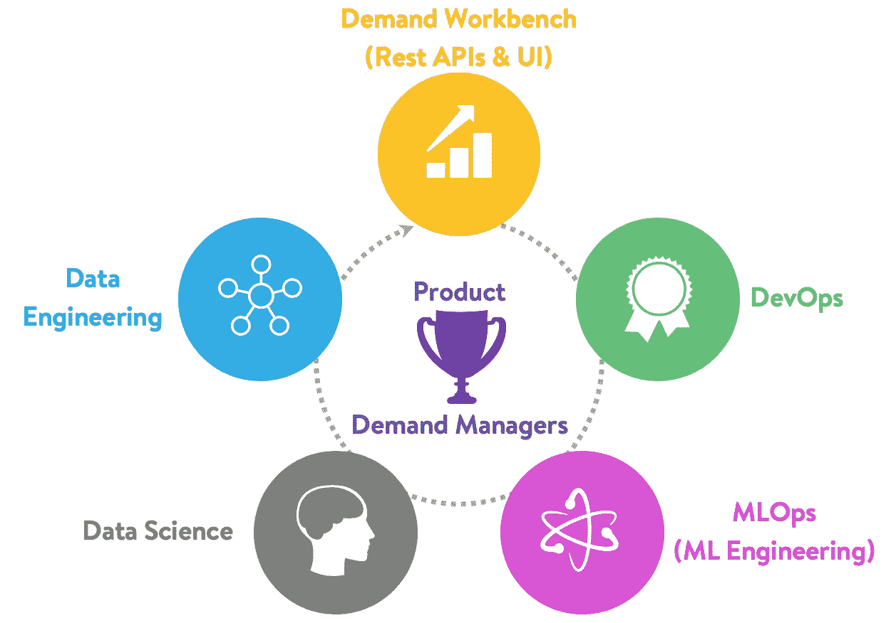

# 沃尔玛需求预测的支柱

> 原文：<https://medium.com/walmartglobaltech/pillars-of-walmarts-demand-forecasting-f6722de86e1a?source=collection_archive---------0----------------------->

当我们开始构建需求预测产品(也称为智能预测)的旅程时，我们有一个独特的机会来构建一个系统，该系统可以影响我们的业务如何管理 5 亿个商店项目预测的需求(仅限美国商店)。除此之外，沃尔玛在全球运营着 11000 多家遍布多个市场和渠道的商店。

生成预测只是旅程的开始。获得不需要任何人工干预的最佳预测是我们平台的涅槃状态(希望我们将很快达到这种状态🙂).

在那之前，我们需要一个允许用户调整预测的应用程序。

并不是说预测不好，而是可能模型没有考虑到一些系统中还没有的数据点，比如，

*   当地天气波动
*   客户人口统计
*   商店附近的活动
*   企业计划的任何促销活动

这是因为*要求*(双关语🙂)一个工程问题，因为它是一个机器学习问题。

该平台的成功取决于业务、产品、工程和数据科学人才的完美融合，他们能够走到一起，协同工作。

我想强调我们如何将自己组织成不同的团队&在深入研究解决方案的技术方面之前(在随后的帖子中)，专注于在每个团队中表现出色。

# 台柱

在任何数据科学产品中，使产品成功的不仅仅是数据科学算法，同样重要的还有以下功能:

*   数据工程
*   ML 工程
*   应用开发
*   用户体验
*   产品管理

不可否认，数据科学相关的关键绩效指标(KPI)像*对我们来说是最重要的推动因素，但我们不能破坏其他领域的重要性。*

*例如:一个很棒的算法只能在笔记本电脑上运行&不能扩展，或者一个可以扩展但不能满足所需 SLA 的算法在理论上是好的&永远不能投入生产。*

# *数据科学*

*   ****大脑*** 我们预测什么需求的背后*
*   *使用任何库或语言开发算法的自由非常重要。*
*   *需要注意的是，没有一种算法能满足所有需求
    例如:时间序列算法不能很好地准确预测所有时间范围*
*   *底层基础架构如何让数据科学家更频繁地进行(大规模)实验将是敏捷性的关键*

# *数据工程*

*这是强制性的，尤其是当我们有大量不同的数据要处理时。*

*我们从第一天起就有近 100 TB 的数据和 10 个数据源可供利用(并且每天都在增长)。*

*   *与沃尔玛分布在各种系统中的海量数据进行交互，并提供相同的数据以实现更好的协作*
*   *管道坚固性的基本保证*
*   *工作流总是有时间限制的，对下游系统有严格的 SLA*
*   *保证数据的新鲜度和质量*

*这确实是该系统的*支柱，对于确保预测的稳定性&准确性至关重要。**

# **需求工作台(REST APIs 和 UI)**

**这就是智能预测的 ***面*** 。仅仅有一个对最终用户没有任何可见性的预测，不会增加多少价值。**

**当我们拥有 ***5 亿个商店商品*** 来提供跨历史&未来的可见性时，这个功能变得更加重要。**

*   **了解影响需求的各种指标，如历史销售额、浪费、库存等。**
*   **指标空间至少包括***750 亿历史&250 亿未来数据点*** 。**
*   **根据每个用户的体验进行个性化设置，显示特定时间真正重要的内容。**
*   **允许用户通过调整预测来管理需求。**
*   **这些 API 还支持供应链中一些关键的按需描述性分析应用程序。**

# **MLOps / ML 工程**

**这是控制我们产品的*大脑* (ML 算法)& *主干*(数据)的 ***中枢神经系统*** ，负责我们模型的许多生产方面。**

*   **在两大支柱即数据科学和数据工程的交汇处。**
*   **自动化系统将有助于将机器学习模型从开发环境传播到生产环境**
*   **建模工作负载的优化调度。**
*   **管道运行的每个部分都具有高可用性和故障处理能力**
*   **建立对新模型进行 A/B 测试的能力**
*   **了解 ML/Data 中的任何新特性如何影响项目的整体 KPI(准确性、偏差等)。)**

# **DevOps**

**他们向我们的工程团队灌输融合了*服务工程* & *发布工程*的最佳实践。**

*   **确保基础架构全天候正常运行和监控**
*   **将高优先级警报通知给相应的团队**
*   **确保我们在构建自动化中有适当的质量检查**
*   **产品的每一部分都在不同的层次上被不断地测试出来，以使每一次提交都满足所需的质量**
*   **不仅要确保你能快速开发和部署特性，还要确保故障恢复的时间 **(MTTR)** 应该很短**
*   **留意恒定成本优化。尤其是在公共云上。**
*   **围绕恢复时间目标 **(RTO)** &恢复点目标 **(RPO)的适当措施构建基础架构。****

# **产品管理**

**产品管理是所有这一切汇集在一起的地方**

*   **始终确保我们将业务放在我们产品工作的中心**
*   **就当前的需求开展业务**
*   **确保添加到产品中的每一项功能都能提供增值**
*   **企业的声音和产品的拥护者**
*   **寻求来自业务和其他支柱的持续反馈**

**希望你已经更好地理解了什么样的团队构成了一个成功的 ML 产品的基本构件。**

**通过这篇文章和其他一系列的博客文章(我打算以后再写)，我试图强调使产品成功的关键技术概念。**