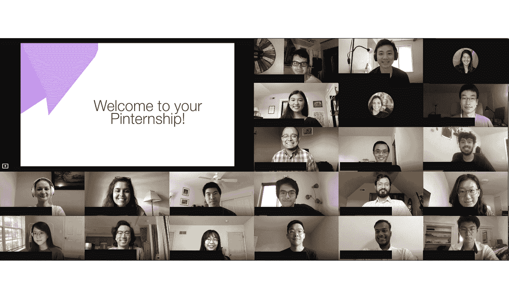
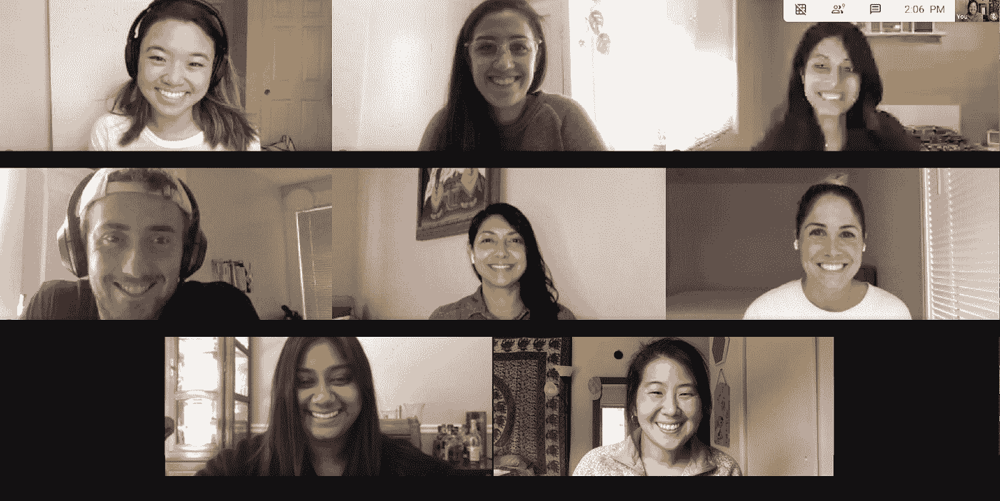

# Pivot: Pinterest 的首个虚拟实习项目

> 原文：<https://medium.com/pinterest-engineering/pin-it-to-win-it-our-first-virtual-pinternship-f096df7ab459?source=collection_archive---------2----------------------->

当我们的大学招聘团队开始为 2020 Pinterns 的到来进行规划时，我们的目标是欢迎他们来到 Pinterest，并为他们提供一次难忘的体验。由于疫情很快改变了每个人的计划，这个核心目标保持不变，我们调整了我们的战略以适应新的工作环境。

除了我们的[工程](https://medium.com/pinterest-engineering)合作伙伴和领导者，我们还面临着一个艰难且时间紧迫的决定。我们的品特一直是一个重要的人才群体。既然我们的使命*带给每个人创造他们热爱的生活的灵感*比以往任何时候都重要，毫无疑问，我们需要继续投资我们的 Pinternship 项目。该团队迅速转向准备和启动我们的工程 Pinternship 计划，实际上是利用我们计划的强大基础，并为成功的远程计划创造必要的支柱。

Pintern Orientation

# **枢转并启动**

今年夏天，我们迎来了第一个完全虚拟的品特班，包括学士(41%)、硕士(28%)和博士(31%)学生，代表了来自 35 所不同大学的不同背景。我们的 Pinterns 正在参加远程入职培训，在他们关键的夏季项目上取得进展，并学习如何照顾他们的 Pinterest 空气工厂。当转向我们的远程计划时，这些关键支柱对我们的发布至关重要:

## ***关键支柱***

*   领导支持和认同
*   导师-经理培训课程和焦点小组
*   工程合作伙伴

当新冠肺炎第一次来袭时，我们的领导团队做出了一个艰难的决定:我们是否要转向并开始启动我们第一个完全远程实习项目的挑战性任务(在 5 周内！)还是 2020 夏季取消？令人欣慰的是，我们实习项目的价值以及我们的 Pinterns 在过去所产生的不可否认的影响，导致我们的工程领导者立即买入。一旦我们的大学团队获得批准，我们就卷起袖子推出了我们的第一个虚拟杂志计划！

我们的工程合作伙伴关系是这个远程项目发展的关键。我们有 Pinterest 工程师的子集，为我们的团队、导师和经理提供额外的技术专业知识和关于资源和夏季项目预期的反馈。除了他们的反馈，我们的导师还通过每周检查他们的 Pinterns 来体现 Pinterest 的[价值](https://www.pinterestcareers.com/homepage)***关心*** 。这为他们提供了持续反馈和对话的机会，最终形成更正式的考核，如中期和最终考核周期。向虚拟工作环境的转变再次证明了导师的支持对我们品特公司成长的重要性。

我们的导师和经理也通过用创造性的解决方案取代那些面对面的联系，展示了 Pinterest 的价值 ***成为一个所有者*** 。他们创建了 Pintern 专用的 Slack 组来获得额外的团队支持，并经常使用 Google Hangouts 来举办虚拟团队活动和咖啡聊天。

## ***虚拟事件&社区建设***

Pintern 活动是彰显 Pinterest 文化和实现我们使命的重要组成部分。在这个新环境中，我们利用 Pinterest 平台和新创建的 [Today 标签](https://newsroom.pinterest.com/en/post/introducing-the-today-tab-for-daily-inspiration)来激发我们的虚拟活动、促进参与和建立社区。我们希望虚拟活动能够体现我们最喜欢的现场 Pinterest 传统之一的精神。我们鼓励 Pinterns 通过我们的远程活动尝试一些新东西，从蜡烛制作到扎染工具包，一直到经典的 Pinterest 玻璃容器建筑。

在 Pinterns 的直属团队之外，我们希望为他们提供一个机会，让他们认识整个公司的同事和员工。我们通过 Slack 上的 Donut integration 发起了一个项目，每周随机配对 Pinterns，以相互了解。为了帮助培养整个工程组织的关系，我们将我们的 Pinterns 与最近的毕业生配对，为从学生到全职工程师的转变提供额外的指导和相关的见解。尽管远程工作很难在不可靠的 wifi 下完美记录会议，但我们仍然希望为我们的打印机提供一个尝试并建立连接的机会。

**在这里遇见 58 个 2020 年的虚拟品特** [**！**](https://www.pinterest.com/pinterns/2020-meet-the-eng-interns/)

# **展望未来**

我们的大学招聘团队致力于与我们的工程团队和 Pinterns 密切合作，尽可能创造最佳的夏季体验，尽管我们目前都面临着巨大的挑战。虽然不确定我们什么时候会回到办公室，搜查零食箱，但我们仍然坚持 Pinterest 的使命和价值观来指导我们的工作，因为我们将第一个虚拟 Pinternship 程序带入了生活。

Our University Recruiting team

*Pinterest 的大学招聘团队为本科生和新毕业生举办了几个项目，以启动进入高速增长模式的新职业。在这里了解更多***。**