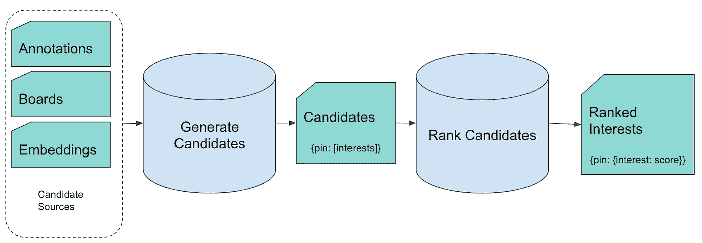

# Pin2Interest:一个可扩展的内容分类系统

> 原文：<https://medium.com/pinterest-engineering/pin2interest-a-scalable-system-for-content-classification-41a586675ee7?source=collection_archive---------1----------------------->

Eileen Li |软件工程师，知识

内容理解是任何优秀推荐系统的核心。通过了解每个 Pin 是关于什么的，Pinterest 可以将 Pinners 与最相关、最鼓舞人心、最符合他们兴趣的内容联系起来。

# 兴趣分类

**兴趣分类法**捕捉 Pinterest 中出现的流行概念，并将它们组织成一个结构化的层次结构。这种高度精选的分类树目前有 10 级粒度，拥有“女性时尚”、“DIY 工艺”等 24 个顶级概念和数万个总兴趣。结构和词汇将继续扩大和增长。为了让您对我们的兴趣类型有所了解，以下是我们“家居装饰”垂直领域的一个示例:

兴趣分类法是我们对内容进行分类的集中方式，包括图钉、图板、图钉和搜索查询。

# 将图钉映射到兴趣

我们构建了 **Pin2Interes** t (P2I)来将我们的 200B+pin 语料库映射到一个动态分类中。P2I 为属于我们丰富的兴趣分类的图钉提供高质量、人类可理解的标签。

对于上面的 Pin，我们得到 P2I 结果，格式为 *(taxonomy_level，label，score)* :

*   *(3，狗，0.83)*
*   *(2，哺乳动物，0.7)*
*   *(1，动物，0.82)*
*   *(3，滑雪，0.83)*
*   *(3，单板滑雪，0.79)*
*   *(2、冬季运动，0.75)*
*   *(3，单板滑雪，0.79)*
*   *(2、冬季运动，0.75)*
*   *(3 次滑雪旅行，0.76)*
*   *(2、出行思路，0.65)*
*   *(1，行程，0.71)*

在分类学中，*狗*是*哺乳动物*的孩子，而哺乳动物又是*动物*的孩子，而*滑雪*和*单板滑雪*是*冬季运动*的孩子。

# 个案研究

P2I 在 Pinterest 的不同系统中被广泛使用。来自 P2I 的结果可以用来识别和删除不安全的内容，生成个性化的建议，并为机器学习模型创建排名功能。P2I 结果也可能直接暴露于 Pinners。

以下是 P2I 信号消费者的一些例子:

*   用户到兴趣(U2I) —用户到兴趣的映射
*   兴趣查询(Q2I) —搜索查询到兴趣的映射
*   主页订阅排名—关于您的主页订阅的建议
*   搜索排名和检索—来自搜索结果的推荐
*   广告兴趣定位和检索—展示推广内容的产品

# 使用 P2I 作为分级特征

P2I 是其他 *X* 2I 系统构建的基础。结果是一个公共的分类空间，其中可以在用户、查询、板、管脚等之间建立关系。

我们在搜索系统中根据搜索查询和 pin 兴趣的相似性创建排名特征，并且我们在用户和 pin 之间的 home feed 上做类似的事情。事实上，我们利用了兴趣分类结构，并为分类的不同级别创建了不同的特性，代表了从广泛到更细粒度的兴趣匹配。

示例:

*   feature 1—cos _ sim _ l1 _ interests =*sum(pin/query 的匹配 L1 兴趣的乘积)*
*   feature 2—cos _ sim _ l2 _ interests =*sum(pin/query 匹配 L2 兴趣的乘积)*

# 使用 P2I 进行广告兴趣定位

**兴趣定位**是一款广告产品，允许广告商通过从兴趣分类中选择类别来选择他们想要到达的受众。

对于以下查询 Pin:

我们在大头针特写上展示了一些相关结果:

推广的 pin，标有“Promoted By”的，是被广告主推广过的，为 Pinterest 带来收入的 pin。使用我们的兴趣定位产品，每个推广的 Pin 都有广告客户指定的兴趣，如*旅游*和*户外运动。*P2I 信号用于通过确保查询 Pin 与目标共享相同的兴趣来实施兴趣目标。在上面的示例中，用红色圈出的两个提升的 Pin 与查询 Pin 共享相同的*差旅*兴趣，而没有任何重叠兴趣的其他候选人已被过滤掉。

# 它是如何工作的

P2I 是一个机器学习系统，大致由两个模块组成:**候选生成**和**排名**。管道是用 burning(Scala+MapReduce)编写的，每天运行，为我们的 pin 语料库重新分类兴趣。

# 候选生成

在候选生成中，我们使用相对廉价、高召回率的方法来获得可能与每个 Pin 相关的兴趣。在此阶段，我们通过以下方法产生最多 200 名候选人(平均 70 名):

# 词汇扩展

我们通过对来自 Pin 的文本执行词法扩展来获得少量高度精确的匹配。词汇扩展可以包括匹配具有低编辑距离的术语、注释的重新排序、词汇化等。

以下是一些例子:

# 引脚/电路板共现

使用这些高度精确的词汇匹配，我们然后通过聚合 pin 上的共现术语和板上的共现 pin 来构建一个更大的网络。

结果是*{ pin:[兴趣候选列表]}，*的映射，这是第二阶段的输入，排名。

# 等级

然后，我们对来自候选生成阶段的每个(Pin，interest)对进行评分，并在我们的最终分类输出中保留那些具有最高相关性分数的对。更具体地说，我们提取每个候选对的特征，并使用二元分类器对它们进行排序(1 表示相关，0 表示不相关)。我们目前使用梯度推进决策树(GBDT)为我们的模型。

一些功能包括:

*   嵌入相似性特征(文本嵌入，如 FastText，Pin 嵌入，如 [PinSage](/pinterest-engineering/pinsage-a-new-graph-convolutional-neural-network-for-web-scale-recommender-systems-88795a107f48)
*   来自 Pin [注解](/pinterest-engineering/understanding-pins-through-keyword-extraction-40cf94214c18)的 Tf-idf 特征(其中 Pin 是文档，interest 是术语)
*   分类功能(利用层次结构，如 L1 父匹配)
*   销接合特征(性别、受欢迎程度等。)
*   上下文特征(Pin 类型、国家等。)

# 立即引起兴趣

新创建的 pin 通过我们称之为“即时利息”的替代流程与利息预测相关联。这个流程与日常批处理工作流有许多相同的逻辑，但是我们对新 Pin 的了解要少得多。相同的模型被触发，只有在管脚创建期间可用的特征。这些预测在每日批处理工作流运行之前可用，并且对于新 pin 的激活和分发非常重要。

# 攀登 P2I

该系统旨在适应不断增长的分类法。当增加新的兴趣时，P2I 只是工作而没有任何额外的工程工作。不需要重新训练模型，因为可以利用现有管道为每个新兴趣提取特征。这种灵活性允许团队快速迭代来自产品团队的请求(例如趋势兴趣)并为分类法的许多版本重用相同的系统。

该团队面临的另一个挑战是让系统对数千亿个 pin 有效工作。我们已经建立了一个模块化系统，其中的组件可以并行工作、调试和改进。瓶颈很容易被识别和标记。在适当的时候利用压缩。工程师们已经学会了在开发的每一步都要考虑效率，因为每个引脚多占用 0.01%的资源，乘以 2000 亿就会放大到有意义的程度。

# 走向国际

让 Pinterest 国际化对我们业务的成功至关重要。P2I 旨在通过很少或没有工程工作来支持更多国家。我们当前的系统支持 17 种语言，并且还在增加。

兴趣分类的每个节点代表一个概念，独立于任何语言。不管是“猫”还是“聊天”(法语)，猫别针的概念都差不多。在内部，我们使用数字 id 而不是文本标签来唯一地标识兴趣。兴趣文本仅在候选生成的词汇扩展期间使用。为了帮助这个阶段，我们在词汇扩展之前提供了从语言 *X* 到英语的翻译。因此，从工程角度来看，向 P2I 添加额外的语言非常简单。

# 结论

**Pin2Interest** 将 Pin 映射到一个动态的、高度精确的分类中。该系统是灵活的，并适应新的要求，如兴趣分类的变化和国际扩张。结果是一个强大的信号，对我们数千亿条内容进行分类，并被 Pinterest 上的系统使用。

【鸣谢:】团队成员、、宋翠、美和孝树(PM) &、郭(EM)，以及斯坦福大学学生团队成员 Attila Dobi、Dhananjay Shrouty、Heath Vinicombe、Rui Li、Troy Ma &在此表示感谢。