# PinalyticsDB:基于 Hbase 的时间序列数据库

> 原文：<https://medium.com/pinterest-engineering/pinalyticsdb-a-time-series-database-on-top-of-hbase-946f236bb29a?source=collection_archive---------1----------------------->

软件工程师，数据工程

PinalyticsDB 是 Pinterest 专有的时间序列数据库。在 Pinterest，我们依靠 PinalyticsDB 作为后端来存储和可视化成千上万的时间序列报告，例如下面的示例案例，按国家进行了划分。

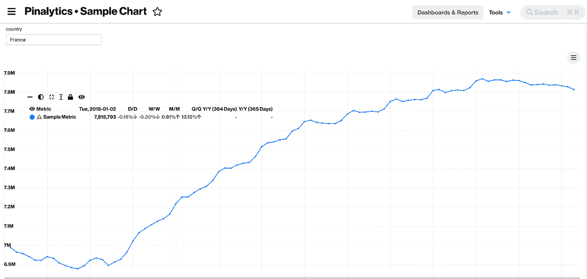

PinalyticsDB 是几年前在 Hbase 之上构建的。它利用实时 map-reduce 架构，通过 Hbase 协处理器进行聚合。然而，随着 Pinterest 的发展和报告数量的增长，以及报告中数据的使用和数量，它暴露了一些可扩展性挑战。

在过去的几个月里，我们已经重新构建了 PinalyticsDB，使它成为一个性能更高、更可靠的服务。继续阅读，了解我们面临的性能和可伸缩性挑战，以及我们如何重新设计服务以构建更好的 PinalyticsDB。

# h 基本区域服务器 Hotspotting

随着 Pinterest 内部对我们平台的使用增加，Hotspotting 逐渐成为 PinalyticsDB 区域服务器的一个问题。在以前的设计中，为每个报告创建一个新的 Hbase 表。

# 旧模式设计

行键以前的设计是:

**前一行-关键字** =前缀|日期|后缀
前缀=公制名称作为字符串
日期= YYYY-MM-DD 格式，再作为字符串
后缀=由段号组成

行键由 ascii 字符组成。“|”用作分隔符。

这种方法有几个问题:

*   因为为每个报告都创建了一个新表，所以有些报告比其他报告更受欢迎，所以托管这些报告的区域服务器获得了更多的流量。
*   我们有数千份报告，因此对于 Hbase 管理员来说，监控报告表并根据观察到的热点拆分这些表是不切实际的。
*   在一个报告中，一些指标更受欢迎。由于 metric-name 是行键的第一部分，这导致了更多的热点。
*   最近的数据往往被更频繁地访问，在指标之后，日期是行键的一部分，这导致更多的热点。

此热备盘用于读取，但是对于写入也观察到了类似的热备盘，较重报告的表具有较高的写入次数，并且指标的数据始终写入到最后一个日期—导致写入热备盘写入到托管每个指标最后一个日期的区域。

# 新模式设计

我们通过改进行键模式和 HBase 表设计来解决这个问题。我们为所有报告创建了一个单一的表，具有以下行键设计。

**新建行-关键字** = SALT | <报表-id > | <公制-id > | <日期-时间> | <段>

行键由字节数组(byte[])表示，而不是字符串。

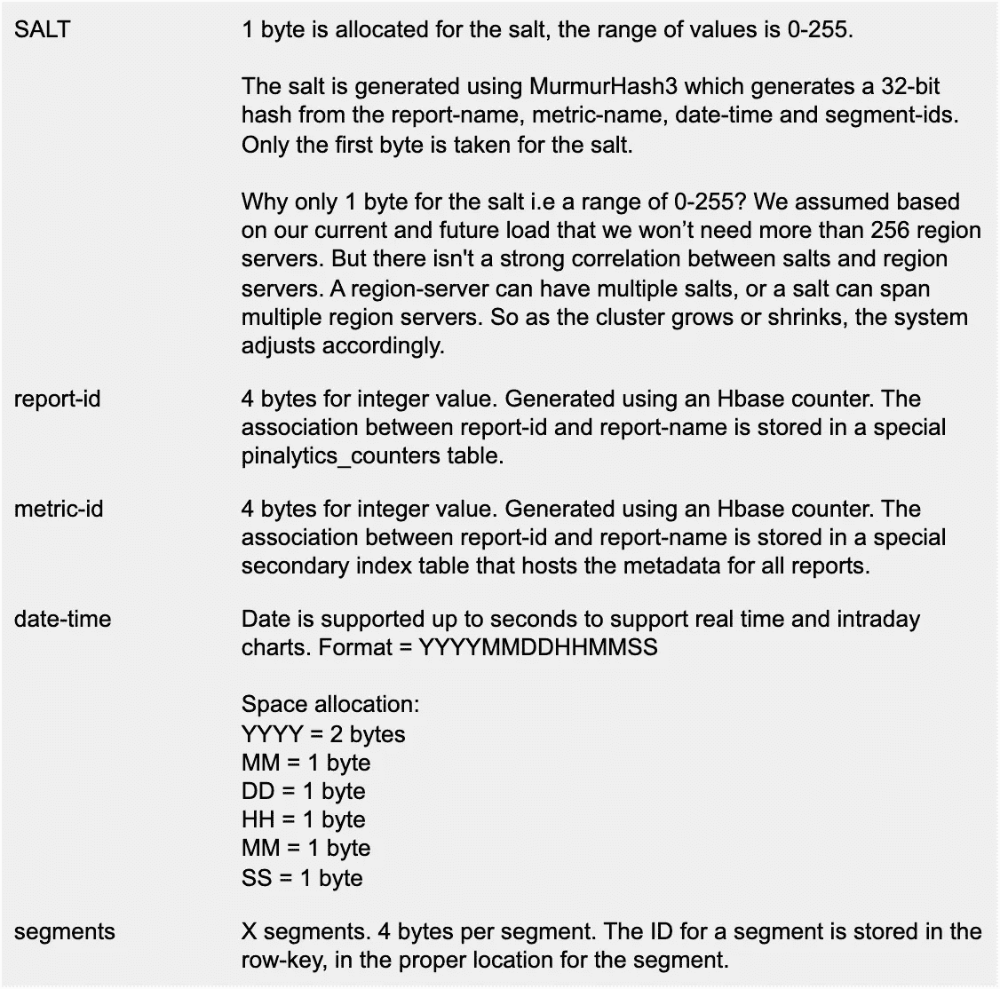

*   密钥的每个部分都有固定的长度。这是为行键定义一个固定的结构。这也是为了支持模糊行过滤器。
*   由于结构固定，我们取消了“|”分隔符，这也是为了节省空间。

# 对读取和写入的影响

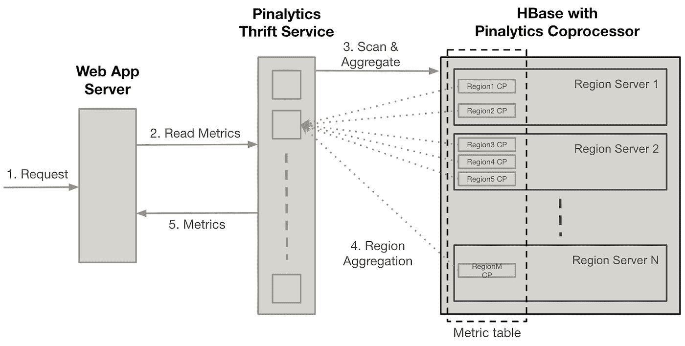

*Pinalytics DB V2 Read Architecture*

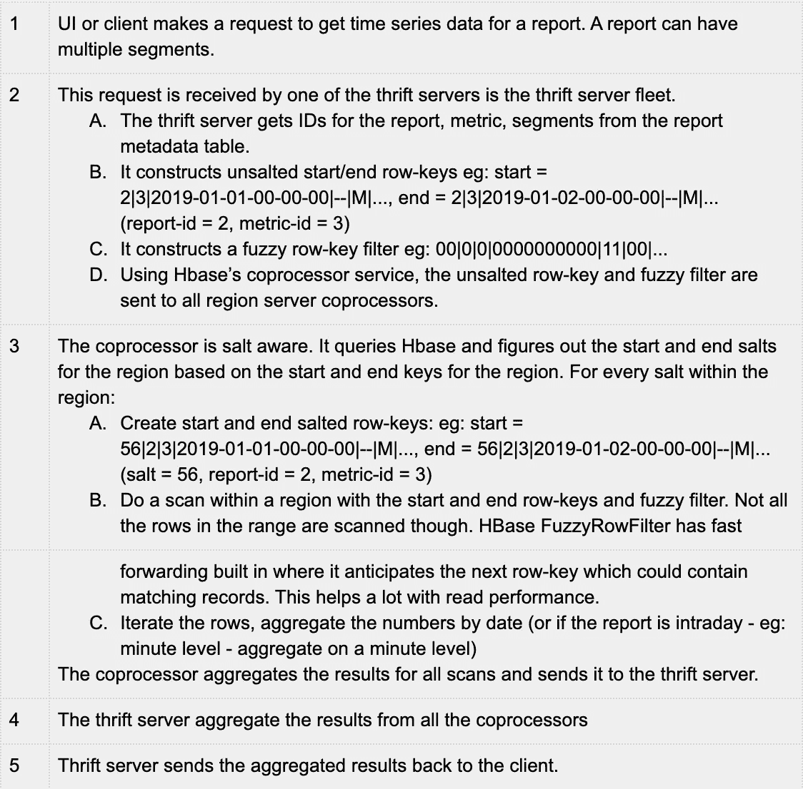

正如您所看到的，由于 salting 逻辑，读取在整个集群中分布良好。但是这种模式设计也使得写操作得到了很好的分布。

# 提高协处理器性能

我们还希望通过修改协处理器的请求结构和扫描行为来优化 PinalyticsDB 协处理器的性能。我们的优化改进了区域服务器 CPU 利用率、RPC 延迟和 JVM 阻塞线程。

我们最初的设计为发送给 Pinalytics 的每个指标、段请求创建了一个 HBase 扫描。PinalyticsDB 会收到许多这样的请求，从而导致大量的扫描。我们减少了 HBase 扫描的数量，方法是将与同一报告和指标相关联的聚合请求合并到单个扫描中，该扫描包含所请求段的所有相关模糊行过滤器。

当使用 Pinalytics 时，用户通常会在不同的细分市场中生成大量包含少量指标的请求。下面的图表举例说明了这一点，要求提供一个跨美国多个州段的样本指标。

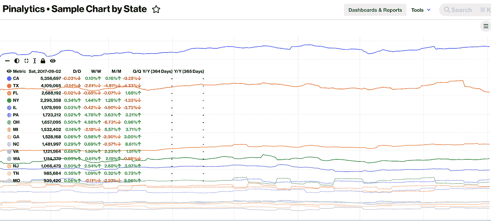

这其实是一个很常见的用例。许多用户的仪表板上有几个这样的图表。

这个用例启发了我们的*“多段优化”*，其中协处理器对 PinalyticsRequest 中与相同指标相关的所有段执行单次扫描(按区域 salt)。

PinalyticsDB V2 协处理器设计

*   Pinalytics Thrift 服务器根据指标对它从 Pinalytics 收到的所有请求进行分组。然后，对于每个度量，协处理器接收包含与该度量所请求的片段组合相关联的所有模糊行过滤器的请求。
*   对于协处理器区域中的每个 salt，协处理器创建一个 MUST_PASS_ONE 扫描，该扫描包含过滤器列表中聚合请求中的所有模糊行过滤器。
*   然后，协处理器根据日期和模糊行过滤器汇总所有扫描的结果，并将该响应发送回节俭服务器。

对于同一个指标，只需要一个聚合请求，而不管该指标需要多少个不同的段组合。

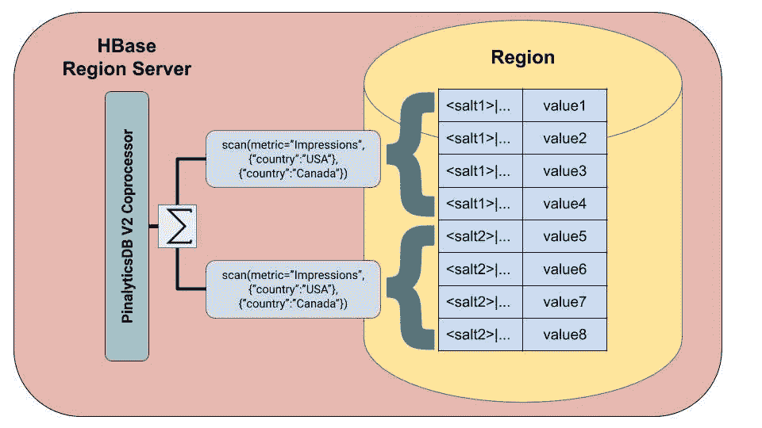

*PinalyticsDB V2 Coprocessor Design: For every salt, a single scan is created for all segments corresponding to the same metric.*

我们的新协处理器设计显著改善了区域服务器 CPU 利用率、RPC 延迟和 JVM 线程阻塞。

***注意:*** *以下图表是在我们的多段优化部署后几个小时捕获的，因此它们不能准确反映系统的当前性能。不过，它们有助于捕捉我们改进的协处理器设计的影响。*

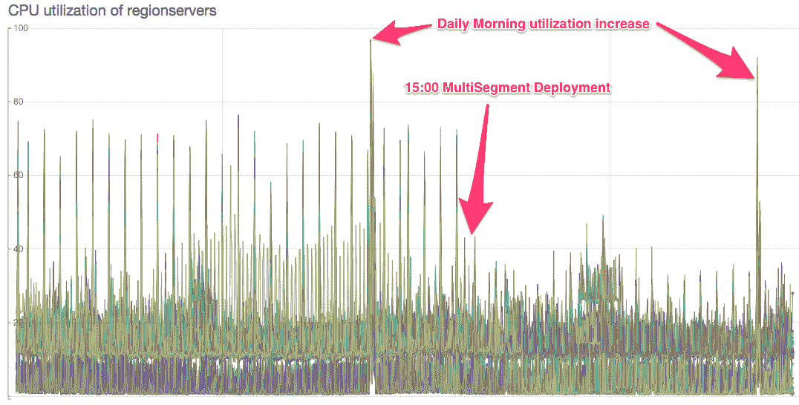

*部署新协处理器后区域服务器 CPU 利用率的提高*

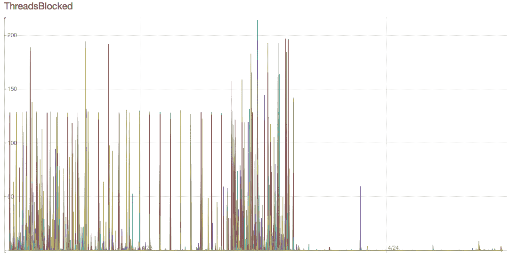

*改进了新协处理器部署后阻塞的区域服务器 JVM 线程*

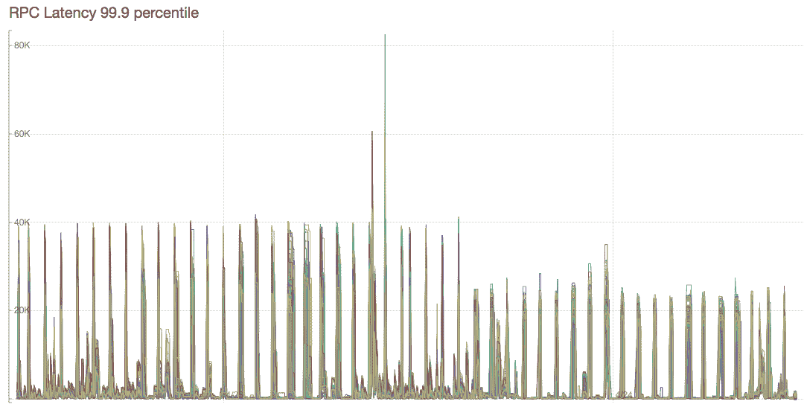

*部署新协处理器后区域服务器 RPC 延迟的改进*

# 庞大的报表元数据和节省服务器空间

我们的节俭服务器也面临频繁的 OOM 崩溃，当用户试图加载图表时，会以 webapp 超时的形式注意到这一点。这是因为节俭服务器的 jvm 没有设置-XX:+ExitOnOutOfMemoryError，所以节俭服务器没有在 OOM 上退出，对它的所有调用都超时了。一个快速的解决方法是添加这个标志，以便节约服务器在 OOM 的生产中自动重启。

为了调试这个问题，将一个 jconsole 指向一个生产节俭服务器，它能够捕获一个节俭服务器崩溃。下面是总堆、老一代堆和新一代堆的图表。

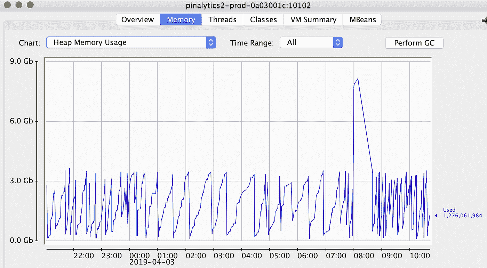

*8G 内存的节俭服务器的总堆内存*

请注意从 4G 以下到 8g 以上的突然峰值，这导致了 OOM。

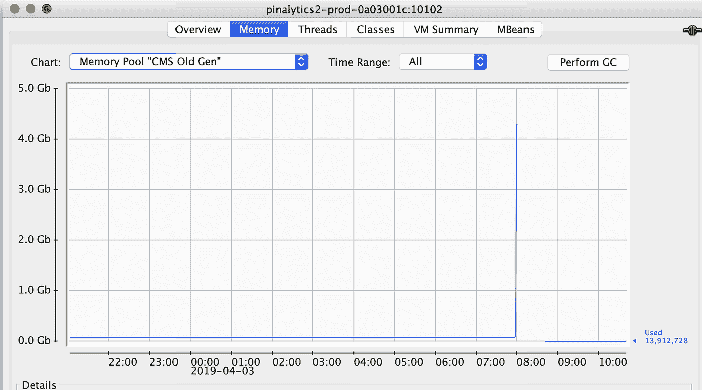

*CMS Old Generation for the Pinalytics DB Thrift Server*

同样，老一代从非常低的值飙升到 4G 以上，超过了老一代的限制。没有时间让 CMS 收集器发挥作用，甚至没有时间让完整的 GC 发挥作用——峰值是如此之快。

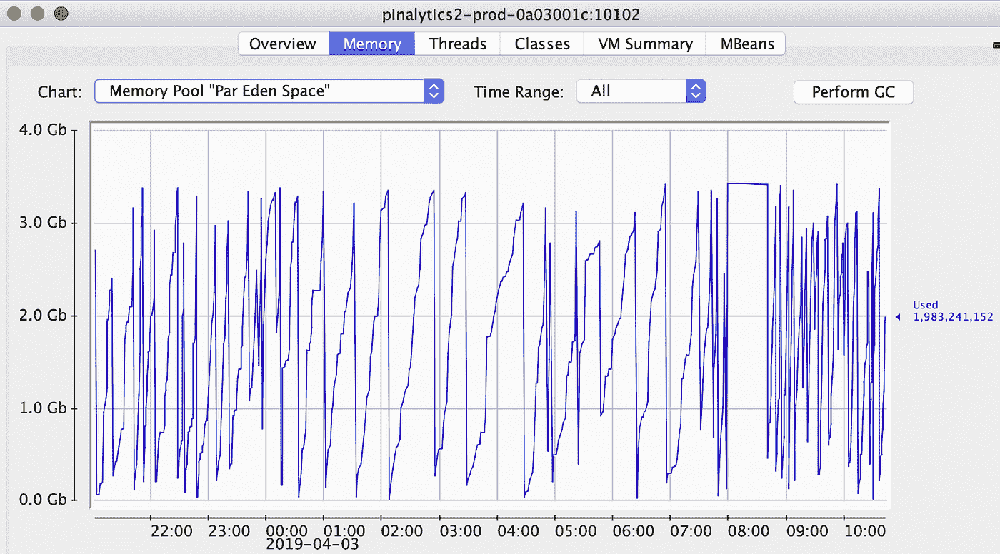

*Eden Space for the Pinalytics DB Thrift Server*

我们能够在开发环境中通过负载测试重现这个问题，并确定这个问题与我们读取和存储报表元数据的方式有关。对于我们的大多数报告，元数据只有几千字节。但是，对于某些报表，元数据是 60+，甚至 120+ MB。这主要是因为一个报告可以有大量的指标。

# 报告元数据结构

这是单个报告的报告元数据。报表元数据存储在一个特殊的二级索引表中。

```
#!/usr/bin/python
# -*- coding: utf-8 -*-
ReportInfo(
   tableName=u’growth_ResurrectionSegmentedReport’,
   reportName=u’growth_ResurrectionSegmentedReport’,
   segInfo={
       u’segKey2': u’gender’,
       u’segKey1': u’country’,
       u’segKeyNum’: u’2',
       },
   metrics={u’resurrection’: MetricMetadata(name=u’resurrection’,
       valueNames=None),
       u’5min_resurrection’:MetricMetadata(name=u’5min_resurrection’
       , valueNames=None)},
   segKeys={
       1: {
         u’1': u’US’,
         u’2': u’UK’,
         u’3': u’CA’,
…
       }
   )
```

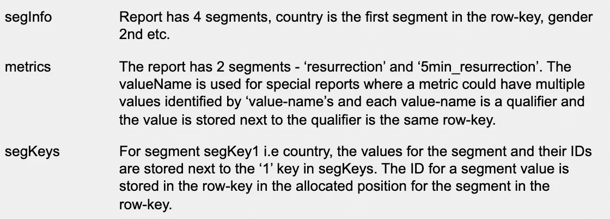

# 优化报告元数据的存储和检索使用

报表元数据以序列化 blob 的形式存储在 hbase 二级索引表中。因此，问题的根本原因是报告元数据的巨大大小，以及我们正在加载整个元数据而不仅仅是我们想要的部分。在高负载的情况下，jvm 堆完全有可能很快填满，以至于 jvm 甚至无法停止全局满垃圾收集。

为了解决这个问题的根本原因，我们决定将报告元数据的内容分布到报告的行键下的几个列族和限定符中。

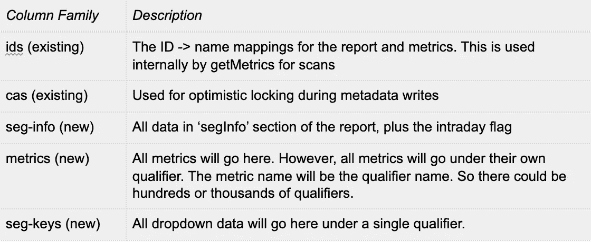

*Enhanced PinalyticsDB V2 Report Row-Key structure, which is distributed among multiple column families and qualifiers*

行键的更新是原子性的。因此，所有列族都将通过一个 PUT 操作自动更新。

我们创建了一个新的方法来获取报告信息。

```
getReportInfo(final String siTableName, final String reportName, List<String> metrics)
```

将返回所有 seg-info 和 seg-keys 数据，但仅返回“metrics”列族中的相关指标数据。由于报告的大部分大小是由指标数据决定的，我们将只返回几 kb 的数据，而不是潜在的 100mb 以上的数据。

# 节俭服务器循环池

我们对节俭服务器做的另一个改变有助于提高可伸缩性。每个节俭服务器都有一个**h base org . Apache . Hadoop . h base . client . connection .**的单一实例

```
hbase.client.ipc.pool.size=5
hbase.client.ipc.pool.type=RoundRobinPool
```

默认情况下，每个区域服务器有 1 个连接。该设置增加了并发连接数，这有助于我们扩展每台服务器的请求数量。

# 缺点和局限性

尽管这种设计对我们来说效果不错，但我们也承认它有一些局限性。

虽然横向扩展体系结构可以实现均匀分布的读取和写入，但它会影响可用性。任何区域服务器或任何 zookeeper 问题都会影响所有的读写请求。我们正在设置一个具有双向复制功能的备份群集，并且我们将在主群集出现任何问题的情况下为读取和写入设置自动故障转移。

因为段是行键的一部分，所以包含许多段的报表将消耗更多的磁盘空间。创建报告后，不能添加或删除报告段。此外，尽管有 FuzzyRowFilter 快进，但基数非常高且有大量数据的报告可能会很慢。这可以通过在协处理器中添加并行性来抵消，以便并行执行对每个 salt 的扫描(或者甚至是按日期的分区扫描)。

这种体系结构使用协处理器进行读取，并且不支持协处理器的复制读取。我们可以通过构建一个汇总缓存层来部分弥补协处理器复制支持的不足，在该缓存层中，结果存储在一个高可用性表中，如果从主区域获取数据失败，我们将执行复制读取(使用常规 hbase 扫描，而不是协处理器)。

我们计划在下一次迭代中解决这些限制。我们还计划增加对 Top-N，percentiles，group-by 和 min，max 等函数的支持。

***鸣谢:*** 非常感谢 Rob Claire、、Justin Mejorada-Pier 和 Bryant Xiao 在 Pinterest 上对 PinalyticsDB 的支持。此外，还要感谢分析平台和存储&缓存团队，他们分别帮助支持 Pinalytics webapp 和 HBase 集群。

> 我们正在建造世界上第一个视觉发现引擎。全世界有超过 2.5 亿人使用 Pinterest 来梦想、计划和准备他们在生活中想做的事情。[来加入我们吧！](https://careers.pinterest.com/careers)