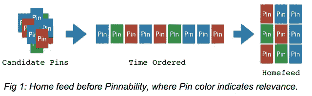
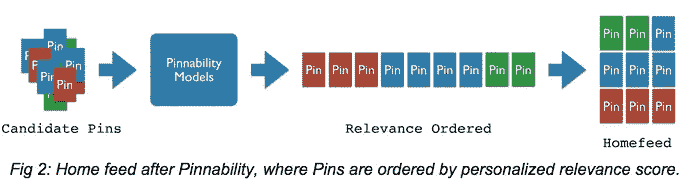
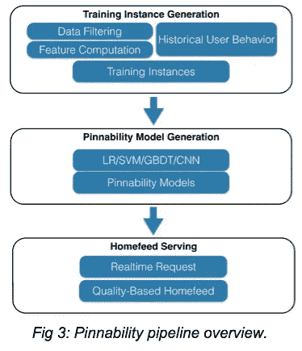

# 可定位性:家庭饲料中的机器学习

> 原文：<https://medium.com/pinterest-engineering/pinnability-machine-learning-in-the-home-feed-64be2074bf60?source=collection_archive---------0----------------------->

郭|发现网站 Pinterest 工程师

Pinterest 拥有超过 300 亿个(还在增长的)包含丰富上下文和视觉信息的 pin。数以千万计的 Pinners(用户)每天通过浏览、搜索、锁定和点击外部网站与网站进行交互。主页订阅是用户参与度最高的部分，它收集了来自相关人员、董事会和兴趣爱好的个人信息，以及包括 Picked for You 在内的各种推荐，在所有个人信息中占据了很大一部分。Pin 越多，Pinterest 就能为每个人提供越好的服务，这使我们处于一个独特的位置，可以作为一个持续的发现引擎提供灵感。

home feed 是发现新内容的一种重要方式，对 Pinner 来说很有价值，但也提出了一个具有挑战性的问题。鉴于各种来源的 pin 数量不断增加，我们如何才能找到最个性化和最相关的 pin？我们的答案是精确。

Pinnability 是我们开发的机器学习模型的统称，用于帮助 Pinners 在他们的 home feed 中找到最好的内容。这是我们去年 8 月推出的由 [smart feed](https://engineering.pinterest.com/post/96012794429/building-a-smarter-home-feed) 支持的技术的一部分，它可以估计 Pinner 与 Pin 互动的可能性的相关性分数。有了准确的预测，我们可以优先考虑那些相关性分数高的大头针，并将其显示在主页提要的顶部。

## 精确定位的好处

在几个月前推出 Pinnability 之前，来自每个来源的所有 home feed 内容(例如，following 和 Picked For You)都是按时间顺序排列的，没有考虑人们可能会发现哪些大头针最有趣。换句话说，来自同一来源的较新的 Pin 总是出现在较旧的 Pin 之前。这个简单的规则很容易理解和实现，但是它缺乏有效地帮助 Pinners 发现他们真正感兴趣的 Pin 的能力，因为低相关性 Pin 很可能出现在高相关性 Pin 之前(见图 1)。

随着可定位性的启动，使用可定位性模型对主进给的候选引脚进行评分。分数代表 Pinner 和候选 pin 之间的个性化相关性。如图 2 所示，home feed 中的 pin 按照相关性分数进行优先排序。

## 通过机器学习增强可定位性

为了准确预测 Pinner 与 Pin 互动的可能性，我们应用了最先进的机器学习模型，包括[逻辑回归(LR)](http://en.wikipedia.org/wiki/Logistic_regression) 、[支持向量机(SVM)](http://en.wikipedia.org/wiki/Support_vector_machine) 、[梯度提升决策树(GBDT)](http://en.wikipedia.org/wiki/Gradient_boosting) 和[卷积神经网络(CNN)](http://en.wikipedia.org/wiki/Convolutional_neural_network) 。我们提取并测试了数以千计的文本和视觉特征，这些特征有助于准确预测相关性得分。在我们为在线 A/B 实验启动模型之前，我们会根据历史数据彻底评估其离线性能。

图 3 总结了我们的可定位性工作流的三个主要组成部分，即训练实例生成、模型生成和 home feed 服务。

## 培训实例生成

可定位性训练数据的基础是历史的 Pinner 与原始馈送引脚的交互。例如，在查看主页订阅源中的 pin 后，Pinner 可以选择喜欢、重复、点击查看 Pin 特写、点进、评论、隐藏或不做任何事情。我们记录一些“积极行动”和“消极行动”作为训练实例。自然，被查看的图钉的数量通常比 Pinner 做出积极行动的图钉的数量大得多，所以我们以不同的速率对积极和消极的实例进行采样。通过这些定义，我们测试了数以千计的信息特征，以提高 Pinnability 的预测准确性。

我们独特的数据集包含丰富的人工管理的内容，因此 Pin、board 和用户动态为准确的可定位性预测提供了丰富的信息。这些特征分为三大类:Pin 特征、Pinner 特征和交互特征:

*   Pin 特征捕获 Pin 的内在质量，例如历史流行度、Pin 新鲜度和垃圾邮件的可能性。还包括来自卷积神经网络(CNN)的视觉特征。
*   Pinner 的特征是关于用户的细节，比如 Pinner 有多活跃，性别和董事会地位。
*   交互特征表示 Pinner 过去与类似类型的引脚的交互。

一些特征受到变换和规范化的影响。例如，对数转换被应用于许多“计数特征”,例如 Pinner 拥有的用于回归友好分布的针数。

我们在开发强大的训练数据生成管道时面临的主要挑战是如何处理大规模的数据。我们构建了 MapReduce 管道来生成训练实例，每个实例代表一个 Pinner/Pin 交互。训练实例包含三部分信息:

*   元数据(Pin ID、Pinner ID、交互源、时间戳等。)用于数据分组，当我们想要使用训练实例的子集来训练和分析可定位性模型时，例如 following 和 Picked For You (PFY)模型。
*   指示 Pinner 在查看 Pin 后是否采取了积极措施的目标值。我们可以训练不同的模型，优化不同的积极行动，如重复和点击。
*   包含用于交互预测的信息信号的特征向量。

## 可定位模型生成

在训练可定位性模型时，我们使用 ROC 曲线 (AUC)下的[面积作为我们的主要离线评估指标，以及 r 平方和均方根误差。我们对 AUC 进行了优化，不仅因为它是类似预测系统中广泛使用的指标，还因为我们观察到离线测试的 AUC 收益与在线 A/B 实验中 Pinner 参与度的增加之间存在很强的正相关关系。我们的生产精确化模型在家庭饲料中实现了平均约 90%的 AUC 分数。](http://en.wikipedia.org/wiki/Receiver_operating_characteristic#Area_under_curve)

我们试验了多种机器学习模型，包括 LR、GBDT、SVM 和 CNN，我们在 10 倍交叉验证和 90/10 训练测试分割设置中使用 AUC 分数，并使用适当的模型参数进行评估。我们观察到，给定一个固定的特征集，获胜的模型总是倾向于 LR 或 GBDT。对于在线 A/B 实验，我们根据离线 AUC 分数对模型进行优先排序。

在我们添加到训练实例的数千个特征中，我们选择显著增加我们离线 AUC 度量的特征作为在线 A/B 实验的候选。鉴于大量的候选特征，我们通常在较小的组中测试新特征，例如新近性、Pin 所有者质量和类别匹配特征。我们进行的 A/B 实验比较了使用生产功能的对照组和使用新实验功能的治疗组之间的 Pinner 参与度。如果结果是肯定的，我们将评估额外的数据大小和延迟对服务器的影响，然后将新功能添加到我们的生产定位模型中。我们快速迭代我们强大的训练实例生成、模型训练和评估管道支持的新功能。为了监控模型的持续性能，我们保留了一个不暴露于可定位性模型的小型用户群。比较抵制者和支持者群体之间的参与度差异，可以提供关于 Pinnability 的长期绩效的有价值的见解。

目前，我们仅使用离线批量数据来训练我们的可定位性模型。这造成了一个潜在的问题，因为我们没有利用最新的数据来动态调整服务中的模型系数。另一方面，我们测试并确认，当对相隔几天的不同批次的数据进行训练时，模型系数不会发生实质性变化，因此在线模型调整的好处有待进一步评估。

我们还在探索将在线培训与实时实例相结合的方法，以扩大我们的离线培训渠道，以便在我们收集到新的主页反馈活动数据后，立即校准我们的模型。在线培训在算法上对我们的机器学习管道和系统地对我们的家庭饲料服务框架提出了新的挑战。

## 家庭饲料供应

Home feed 由我们内部的[智能 feed 基础设施](https://engineering.pinterest.com/post/96012794429/building-a-smarter-home-feed)提供支持。当重新发布一个新 Pin 时，smart feed worker 会向 Pinnability 服务器发送一个请求，以获取重新发布的 Pin 与跟随重新发布 Pin 者或公告板的所有人之间的相关性分数。然后，它将带有分数的瓶插入到包含所有跟随瓶的池中。以类似的方式将 PFY 图钉插入到具有可图钉相关性分数的 PFY 池中。

当用户登录或刷新 home feed 时，smart feed content generator 会具体化来自各个池的新内容，同时考虑每个池中的相关性分数，smart feed 服务会呈现 Pinner 的 home feed，它会对相关性分数进行优先排序。

## 定位结果

我们将继续完善精确定位，并且迄今为止已经发布了几项改进。随着每一次迭代，我们都观察到 Pinner 参与度的显著提高，包括 home feed reppin 数量增加了 20%以上。我们还观察到了其他指标的显著提高，包括总重复次数和点击率。

鉴于 home feed 的重要性和 Pinner 参与度的提升，Pinnability 仍然是构建我们发现引擎的核心项目。我们还开始扩大我们的定位模型的使用，以帮助改善我们在家庭饲料以外的其他产品。

我们一直在寻找聪明的工程师[加入 Pinterest](https://about.pinterest.com/en/careers/engineering-product) ，帮助我们解决诸如可定位性等有影响力的问题。

*郭是推荐团队*的软件工程师

*鸣谢:Pinnability 是一个长期战略项目，由 Mukund Narasimhan、Chris Pinchak、刘宇辰、Dmitry Chechik 和徐辉合作开发。这个团队以及整个公司的人，用他们的技术洞察力和宝贵的反馈帮助这个项目成为现实。*

*获取 Pinterest 工程新闻和更新，关注我们的工程*[*Pinterest*](https://www.pinterest.com/malorie/pinterest-engineering-news/)*，* [*脸书*](https://www.facebook.com/pinterestengineering) *和*[*Twitter*](https://twitter.com/PinterestEng)*。有兴趣加入团队吗？查看我们的* [*招聘网站*](https://about.pinterest.com/en/careers/engineering-product) *。*