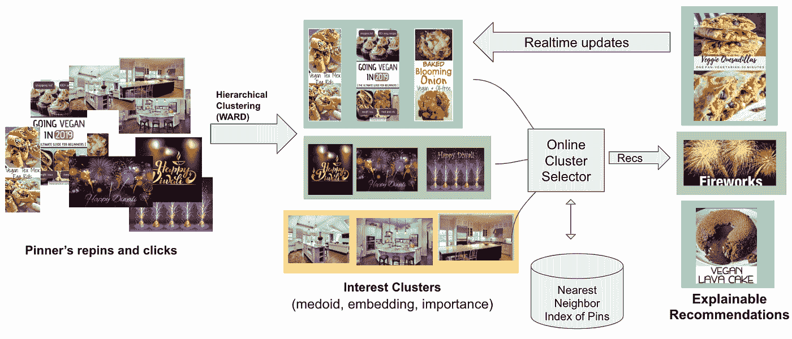
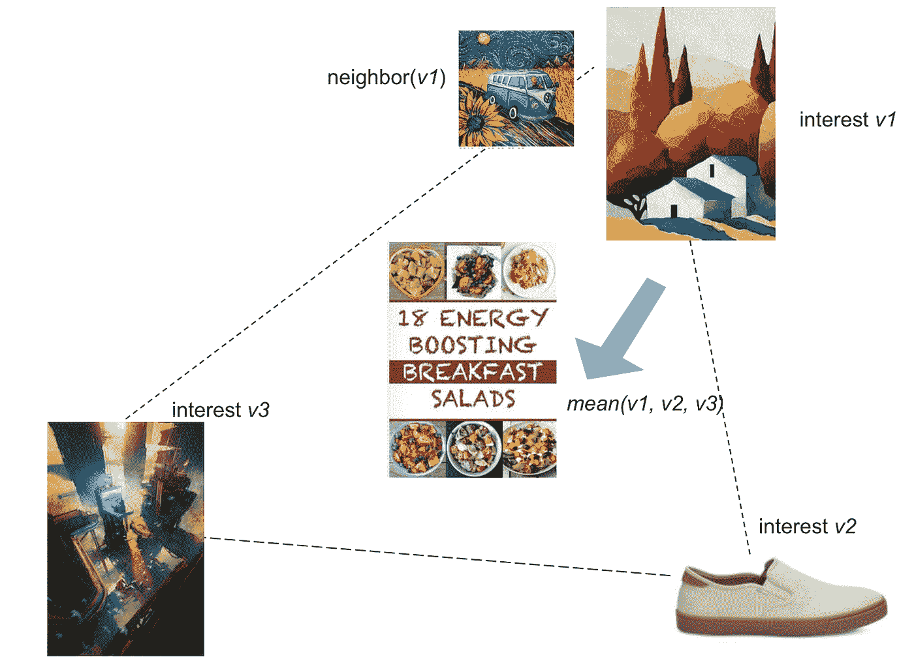
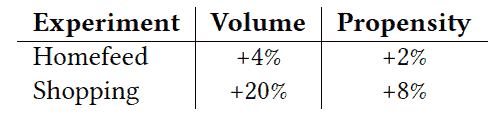

# PinnerSage:Pinterest 推荐的多模态用户嵌入框架

> 原文：<https://medium.com/pinterest-engineering/pinnersage-multi-modal-user-embedding-framework-for-recommendations-at-pinterest-bfd116b49475?source=collection_archive---------1----------------------->

Aditya Pal |应用科学，Chantat Eksombatchai |应用科学，周奕彤|用户理解，赵波|用户理解，Charles Rosenberg |应用科学，Jure Leskovec |应用科学

在我们构建支持 2B+pin 的视觉发现引擎时，了解用户的兴趣和偏好以提供相关内容至关重要。编码用户偏好的一种标准方法是通过高维空间中基于嵌入的表示。在 Pinterest 尝试的大多数现有方法为每个用户推断与内容嵌入兼容的单个高维嵌入。这是一个很好的起点，但不足以充分理解用户。

在这项工作中，我们假设单个嵌入不足以编码用户兴趣的多个方面，这些方面之间可能没有明显的联系。它们可以演变，有些兴趣会持续很长时间，而有些兴趣会持续很短时间。推荐的项目也在相同的嵌入空间中表示。一个好的嵌入必须编码用户的多种口味、兴趣、风格等。，而推荐项目(视频、图像、新闻文章、房屋列表、大头针等。)通常只有一个焦点。因此，用多个嵌入来表示用户变得很重要，每个嵌入捕获他们感兴趣的特定方面。

# PinnerSage 模型

为了更好地了解我们用户的偏好，我们开发了 PinnerSage，这是一个高度可伸缩、灵活和可扩展的推荐系统，它在内部用多个嵌入表示每个用户。图 1 提供了 PinnerSage 推荐模型的端到端概述。我们的模型的起点是通过运行 [Ward 聚类模型](https://en.wikipedia.org/wiki/Ward%27s_method)将用户的 repins 和 clicks 组织成多个兴趣聚类，然后使用 medoid、嵌入和聚类重要性分数生成每个聚类的摘要。接下来，通过在线聚类选择来挑选这些聚类的子集，并且它采用最近邻索引来向用户生成推荐。用户的行为被实时处理以更新兴趣聚类。为了让 PinnerSage 向我们每月 4 亿多的活跃用户提供相关建议并实时调整，我们做出了几个模型设计选择，下面我们将对此进行介绍。

**Figure 1: Overview of PinnerSage model**

## 设计选择 1:引脚嵌入是固定的

图 1 中的兴趣聚类是通过对嵌入的 repins 和用户的点击进行聚类而生成的。repins 和 clicks 的嵌入通过 [PinSage 模型](/pinterest-engineering/pinsage-a-new-graph-convolutional-neural-network-for-web-scale-recommender-systems-88795a107f48)进行训练，该模型通过图形卷积模型对 pin 之间的上下文和视觉相似性进行优化。因为我们的目标是将用户投影到与 Pin 嵌入空间相同的空间中，所以我们认为 Pin 嵌入是固定的。这种设计选择大大简化了我们的模型，并允许我们为每个用户并行运行推理管道。

联合嵌入推断模型，其中用户和 Pin 嵌入被一起推断，可能太复杂并且难以扩展。此外，我们假设在实践中它们损害了推荐相关性，因为 pin 之间的一些虚假连接可以通过用户建立。要了解这一点，请考虑图 2 中的例子。

**Figure 2: Three interests of a given user.**

在上面的示例图中，用户对绘画、鞋子和科幻感兴趣。共同学习的用户和 pin 嵌入将使这些不同主题上的 Pin 嵌入更接近，这可能损害基于最近邻的推荐器的相关性。引脚嵌入应仅根据以下基本原则进行操作:使相似的引脚靠得更近，同时使其余引脚保持尽可能远。出于这个原因，我们使用 PinSage，它可以精确地实现这个目标，没有任何稀释。

## 设计选择 2:无限制的用户嵌入

先前的工作要么将嵌入的数目固定为一个小数目，要么对它们设定一个上限。在最好的情况下，这种限制阻碍了对用户的全面理解，在最坏的情况下，将不同的概念融合在一起，导致糟糕的推荐。例如，合并嵌入可能会产生位于完全不同区域的嵌入。图 2 显示了三个不同的 pin 嵌入的合并导致了由概念*能量提升早餐最好地表示的嵌入。*不用说，基于这种合并的推荐可能会有问题。

PinnerSage 生成底层数据支持的尽可能多的兴趣聚类。这是通过分层凝聚聚类算法(Ward)将用户的动作聚类成概念上一致的簇来实现的。轻度用户可能由 3-5 个集群代表，而重度用户可能由 75-100 个集群代表。

## 设计选择 3:基于 Medoid 的聚类表示

通常，聚类由质心表示，这需要存储嵌入。此外，质心可能对群集中的异常值敏感。为了简洁地表示一个集群，我们选择一个集群成员 pin，称为 medoid。根据定义，Medoid 是用户最初交互的 pin 集合的成员。因此，它避免了主题漂移的陷阱，并对异常值具有鲁棒性。从系统的角度来看，medoid 是一种简洁的表示集群的方式，因为它只需要存储 medoid 的 pin id，并导致跨用户甚至跨应用程序的缓存共享。它还允许我们的系统与其他非基于嵌入的推荐系统兼容，例如 [Pixie](/pinterest-engineering/introducing-pixie-an-advanced-graph-based-recommendation-system-e7b4229b664b) 。

## 设计选择 4:用于候选人检索的中间抽样

PinnerSage 通过集群 medoids 提供了丰富的用户表示。然而，在实践中，由于成本问题，我们不能同时使用所有的 medoids 进行候选检索。此外，用户会受到太多不同项目的轰炸。为了解决这些问题，我们对 3 个与其重要性分数成比例的 medoids 进行了采样，并推荐了它们最近的相邻引脚。medoids 的重要性分数每天都在更新，它们可以随着用户口味的变化而适应。

## 设计选择 5:处理实时更新的双管齐下的方法

推荐系统适应用户当前的需求是非常重要的。同时，用户的准确表现需要查看他们过去 60-90 天的活动。数据的庞大规模和增长速度使得很难同时考虑这两个方面。我们通过结合两种方法来解决这个问题:(a)基于用户的长期交互历史推断每个用户的多个 medoid 的每日批量推断作业，以及(b)基于用户当天的交互推断 medoid 的同一模型的在线版本。当新的活动到来时，只有在线版本被更新。在一天结束时，批处理版本消耗当天的活动，并解决任何不一致。这种方法确保我们的系统快速适应用户当前的需求，同时不会损害他们的长期利益。

# A/B 测试

PinnerSage 目前已部署在生产中，并被 Pinterest 中的许多产品使用，包括 Homefeed、相关 pin、广告、购物和创作者，以及它们的检索和排名 ML 模型。我们在两个表面上的初始 A/B 测试中的胜利如表 1 所示。

表 1 显示，PinnerSage 在增加总体参与量(重复次数和点击次数)以及增加参与倾向(每个用户的重复次数和点击次数)方面提供了显著的参与收益。任何收益都可以直接归因于 PinnerSage 推荐的质量和多样性的提高。

**Table 1: A/B test of PinnerSage vs current production, which includes a single embedding model.**

# 结论

我们提出了一个名为 PinnerSage 的端到端系统，该系统支持 Pinterest 上的个性化推荐。与基于单个基于嵌入的用户表示的现有生产系统相比，PinnerSage 提出了一种基于多重嵌入的用户表示方案。我们提出的聚类方案确保我们充分了解用户的需求，并更好地理解他们。为了实现这一点，我们采用了几种设计选择，使我们的系统能够高效运行。我们的大型 A/B 测试表明，PinnerSage 在用户参与度方面有显著提高。我们的模型所带来的许多改进可以归功于它对用户兴趣的更好理解和对用户需求的快速响应。

# 附录

PinnerSage 纸将于 2020 年出现在 KDD。在这里阅读更多关于这篇论文的细节:[https://arxiv.org/abs/2007.03634](https://arxiv.org/abs/2007.03634)

# 承认

*我们非常感谢 Homefeed 和购物团队帮助我们建立在线 A/B 实验。我们特别感谢嵌入式基础设施团队为嵌入式最近邻搜索提供支持。*