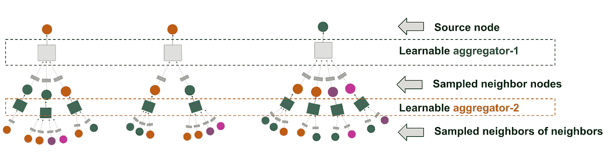
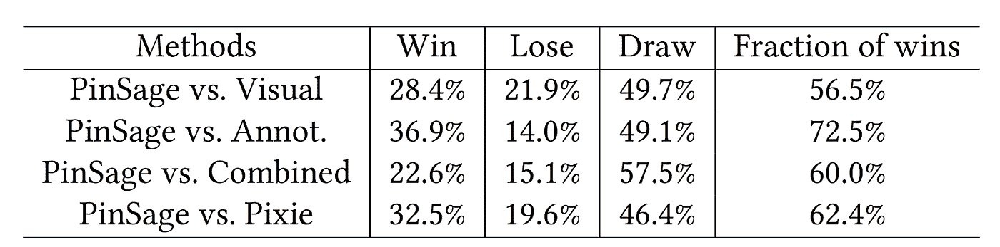
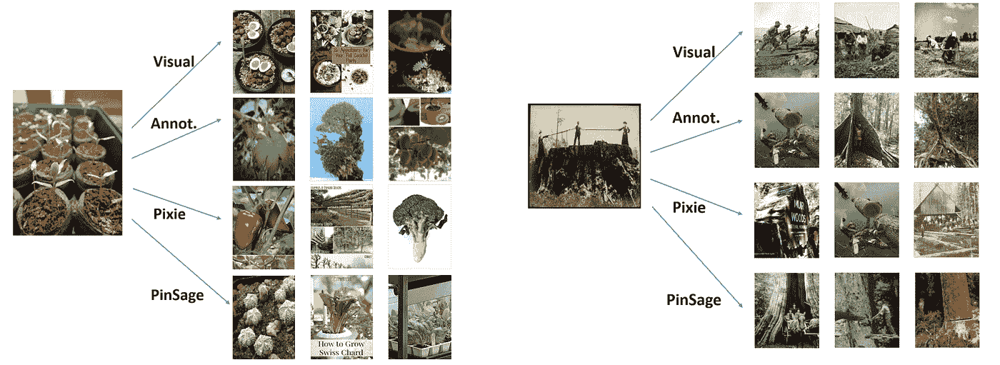

# PinSage:一种新的用于 web 规模推荐系统的图卷积神经网络

> 原文：<https://medium.com/pinterest-engineering/pinsage-a-new-graph-convolutional-neural-network-for-web-scale-recommender-systems-88795a107f48?source=collection_archive---------0----------------------->

毁掉他| Pinterest 工程师，Pinterest 实验室

深度学习方法在广泛的机器学习和人工智能任务上取得了前所未有的性能，如视觉识别、语音识别和机器翻译。然而，尽管取得了惊人的进展，但深度学习研究主要集中在欧几里德域上定义的数据，如网格(如图像)和序列(如语音、文本)。尽管如此，大多数有趣的数据和挑战都是在非欧几里得领域中定义的，比如图、流形和推荐系统。主要的问题是，如何为如此复杂的数据类型定义基本的深度学习操作。随着服务的不断增长和全球化，我们无法选择无法扩展以满足日常使用的系统。我们的答案以 PinSage 的形式出现，这是一种随机行走图卷积网络，能够学习包含数十亿对象的网络规模图中节点的嵌入。

在这里，我们将展示如何创建连接到一个大型图形中的节点(如大头针/图像)的高质量嵌入(即密集矢量表示)。我们的方法的好处是，通过从附近的节点/引脚借用信息，所得到的节点嵌入变得更加准确和更加鲁棒。例如，床栏杆销可能看起来像花园围栏，但门和床在图中很少相邻。我们的模型依赖于这个图信息来提供上下文，并允许我们消除(视觉上)相似但语义不同的引脚的歧义。

据我们所知，这是迄今为止深度图嵌入的最大应用，为基于图卷积架构的新一代网络规模推荐系统铺平了道路。

**背景**

Pinterest 最大的价值之一是，我们能够通过考虑数亿用户添加的上下文，基于口味进行视觉推荐，然后帮助人们发现符合他们兴趣的想法和产品。随着使用 Pinterest 的人数超过 2 亿+ MAU，保存的对象数量超过 1000 亿，我们必须不断开发技术，不仅要跟上，还要更智能地提供推荐。

作为一个内容发现应用，人们使用 Pinterest 来保存和组织 pin，pin 是在线内容(食谱、衣服、产品等)的可视化书签。)放到木板上。我们将 Pinterest 环境建模为一个二分图，由两个不相交的集合(引脚和电路板)中的节点组成。每个 Pin 都与某些信息相关联，如图像和一组文本注释(标题、描述)。在这里，我们的目标是从我们的二分图中生成高质量的引脚嵌入，其中视觉和注释嵌入作为输入特征。

Pin 嵌入对于各种任务都是必不可少的，例如 pin 的推荐(包括广告的动态 pin ),以及购物(分类、聚类甚至重新排序)。这些任务是我们关键服务的基础，如相关的 pin、搜索、购物和广告。为了实现我们生成高质量嵌入的目标，我们开发了一个高度可扩展的通用深度学习模型，称为 PinSage，用于从 web 规模的图中提取节点的嵌入。我们已经成功地在 Pinterest 数据上应用了 PinSage，这些数据拥有数十亿个节点和数百亿条边。

**挑战**

近年来，[图卷积网络](https://arxiv.org/abs/1609.02907) (GCNs)已经被提出来对图进行建模，并且在各种推荐系统基准上取得了成功。然而，基准测试任务的这些优势还没有转化为现实生产环境中的优势。主要的挑战是将基于 GCN 的节点嵌入的训练和推断扩展到具有数十亿个节点和数百亿条边的图。向上扩展 gcn 非常困难，因为在大数据环境中工作时，其设计背后的许多核心假设都被违反了。例如，所有现有的基于 GCN 的推荐系统都需要在训练期间对全图拉普拉斯进行操作——当底层图具有数十亿个节点并且其结构不断演变时，这种假设是不可行的。

**关键创新**

在这里，我们展示了一个高度可扩展的 GCN 框架，它是我们在 Pinterest 上开发和部署的。我们的框架是一个名为 PinSage 的基于随机行走的 GCN，它在一个具有 30 亿个节点和 180 亿条边的大规模图上运行，这个图比 gcn 的典型应用大 10，000 倍。PinSage 利用了几个关键的见解来大幅提高 gcn 的可伸缩性。

**1。动态卷积**

传统的 GCN 算法通过将特征矩阵乘以全图拉普拉斯的幂来执行图卷积。相比之下，我们的 PinSage 算法通过采样节点周围的邻域并动态构建计算图来执行高效的局部卷积。这些动态构建的计算图(图 1)指定了如何围绕特定节点执行局部卷积，并减少了在训练期间对整个图进行操作的需要。

*Figure 1: Example of computation graphs we dynamically construct for performing localized graph convolutions. Here we show three source nodes (at the top) for which we are generating embeddings. For each source node, we sample its neighbor nodes and we further sample neighbor nodes of each neighbor, i.e., here depth is 2\. Between the layers are learnable aggregators parameterized by neural networks. Aggregators are shared across different computation graphs.*

**2。通过随机漫步构建卷积**

对节点的完整邻域执行卷积会产生巨大的计算图，因此我们求助于采样。我们方法中的一个重要创新是我们如何定义节点邻域，即我们如何选择要卷积的邻居集。以前的 GCN 方法只是简单地检查 K 跳图邻居，而在 PinSage 中，我们通过模拟随机行走和选择访问次数最多的邻居来定义基于重要性的邻居。这样做的好处是双重的:

*   首先，它允许我们的聚合器在聚合邻居的向量表示时考虑邻居的重要性。我们将这种新方法称为重要性池。
*   第二，选择固定数量的节点进行聚合，这允许我们在训练期间控制算法的内存占用。

在我们的离线评估指标中，我们提出的基于随机行走的方法比传统的*K*-跳图邻域方法获得了 46%的性能增益。

**3。高效的 MapReduce 推理**

给定完全训练的 GCN 模型，直接应用训练的模型来为所有节点生成嵌入仍然是具有挑战性的，包括那些在训练期间没有看到的节点。天真地计算具有局部共解的节点的嵌入会导致由节点的 *K* 跳邻域之间的重叠引起的重复计算。

我们观察到，如果我们在 MapReduce 中将所有节点的每个聚合步骤分解为三个操作，即 *map* 、 *join* 和 *reduce* ，那么节点嵌入的自底向上聚合(参见图 1)非常适合 MapReduce 计算模型。简单来说，对于每个聚合步骤，我们使用 *map* 将所有节点投影到潜在空间，而没有任何重复的计算，然后 *join* 将它们发送到层次结构上相应的上层节点，最后 *reduce* 执行聚合以获得上层节点的嵌入。我们高效的基于 MapReduce 的推理能够在几个小时内为数百个实例的集群上的数十亿个节点生成嵌入。

**线下评测**

我们在 Pinterest 数据上实现并评估了 PinSage 我们的二分 Pin-board 图，以可视化和注释嵌入作为输入特征。我们使用的视觉嵌入来自 Pinterest 部署的最先进的卷积神经网络。在 Pinterest，使用基于 Word2Vec 的生产模型来训练注释嵌入，其中注释的上下文由与每个 Pin 相关联的其他注释组成。我们根据以下生成 pin 嵌入的基于内容的深度学习基线来评估 PinSage 的性能:

*   **视觉嵌入(Visual)** :使用深度视觉嵌入(如上所述)的最近邻居进行推荐。
*   **注释嵌入(Annot。)**:根据注释嵌入(如上所述)基于最近邻居进行推荐。
*   **组合嵌入(Combined)** :推荐基于串联上述视觉和注释嵌入，并使用 2 层多层感知器来计算捕捉视觉和注释特征的嵌入。它使用与 PinSage 完全相同的数据和损失函数进行训练。

请注意，我们使用的可视化和注释嵌入是当前在 Pinterest 部署的最先进的基于内容的系统，用于生成 pin 的表示。仅仅由于我们问题的规模，我们没有与文献中的其他深度学习基线进行比较。

我们使用召回率和平均倒数排名(MRR)作为度量标准，比较了各种方法在点对点推荐方面的性能。在召回率方面，PinSage 超过了最高基线 40%的绝对值(150%的相对值),在 MRR 方面也超过了 22%的绝对值(60%的相对值)。

**用户研究**

我们还通过在不同的学习表征之间进行头对头的比较来研究 PinSage 的有效性。在这项研究中，向用户呈现了查询 Pin 的图像，以及由两种不同的推荐算法检索到的两个 Pin。然后要求用户选择两个候选 Pin 中的哪一个与查询 Pin 更相关。用户被指示在诸如视觉外观、对象类别和个人身份等方面找到推荐项目和查询项目之间的各种相关性。如果两个推荐的项目看起来同等相关，用户可以选择“同等”。如果三分之二的用户对同一个问题没有达成一致意见，我们认为结果是不确定的。

*Table 1: Head-to-head comparison of which image is more relevant to the recommended query image.*

表 1 显示了 PinSage 和 4 个基线之间的比较结果。这里我们包括了 [Pixie](https://arxiv.org/abs/1711.07601) ，这是一个纯粹基于图形的方法，它通过模拟从查询 Pin 开始的随机行走，使用有偏随机行走来生成排名分数。具有最高分数的项目作为推荐被检索。

在用户认为更相关的项目中，大约 60%的优选项目是由 PinSage 推荐的。图 3 给出了建议的例子，并说明了不同方法的优缺点。最终，结合视觉、文本和图形信息，PinSage 能够找到在视觉上和主题上与查询项目相似的相关项目。

Figure 3: Examples of pins recommended by different algorithms. The image to the left is the query pin. Recommended items to the right are computed using Visual embeddings, Annotation embeddings, Pixie (purely graph-based method), and PinSage.

**A/B 测试**

我们在 Home Feed 和相关的 Pin 广告中进行了 A/B 实验，并与基于注释嵌入的基线进行了比较，观察到用户参与率相对提高了约 30%。

**结论**

我们开发了 PinSage，这是一个随机行走图卷积网络，具有高度可扩展性，能够在包含数十亿个对象的网络规模的图中学习节点的嵌入。

这项工作正在加速产品发现的后端，并将推动未来使用 Pinterest 进行大规模购物。

我们通过离线指标、用户研究和 A/B 测试，全面评估了大量推荐任务中学习嵌入的质量，所有这些都证明了推荐性能的显著提高，包括我们的 Shop the Look 产品的印象增加了 25%。关于 PinSage 的更多细节，请阅读我们的[SIGKDD’18 论文](https://arxiv.org/abs/1806.01973)。如果你对我们的工作类型感兴趣，加入[我们的团队](https://careers.pinterest.com/careers/)！

他是 Pinterest 的研究科学家。

*鸣谢:PinSage 工作的核心贡献者是 Rex Ying、Ruining He、Kaifeng Chen、Pong Eksombatchai、Hamilton、Jure Leskovec 和 Chuck Rosenberg。维塔利·库利科夫密切合作，通过位置敏感散列法提供 PinSage 嵌入。此外，公司的多名工程师包括赛晓、Raymond Hsu、Andrei Curelea、Ali Altaf、Stephanie Rogers、Jerry Zitao Liu 等。帮助 PinSage 取得成功！*