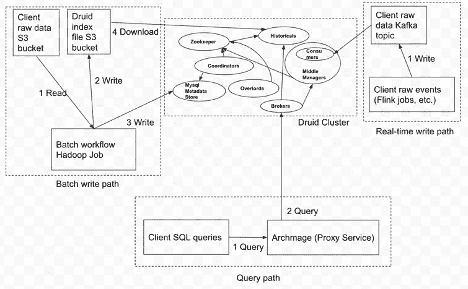

# Pinterest Analytics 作为德鲁伊平台(第 1 部分,共 3 部分)

> 原文：<https://medium.com/pinterest-engineering/pinterest-analytics-como-plataforma-en-druid-parte-1-de-3-e8a07793d87?source=collection_archive---------7----------------------->

Jian Wang, Jiaqi Gu, Yi Yang, Isabel Tallam, Lakshmi Narayana Namala, Kapil Bajaj | 实时分析团队

*这篇文章最初发表于 英语.Read the English version* [*here*](/pinterest-engineering/pinterests-analytics-as-a-platform-on-druid-part-1-of-3-9043776b7b76) *(T7 )*

在本系列文章中,我们将探讨 Pinterest Analytics 作为德鲁伊平台,并分享使用德鲁伊的一些经验教训。这是博客系列的第一个版本;它包括一个关于切换到 Druid 的简短历史,使用 Druid 的系统架构,以及为 Mmap 优化主机类型的一些课程。

# 首页 〉外文书 〉人文 〉历史 〉A Brief History of Change to Druid

传统上,Pinterest 上的大多数分析用例都是使用 Hbase 技术完成的,Hbase 技术当时是一个在公司内部得到良好支持的关键证券存储库。所有报告指标都预先以每日或每小时批次计算,然后转换为关键值数据模型,并存储在 Hbase 中。这种策略在一段时间内运作良好,但最终基于 Hbase 的预计算键值搜索系统的缺点变得越来越明显:

● 键值数据模型不自然适合分析查询模式,需要在应用程序中进行更多聚合工作。

● 每次添加新列时,基数都会扩展。

预先计算所有过滤器组合的成本太高,导致用户界面中的过滤器选项有限。

随着数据集的增长,Hbase 的集群稳定性和运营成本变得越来越难以管理。

出于所有这些原因,我们评估并决定采用 Druid 作为 Pinterest 的下一代分析数据存储。从那时起,我们纳入了许多关键用例,包括广告商和报告合作伙伴的业务指标、有机引脚统计数据、实验指标、垃圾指标分析等。该基础架构由多群集配置中的 2,000 多个节点组成(最大的脱机使用案例覆盖超过 1PB 的数据),最大的在线使用案例提供超过 1,000 QPS(P99 延迟小于 250 毫秒)。

# 建筑学

Gráfico 1: Arquitectura general del sistema

Injection 是一种具有以下特征的 lambda 架构:

每日/每小时批处理过程将输入到 S3 的数据转换为 Druid 格式的索引文件,然后将其写回 S3,并将相应的元数据记录插入 MySQL 中。

流进程使用 Kafka 主题,其中上游客户端服务实时放置事件。

查询通过名为 Archmage 的代理服务来实现。该公司的大多数微服务都通过 Thrift RPC 调用相互通信,而 Druid 仅接受 HTTP,因此除了 Druid 之外,我们还添加了一个 Thrift Archmage 服务器来处理差异。同时,代理还可以轻松发布服务指标,重写查询,暗读取,速度限制等。

# 有关为 Mmap 优化主机类型的课程

如我们所知,当查询到达时,历史进程将检索部分数据段,以便通过 Mmap 查询。这是基于段文件支持的字节数组的理想化抽象,提供一定的偏移量和长度。操作系统负责确保字节数组中引用的位移位于 RAM 中。如果没有,它将触发一个主要的页面故障,以加载一个或一系列包含 RAM 中的数据的页面,这是一个昂贵的磁盘操作。另一方面,如果之前访问了字节数组中引用的滚动,并且没有避免它,则它驻留在 RAM 的磁盘缓存部分(也称为页缓存)。然后触发一个较小的页面故障,将页面缓存中的页面链接到 Druid 进程的虚拟内存中的页面,这是一个轻松得多的操作,不涉及磁盘读取。在添加不同使用案例的过程中,我们针对不同的工作负载评估了一些主机类型,并决定使用内存优化或 IO 优化(插入顺序)主机类型,具体取决于所需的磁盘访问量。

# 针对记忆体最佳化的主机类型

对于 Pinterest 中的低延迟使用案例,我们尝试将磁盘读取量降至最低,方法是为主机预配足够大的内存大小,以便将所有经常访问的段放入页面缓存中。我们选择内存优化主机(例如:R 系列(如果使用 AWS)。一般规则是在磁盘上的分段大小和可用于页面缓存的 RAM 之间至少进行 1:1 映射。每个历史节点的可用页缓存大小是根据主机上的总 RAM 减去需要分配的最大 Druid 进程动态存储和直接内存,以及减去主机上其他侧向设备使用的 RAM 来计算的。随着时间的推移,随着传入的查询,由于页面出现重大故障而导致的初始磁盘读取消失,因为所有段都逐渐存储在页面缓存中。

当每小时或每天下载新区段时,此过程将再次启动,并且会降级,直到这些区段完全缓存为止。为了使性能更具可预测性,我们采用了预缓存方法。由于操作系统处理页缓存的方式,如果磁盘上的段文件被任何进程(即使是非德鲁伊进程)的读取系统调用传递,如果仍有空间,操作系统会将其加载到 RAM 的页缓存部分,以便以后对段文件的读取系统调用可能只是触发一个较小的页错误并阻止从磁盘读取。我们利用这种机制,允许历史进程中的一组线程在历史进程首次将一个线程下载到本地磁盘时遍历整个段文件。

# 针对 IO 优化的主机类型

在以下情况下,内存优化主机类型不是很好的选择:

数据量太大,无法提供足够的 RAM 来缓存每个区段;

● 使用案例是离线的,不需要小于一秒的延迟。

当我们为包含大约 1 PB 数据的实验指标添加离线使用案例时,我们获得了具有上述功能的使用案例的最佳实践。

最初,我们测试了具有大量 EBS 的内存优化主机类型。我们相信,有了更大的 RAM,我们至少可以从缓存中存储比主机类型更多的段中受益;结果和性能在较小的 RAM 下并不令人满意。通过进一步调查,我们发现,在每个查询中,有许多细分需要分析,远远超过页面缓存中的数量;他们几乎总是不同的。因此,之前在页面缓存中的任何内容都将被弹出,并且性能将主要由磁盘的读取性能决定。Druid 将一个段抽象成一个字节数组,并依赖于 mmap 来获取(按需)磁盘的字节数组的特定部分,而不是该段的所有数据。,给定维度的位图索引的某一部分,具有给定的过滤器)。这意味着加载一个区段的一个或一系列页面,然后移动到另一个区段,直到处理了查询所需的所有区段。对于大多数企业架构,最小页面大小为 4 KB。

简而言之,一般规则是使用具有高 4 KB 页面大小随机读取 IOPS 的主机类型,如果需要磁盘访问。对于 AWS,实例化 SSD 主机类型是最好的:i3 比 i3en 更好,而且两者都比任何其他连接 EBS 磁盘的实例类型更有效率。最后,我们选择了 i3en,它提供了价格和性能之间的平衡,并且是该公司最具成本效益的用例之一。

# 未来工作

我们将继续改进架构,以满足新的用例要求:

● 我们将向数据节点添加可用区分配,以提高可用性。

● 我们将评估基于 ZK 的分段检测替代方案,以便更好地扩展大型用例。

我们将评估替代的摄入解决方案,以提高效率或降低维护成本。

我们还计划探索更多主机类型,以提高不同场景的盈利能力。我们将分析 EBS 性能提升的主机类型、AWS Graviton 处理器主机类型等。

# 致谢

我们从 Druid Guild 与广告数据团队的对话中学到了很多东西,并从开源社区的反馈中学到了很多,因为我们开始为我们的工作做出贡献。我们还要感谢所有与我们合作将其用例集成到统一分析平台的团队:信息团队、核心产品数据团队、度量团队、信任与安全团队、广告数据团队、信号平台团队、广告投放团队等。每个用例都是不同的,并且该平台自成立以来已经发展了很多。

*有关 Pinterest 工程的更多信息,请查看我们的* [*工程博客 [*](https://medium.com/pinterest-engineering) *并访问我们的* [*Pinterest Labs*](https://www.pinterestlabs.com/?utm_source=medium&utm_medium=blog-article-post&utm_campaign=wang-et-al-december-9-2021&utm_content=spanish) *网站。如需查看和申请职位,请访问我们的* [*工作*](https://www.pinterestcareers.com/?utm_source=medium&utm_medium=blog-article-post&utm_campaign=wang-et-al-december-9-2021&utm_content=spanish) *页面。(T19)*