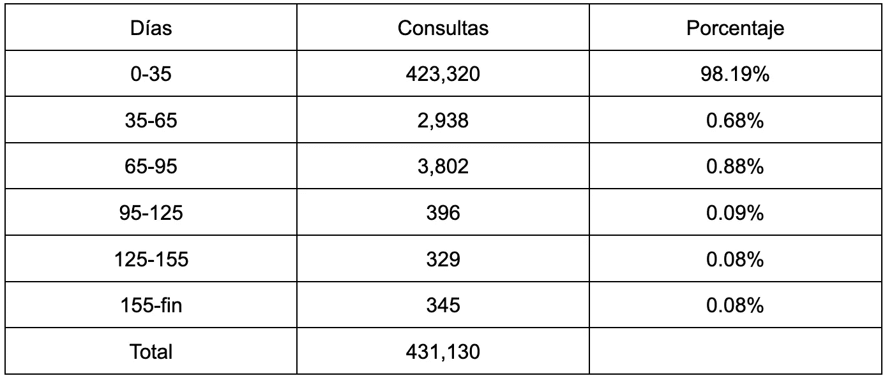
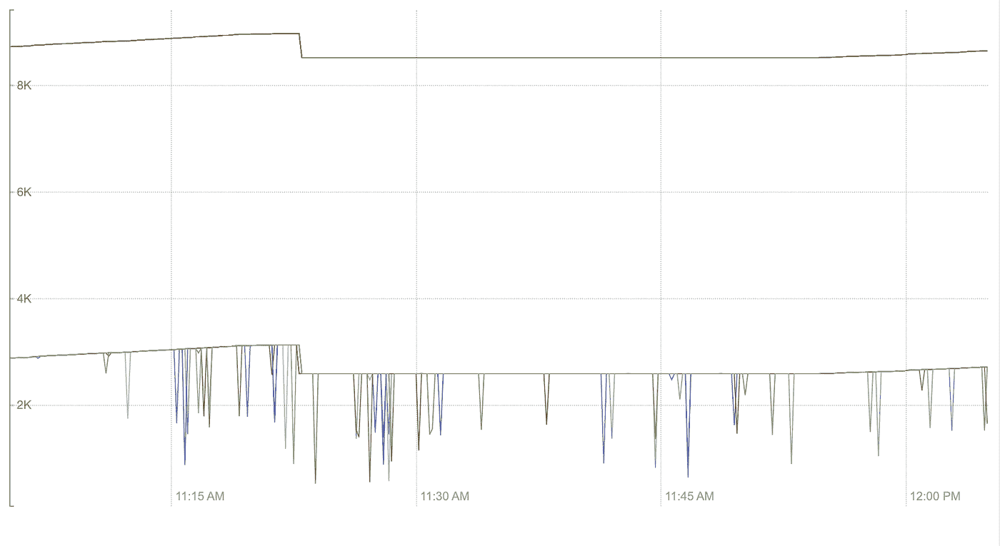
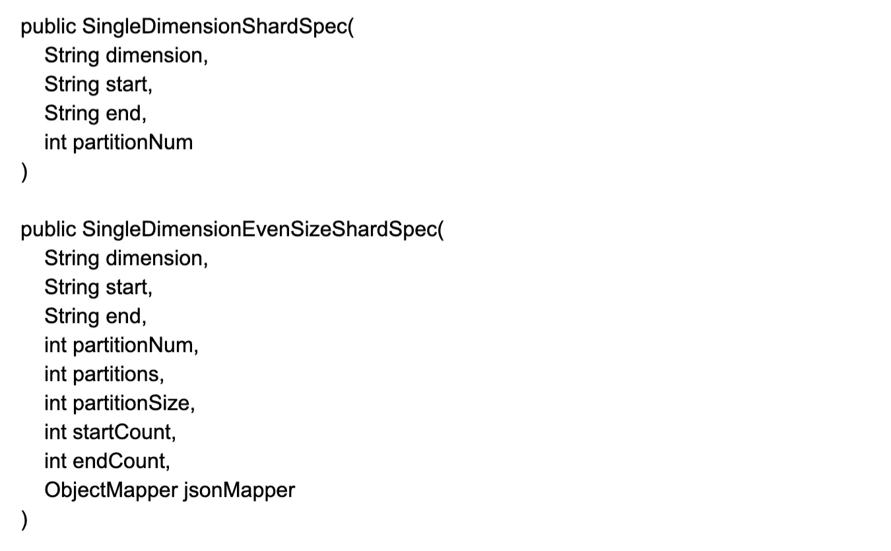
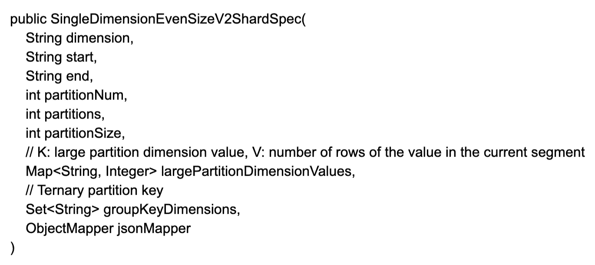

# Pinterest Analytics 作为德鲁伊平台(第 2 部分,共 3 部分)

> 原文：<https://medium.com/pinterest-engineering/pinterest-analytics-como-plataforma-en-druid-parte-2-de-3-ed6b2a848e07?source=collection_archive---------6----------------------->

Jian Wang, Jiaqi Gu, Yi Yang, Isabel Tallam, Lakshmi Narayana Namala, Kapil Bajaj | 实时分析团队

*这篇文章最初发表于 英语.Read the English version* [*here*](/pinterest-engineering/pinterests-analytics-as-a-platform-on-druid-part-2-of-3-e63d5280a1a9) *(T7 )*

在本系列文章中,我们将探讨 Pinterest Analytics 作为德鲁伊平台,并分享使用德鲁伊的一些经验教训。这是该系列的第二个版本,我们将讨论在批量使用案例中优化德鲁伊的经验教训。

# 针对批量使用案例优化 Druid 的经验教训

## 系统的能见度

在添加不同用例的过程中,我们发现 Druid 中缺少许多关键的系统指标。作为响应,我们添加了有关处理线程使用、合并缓冲区、内存中的队列等的指标。,帮助我们更清楚地了解影响容量配置的瓶颈,以确定改进的机会。

## 基于请求模式的分级

Druid 支持根据区段的时间戳将区段加载到不同的服务器组中,并且可以使用更高级别的主机来为最常访问的区段提供服务。起初,我们没有对请求时间间隔的分布进行定量分析,只有客户提供的启发式分析,因此分层在某种程度上是任意的。然后,我们将德鲁伊的所有请求记录在数据源中进行分析,这有助于我们做出更明智的调整决策。下面是其中一个使用案例的示例,我们过去在内存优化主机上加载了六个月的区段。在分析查询模式后,我们得出结论,98% 的请求是在最近 35 天内到达的,因此我们将 35 天前的区段改为基于 IO 的优化主机,而不会影响服务级别协议 (SLA),同时节省了基础设施成本。

Tabla 1: Distribución del intervalo de tiempo de solicitud del caso de uso 1

## 删除二级密钥

默认情况下,Druid 使用时间戳作为分区的主要键。可以根据选择作为次要键的维度对数据进行进一步分区,方法是在摄取期间使用基于哈希的分区或单维分区。在查询期间,Druid 使用两层查询架构,经纪人可以找出要分析的区段,并向托管它们的数据节点发送请求。当使用次要键的分区规范时,代理不仅可以基于时间戳(主键),还可以基于分区大小(次要键)来删除分区。这增加了跳过向数据节点发送请求以分析保证返回空结果的段的可能性,并节省了数据节点上宝贵的处理线程。我们使用基于哈希的分区,因为它很简单。但是,我们随后得出结论,在查询期间不会像单维分区那样使用辅助密钥。在添加缺少的逻辑以使用辅助密钥后,需要分析的区段数量减少了三倍,这大大减轻了数据节点的负担。

Figura 1: Cantidad de segmentos a analizar (caso de uso 2)

## 针对偏见数据的分区优化

基于哈希的分区适用于一般的批处理用例,但当我们将典型查询包含特定 partner_id 的业务报表用例纳入其中时,它显示了缺点。我们按 partner_id 对数据进行哈希,以减少在查询时间内要分析的区段。我们看到一些标识符的数据量远远大于其他标识符,以至于大约 20 个主要标识符的数据占总数据量的 90%以上,即使标识符总数的基数为数百万。这几十个大合作伙伴是公司最重要的客户,所以我们不能忽视他们。在摄取工作中,单个减速器负责创建单个段,并且大型合作伙伴的存在导致长时间的摄取延迟,以创建比其他段大得多的几个段。同时,在咨询时间内,即使大多数合作伙伴的查询运行良好,数十个大型合作伙伴的查询也很慢,甚至过期(我们的用例为 5 秒)。由于 Druid 中的基本处理单元是一个线程,只能通过单个线程进行处理,因此除非我们能够将大型合作伙伴的数据分散到多个线程中,否则我们无法加速该过程。

在寻找解决方案时,我们发现现有的基于哈希或基于单维的分区都不能根据其行数将给定标识符的数据分布到多个段中。因此,我们为上述目标创建了一个自定义分区规范。我们依赖于现有的单维分区规范,该规范更接近我们所需的内容:input 工作流包含一个统计计算任务,该任务在实现后和实际索引工作之前计算每个标识符的行数。我们修改了在区段中填充行的逻辑,直到达到预定义的区段大小门槛,并将剩余的行放置在下一个区段中,直到标识符的所有行都已准备就绪。一些额外的元数据字段(例如 partitionSize、startCount 和 endCount 等。)被添加到自定义分区规范中,以协助摄取任务并减少经纪方查询时间。

通过此更改,我们能够生成均匀大小的区段,并将区段中每个标识符的行数限制为预定义的区段大小(例如:的 5M)。它解决了入站队列延迟问题,并且大多数大型合作伙伴的查询性能都得到了显着改善(除了某些过期的大型合作伙伴)。

在进行进一步的表征之后,我们发现许多大型合作伙伴在一个细分市场中填充了 5M 行。我们的假设是,在数据节点上使用单个线程快速处理 5M 行,但这不适用于我们的使用案例。对于我们刚刚分析的统一大小的自定义分区规范,区段大小临界值是唯一的按钮,进一步缩小它会创建大量的区段并不必要地影响其他标识符。随后,我们改进了之前的自定义分区规范,并添加了另一个按钮(用于限制区段内标识符的行数的门槛,独立于区段大小门槛)。因为不同的大型标识符的数量通常很少,所以我们可以将每个大型标识符单独存储在分区规范中。

通过此更改,我们能够进一步降低大型合作伙伴的延迟,而无需创建更多细分或影响小型合作伙伴的性能。与此同时,我们发现我们的用例的许多查询都是组查询,因此数据节点的主要工作是查找区段中的所有可用组,然后将它们传输回经纪商进行排序和合并。我们还发现,最昂贵的组查询中的组维度具有数万个基数。因此,我们在更昂贵的组查询中添加了一个三级分区键,例如组维度,以便在同一区段中哈希同一组的数据,此时来自合作伙伴 ID 的数据必须跨越多个区段,以确保完美的摄取时间,增加数据位置,减少网络传输,并减少经纪方的最终工作量。

借助改进的统一大小的自定义分区,我们能够减少所有大型合作伙伴(最大合作伙伴除外)的延迟。深入了解后,我们发现最大的合作伙伴在实施后每天包含大约 200M 行。即使我们可以通过改进的均匀大小分区来减少花费在数据节点上的时间,经纪人仍然是瓶颈,因为单个主机不足以合并数据节点返回的大量中间结果,即使是多线程。我们还试图通过在启用 config forceLimitPushDown 的情况下首先在数据节点上获得近似的本地顶级 N 结果来减少经纪商在昂贵的组查询中的工作;但是,在经纪人方面仍然有太多的行可以添加。最后,我们意识到,除非我们将另一个聚合层添加到现有两个层的中间的当前聚合模型中(代理作为单个根,数据节点作为无限数量的叶),否则我们将无法使其返回到最大合作伙伴的超时(五秒)。最后,我们决定跳过最近的日期查询,等待一到两天后为较大的合作伙伴提供某种形式的实施的数据集作为临时解决方案。

最后,我们还得出结论,当输入大小很大时,实际索引作业之前的统计计算工作非常缓慢,并且在某些情况下,由于在映射缩小作业之间昂贵的磁盘操作,需要超过 10 个小时才能完成,这使得它无法使用。实际上,将逻辑作为一系列地图缩减任务呈现是不舒服的;但是,它在 SQL 中非常简单:分组的不同查询的计数。我们通过以与外部 SparkSql 作业中原始地图缩小作业的输出相同的格式生成统计信息来优化这一点,该作业大约需要 15 分钟才能完成,而之前大约需要 10 个小时。

# 未来工作

我们计划为系统指标添加更多可见性,以充分利用主机类型,自动分析所有用例的请求模式以降低效率,整合分区规范以减少维护多个分区的负担,并实施多层聚合模型以减少最昂贵查询的延迟。

# 致谢

我们从 Druid Guild 与广告数据团队的对话中学到了很多东西,并从开源社区的反馈中学到了很多,因为我们开始为我们的工作做出贡献。我们还要感谢所有与我们合作将其用例集成到统一分析平台的团队:信息团队、核心产品数据团队、度量团队、信任与安全团队、广告数据团队、信号平台团队、广告投放团队等。每个用例都是不同的,并且该平台自成立以来已经发展了很多。

*有关 Pinterest 工程的更多信息,请查看我们的* [*工程博客 [*](https://medium.com/pinterest-engineering) *并访问我们的* [*Pinterest Labs*](https://www.pinterestlabs.com/?utm_source=medium&utm_medium=blog-article-post&utm_campaign=wang-et-al-december-14-2021&utm_content=spanish) *网站。如需查看和申请职位,请访问我们的* [*工作*](https://www.pinterestcareers.com/?utm_source=medium&utm_medium=blog-article-post&utm_campaign=wang-et-al-december-14-2021&utm_content=spanish) *页面。(T19)*