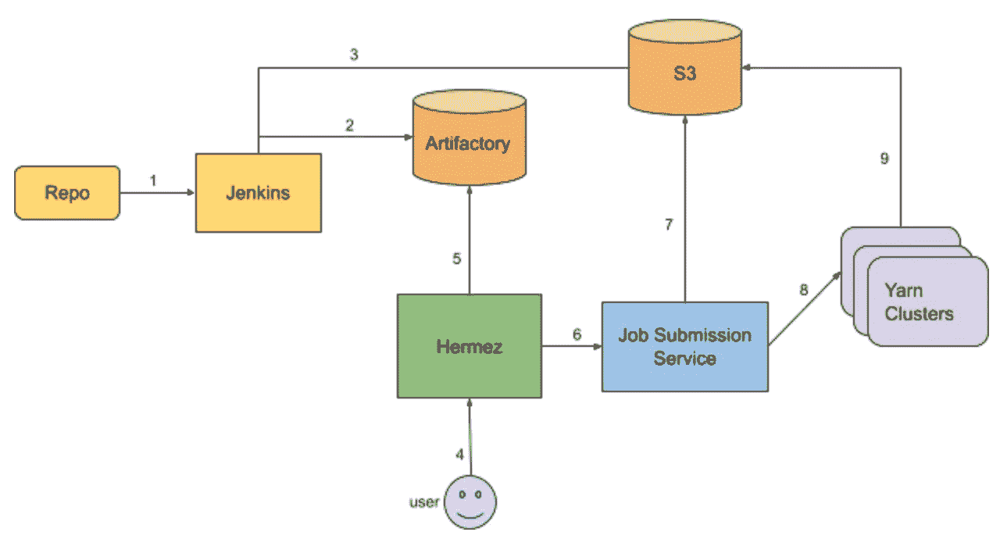
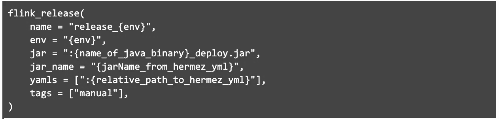
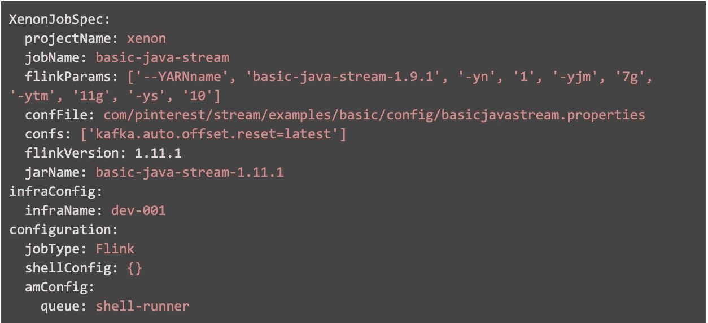

# Pinterest Flink 部署框架

> 原文：<https://medium.com/pinterest-engineering/pinterest-flink-deployment-framework-512c6cd4a1b7?source=collection_archive---------4----------------------->

李|软件工程师，流处理平台团队

# 背景

在 Pinterest，流处理允许我们为 pinners 和合作伙伴从实时数据中释放价值。流处理平台团队正在努力构建一个可靠且可扩展的平台，以支持许多关键的流应用，包括[实时实验分析](/pinterest-engineering/real-time-experiment-analytics-at-pinterest-using-apache-flink-841c8df98dc2)和[实时机器学习信号](/pinterest-engineering/pinterest-visual-signals-infrastructure-evolution-from-lambda-to-kappa-architecture-f8f58b127d98)。

Apache Flink 是一个框架和分布式处理引擎，用于无界和有界数据流上的状态计算。它提供的特性包括一次性保证、低延迟、高吞吐量和强大的计算模型。在 Pinterest，我们采用 Flink 作为统一的流处理引擎。

# 要求

## 标准化 Flink 构建

在 Pinterest，我们使用 [Bazel](https://bazel.build/) 作为构建系统。我们需要一个标准化的 Bazel 规则来构建所有的 Flink 工作，而不改变 Makefiles。一旦构建完成，不再要求用户将 Flink jars 复制到[纱线](https://hadoop.apache.org/docs/current/hadoop-yarn/hadoop-yarn-site/YARN.html)集群，jars 应该自动上传到远程存储。

## 部署和运营历史记录

用户过去常常将弗林克罐子复制到纱线簇中，并手动运行命令。如果我们需要恢复失败的作业，很难跟踪以前的执行历史。我们需要提供标准的 Flink 操作，例如启动、终止、触发保存点，以及从最近的保存点恢复作业。

## 作业重复数据消除

Flink 应用程序作为服务部署，因此每个 Flink 应用程序一次应该运行一个实例。我们需要防止用户为同一个工作意外部署两次的情况，这意味着两个实例可能写同一个卡夫卡主题。这将意味着对卡夫卡的双重书写，并可能影响下游工作。

# 部署框架

我们在 Bazel、Hermez(内部连续部署平台)、Job Submission Service(内部服务)和纱线集群的基础上构建了 Flink 部署框架。

Figure 1\. Deployment high level architecture

## 创建 Bazel BUILD 文件

BUILD 文件需要包含加载(“flink_release”)。用户还需要插入一个 Bazel 规则，如下所示:

## 定义赫米兹部署文件

Hermez 是 Pinterest 持续部署系统。为了使用 Hermez 启动 Flink 作业，用户需要创建一个 Hermez.yml 文件。该文件包含的信息包括在哪个纱线簇 Flink 作业中运行、使用什么纱线参数、使用什么资源等。对于 Flink 作业的每个实例，用户应该设置一个单独的 YAML 文件。例如，如果用户在开发、暂存和生产环境中运行他们的作业，他们将需要三个不同的 YAML 文件(每个环境一个)。

下面是一个 yml 文件的例子:

## 自动链接职位构建

*以下数字指的是图 1 中的步骤:部署高级架构*

每当用户更改 Git repo 时，就会触发 Jenkins job 来构建 Flink job JARs (1)。Jenkins 作业将遵循构建文件中描述的 flink_relase 规则来构建 Flink JAR 并将其上传到 S3 存储桶(3)。同时，它会将与部署相关的 Hermez YAML 文件上传到 Artifactory (2)。Hermez 显示器 Artifactory 当它看到一个新的 yml 文件时，它将在 UI 上显示它，以允许用户使用该 yml (5)启动一个作业。

## Flink 作业启动

当用户启动 Flink 作业时，Hermez 将 yml 文件转换成 JSON，并提交给作业提交服务(JSS) (6)。JSS 是 Pinterest 维护的一项服务，能够调度和启动 Flink 作业到 YARN clusters。

JSS 检查了该请求，并确保燧石罐和燧石作业状态存在于 S3 (7)。如果一切正常，JSS 将首先启动一个 shell-runner 作业，该作业将在 YARN cluster 集群(8)上执行一个命令。shell-runner 作业从 S3 下载 Flink 作业的 JAR，然后使用 JSS 提供的配置启动实际的 Flink 作业(9)。我们添加 shell-runner 作业的原因是将 JSS 保持为一个薄层，而无需处理不同的计算引擎客户端(Flink、Spark、MapReduce 等)。)以及每个集群的不同配置。

## JSS 重复数据删除

当恢复 Flink 作业时，我们提供了几个选项，包括从最近的保存点或检查点恢复、新状态，以及指定保存点或检查点路径。作业重复数据消除功能确保一次只有一个 Flink 作业实例在运行。

作业重复数据消除的工作方式是，提交作业时，每个作业都有一个唯一的名称。如果已经有一个作业实例在运行，JSS 将触发一个安全点并首先停止它，然后提交新作业。如果停止请求因为保存点失败而失败，那么提交的请求将失败，而正在运行的实例将保持运行。如果有一个部署正在进行，新的作业提交将被拒绝

## Flink 作业配置修补程序

由于 Flink 配置与 Flink 作业二进制文件打包在一起，用户过去常常签入配置更改以重新存储和重建包。整个过程可能需要 10 多分钟。如果我们希望在事故期间快速调整参数，这可能是一个问题。例如，当 Flink 作业由于缺乏资源而在生产中失败时，我们通常会经历整个构建过程来展示资源配置更改。事件解决后，我们需要签入另一个更改来回滚这些配置。为了加快这个过程，我们在 Hermez 上提供了一个热修复功能，可以在不改变代码的情况下覆盖 Flink 作业配置。用户可以在部署期间调整 Flink 配置值。在后台，Hermez 将直接覆盖 Hermez 从 Artifactory 读取的 ymls 中的这些值。

# 下一步是什么

## 减少部署延迟

当前的方法首先启动 shell-runner。然后，shell-runner 向可能会增加延迟的纱线簇发起 Flink 作业。我们计划改进这一流程，以减少端到端 Flink 作业启动时间。

## 自动作业故障转移

为了进一步提高平台和 Flink 应用的可用性，我们在多个 AWS [可用性区域](https://docs.aws.amazon.com/AWSEC2/latest/UserGuide/using-regions-availability-zones.html#concepts-availability-zones) (AZ)中构建了 YARN 集群，以便在一个集群或一个 AZ 不可用时提供备份。我们还在构建一种服务，它可以自动检测任何集群故障，并将失败的作业故障转移到不同 az 中的备份集群，或者检测应用程序故障并自动重启应用程序。

敬请期待！

# **致谢**

感谢史蒂芬·拜罗斯-诺瓦克和杨宇做出的无数贡献。感谢张昂更新这个博客。这个项目是 Pinterest 多个团队的共同努力。感谢工程生产力团队对 Hermez 的支持。