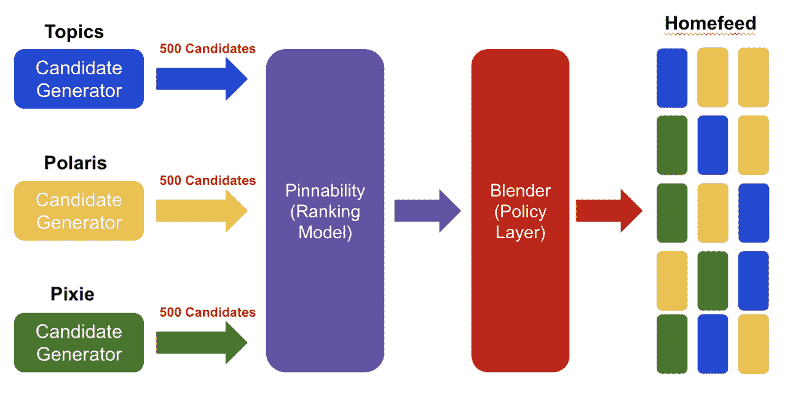
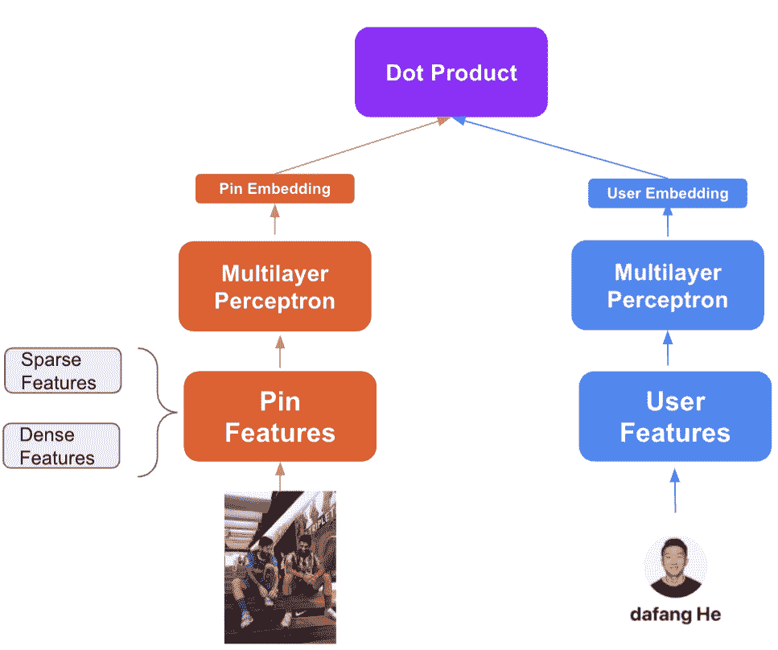
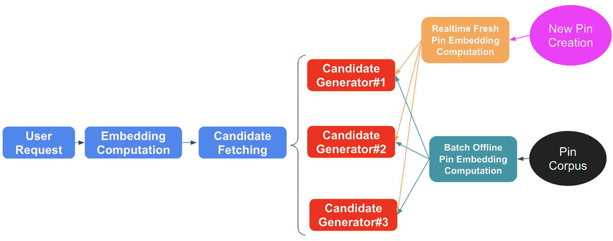

# Pinterest Home Feed 统一轻量级评分:双塔方法

> 原文：<https://medium.com/pinterest-engineering/pinterest-home-feed-unified-lightweight-scoring-a-two-tower-approach-b3143ac70b55?source=collection_archive---------0----------------------->

大方何|软件工程师，家考生代；廖骏伦；Dhruvil Deven Badani |软件工程师，Homefeed 排名；Poorvi BhargavaSangmin Shin |工程经理，首页排名；张铎|工程经理，候选人生成；Jay Adams |软件工程师，Inspire

# 介绍

Pinterest 是一个用户(Pinners)可以保存和发现来自网络和移动平台的内容的地方，越来越多的创作者可以将原生内容发布到 Pinterest。我们在语料库中拥有数十亿的内容(pin ),并提供个性化的推荐，激励 Pinners 创造他们热爱的生活。Pinterest 最关键也是最复杂的界面之一是 home feed，Pinners 可以在这里根据他们的参与度和兴趣看到个性化的 feed。在这篇博客中，我们将讨论如何在支持 home feed 推荐的各种候选生成器之间统一轻量级评分层。

# 动机

Pinners 打开 Pinterest 应用时首先看到的是 Home feed。为了提供相关和多样的推荐，我们使用一个包含许多不同来源的推荐系统。例如，一个主要的来源是 [Pixie](/pinterest-engineering/an-update-on-pixie-pinterests-recommendation-system-6f273f737e1b) [1]，它基于[二部针板图](https://en.wikipedia.org/wiki/Bipartite_graph)的随机行走。基于 Pixie 平台，我们能够生成多种不同的来源，一些来源基于参与历史直接从随机漫步返回 pin，一些来源基于从 Pixie 随机漫步返回的电路板检索的 pin。除了 Pixie，我们还有接受主题或基于嵌入的推荐源。这些候选生成器通常有自己的轻量级评分模型，该模型对最相关的候选进行排名和选择，并将其发送到最终排名。例如，我们有一个随机行走后在生产中使用的 gbdt 轻量级评分模型[2]。首页提要推荐引擎的总体情况如图 1 所示。

这些推荐源大多具有:

1.  个人培训数据生成管道
2.  不同的在线服务方式
3.  不同的轻型型号在服务期间具有不同的功能集。

开发仅服务于一个特定候选生成器的单个机器学习模型需要大量的工程工作。这大大限制了 ML 工程师的开发速度。

除了开发速度之外，如果我们为了改进轻量级模型而增加特性集，我们还会看到在线服务成本的增加。这是因为每个候选源将需要对一大组候选源(pin)进行相对复杂的在线模型计算。例如，对于一个由 pixie 轻量级评分[2]支持的源，它在服务中使用 gbdt 模型，并且需要计算每个请求的数千个 pin 的排名。这种计算开销使得很难在不引入大量服务成本的情况下进行特征工程。

Fig. 1\. *Overview of current home feed recommendation pipeline.* Home feed recommendation is powered by many different candidate generators. Each of them serves a unique role and has its own light-weight ranking layer.

最后但同样重要的是，对于某些候选来源，许多功能在在线申请阶段也不可用。添加这些功能会带来基础设施开销，并且在实际收集数据和运行实验之前很难证明性能提升的合理性。Pixie lws 的博客帖子中也提到了这个痛点。

所有这些因素促使我们**为这些候选生成器统一**我们的机器学习建模和服务方法，以便为最终排名模型提供一组更个性化的候选。因此，我们决定使用统一的双塔模型[3]，[4]进行轻量级建模。

# 双塔建筑

在这一节中，我们将描述我们的双塔建模方法，用于统一灯光评分，目标是解决上述棘手问题。

双塔架构的概述如图 2 所示。它有一个单独的用户塔和一个 Pin 塔，最终的点积计算给定用户和给定 Pin 之间的相似性。引脚塔从给定引脚获取特征，并为其生成引脚嵌入。所使用的特征包括密集特征如 Pin 的最近表现以及稀疏特征如类别。稀疏特征将在发送到 pin 的 MLP 进行最终嵌入计算之前被传递到嵌入层。用户塔将参与历史特征作为输入，并生成用户特定的嵌入。最后，我们基于两个嵌入做了一个简单的点积，作为 Pinner 与 Pin 接合的可能性的度量。

Figure 2\. *The overview of two-tower architecture used in unified light-weight scoring. On the left side, it is the pin tower that computes the pin’s embedding, and on the right side we have the user tower that generates the user embedding.*

# 培养

对于轻量级排序层上双塔模型的优化，我们必须将其与排序层上的建议区别对待，因为与将用于排序的 pin 相比，我们将在候选生成器级别上面对更多负面候选。因此，我们应用批内负抽样方法[5]，并在我们的训练中使用 6000 的批量大小，以便使每个正候选与免费产生的足够的负候选相结合。我们发现，通过应用这一点，我们能够实现更好的离线指标，如通过在 top k 的召回所测量的。

# 服务

在这一部分，我们将描述我们如何服务于机器学习模型来支持在线候选人检索推荐。服务架构将包括两个部分:Pin 嵌入服务和用户嵌入服务。我们将在这里分别讨论这两个部分。

## **嵌线上菜**

Pinterest 中所有可能的候选 pin 的 Home feed powers 推荐。因此，我们必须计算所有引脚的嵌入。通常对于推荐引擎来说，内容分发将遵循长尾规则，并且对于我们来说重要的是避免每次对于在线请求重新计算相同的 pin 嵌入，因为许多请求将被归因于相同的 pin。另一方面，pin 的内容不会移动太多，所以它们的嵌入相对稳定。因此，我们应该能够在离线工作流中计算大多数引脚的嵌入。在在线请求中，我们只需要检索预先计算的嵌入，而不是重新计算。对于新的 pin(在几小时内进入 Pinterest 生态系统的 pin)，我们将需要为它们进行在线推断，因为它们不会被离线工作流拾取。因此，我们将引脚的嵌入计算分离到两个不同的管道中，如图 3 所示。

## **用户嵌入服务**

Pinners 倾向于立即改变他们的状态。例如，如果一个销针与一个卡特彼勒销接合，他们很可能在不久的将来与另一个卡特彼勒销接合。因此，捕捉反映他们实时兴趣的状态变化对我们来说很重要。为此，每当有新的用户请求时，我们就启用在线用户嵌入计算。添加这样的东西不会是一个昂贵的计算，因为我们每个请求只计算一次。

Figure 3\. *The overall serving pipeline for candidate retrieval with two-tower embedding computation. Most of the existing pins will be inserted into candidate generators with an offline workflow that computes pin embeddings, while new pins will be inserted to be served after they get online pin embedding computation*.

# 视窗网际网路名称服务

为了评估统一轻量级评分方法的性能，我们做了一个在线实验，将轻量级评分层应用于所有候选生成器。我们看到了以下几个方面的收获。

## **订婚胜利**

通过对所有候选生成器应用轻量级排序层，我们看到了巨大的参与度提升。例如，总储蓄和特写都增加了 2-3%。我们也看到总皮革量下降了 3-4%。这些指标的胜利证明了相关性的改善，同时使用双塔架构来取代旧的轻量级排名方法。我们认为这是因为双塔方法可以利用 Pin 和 Pinner 的所有相关功能，因此我们可以为两者获得更好的嵌入表示。

## **多样性**

将同一模型应用于所有候选生成器的一个问题是，这将使我们的推荐不那么多样化。作为一个旨在激励 Pinners 的平台，我们不想放弃我们的推荐多样性。然而，在我们的在线实验中，我们实际上看到采用的多样性增加了(保存、特写等)。我们认为这是因为(1)生成的用户嵌入可以基于参与历史编码多样化的兴趣。(2)由双塔方法提供的更好的推荐过滤掉了不相关的引脚，并且推荐的项目更有可能被采用。

## **基础设施成本**

每个请求使用数千个引脚的在线计算成本很高。考虑到我们正在处理的候选生成器的数量，情况尤其如此。通过使用双塔方法在轻量级排名层应用简单的点积，我们显著降低了每个请求的在线服务成本。考虑具有两个 64 维嵌入向量的点积，我们只需要 n 次乘法运算和 n 次加法运算。这比，例如，具有在线特征转换的逻辑回归模型，桶化，要便宜得多。通常，在我们最初的服务系统中，这最终会导致一个长向量和巨大的在线服务成本。

# **总结&未来作品**

在这篇文章中，我们概述了目前在 Homefeed 中使用的统一轻量级排名层。我们关注这些努力的主要动机以及从中获得的经验。总之，从机器学习建模的角度来看，密集编码的学习嵌入向量提供了更好的推荐，我们不仅在参与度方面取得了收益，而且在采用多样性和基础设施成本节约方面也取得了收益。同时，我们能够在不同候选生成器使用的不同服务基础设施之间应用相同的模型。

在未来的工作中，我们将尝试使用更好的功能和 ML 建模来不断改进轻量级排名模型。我们还将尝试将该模型应用于其他一些新添加的候选生成器，以进一步统一我们的轻量级评分层。

# **鸣谢:**

邓宝文、吴、谢海滨、傅、尚雯婕、张世元、姜建清、米开朗琪罗、、王迪伦、、、陈蜜蜂、张良。

*要在 Pinterest 了解更多工程知识，请查看我们的* [*工程博客*](https://medium.com/pinterest-engineering) *，并访问我们的*[*Pinterest Labs*](https://www.pinterestlabs.com/?utm_source=medium&utm_medium=blog-article&utm_campaign=he-et-al-september-9-2021)*网站。要查看和申请空缺职位，请访问我们的* [*职业*](https://www.pinterestcareers.com/?utm_source=medium&utm_medium=blog-article&utm_campaign=he-et-al-september-9-2021) *页面。*

## **参考文献:**

[1] Pixie:一个向 2 亿多用户实时推荐 30 多亿件商品的系统

[2] Pixie lws 博文:[https://medium . com/Pinterest-engineering/improving-the-quality-of-recommended-pins-with-lightweight-ranking-8ff 5477 b20e 3](/pinterest-engineering/improving-the-quality-of-recommended-pins-with-lightweight-ranking-8ff5477b20e3)

[3]用于 youtube 推荐的深度神经网络。p .科文顿，j .亚当斯和 e .萨金。

[4]通过 gramian 估计对非常大的语料库进行有效训练。克里钦，w .，马约拉斯，n .，伦德，s .，张，l .，易，x .，洪，l .，迟，e .，安德森，J

[5]用于大语料库项目推荐的采样偏差校正的神经建模。信阳易洪陆。