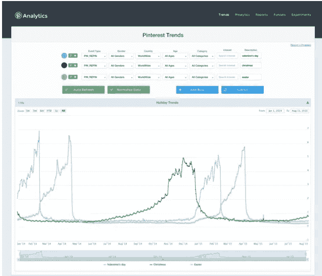
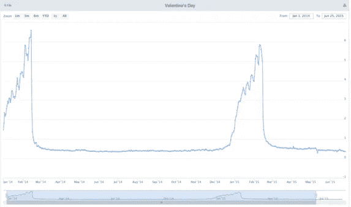
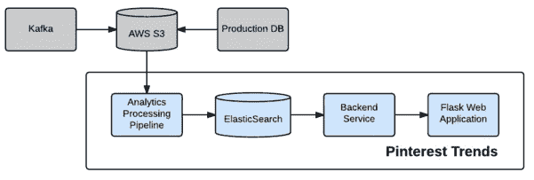

# Pinterest 趋势:对非结构化数据的洞察

> 原文：<https://medium.com/pinterest-engineering/pinterest-trends-insights-into-unstructured-data-b4dbb2c8fb63?source=collection_archive---------3----------------------->

斯蒂芬妮·罗杰斯|发现网站 Pinterest 工程师

品友们对什么话题感兴趣？他们什么时候最关注这些话题？他们如何参与这些话题？为了回答这些问题，我们构建了一个内部 web 服务，该服务将[非结构化](https://en.wikipedia.org/wiki/Unstructured_data)数据可视化，并帮助我们更好地理解及时的趋势，我们可以通过产品向 Pinners 重新展示这些趋势。该工具显示最受欢迎的大头针，以及在大头针和搜索中的关键字的时间序列趋势。

该工具的一个用例是，它帮助我们了解 Pinners 对什么主题感兴趣，这种兴趣通常发生在什么时候，以及他们如何参与这些主题。具体到何时，我们随着时间的推移可视化关键词，以更容易地识别主题的季节性或趋势，但最强大的洞察力来自于通过顶级 pin 了解 Pinner 行为。

例如，简单地搜索一个节日，比如“情人节”，我们可以看到在 2 月 14 日前两个月，人们的兴趣开始上升。但是对关键词的兴趣还不够；我们想确定何时应该开始推广不同类型的产品。我们看到男性品酒师在高峰开始时会看产品。这些人都是有远见的人，他们在寻找需要提前预订的礼物。大约在假期前 2-3 天，男性品酒师主要看 DIY 工艺品和烘焙食品，这些东西不需要太多时间，或者可以在前一天晚上在便利店买到。最后，在情人节那天，我们看到了很多关于孤独的幽默模因。我们能够在几秒钟内发现这些参与趋势。

**情人节前的男性时尚趋势**

【2015 年 1 月—产品

【2015 年 2 月初— DIY &烘焙食品

*2015 年 2 月 14 日——孤独的迷因*

## 动机

任何关键字趋势解决方案的核心部分都是能够对属性执行全文搜索。虽然 MapReduce 对于查询围绕大头针的结构化内容很好，但在回答需要全文搜索的查询时却很慢。另一方面，ElasticSearch 提供了一个分布式的全文搜索引擎。

通过使用 ElasticSearch 对 pin 周围的非结构化数据(如描述、标题和兴趣)进行索引，我们开发了一个工具，可以实时处理全文查询，并以用户友好的方式可视化趋势和相关 pin。在较高层次上，该工具提供了针对引脚描述的关键字搜索和搜索查询，以:

*   使用给定的关键字查找前 N 个大头针或搜索查询
*   显示和比较时间序列趋势，包括每天的重复和搜索量

此外，该工具还通过各种细分来过滤关键词量，包括位置、性别、兴趣、类别和时间。

## 履行

1.  **提取**所有与引脚相关的文本
2.  **将** Pin 文本插入弹性搜索
3.  **索引**文本数据(ElasticSearch 为我们做这件事)
4.  **构建**服务来调用应用程序后端的 ElasticSearch API
5.  **使用 Flask 和 ReactJS 在应用前端可视化**数据

## 挑战

**数据收集**
收集与 Pin 相关的所有文本，包括描述、标题、标记的兴趣、类别和时间戳，以及 Pinner 人口统计数据，需要可扩展的复杂逻辑。我们使用一系列 [Hive](https://hive.apache.org/) 和[级联](https://www.cascading.org/)作业(两者都是基于 MapReduce 的框架)每晚运行一个 [Pinball](https://engineering.pinterest.com/blog/open-sourcing-pinball) 工作流，以提取前一天与 pin 相关的所有文本并将其转储到我们的 ElasticSearch 集群中，然后该集群对这些文本进行索引。

**设计**

一个主要的设计决策是使用每日索引(每天一个索引)，因为许多高容量的时间序列项目默认都是这样做的，包括 [Logstash](http://logstash.net/docs/1.4.0.beta1/tutorials/getting-started-with-logstash) 。使用这些每日索引对我们整个系统的可伸缩性和性能有几个好处，包括:

*   增加了指定时间范围的灵活性。
*   由于文档在各个节点之间分布良好，读取速度更快。
*   每个查询中涉及的索引数量最少，以避免相关的开销。
*   通过并行调用进行大容量插入或大容量读取。
*   失败后更容易恢复。
*   更容易调整集群的属性(碎片数量、复制等。).较小的索引导致测试这些不可变属性的迭代更快。

**可扩展性**

尽管使用了大数据技术，但我们的工作流面临着各种可扩展性挑战。数据太多，无法运行简单的 Hive 查询，因此我们优化了 Hive 查询设置，切换到级联作业，并在实现选择上进行权衡。

到目前为止，每天超过 14GB 的数据和大约两年的存储数据(总共大约 10TB 的数据)使我们的弹性搜索集群面临更大的可扩展性问题。我们不得不通过添加更多节点来不断扩展我们的集群。如今，我们有 33 个 I 2.2 x 大搜索节点和 3 个 m 3.2 x 大主节点。虽然不需要复制来防止数据丢失，因为 ES 不是主要的持久存储，但我们仍然决定使用 1 的复制因子(即所有数据有两个副本)来将读取负载分散到多台服务器上。

**性能**

在启动我们的原型之后，我们看到了应用程序性能有很大的改进空间，尤其是随着用户数量的增长。我们从原始 HTTP 请求转换到了弹性搜索 Python 客户端，并优化了服务中的弹性搜索查询代码，从而使性能提高了 2 倍。我们还实现了服务器端和客户端缓存，以获得更频繁查询的即时结果的额外好处。所有这些优化的最终结果是为用户提供两秒钟的查询。

## 结果

这一创新工具取得了巨大成功。使用是普遍的内部获得 Pinner 见解，突出受欢迎的内容，甚至检测垃圾邮件。

如果您有兴趣研究像这样的大规模数据处理和分析挑战，[加入我们的团队](https://careers.pinterest.com/careers/details/data-engineer_san-francisco_15423)！

*致谢:该项目是 Pinterest 内部多个团队的共同努力。各个团队提供了深刻的反馈和建议。主要工程贡献者包括* [*斯蒂芬妮·罗杰斯*](https://www.pinterest.com/stogers/) *、* [、*贾斯汀·梅杰拉达-皮尔、*、](https://www.pinterest.com/justinmpier/)、*王春燕以及数据工程团队的其他成员。*