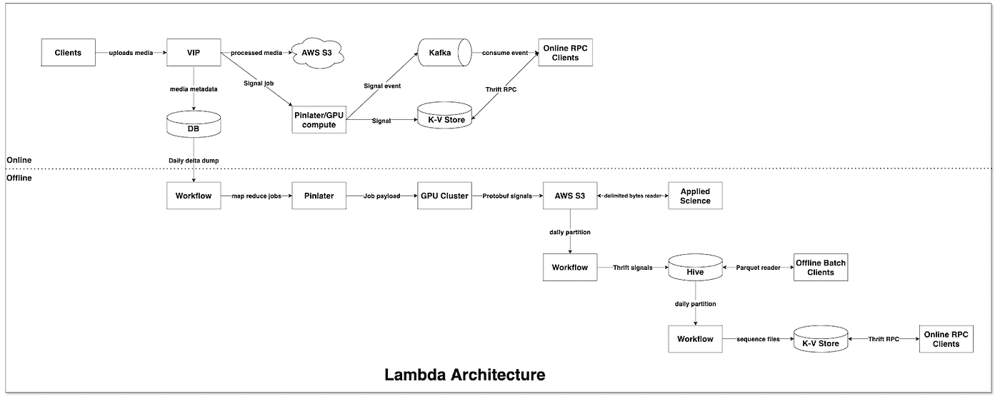
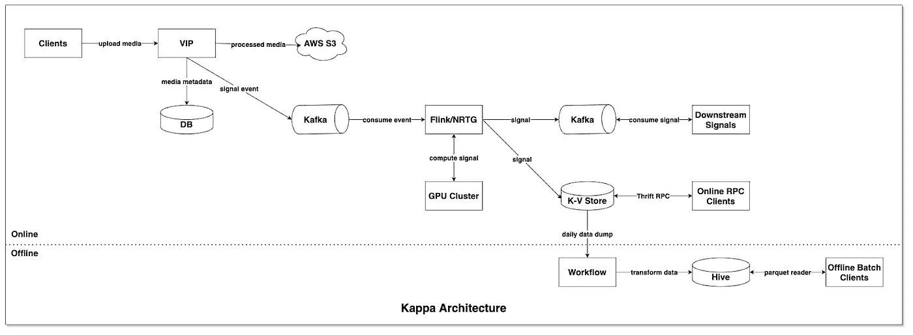

# Pinterest 视觉信号基础设施:从 Lambda 到 Kappa 架构的演变

> 原文：<https://medium.com/pinterest-engineering/pinterest-visual-signals-infrastructure-evolution-from-lambda-to-kappa-architecture-f8f58b127d98?source=collection_archive---------1----------------------->

Ankit Patel |内容获取和媒体平台软件工程师

随着对来自 Pinterest 庞大视觉数据集的机器学习信号的需求不断增长，我们决定进一步研究我们产生和服务这些信号的基础设施。我们特别感兴趣的几个参数是信号可用性、基础设施复杂性和成本优化、技术集成、开发速度和监控。在本帖中，我们将描述我们从 [Lambda 架构](https://hazelcast.com/glossary/kappa-architecture/)到受 [Kappa 架构](https://milinda.pathirage.org/kappa-architecture.com/)启发的新型实时信号基础设施的旅程。

# 背景

为了理解现有的视觉信号基础设施，我们需要理解 Pinterest 的一些基本内容处理系统。Pinterest 的内容获取和媒体平台，以前称为视频和图像平台(VIP)，负责摄取、处理和提供应用程序每个表面上的所有 Pinterest 内容。我们每天都在大规模地摄取媒体。这篇文章不会详细介绍摄取和服务部分，它将主要关注处理部分，因为这是最神奇的地方。

媒体通过 50 个不同的管道摄入。管道是 VIP 系统中的名称空间，例如 Pinner 上传的内容、抓取的图像、购物图像、视频关键帧、用户个人资料图像等。每个管道映射到为其服务的用例定制的定制媒体处理配置。

当我们开始构建我们的视觉信号处理基础设施时，我们利用了这种现有的命名空间理念，并围绕管道划分了我们的视觉信号。Pinterest 自主研发的信号处理和服务技术栈名为 Galaxy。Galaxy 中以不同实体 id 为关键字的名称空间称为联接或 Galaxy。每个 VIP 管道都被映射到对应的星系。有时我们将多个相似的管道组合成一个星系，因为它们关系密切。

# λ架构

直到最近，我们还在使用下图所示的 Lambda 架构来计算媒体内容中的视觉信号。

正如您在上图中看到的，这个架构有两种模式:在线和离线。先来讨论下线下架构。

1.  计划运行夜间工作流(基于 Hadoop 的 map-reduce 作业)。我们计算特定日期的增量唯一映像签名，并创建一个新分区。
2.  然后，我们创建成批的图像签名，并对处理这些批处理的 PinLater 作业进行排队。
3.  我们用信号计算所需的 ML 模型构建了一个 GPU 集群，然后开始处理 PinLater 作业。这是一个昂贵的集群。
4.  我们从亚马逊 S3 下载图像，对其运行模型推理，然后将输出存储在 S3。然后，我们将降低 GPU 集群的速度，以优化 EC2 支出。
5.  该信号以带 Protobuf 编码值的分隔字节格式生成。
6.  我们启动了一个工作流，将这个输出转换成等价的 Apache Thrift 编码，因为 Pinterest 大量使用 Thrift 作为其网络格式和数据存储。
7.  节俭输出存储在镶木地板柱状蜂房表。下游批处理客户端使用此输出。
8.  为了支持实时 RPC 客户端，我们有一个最终的工作流，将配置单元分区上传到 Rockstore 键值对数据库。
9.  Galaxy Signal Service 提供了一个 RPC API 来为我们的在线客户端从 Rockstore 中查找这些信号。

正如你所看到的，在上面的设计中有很多移动的部分。尽管随着时间的推移，这些流程变得更加成熟和稳定，但是 VIP 团队的工程师在工作时经常会遇到问题。一些最大的问题是:

*   依赖于其他工作流的工作流
*   消费者必须等待 24 小时才能收到信号
*   应用程序逻辑问题极难调试
*   粒度重试是不存在的，要么全有，要么全无
*   由于这些系统的性质造成的延迟

随着我们继续构建由这些机器学习信号驱动的其他功能，更快地产生这些信号的需求成为了整个公司的优先事项。这就是在线模式发挥作用的地方:

1.  我们实时为每个图像签名创建 PinLater 作业。
2.  在这项工作中，我们调用运行机器学习模型推理服务的 GPU 集群来计算信号，并将其结果直接存储到基于键值对的 Rockstore 数据库中。GSS(银河信号服务)然后将服务这个信号。
3.  然后，我们通过 Kafka 发布一个事件，通知下游消费者信号的可用性。
4.  下游客户端使用该事件，并实时从 GSS 获取信号。

VIP 并不是 Pinterest 中唯一被这种新的信号处理范式吸引的团队。其他团队对实时计算信号的想法感到兴奋。与基于 hadoop 的工作流的黑匣子相比，它提供了对信号生成的更多可见性。这种方法有多种好处，例如:

*   更好的开发者体验
*   更容易调试、测试和部署变更
*   粒度重试
*   低延迟信号

然而，它也有它的缺点。主要的是:

*   像 group bys 和 signal joins 这样的复杂操作是不可能用像 Pinlater 这样简单的事件驱动处理框架来完成的。我们需要一个健壮的流处理框架，比如 Apache Flink。
*   运行重复 GPU 集群的额外成本，该集群持续处理与批处理流水线相同的管脚。
*   没有解决共同需求的共享基础设施。

# 卡帕建筑

最后，Pinterest 的信号平台团队看到了一个解决所有信号开发人员这一问题的机会，并建立了下一个版本的信号开发基础设施，称为“近实时星系”，或简称为 NRTG。选择的技术是 Apache Kafka 和 Apache Flink。Flink 似乎是专门为解决上述问题而设计的。鉴于 Signal Platform 团队已经有了一个使用 Galaxy Dataflow APIs 在批处理技术上构建信号的框架，将其扩展到流技术上可以说是最佳的前进方式，而不会导致大量的重构、重写或重新发明。

VIP 团队决定成为该计划的早期采用者之一，因为我们的媒体信号是 Pinterest 整个信号树中最上游的一些信号，所以在平台仍在建设中时，它自然是最容易装载的。我们找出了想要试验的信号，并开始了这项任务。

它的要点非常简单:您可以编写一个简单的 flink 作业来计算流中的信号(在 Apache Flink 上)。NRTG 将通过利用标准设计模式和注释使这个过程变得简单快捷。

基于这些注释，上面提到的 NRTG 框架完成了对信号开发人员隐藏的大部分繁重工作。这个中间件层管理配置和到底层本地 Flink 的映射。这使得 signal 开发速度非常快，因为开发人员不需要详细学习 Flink，因为他们已经熟悉这些注释。Pinterest 的 Xenon (Flink)平台团队提供部署和维护 Flink 应用程序的基础设施能力。

一旦我们加入 NRTG，我们希望关闭现有的批处理工作流设置。有许多消费者批量消费这些信号。我们必须从我们的流媒体渠道为他们提供一个可行的解决方案。为了模拟我们信号的每日配置单元表，我们编写了一个简化的工作流，该工作流获取 KVStore 的每日转储，并将其转换为现有的配置单元输出。重新计算信号值不需要 GPU 计算，数据只是在流中计算，通过每日转储移动到 S3，并过滤为正确的格式。这不仅让我们节省了 GPU 成本，还将复杂的工作流设计简化为简单的数据转换工作。随着 FlinkSQL 的积极开发，我们将能够完全将离线部分从 Spark/Hadoop 迁移到 Flink。

# 结论

迁移到这种新的快速信号基础设施是 Pinterest 在信号生成方面美好未来的开始。它允许信号开发人员以更少的学习曲线快速构建信号。底层 Flink 功能也支持高级信号设计。尽管批量回填支持是 NRTG 正在进行的一项工作，信号生产者需要调整输出以避免对消费者造成干扰，但其好处仍然超过了现有 lambda 基础设施中复制的成本。NRTG 团队已经在路线图中提供了这一点，通过将 Hive 集成作为框架的一部分来提供端到端支持。在一个平台下实现信号的端到端生命周期将极大地有利于 Pinterest 不同团队的创新和产品化想法。它降低了基础架构的复杂性，我们能够在 GPU 和其他计算资源上实现成本优化。我们希望 Pinterest 的其他团队也能步我们的后尘，通过迁移到一个更简单、更健壮的架构来提高他们的开发速度，就像这篇博客中描述的那样。

这个项目是 Pinterest 多个团队的共同努力:视频和图像平台(VIP)、近实时星系(NRTG)、Xenon、Hermes、Rockstore 和视觉搜索。