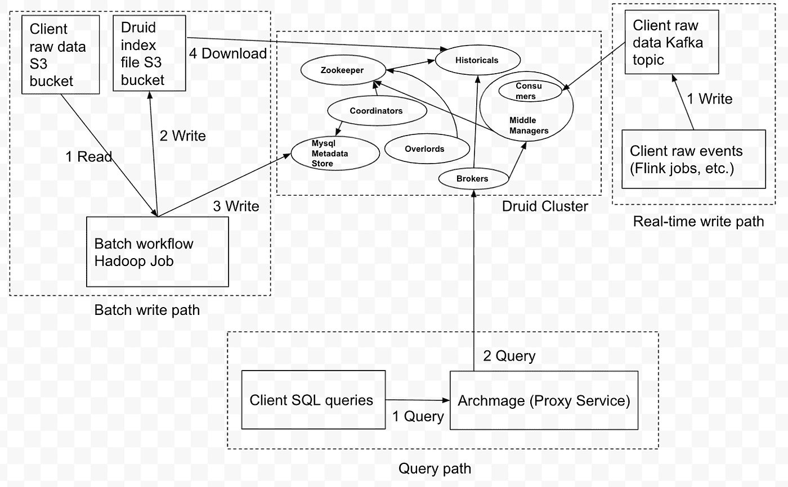

# 作为德鲁伊平台的 Pinterest 分析(第 1 部分，共 3 部分)

> 原文：<https://medium.com/pinterest-engineering/pinterests-analytics-as-a-platform-on-druid-part-1-of-3-9043776b7b76?source=collection_archive---------2----------------------->

、齐家·古、、伊莎贝尔·塔拉姆、拉克什米·纳拉亚纳·纳马拉、卡比尔·巴贾杰|实时分析团队

这是一个由三部分组成的博客系列。要阅读第 2 部分，请点击此处的。第三部分点击[这里](/pinterest-engineering/pinterests-analytics-as-a-platform-on-druid-part-3-of-3-579406ffa374)。

在这个博客系列中，我们将讨论作为德鲁伊平台的 Pinterest 分析，并分享一些使用德鲁伊的心得。这是博客系列的第一篇，简要介绍了切换到 Druid 的历史、Druid 的系统架构以及优化 Mmap 主机类型的经验。

# 切换到德鲁伊的简短历史

从历史上看，Pinterest 中的大多数分析用例都是由 Hbase 支持的，h base 当时是该公司中一个受到良好支持的关键价值商店。所有报告指标都在每小时或每天的批处理作业中预先计算，转换为关键值数据模型，并存储在 Hbase 中。这种方法在一段时间内运行良好，但最终基于 Hbase 的预计算键值查找系统的缺点变得越来越明显:

*   关键值数据模型自然不适合分析查询模式，在应用程序端需要做更多的工作来进行聚合
*   每当添加新列时，基数就会爆炸
*   预计算所有过滤器组合的成本太高，导致 UI 中的过滤器选择有限
*   随着数据集变得越来越大，Hbase 集群稳定性和运营成本变得越来越难以管理

出于所有这些原因，我们评估并决定采用 Druid 作为 Pinterest 的下一代分析数据存储。从那时起，我们已经开始使用许多关键用例，包括报告合作伙伴和广告商业务指标、有机 pin 统计、实验指标、垃圾邮件指标分析等。该基础架构由多集群设置中的 2，000 多个节点组成(最大的离线用例覆盖超过 1 PB 的数据)，最大的在线用例服务 1000 多个 QPS(P99 延迟低于 250 毫秒)。

# 体系结构

Figure 1: Overall System Architecture

摄取是一种 lambda 架构，其中:

*   每天/每小时的批处理管道将 S3 上的输入数据转换成 Druid 格式的索引文件，并将相应的元数据记录插入 MySQL 写回 S3
*   流式管道使用 Kafka 的主题，上游客户端服务实时将事件放入其中

查询通过一个名为大法师的代理服务进行。公司中的大多数微服务都通过 Thrift RPC 调用相互通信，而 Druid 只接受 HTTP，所以我们在 Druid 上添加了一个 thrift server 大法师来处理这种差异。同时，代理还简化了服务度量、查询重写、暗读、速率限制等。

# 关于优化 Mmap 主机类型的学习

我们知道，当一个查询进来时，历史进程通过 Mmap 从要查询的数据段中检索部分数据。通过提供一些偏移量和长度，这在由段文件备份的字节数组的理想化抽象上操作。操作系统负责确保字节数组中引用的偏移量在 RAM 中。如果不是，它将触发一个主要页面错误，将包含数据的一个或一系列页面加载到 RAM 中，这是一个开销很大的磁盘操作。另一方面，如果字节数组中引用的偏移量之前已经被访问过并且没有被逐出，那么它驻留在 RAM 的磁盘缓存(也称为页面缓存)部分。然后，触发一个小的页面错误，将页面缓存中的页面链接到 Druid 进程的虚拟内存中的页面，这是一个轻量级得多的操作，不涉及磁盘读取。在引入不同使用案例的过程中，我们评估了不同工作负载的不同主机类型，并根据所需的磁盘访问量，决定使用内存优化或 IO 优化的主机类型。

# 内存优化的主机类型

对于 Pinterest 中的低延迟用例，我们试图通过为主机提供足够大的内存来将所有频繁访问的段放入页面缓存中，从而最大限度地减少磁盘读取。如果使用 AWS，我们选择内存优化的主机，例如 R 系列。经验法则是，磁盘上段的大小和页面缓存的可用 RAM 之间至少要有 1:1 的映射。每个历史节点的可用页面缓存大小的计算方法是，主机中的总 RAM 减去 Druid 进程的最大堆和直接分配内存，再减去主机中其他侧柜使用的 RAM。随着时间的推移，随着查询的到来，由主要页面错误导致的初始磁盘读取会消失，因为所有数据段都会逐渐缓存到页面缓存中。

当每小时或每天下载新的数据段时，这个过程将再次开始，我们将看到性能下降，直到这些数据段被完全缓存。为了提高性能的可预测性，我们采用了预缓存方法。由于操作系统管理页面缓存的方式，如果磁盘上的段文件被任何进程(甚至来自非 Druid 进程)的读取系统调用遍历，操作系统将在还有空间的情况下将其加载到 RAM 的页面缓存部分，以便以后对段文件的任何读取系统调用都可以触发较小的页面错误，从而避免磁盘读取。我们利用这种机制，让历史进程中的线程池在历史进程第一次将一个线程下载到本地磁盘时遍历整个段文件。

# IO 优化的主机类型

在以下情况下，内存优化的主机类型并不适合:

*   数据量太大，我们无法提供足够的 RAM 来缓存每个数据段
*   用例本身是离线的，不需要亚秒级的延迟

当我们对包含大约 1PB 数据的实验度量进行离线用例时，我们得到了具有上述特征的用例的最佳实践。

最初，我们尝试了具有大 EBS 卷的内存优化主机类型。我们认为使用更大的 RAM，我们至少可以从缓存比主机类型更多的段中受益；更小的内存和性能结果并不令人满意。深入研究后，我们发现对于每个查询，都有许多段需要扫描，远远超过页面缓存所能容纳的数量，而且几乎每次都不一样。因此，之前在页面缓存中的任何内容都将被逐出，性能主要由磁盘读取性能决定。Druid 将段抽象成一个字节数组，并依靠 mmap 从磁盘中只获取(按需)字节数组的特定部分，而不是所有的段数据(例如，给定过滤器的某个维度的位图索引的某个部分)。这相当于为一个段加载一个或一系列页面，然后移动到另一个段，直到处理完查询所需的所有段。对于大多数公司的架构，4KB 是最小的页面大小。

总之，经验法则是，如果预期有磁盘访问，则使用具有高 4KB 页面大小随机读取 IOPS 的主机类型。对于 AWS，具有实例上 SSD 的主机类型工作得最好:i3 比 i3en 好，并且都比连接 EBS 磁盘的任何其他实例类型好得多。我们最终选择了 i3en，它在价格和性能之间取得了平衡，是该公司最具成本效益的用例之一。

# 未来的工作

我们将不断改进架构，以满足新的用例需求:

*   向数据节点添加 AZ 感知段分配以提高可用性
*   评估基于 ZK 的细分市场发现的替代方案，以便更好地适应大型使用情形
*   评估替代摄取解决方案，以提高效率或降低维护成本

我们还计划探索更多的主机类型，以提高不同场景的成本效益。我们将探索具有增强 EBS 吞吐量的主机类型、具有 AWS Graviton 处理器的主机类型等。

# 承认

当我们开始反馈我们的工作时，我们从德鲁伊公会与 Ads 数据团队的讨论以及来自开源社区的反馈中学到了很多。我们还要感谢所有与我们合作将其使用案例纳入统一分析平台的团队:洞察团队、核心产品数据团队、测量团队、信任与安全团队、广告数据团队、信号平台团队、广告服务团队等。每个用例都是不同的，该平台自诞生以来已经发展了很多。

*要在 Pinterest 了解更多工程知识，请查看我们的* [*工程博客*](https://medium.com/pinterest-engineering) *，并访问我们的*[*Pinterest Labs*](https://www.pinterestlabs.com/?utm_source=medium&utm_medium=blog-article&utm_campaign=wang-et-al-august-19-2021)*网站。要查看和申请空缺职位，请访问我们的* [*职业*](https://www.pinterestcareers.com/?utm_source=medium&utm_medium=blog-article&utm_campaign=wang-et-al-august-19-2021) *页面。*