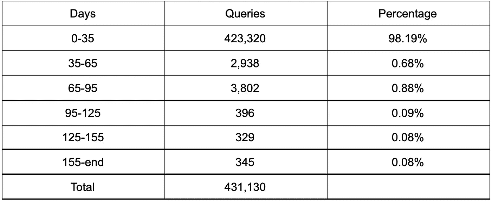
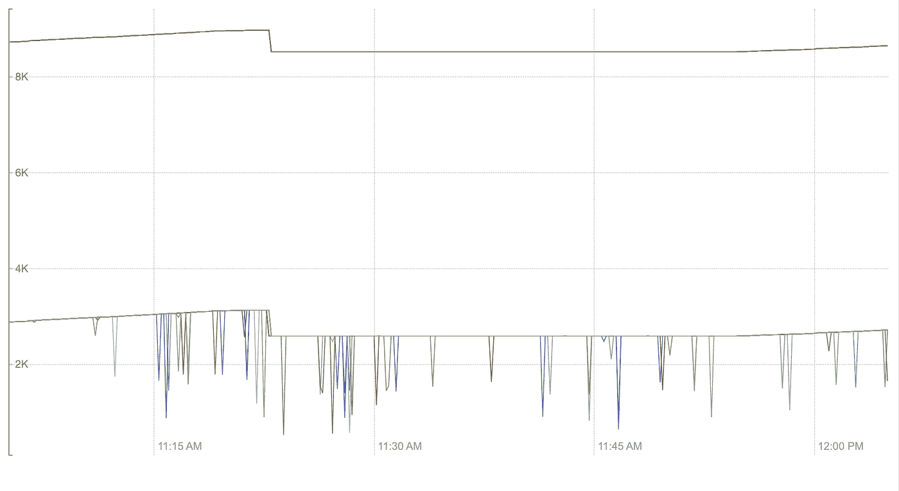
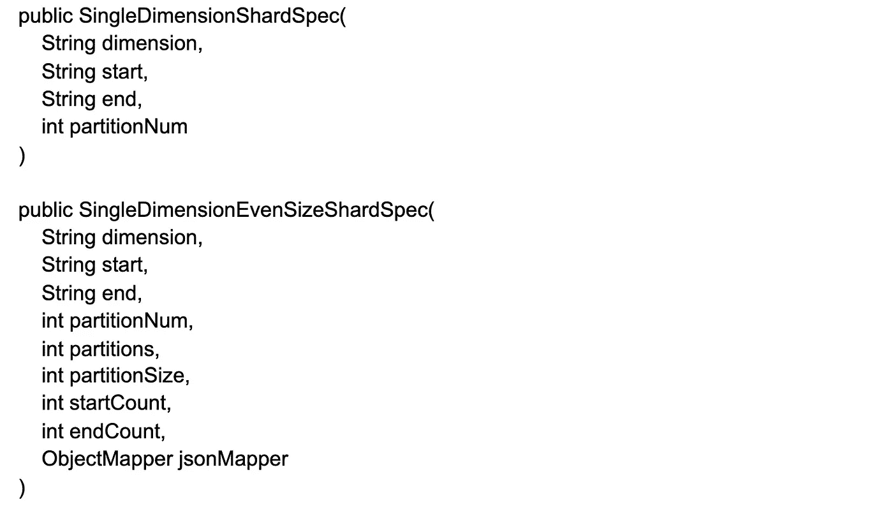
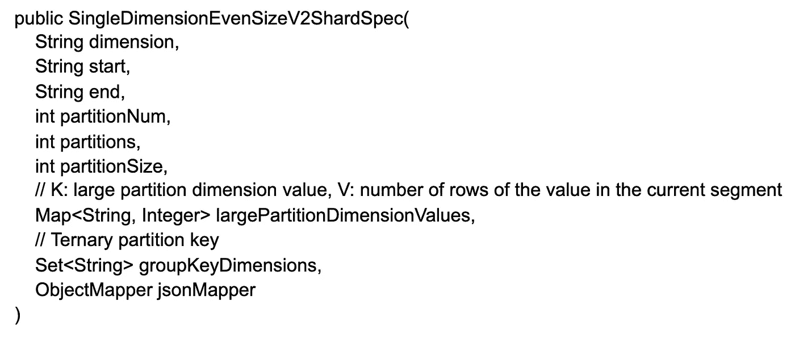

# 作为德鲁伊平台的 Pinterest 分析(第 2 部分，共 3 部分)

> 原文：<https://medium.com/pinterest-engineering/pinterests-analytics-as-a-platform-on-druid-part-2-of-3-e63d5280a1a9?source=collection_archive---------4----------------------->

、齐家·古、、伊莎贝尔·塔拉姆、拉克什米·纳拉亚纳·纳马拉、卡皮尔·巴贾杰|实时分析团队

这个系列由三部分组成。要阅读第 1 部分，请点击此处的。第三部分，点击[这里](/pinterest-engineering/pinterests-analytics-as-a-platform-on-druid-part-3-of-3-579406ffa374)。

在这个博客系列中，我们将讨论作为德鲁伊平台的 Pinterest 分析，并分享一些使用德鲁伊的心得。这是博客文章系列的第二篇，将讨论如何为批量用例优化 Druid。

# 关于为批量用例优化 Druid 的学习

## 系统可见性

在引入不同用例的过程中，我们发现 Druid 中缺少许多关键的系统指标。作为回应，我们增加了处理线程、合并缓冲区、内存中行等的使用指标。，帮助我们更清楚地了解影响容量配置的瓶颈，并找出改进的机会。

## 基于请求模式的分层

Druid 支持基于段时间戳将段加载到不同的服务器池中，更高端的主机可以用来服务更频繁访问的段。最初，除了客户端提供的启发式信息，我们没有对请求时间范围分布进行定量分析，因此分层有些随意。后来，我们将所有 Druid 请求记录到一个数据源中进行分析，这帮助我们在分层方面做出更明智的决策。下面是我们用来将所有六个月的数据段加载到内存优化主机中的一个用例示例。在查询模式分析之后，我们发现 98%的请求命中最近 35 天，因此我们将 35 天之前的数据段转移到基于 io 优化的主机，而不影响 SLA，同时节省基础架构成本。

Table 1: Use case 1 request time range distribution

## 辅键修剪

默认情况下，Druid 使用时间戳作为划分段的主键。如果在摄取过程中使用基于哈希的分区或单维分区，则可以通过所选的维作为二级键对数据进行进一步分区。在查询期间，Druid 使用一个两层的查询架构，其中代理计算出要扫描哪些数据段，并将请求分散到托管它们的数据节点。当使用带有辅键的分片规范时，代理不仅可以基于时间戳(主键)还可以基于分区维度(辅键)来修剪段。这增加了跳过向数据节点发送请求以扫描保证返回空结果的段的机会，并节省了数据节点上宝贵的处理线程。我们使用基于散列的分区，因为它很简单。但是我们后来发现，它不像单维分区那样在查询时使用辅键。在我们添加了缺少的逻辑以使用二级键后，要扫描的段数下降了 3 倍，这大大减轻了数据节点的负担。

Figure 1: Use case 2 number of segments to scan

## 优化倾斜数据的分区

基于散列的分区对于一般的批处理用例来说工作得很好，但是当我们使用典型查询包含给定 partner_id 的业务报告用例时，它显示出了缺点。我们通过 partner_id 对数据进行哈希处理，以减少查询时要扫描的数据段。我们看到一些 id 的数据量比其他 id 多得多，前 20 个 id 的数据占总数据的 90%以上，即使总 id 的基数是数百万。这几十个大合作伙伴恰好是公司最大的客户，我们不能简单的忽略他们。在摄取作业中，单个缩减器负责创建单个数据段，大型合作伙伴的存在会导致长尾摄取延迟，从而创建比其他数据段大得多的一些数据段。同时，在查询期间，即使大多数合作伙伴的查询工作正常，但几十个大型合作伙伴的查询速度很慢，甚至超时(对于我们的用例来说是 5 秒)。由于 Druid 中的基本处理单元是一个段，并且它只由单线程处理，所以我们无法加速这个过程，除非我们能够将大伙伴的数据分布到多个段中。

在寻找解决方案时，我们发现现有的基于散列或基于单维的分区都不能根据给定 id 的行数将数据分布到多个段中。因此，我们基于上述目标创建了一个定制的碎片规范。我们借鉴了现有的一维碎片规范，这与我们的需求非常相似:摄取工作流包含一个统计计算作业，它在汇总之后和实际索引作业之前计算每个 id 的行数。我们修改了逻辑，将行填充到一个段，直到它达到预定义的段大小阈值，并将剩余的行放入下一个段，直到一个 id 的所有行都完成。一些额外的元数据字段，如 partitionSize、startCount 和 endCount 等。，被添加到自定义碎片规范中，以帮助进行摄取分配和查询时间代理端修剪。

通过这一改变，我们能够产生大小均匀的段，并将段中每个 id 的行数限制在预定义的段大小(例如，5 百万)。摄取尾部延迟问题得到了解决，对于大多数大型合作伙伴来说，查询性能变得更好了(除了少数仍然超时的大型合作伙伴)。

经过更多的分析，我们发现许多大的合作伙伴填满了一个细分市场中的全部 500 万行。假设在数据节点中用单线程处理 500 万行是很快的，但对于我们的用例来说，这似乎并不正确。对于我们刚刚讨论的偶数大小的定制碎片规范，段大小阈值是唯一的旋钮，进一步降低它会产生大量的段，并对其他 id 产生不必要的影响。然后，我们增强了之前的自定义碎片规范，添加了另一个旋钮，这是一个阈值，用于限制一个 id 在一个段内的行数，与段大小阈值无关。因为不同的大型 id 的数量通常很少，所以我们能够在 shard 规范中单独存储每个大型 id。

通过这一改变，我们能够进一步减少大合作伙伴的延迟，而不会产生更多的细分市场或影响小合作伙伴的性能。同时，我们发现我们用例的许多查询都是分组查询，所以数据节点上的主要工作是获取段中所有可用的组，并传输回代理进行排序和合并。我们还发现，在最昂贵的分组查询中，分组维度的基数约为几十万。因此，当合作伙伴 id 的数据需要跨越多个段时，我们添加了一个三元分区键作为最昂贵的 group-by 查询中的 group-by 维度，以将同一组的数据散列到同一段，从而确保完美的接收时间累积，提高数据局部性，减少网络传输，并减少代理端的最终工作量。

有了增强的偶数大小定制碎片，我们能够减少除最大合作伙伴之外的所有大型合作伙伴的延迟。深入研究后，我们发现最大的合作伙伴在每天汇总后包含大约 2 亿行。即使我们能够通过增强的偶数大小分区减少花费在数据节点上的时间，代理仍然会是瓶颈，因为单个主机不足以合并从数据节点返回的大量中间结果，即使是多线程。我们还尝试通过启用 config forceLimitPushDown，首先在数据节点上获得一个近似的本地前 N 名结果，来减少代理为昂贵的分组查询所做的工作，但是在代理端仍然有太多的行需要聚合。最终，我们意识到，对于最大的合作伙伴，我们将无法在超时阈值(5 秒)内返回，除非我们在现有的两层(代理作为单个根，数据节点作为无限数量的叶)中间向当前的聚合模型添加另一个聚合层。最后，我们决定跳过对最晚日期的查询，等待一个具有某种形式的汇总的数据集，该数据集在一两天后到达最大的合作伙伴，作为一种临时解决办法。

最后，我们还发现，当输入大小很大时，实际索引作业之前的统计计算作业非常慢，在某些情况下，由于 map reduce 作业之间昂贵的磁盘操作，它需要 10 个多小时才能完成，这使它无法使用。实际上，将逻辑表示为一系列 map reduce 作业是很困难的；然而，这在 SQL 中非常简单:count distinct group-by 查询。我们通过在外部 SparkSql 作业中生成与原始 map reduce 作业输出相同格式的统计数据来对此进行优化，该作业在大约 15 分钟内完成，而之前需要大约 10 个小时。

# 未来的工作

我们计划增加系统指标的可见性，以帮助我们充分利用主机类型，自动化所有用例的请求模式分析，以帮助我们降低效率，将碎片规范整合为一个完善的规范，以减少维护多个规范的负担，并实施多层聚合模型，以减少最昂贵的查询的延迟。

# 承认

当我们开始反馈我们的工作时，我们从德鲁伊公会与 Ads 数据团队的讨论以及来自开源社区的反馈中学到了很多。我们还要感谢所有与我们合作将其使用案例纳入统一分析平台的团队:洞察团队、核心产品数据团队、测量团队、信任与安全团队、广告数据团队、信号平台团队、广告服务团队等。每个用例都是不同的，该平台自诞生以来已经发展了很多。

*要在 Pinterest 了解更多工程知识，请查看我们的* [*工程博客*](https://medium.com/pinterest-engineering) *，并访问我们的*[*Pinterest Labs*](https://www.pinterestlabs.com/?utm_source=medium&utm_medium=blog-article&utm_campaign=wang-et-al-august-26-2021)*网站。要查看和申请空缺职位，请访问我们的* [*职业*](https://www.pinterestcareers.com/?utm_source=medium&utm_medium=blog-article&utm_campaign=wang-et-al-august-26-2021) *页面。*