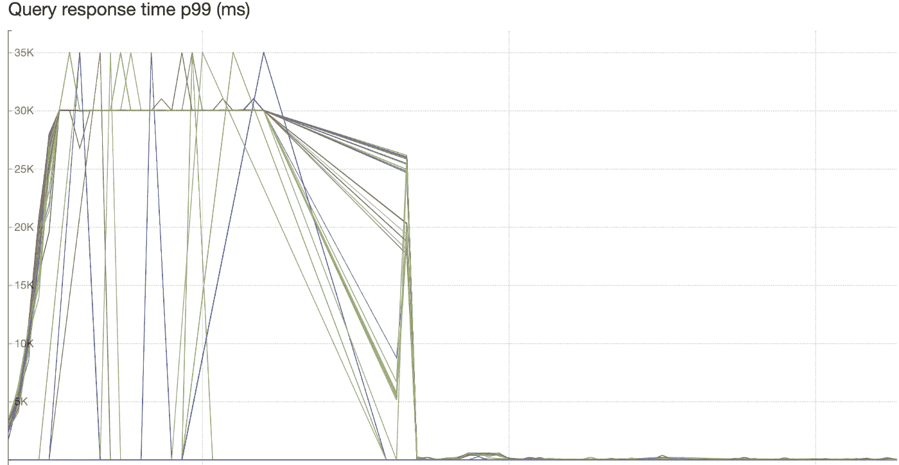
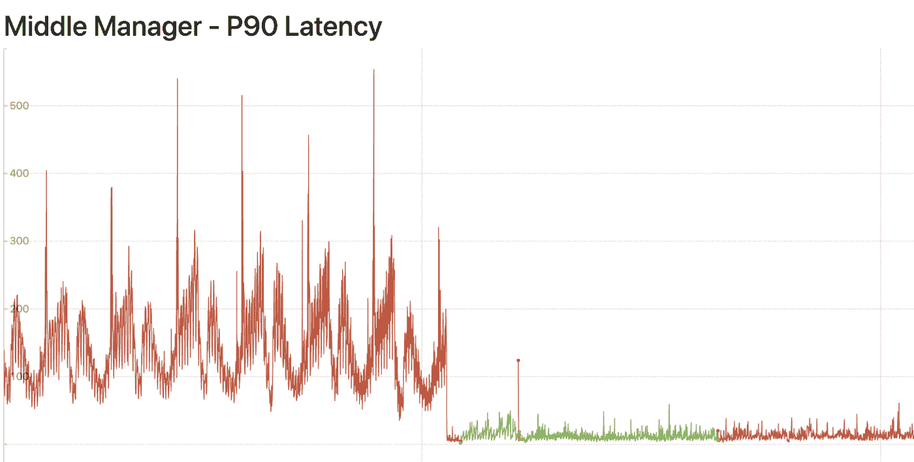
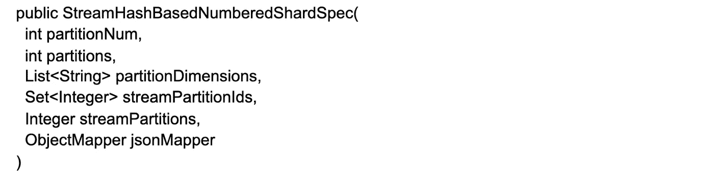
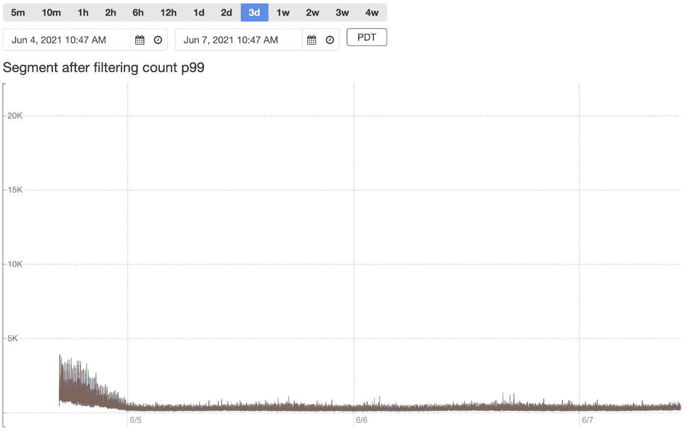
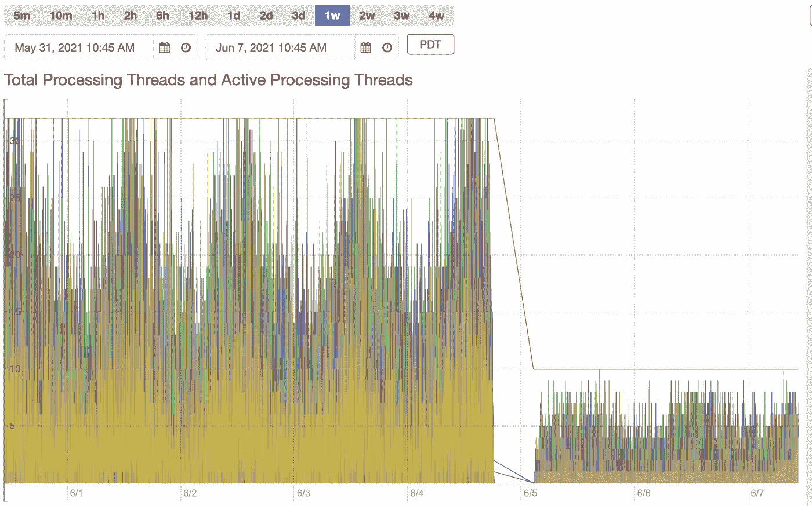
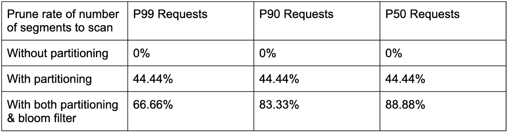

# 作为德鲁伊平台的 Pinterest 分析(第 3 部分，共 3 部分)

> 原文：<https://medium.com/pinterest-engineering/pinterests-analytics-as-a-platform-on-druid-part-3-of-3-579406ffa374?source=collection_archive---------3----------------------->

、齐家·古、、伊莎贝尔·塔拉姆、拉克什米·纳拉亚纳·纳马拉、卡比尔·巴贾杰|实时分析团队

这是一个由三部分组成的博客系列。点击阅读[第一部分](/pinterest-engineering/pinterests-analytics-as-a-platform-on-druid-part-1-of-3-9043776b7b76)和[第二部分](/pinterest-engineering/pinterests-analytics-as-a-platform-on-druid-part-2-of-3-e63d5280a1a9)。

在这个博客系列中，我们将讨论作为德鲁伊平台的 Pinterest 的分析，并分享一些使用德鲁伊的心得。这是博客文章系列的第三篇，将讨论针对实时用例优化 Druid 的学习。

# 关于为实时用例优化 Druid 的学习

当我们第一次将 Druid 引入 Pinterest 时，它主要用于查询批量获取的数据。随着时间的推移，我们已经转向基于实时的报告系统，以使指标在到达后几分钟内准备好供查询。用例越来越多地采用 lambda 架构，除了真理批处理管道之外，Flink 上还有流管道。这给 Druid 上的报告层带来了一个巨大的挑战:我们搭载的最大的实时用例有以下需求:上游流 ETL 管道产生的 kafka 主题 Druid 使用超过 500k QPS，并期望 Druid 上的摄取延迟在一分钟之内。预期的查询 QPS 约为 1，000，P99 延迟约为 250 毫秒

## 内存位图

在使用用例的过程中，我们首先遇到了为运行在中层管理人员 peon 流程上的实时片段提供服务的瓶颈。最初，为了满足 SLA 的要求，增加了大量的主机，但是基础架构成本很快变得与收益成非线性关系。此外，由于有如此多的任务计数和副本，在处理细分元数据时，霸王在处理来自 peons 的请求方面压力很大。需要大量主机来提供足够的处理线程，除非每个处理线程的工作(扫描数据段)变得更加高效，否则无法减少主机数量。我们进行了分析，发现实时段的查询逻辑效率很低:当数据第一次被接收到实时层时，它首先被放入内存映射中，该映射没有批量接收的 druid 段所具有的倒排索引，这意味着对实时段的每个查询都将对每一行进行完全扫描，以获得要聚合的候选行。对于我们的大多数用例来说，每个查询要聚合的候选行只占细分行总数的很小一部分。然后，当查询未持久化的实时段时，我们实现了内存位图。这导致我们所有实时用例的中层管理人员能力减少了近 70%,同时提供了更好的延迟。

Figure 1: Use case 1 P99 latency reduction on Middle Managers

Figure 2: Use case 2 P90 latency (ms) and infrastructure cost reduction on Middle Managers

## 分区实时段

在添加内存位图后，我们在减少处理单个段的 CPU 方面取得了很好的改进。然而，我们发现我们仍然无法处理线程，因为由于数据段未被分区，需要处理大量的数据段。当实时片段由中层管理人员提供服务时，以及当片段在压缩作业几个小时后开始之前由历史片段完成并提供服务时，这是一个问题。我们的用例具有许多延迟事件的性质，时间戳跨越过去 48 小时。这给德鲁伊造成了很大的负担，因为每小时创建的段的数量与我们接受的延迟消息时间窗口的数量成正比。经过一些基准测试后，客户同意使用 3 小时的延迟消息接受窗口来捕捉大多数事件。这比之前的 48 小时延迟消息窗口要好，但仍然对系统提出了很大的挑战。当 QPS 很高时，常数乘数很重要。假设我们需要 250 个任务来将接收延迟保持在 1 分钟以内，延迟 3 小时的消息窗口，当前小时的段数至少为 250 * 3 = 750。每个单个查询需要扫描 750 个段，对于 1000 QPS，每秒扫描的段数约为 750 * 1000 = 750000。Druid 中的每个段都由单个处理线程处理，处理线程的典型数量被设置为等于主机中可用 CPU 的数量。从理论上讲，我们需要 750000 / 32 = 23437 台 32 核主机，以避免任何数据段排队，但基础架构成本将无法控制。

实际上，效率在于事件分散在所有片段中。对于 Pinterest 中的大多数实时用例，每个查询都带有一个 id 来过滤，例如 pin_id，因此如果我们可以根据 id 划分段，这将为我们提供一个机会来修剪段并限制查询扇出。在批量摄取中，分区是可能的，因为我们可以在摄取过程中进行任意混合，而在实时摄取中，摄取到每个部分的数据基于 peon 过程中每个消费者被分配到的 kafka 分区。所以我们让上游流处理器使用定制的 kafka 密钥分割器。分区是在基于哈希的机制中完成的，实时段采用了相应的自定义碎片规范，该规范还包含创建该段的 kafka 分区的元数据。在查询期间，代理可以在过滤器中重新散列 id，以确定给定的段是否可能包含该 id 的数据。id 的散列产生一个 kafka 分区，从而产生一个段。有了这一点，每个段要扫描的段数减少了 250 倍，从最初的要扫描的段数/任务数(750000)降至 750000 / 250 = 3000 段，这需要 3000 / 32 = 93 台 32 核主机，比以前更易于管理。

作为后续工作，我们还扩展了自定义碎片规范，增加了另一个字段 fanOutSize，用于将给定的分区维度值散列到多个段，以解决未来用例中潜在的数据偏斜问题。

## 实时段上的布隆过滤器索引

对于分区的实时段，查询段扇出显著下降；但是所需的 CPU 数量仍然很高。上面计算中要查询的 3000 个片段仅针对一个小时。我们的实时用例的典型查询要求从现在到 24 小时前的数据。由于各种原因，在压缩开始之前需要 8 小时来压缩 8 小时前的实时数据段。到那时，要查询的数据段数量将减少 3 倍，因为由延迟事件引入的 3 个数据段已被压缩，因此 8 小时之前的数据段所需的 CPU 数量将大大减少。另一方面，对于最近的 8 小时部分，3000 * 8 = 24000 需要 24000 / 32 = 750 台 32 核主机。

随着对查询模式进行更多的分析，我们发现尽管过滤器中的 id 基数很大，但并不是所有的 id 在给定的时间内都有新数据。基于哈希的实时段分区没有足够的元数据来进行单个 id 级别的存在性检查，因为哈希将导致至少一个段可能包含数据，而实际上该段在大多数情况下没有任何数据要返回。对于高 QPS 和晚事件，在一个扫描段上的假阳性很重要。

我们没有找到一个好的方法来解决上述问题的实时段服务于中层管理人员。他们不断有新的数据流入，我们不知道具体 id 的数据是否会到达，直到片段最终完成并发布到 historicals。同时，因为基于片段的碎片规范中的元数据的修剪逻辑在代理上被调用，而关于片段中的数据的最新信息在 peons 上是已知的，所以如果元数据不正确，就没有办法在两个不同的组件之间实时同步片段中的特定 id。由于这只有一个小时，我们没有触及未完成的部分。

另一方面，在最终确定 peons 的实时细分市场时，我们对细分市场中的数据有充分的了解。因此，我们在 shard 规范中添加了元数据——当段由中层管理人员提供服务时，代理最初会忽略这些数据，但后来当 historicals 加载段的最终版本时，这些数据会被提取出来。对于特定的元数据，我们使用了一个 bloom 过滤器来存储 id，这是一个很好的平衡大小和准确性的概率结构。对于段中一百万基数的 id，只需要几个 MB 就可以获得 3%的预期误报率。通过这一改变，我们能够在过去的 8 小时内将扫描的段数减少 5 倍。上面计算出的所需 CPU 数量变成了 750 / 5 = 150 台 32 核主机，这比以前更具成本效益。

Figure 3: Use case 1 number of Segments to Scan

Figure 4: Use case 1 processing thread usage on historicals

Table 1: Use case 2 prune rate of number of segments to scan

# 未来的工作

仍有许多方面需要改进，包括但不限于持续压缩、Kafka 主题缩放事件兼容实时分区、大任务计数和晚期消息窗口可伸缩性改进等。与此同时，我们也将更加积极地开源我们迄今为止开发的内容。

# 承认

当我们开始反馈我们的工作时，我们从德鲁伊公会与 Ads 数据团队的讨论以及来自开源社区的反馈中学到了很多。我们还要感谢所有与我们合作将其使用案例纳入统一分析平台的团队:洞察团队、核心产品数据团队、测量团队、信任与安全团队、广告数据团队、信号平台团队、广告服务团队等。每个用例都是不同的，该平台自诞生以来已经发展了很多。

*要在 Pinterest 了解更多工程知识，请查看我们的* [*工程博客*](https://medium.com/pinterest-engineering) *，并访问我们的*[*Pinterest Labs*](https://www.pinterestlabs.com/?utm_source=medium&utm_medium=blog-article&utm_campaign=want-et-al-september-2-2021)*网站。要查看和申请空缺职位，请访问我们的* [*职业*](https://www.pinterestcareers.com/?utm_source=medium&utm_medium=blog-article&utm_campaign=want-et-al-september-2-2021) *页面。*