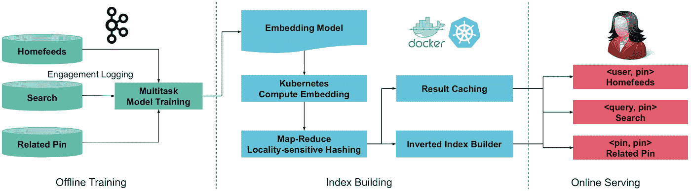
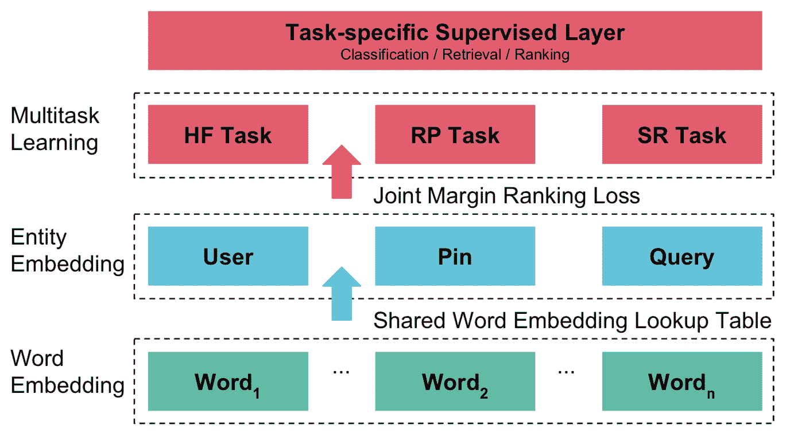
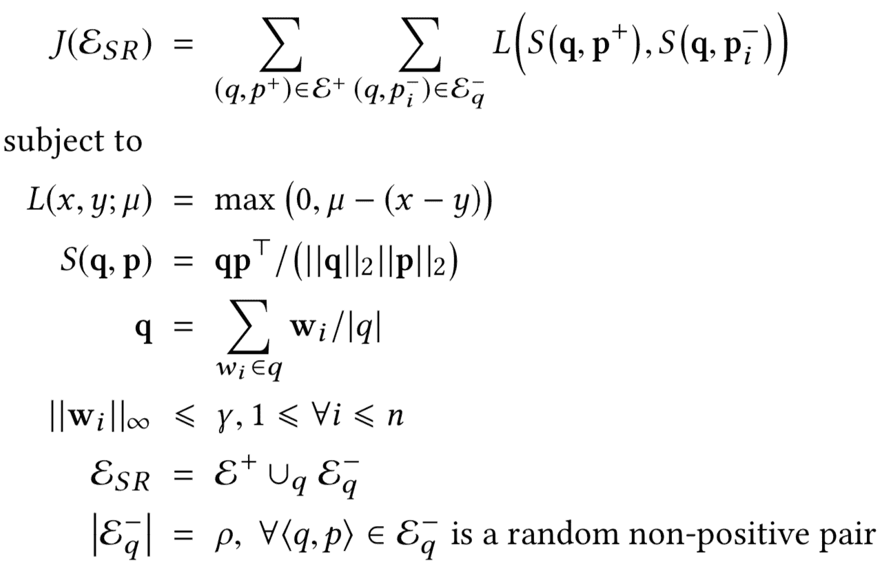
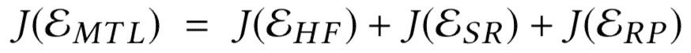
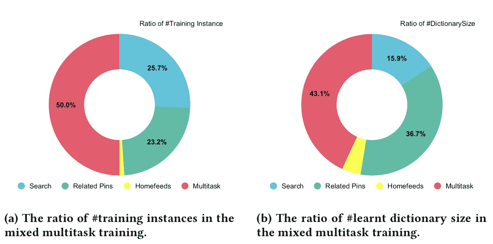
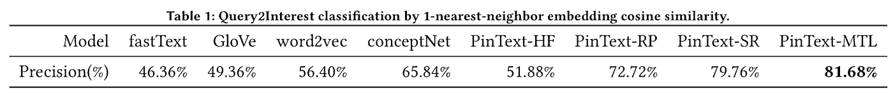
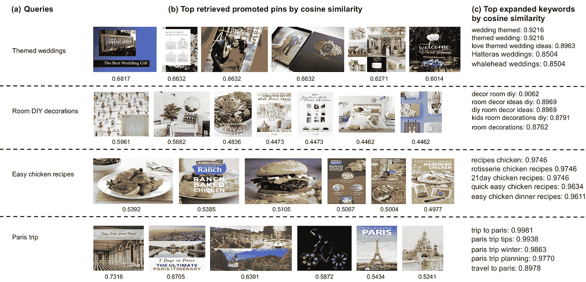

# PinText:Pinterest 中的多任务文本嵌入系统

> 原文：<https://medium.com/pinterest-engineering/pintext-a-multitask-text-embedding-system-in-pinterest-b80ece364555?source=collection_archive---------0----------------------->

**庄金凤|软件工程师，内容知识**

自从神经网络语言模型被提出以来，机器学习社区中的研究人员和实践者已经积极地研究和开发了单词嵌入。研究人员不仅提出了原则性的算法和开源代码，而且他们还发布了预训练的嵌入模型，这些模型带有维基百科、推特或谷歌新闻等公共数据语料库。众所周知，高质量的单词表示通常对文本分类或其他一般任务贡献最大。

在 Pinterest 中，文本数据更多的是关于具体的注释术语和短语，而不是长句和段落，这使得 word embedding 成为比复杂的神经网络架构更基本的组件，用于特定的任务。虽然预先训练的单词嵌入提供了良好的基线，但我们确实观察到工业应用和学术研究之间存在明显的差距，包括存储成本、内存成本、监督信息的可用性、吞吐量和延迟。这些差距促使我们在实际系统层面上进行文本嵌入。我们的主要设计目标包括:

*   使用监督信息，而不是像 word2vec 那样的无监督共现风格的单词嵌入。
*   做单词级而不是字符级的嵌入，确保学习到的嵌入字典可以在需要的时候加载到内存中。
*   学习所有下游任务的共享单词嵌入，而不是与特定应用程序耦合的端到端嵌入。
*   最终替换所有开源嵌入，以节省维护成本。

我们在 Pinterest 上有三个界面:主页、相关的大头针和搜索。使用多任务学习(MTL)将所有信息结合在一起，使学习到的模型更好地泛化，是一种直观的选择。用户参与每项任务自然会提供监督信息。在我们学习了这些信息的嵌入之后，我们使用 Kubernetes+Docker 解决方案或 map-reduce 系统进行大规模批量计算。我们还可以为在线搜索构建嵌入标记的倒排索引。图 1 展示了文本嵌入解决方案的高级架构。图 2 展示了三个表面、一个特定的用户配置文件和一个 Pin。

Figure 1: A simplified representation of the PinText architecture consists of offline training, index building, and online serving. Left: We use Kafka to collect users’ engagement data to construct training data. Middle: We use locality-sensitive hashing (LSH) to compute embedding tokens and build an inverted index for each Pin. Embedding vectors and k-nearest neighbors (KNN) results can be cached. Right: Use LSH tokens of embedding vectors to retrieve Pins, and use embedding similarity in the ranking model.

Figure 2: Examples from the Pinterest iOS app of two core concepts: user (a) and Pin (b). Figures (c,d,e) presents examples of home feed, related Pin, and search for this particular user and the idea “Alaska train ride”. When users save and click content, we receive positive votes via the logging system. The learning task is to mine the semantic text embeddings behind such operations. Note we know voting results, but we don’t know who voted throughout this work.

在下面的讨论中，让 HF、RP 和 SR 分别表示本地馈送、相关的 Pin 和搜索任务。每个训练实例是每个任务中的一对实体<q p="">。具体来说，</q>

*   在 SR 中，q 是搜索查询，p 是 Pin。我们提取 Pin 的标题和描述作为 Pin 的文本。参考图 2(b)作为例子。
*   在 RP 中，q 是主题 Pin，p 是相关 Pin。
*   在 HF 中，q 是由我们的个性化团队导出的用户兴趣文本，p 是 Pin。

我们使用实体的关联单词嵌入的平均值作为整体实体嵌入。然后，学习目标是使正实体对的嵌入的余弦相似性大于具有随机采样的背景实体的配对的余弦相似性。我们使用 Pin 保存和点击来定义正对。以 SR 任务为例，可以通过用户在搜索查询 q 的结果中保存或点击 Pin p 来定义肯定训练数据对<q p="">。</q>

Figure 3: Simplified architecture for the multitask word-embedding model

图 3 显示了学习架构的概况。现在我们来给出上述概念的数学表述。设 **D** ∈ Rⁿ×d 表示学习过的字典，其中 n 为单词数，d 为嵌入向量的维数。给定一个词 wᵢ，我们通过恰好取 **wᵢ** ∈ Rᵈ为 **D** 的第 I 行，推导出它的嵌入函数 F(wᵢ) = **wᵢ** 。我们通过平均实体 q 的单词嵌入来计算实体 q 的嵌入。注意我们使用粗体小写字符来表示嵌入的行向量(例如， **q** := F(q))。为了训练单任务嵌入模型，我们通过强制在涉及 q 的正对< q，p⁺ >上的相似性大于在几个随机采样的背景对< q，p⁻ >上的相似性来定义目标函数 j(ɛ。以搜索任务为例(q 为搜索查询):

其中ρ负采样率、μ秩余量损失和嵌入向量的γ半径是通过实验调整的超参数。我们将 L 和 S 分别固定为铰链损失和余弦相似度。这样，我们实现了上面的目标函数设计目标。对于一个特定的实体 q，我们强制它与一个肯定实体的相似性 x 比它与一个随机的否定实体的相似性 y 大一个差值μ。否则会引入损耗μ(x y)。这里的启发是，一个好的语义嵌入应该捕捉用户的参与度。

多任务学习目标函数是 3 个学习任务的简单集合，其中所有任务共享相同的单词嵌入查找表(如图 3 所示):

利用这个 MTL 目标函数，我们可以对嵌入字典 **D** 中的每个条目应用梯度下降，以直接学习单词嵌入。

Figure 4: Breakdown of the contribution of each task.The Multitask training data is the distinct union of the three single tasks.

我们通过 KNN 查询 2 兴趣分类来评估这个 PinText 嵌入，其中我们为一个搜索查询预测一个感兴趣的术语列表。该任务的标签数据示例为:{查询:*木纹橱柜厨房*，标签:[ *__label__home_decor，_ _ label _ _ DIY _ and _ crafts*}。我们基于各种文本嵌入模型计算查询和兴趣嵌入，然后使用最近的兴趣作为预测。事实证明，这种监督模型明显优于预先训练的非监督模型。它也明显优于单任务 PinText 学习。请注意，PinText-MTL 仅比 PinText-SR 精确 2%(表 1 ),但在单词覆盖率方面的收益要大得多，这意味着它在其他场景中的表现甚至会更好。参考图 4(b ),了解每个任务的令牌贡献。

通过学习单词嵌入字典，我们能够导出实体嵌入，并在上面使用 KNN 搜索进行检索。我们还使用文本术语作为索引标记。然而，有时复杂实体上的文本表示有一些限制:

*   完整性:一些术语在语义上彼此接近，但拼写完全不同。对于长尾查询，往往很难在候选项中找到术语。
*   紧凑性:一个用户或 Pin 可能有数百个注释术语。很难用具体的文本术语来概括这样一个复杂实体的主题。冗长的文本表示会导致歧义。
*   连续性:当部分匹配发生时，我们需要一种定量的连续方式来定义我们是否应该为特定查询返回候选项。

Pinterest 擅长视觉搜索，显示许多可能的灵感想法，而不是为事实问题提供具体答案。这种开放式查询的性质使得上述问题更加明显。使用文本嵌入模型，每个实体可以被压缩成固定长度的实向量，这在统一的宇宙中提供了紧凑的语义表示。因此，我们可以通过这个公共空间中的相似性度量将查询与候选项进行匹配，而不是依赖于精确的术语匹配，这在很大程度上解决了紧凑性和完整性问题。相似性得分可以用作以自然方式过滤候选对象的连续度量，或者用作监督模型中的区别特征。请参见下面图 5 中的广告检索示例。

Figure 5: Examples of PinText-based retrieval and search keyword broad match in Pinterest. These top four queries exhibit the diversity advantage of embedding-based retrieval when the query is not specific or exact term match is not good. The cosine similarity between queries and Pins can also serve as a ranking feature.

我们在这一领域持续投资。平均单词嵌入使得我们的系统简单而高效，但是我们也丢失了诸如单词顺序的信息。由于文本通常是具体的术语，而不是自然语言的句子，因此对其应用 NLP 模型并不简单。我们正在积极开发 PinText 的下一个版本。

*鸣谢:作者要感谢 Pinterest Infra 团队的队友——包括李丽达、刘军、徐素丽和刘——以及 Ads Quality 团队的无缝协作。我们感谢 Stephanie deWet、Mukund Narasimhan、Ou 和 Nick Liu 进行了许多富有成效的讨论。*

> 我们正在建造世界上第一个视觉发现引擎。全世界有超过 2.5 亿人使用 Pinterest 来梦想、计划和准备他们在生活中想做的事情。[来加入我们吧！](https://careers.pinterest.com/careers)