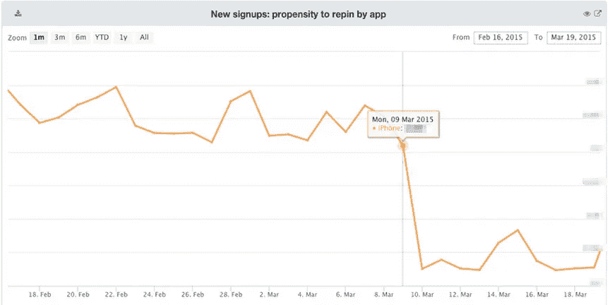

# Pinvestigator:探索实验相关变化的工具

> 原文：<https://medium.com/pinterest-engineering/pinvestigator-a-tool-for-exploring-experiment-related-changes-a58f143f83c?source=collection_archive---------4----------------------->

Alexandra Cong | Pinterest 工程

作为产品科学团队的实习生，我亲身体验了与 A/B 实验相关的指标变化的重要性。在这里，我将详细介绍构建 Pinvestigator，这是一个通过简化访问实验数据的过程并确定它们对 Pinner 增长的影响来快速探索这些变化的工具。你还可以一窥在 Pinterest 做实习生是什么感觉(剧透一下，相当梦幻)。

## 从查看指标开始

我们最重要的业务指标反映了活跃 Pinner 的数量，同时我们还有无数其他关于 Pin ner 行为的图表，跟踪从董事会创建率到兴趣跟踪率再到 Pin 特写率的一切。通常，我们会看一下类似下图的图表(或者注意到来自[异常值电子邮件](https://engineering.pinterest.com/blog/learning-about-your-business-anomalous-metrics)的变化)并问自己，“那里发生了什么？!"。

上图显示了首次使用该产品的新 Pinners 的百分比。显然，在 3 月 9 日和 10 日之间发生了一些激烈的事情。事实证明，这种急剧下降是 A/B 实验的结果。我们进行了很多这样的实验，因为有如此多的实验和指标，确定哪个实验以何种方式影响了哪个指标是一个挑战。为了弄清这个特殊案例的真相，需要一个人注意到变化，与一组人一起找出是哪个实验引起的，然后关掉那个实验。这是一个漫长而复杂的过程，并且依赖于令人不安的运气。随着公司的发展，跟踪正在进行的实验会变得更加困难。另一种方法是查看数据，这可能很费时也很困难。

为了解决这个问题，我们构建了 Pinvestigator，这是一个以快速、简单的方式探索实验相关变化的工具。

## 找到一种方法

第一个挑战是弄清楚这样一个工具应该做什么和如何工作，包括如何使它足够通用以用于各种用例，同时又足够具体以找到有用的信息。我可能应该更有勇气，但我在第一天就是一个目光炯炯、精力充沛的实习生——我可以接受任何事情！我们认为最好的前进方式是首先尝试寻找引起变化的实验，然后确定是否有一种方法可以推广。

我首先研究了几个指标的变化，我们知道哪些实验是原因。这些实验通常分为两类:要么实验的治疗组与对照组相比表现出 Pinner 行为的显著变化，要么实验在 Pinner 的数量上有很大变化(或者有时两者都有)。第一个是当考虑移动度量标准的实验时，你可能会想到什么(毕竟，控制组应该保持不受影响，对吗？)，而第二种方法捕捉使用第一种方法无法发现的实验。

## 建筑物探测器

在这一点上，我感觉很好。一个工具是可能的！我本应该暗自怀疑实现 Pinvestigator 可能很难，但至少我们有一个愿景。我们希望有一个交互式的 web 工具，用户可以输入描述指标变化的信息(今天是什么日子，采取了什么行动等等)。)，之后他们会得到两类结果的列表，一个是导致品纳行为改变的实验，另一个是品纳行为改变很大的实验。

有了如何处理这些数据的想法，主要的问题是从哪里获取数据。Hive 查询具有灵活性，包括按某一天加入的 Pinners 或按执行的操作数量过滤数据。然而，每个查询可能需要 30 分钟，这对于一个响应速度很慢的 web 工具来说是不够的。有了 Hive，用户会收到一封带有结果的电子邮件，这不是一个糟糕的体验，但也不是最好的。另一个选择是 HBase，它没有 Hive 灵活，但速度快得多——可能快得足以成为一个响应迅速的 web 工具。这听起来很诱人。

最后，我想为什么不两者兼得呢？我首先构建了一个快速、交互式版本的 Pinvestigator，它使用存储在 HBase 中的预计算数据来处理最常见的用例，比如用户查看某个动作的数量变化或某一天采取某个动作的 Pinners 的数量变化。然后，我可以添加额外的功能来运行 Hive 作业，并通过电子邮件向用户发送结果，以进行更具体的查询。

不幸的是，像生活一样，软件工程很少按计划进行。我试图使用 HBase 中已经存在的数据，但它太慢了，无法避免我们内部分析网站上 90 秒的网络超时。尽管我已经习惯了快速 web 工具的概念，但我不想只依赖 Hive。一位同事建议将数据预先计算到 HBase 中，这将删除更多的功能，但可能会使它更快。然而，在实施“快速”解决方案后，通常仍需要三分钟或更长时间才能在生产中返回结果。灾难！最终，我决定，如果我要为 Pinvestigator 的速度较慢的蜂巢支持部分发送结果电子邮件，我也可以为 HBase 部分发送结果电子邮件。危机被避免了！我终于有工具可以运送了。

## 有用吗？我们为什么关心？

还记得之前的图表吗？我测试了 Pinvestigator 的这一指标变化(3 月 10 日，iPhone 上新 Pinners 的 repin 率下降)，它返回的第一个实验确实是导致下降的那个实验。没有电子邮件，也不需要手动挖掘数据！不过，Pinvestigator 并不完美。总会有一些实验没有显示出来，或者用户想要查看没有存储在 in Pinvestigator 中的数据。但是，Pinvestigator 是一个很好的工具，可以用来识别一些可能值得进一步研究的实验，并显示某个实验可能不是给定变化的原因。

数据非常强大，但也很困难。Pinvestigator 使任何关心疯狂指标跳跃的员工能够快速访问数据以找到根源。最终，我们使用这些数据来改善 Pinterest 体验，这使得所有的障碍都是值得的。

鸣谢:感谢我的导师 Dan Frankowski，我的经理 Andrea Burbank，以及数据工程团队的和 Bryant Xiao，他们在这一路上给了我极大的帮助。没有你我不可能做到！