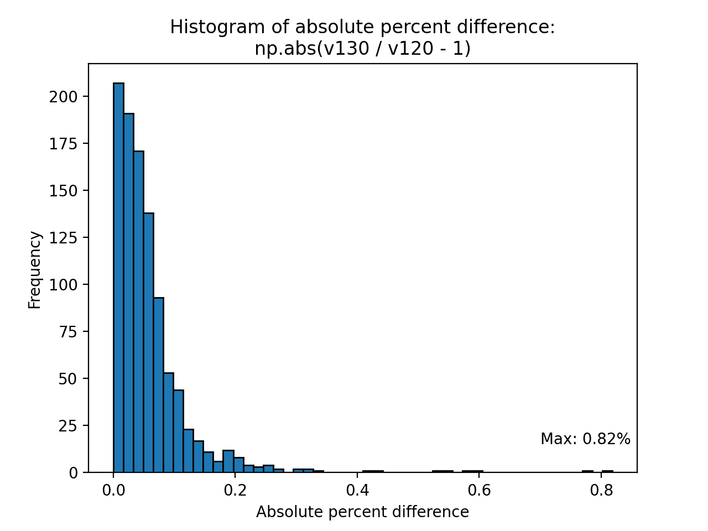
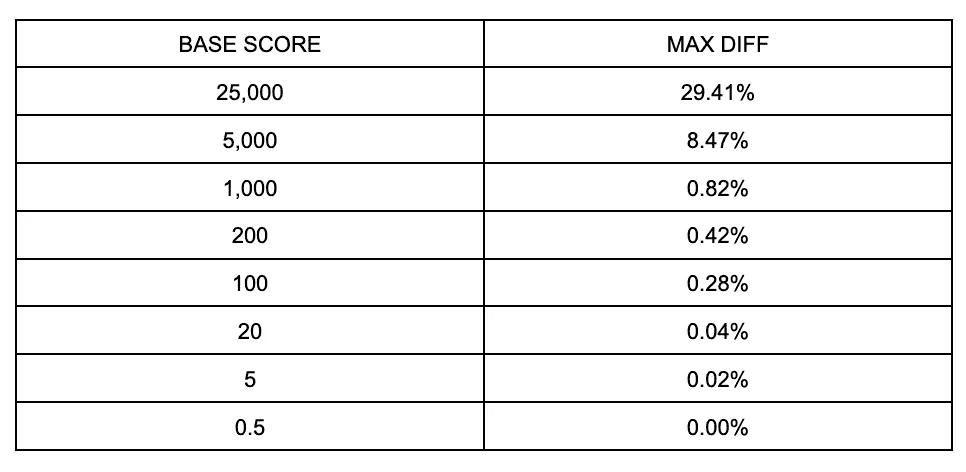

# 错误调整的 XGBoost 超参数的陷阱

> 原文：<https://medium.com/capital-one-tech/pitfalls-of-incorrectly-tuned-xgboost-hyperparameters-d06e4e42a38f?source=collection_archive---------0----------------------->

## 不正确调整的基础分数如何破坏 XGBoost 版本中模型预测的数值稳定性


机器学习从业者早就听说过这句格言*“垃圾进，垃圾出。”*它强调了将任何建模工作建立在一个被充分理解并适合手头问题的数据集上的重要性。建模的一个同样重要的相关方面是需要理解建模算法的*超参数*的细微差别。

一般来说，[超参数是模型参数，其值不能从训练数据](https://en.wikipedia.org/wiki/Hyperparameter_(machine_learning))中直接估计。它们控制模型训练过程的不同方面，并且需要预先指定。例如，[基于树的算法](https://towardsdatascience.com/3-decision-tree-based-algorithms-for-machine-learning-75528a0f03d1?gi=a2dc9ae2535)通常有一个超参数来控制需要在模型训练开始之前指定的树的深度。在实践中，超参数通常基于以前的经验、成熟的启发式方法或技术(如[网格搜索](https://towardsdatascience.com/grid-search-for-model-tuning-3319b259367e))进行调整。

在 Capital One，超参数调整是整个模型构建过程中不可或缺的一步。一个执行良好的调优策略会带来一些好处，比如更好的预测性能和更快的训练时间，这反过来又有助于我们从数据中获取最大的价值。然而，尽管付出了巨大的努力，我们还是会在调优过程中遇到一些边缘情况，这些情况最终会以微妙和意想不到的方式影响建模结果。

在这篇文章中，我们将深入研究 [XGBoost](https://xgboost.readthedocs.io/en/latest/index.html) ，这是一个流行的开源建模包，它实现了[梯度增强机器(GBM)算法](https://towardsdatascience.com/understanding-gradient-boosting-machines-9be756fe76ab)，并专注于一个特定的超参数`base_score`。具体来说，我们将展示一个场景，在这个场景中，一个用错误指定的基础分数训练的模型最终在 XGBoost 包的两个相邻版本中产生明显不同的预测。

在这篇文章的结尾，你将会学到:

*   调整模型超参数时理解算法和计算含义的重要性。
*   基本分数在 XGBoost 模型预测过程中的作用。
*   为什么选择一个与目标变量的规模相称的基础分数是个好主意。
*   为什么选择一个范围非常不同的值可能会导致 XGBoost 版本之间细微的、意想不到的数字差异。

# XGBoost 预测循环和基本分数的作用

当谈到模型训练过程时，XGBoost 附带了[各种各样的超参数](https://xgboost.readthedocs.io/en/latest/parameter.html)，人们可以通过调整来影响训练结果。一个这样的超参数是`base_score`,它允许用户向估计者提供有效的默认猜测。

一旦模型经过训练并准备好生成预测，该算法将首先对各个树的预测残差进行求和，然后在最后添加基本分数，以得出最终的预测值。在伪代码中，这个过程可以用一个简单的 for 循环来表示，如下面针对单个观察的说明。

```
predicted_value = 0for tree in trees:
    # Predicted residual is found by first locating the leaf to
    # which the observation of interest belongs, and then looking 
    # up the numerical value for said leaf
    predicted_residual = … predicted_value += predicted_residual# Add base score at the end to get final prediction
predicted_value += base_score
```

或者，我们可以设置运行总和等于基本分数开始，在这种情况下，我们不再需要在最后添加它。

```
# Alternatively, set running sum equal to base score at the start
predicted_value = base_scorefor tree in trees:
    predicted_residual = …
    predicted_value += predicted_residual
```

在 XGBoost 1 . 3 . 0 版之前，预测循环中的逻辑是运行总和从零开始。然而，在版本 1.3.0 中，[行为被修改](https://github.com/dmlc/xgboost/issues/6350#issuecomment-726053585)，使得运行总和在 for 循环开始时被有效地设置为等于基本分数。从数学上来说，这两种求和的方法是等价的。然而，从计算角度来说，情况并不总是如此。虽然这种细微差别预计不会在绝大多数用例中产生有意义的模型预测差异，但它的影响可能会被放大，并根据建模设置的具体情况被证明是有问题的。

为了强调这最后一点，我们现在将呈现一个场景，在该场景中，基本分数的值及其在预测循环中添加到运行总和的顺序最终会对 XGBoost 的两个相邻版本的模型预测的数值稳定性产生重大影响。

# 基础分数对模型预测数值稳定性的影响

概括地说，我们将这样做:

*   使用特定的基本分数在 XGBoost 1 . 2 . 0 版中训练模型，保存模型对象，并根据训练数据生成预测。
*   在 XGBoost 版本 1.3.0 中加载*相同的*模型对象，在相同的训练数据上生成预测。
*   检查两组模型预测是否相同。

为了设置这个实验，我们需要创建两个虚拟环境，在一个环境中安装 XGBoost 1.2.0，在另一个环境中安装 1.3.0。实现这一点的一个方法是通过 conda 环境/包管理器。详情请参考康达[官方文档](https://conda.io/projects/conda/en/latest/user-guide/getting-started.html)。

训练数据完全是合成的。具体来说，数据包括:

*   1000 次观察。
*   一个目标变量加上五个特征，这六个特征都是在 0 到 1 之间随机生成的数字。

```
import numpy as np# Set random seed for reproducibility
np.random.seed(2021)data = np.random.rand(1000, 6)# Save to disk for later use
np.savetxt('data.csv', data)
```

我们将在 XGBoost 1.2.0 中训练一个模型，并将拟合的模型与训练数据上的模型预测一起保存，供以后使用。

```
# Execute this snippet in xgboost 1.2.0 environment
import xgboost as xgby, x = data[:, 0], data[:, 1:]# Set hyperparameters for model training
hyperparams = {
    'base_score': 1000,
    'n_estimators': 500,
    'max_depth': 5,
    'learning_rate': .05
}# Train model and save
model = xgb.XGBRegressor(**hyperparams)
model.fit(x, y)
model.save_model('model_v120.bin')# Generate predictions on training data and save
predicted_v120 = model.predict(x)
np.savetxt('predicted_v120.csv', predicted_v120)
```

选择使用`XGBRegressor`作为特定模型在这里并不特别重要。然而，*和*重要的是，我们已经将基础分数设置得比目标变量大得多(再次回忆一下，目标变量在 0 和 1 之间)。正如我们将在后面的章节中讨论的那样，这将以一种微妙且有些出乎意料的方式影响模型预测的数值稳定性。

接下来，我们将把拟合的模型对象加载到 XGBoost 1.3.0 中，并再次对训练数据生成预测。

```
# Execute this snippet in xgboost 1.3.0 environment
data = np.loadtxt('data.csv')
x = data[:, 1:]# Load previously trained model
model = xgb.XGBRegressor()
model.load_model('model_v120.bin')predicted_v130 = model.predict(x)
predicted_v120 = np.loadtxt('predicted_v120.csv')
```

我们现在有两组模型预测，它们都是由相同的基础模型对象根据相同的训练数据生成的。唯一的区别是使用的 XGBoost 版本——1 . 2 . 0 和 1.3.0。

凭直觉，我们会认为这两组预测几乎完全相同。为了验证事实是否如此，我们绘制了一个直方图，显示了两组之间的绝对百分比差异。



```
Max absolute percent difference: 0.82%
1.2.0: 0.05175781
1.3.0: 0.05133431
```

如上所述，两组预测之间的差值可高达 0.82%。虽然我们不一定期望预测与*完全相同(可能是由于浮点舍入误差)，但是观察到的差异比预期的要大得多；没有进一步的调查，我们不能简单地把这种数量级的变化忽略不计。特别是，如果模型的使用与治理过程联系在一起，这在大型企业中是常见的，这种差异肯定会引起风险管理部门的注意。*

让我们用不同的基本分数重新训练模型，看看这是否会以任何方式影响 delta。事实上，将基本分数修改为 0.5(XGBoost 中的默认值)会导致两个 XGBoost 版本中的模型预测几乎相同。

```
Max percent difference: 0.00%
1.2.0: 0.00867423
1.3.0: 0.00867402
```

我们将尝试其他一些基本分数，并评估它们对最大差异的影响。如下表所示，基本分数和最大差值之间似乎呈正相关。以极值 25000 为例。如果我们用这个基本分数训练一个模型，并比较两个 XGBoost 版本的模型预测，它们可能会相差 30%。



那么结论是，一旦我们升级到软件包的新版本，XGBoost 给出的模型预测就不可靠了吗？不会。我们很快就会看到，我们的特定建模设置会放大异常大的基础分数的影响。

事实上，在我们最初的例子中，我们有目的地选择基础分数比目标变量的规模大几个数量级。在实践中，这可能是由于将超参数传递给 XGBoost API 时出现了输入错误，或者是由于数据科学家在重新调整目标变量时忘记相应地调整基本分数而导致的疏忽。

不管它是如何出现的，要带走的关键信息是超参数可以以微妙和意想不到的方式影响建模结果，并且当修改它们的值时，理解算法和(我们将很快看到)计算的含义对我们来说很重要。

对于手头的问题，我们需要研究为什么较大的基本分值会导致 XGBoost 版本中的模型预测在数值上不稳定。由于 XGBoost 中的[保证了向后兼容性](https://xgboost.readthedocs.io/en/latest/tutorials/saving_model.html#a-note-on-backward-compatibility-of-models-and-memory-snapshots)，数据科学家在一个版本的 XGBoost 中训练一个模型，保存该模型，然后在新版本的 XGBoost 中重用相同的模型，以便利用新版本中引入的额外功能和性能增强，这种情况并不罕见。如果这些改进是以数值不稳定和模型预测中无法解释的变化为代价的，那将是不幸的。

# 错误指定的基本分数如何破坏数值稳定性

如前所述，在我们的原始示例中观察到的数字差异是我们选择基本分数 1000 的直接结果，该分数比目标变量的范围(介于 0 和 1 之间)大几个数量级。

为了理解这个问题是如何表现出来的，我们需要重温一下本文前面介绍的预测循环的伪代码。具体来说，我们关注 XGBoost 1.3.0 中引入的修改后的逻辑，在 for 循环开始时，运行总和被设置为等于基本分数。

```
# Start running sum at base score. New behavior introduced in 1.3.0
predicted_value = base_scorefor tree in trees:
    predicted_residual = …
    predicted_value += predicted_residual
```

假设第一棵树的预测残差是-50.0341012。在循环的第一次迭代之后，我们期望`predicted_value`等于 949.9658988。

```
1000.0–50.0341012 = 949.9658988
```

在引擎盖下，一台计算机使用[浮点运算](https://en.wikipedia.org/wiki/Floating-point_arithmetic)进行计算，类似于科学记数法的工作方式。虽然它不像上面的等式那么简单，但直觉上我们会认为它会产生相同的答案，如下图所示。(计算机以二为基数工作，而不是以十为基数，如图所示。然而，同样的原则也适用。)

```
1000.0
 -50.0341012
    ↓
   1.0          * 10³ Convert to scientific notation
  -5.00341012   * 10¹
    ↓
   1.0          * 10³
  -0.0500341012 * 10³ Ensure the same exponent
    ↓
   0.9499658988 * 10³
    ↓
 949.9658988
```

然而，现实中最终发生的事情略有不同。

计算机能用来存储浮点数的位数是有限的。如果我们有一个小数点后有大量尾随数字的数字，可能没有足够的空间来存储它们。在某一点之后，一些数字将不得不被丢弃。

让我们假设我们正在使用 32 位浮点数，它的精度限制大约是 7 位十进制数字。因为我们从比第一棵树的预测残差大得多的基础分数开始，这实际上导致较小的数字向右“移位”，导致最后三位数字在此过程中被丢弃。

```
 0.9499658988 * 10³
   ↓
  0.9499659xxx * 10³ Last 3 digits discarded
   ↓
949.9659             Less precision as a result
```

相比之下，如果我们从零开始运行总和(XGBoost 1.2.0 中的行为), for 循环中的每个后续加法/减法将以更精确的方式执行，利用所有可用的位，而不会过早地丢弃尾部数字。

你可能想知道，*“如果我在这里或那里留下一些无关紧要的数字，会有什么不同？”你是对的——这通常没什么关系。然而，当目标变量很小时，每一点精度都很重要。如果我们执行大量的运算，每一次都牺牲了一点点精度，这些小误差就会叠加，并可能产生一个最终结果，这个结果与我们从零开始计算累计和的结果有很大的不同。这种现象是浮点计算的[非关联性的直接结果——由于数学构造与其具体计算实现之间的偏差，这种属性经常让人们感到惊讶。](https://en.wikipedia.org/wiki/Associative_property#Nonassociativity_of_floating_point_calculation)*

# 如何补救由错误指定的基本分数导致的数值不稳定性

根据您的模型的具体用例，我们到目前为止讨论的数字差异可能并不重要。然而，如果数值稳定性和精度*对您来说很重要的话，有一些选项可以减少前面描述的浮点运算的细微差别所导致的数值差异。*

最稳健的补救措施是使用适当选择的基础分数重新训练模型，该分数与目标变量的规模相当。

在重新训练模型不可行的情况下，我们可以通过复制 XGBoost 早期版本中的预测逻辑来消除数值差异。

```
def v120_predict_replica(model, x):
    """Replica of the prediction logic in xgboost version 1.2.0. Specifically, base score will be added _at the end_ of the 
    prediction loop, rather than at the start. This is achieved via  
    setting `base_margin` to be zero, which forces the base score to 
    be ignored.
[https://xgboost.readthedocs.io/en/latest/prediction.html#base-
margin](https://xgboost.readthedocs.io/en/latest/prediction.html#base-margin)
    """ float32 = np.float32 # xgboost uses 32-bit floats
    base_margin = np.zeros(len(x), dtype=float32)
    dmatrix = xgb.DMatrix(x, base_margin=base_margin)
    base_score = model.get_xgb_params()[‘base_score’]
    booster = model.get_booster()
    predicted_value = booster.predict(dmatrix) + float32(base_score)
    return predicted_value
```

也就是说，这不应该被视为一个永久的解决方案——它只是一个权宜之计，为我们争取更多的时间，让我们为重新训练模型的更强大的解决方案制定计划。

# 结论

在这篇文章中，我们研究了一个场景，在这个场景中，一个用错误指定的基础分数训练的 XGBoost 模型最终在两个相邻的 XGBoost 版本之间产生数值不稳定的预测。尽管我们只关注单个超参数，但关键信息是通用的。

将一个不合适的数据集输入到一个算法中可能会导致一个几乎无用的模型。类似地，试图在没有充分考虑算法和计算含义的情况下调整模型的超参数，可能最终导致细微的、意想不到的、难以调试的建模结果。

如果您想了解 XGBoost 中可用的超参数的更多信息，那么[官方文档](https://xgboost.readthedocs.io/en/latest/parameter.html)和之前的 Capital One 博客文章— [“如何控制您的 XGBoost 模型”](https://www.capitalone.com/tech/machine-learning/how-to-control-your-xgboost-model/) —是帮助您入门的好资源。

# 承认

这篇文章是我在 Capital One 的同事们之前工作和贡献的结晶(按字母顺序排列):

*   [阿隆·艾哈迈迪](https://www.linkedin.com/in/aron-ahmadia/)
*   [陈](https://www.linkedin.com/in/hanying-chen-22794181/)
*   [杰夫·福里斯特](https://www.linkedin.com/in/jeff4rest/)
*   Khatereh Mohajery
*   [斯潘塞·贝利](https://www.linkedin.com/in/spencer-bailey-b4b683a0/)
*   [苏南和克里希南](https://www.linkedin.com/in/sunandkrishnan/)
*   [邵婷](https://www.linkedin.com/in/ting-shao-cfa-719aab79/)

# 参考资料和资源

*   https://xgboost.readthedocs.io/en/latest/parameter.html
*   [https://xgboost . readthedocs . io/en/latest/tutorials/saving _ model . html # a-note-on-backward-compatibility-of-models-and-memory-snapshots](https://xgboost.readthedocs.io/en/latest/tutorials/saving_model.html#a-note-on-backward-compatibility-of-models-and-memory-snapshots)
*   [https://github.com/dmlc/xgboost/issues/6350](https://github.com/dmlc/xgboost/issues/6350#issuecomment-726053585)
*   [https://github.com/dmlc/xgboost/issues/799](https://github.com/dmlc/xgboost/issues/799)
*   [https://www . capital one . com/tech/machine-learning/how-to-control-your-xgboost-model/](https://www.capitalone.com/tech/machine-learning/how-to-control-your-xgboost-model/)
*   [https://machine learning mastery . com/difference-a-parameter-and-a-hyperparameter/](https://machinelearningmastery.com/difference-between-a-parameter-and-a-hyperparameter/)
*   [https://en . Wikipedia . org/wiki/Hyperparameter _(machine _ learning)](https://en.wikipedia.org/wiki/Hyperparameter_(machine_learning))
*   [https://en.wikipedia.org/wiki/Floating-point_arithmetic](https://en.wikipedia.org/wiki/Floating-point_arithmetic)
*   [https://en . Wikipedia . org/wiki/Associative _ property # non Associative _ of _ floating _ point _ calculation](https://en.wikipedia.org/wiki/Associative_property#Nonassociativity_of_floating_point_calculation)
*   [https://floating-point-gui.de/](https://floating-point-gui.de/)
*   [https://ciechanow.ski/exposing-floating-point/](https://ciechanow.ski/exposing-floating-point/)
*   [https://conda . io/projects/conda/en/latest/user-guide/getting-started . html](https://conda.io/projects/conda/en/latest/user-guide/getting-started.html)

*披露声明:2022 资本一。观点是作者个人的观点。除非本帖中另有说明，否则 Capital One 不隶属于所提及的任何公司，也不被这些公司认可。使用或展示的所有商标和其他知识产权是其各自所有者的财产。*