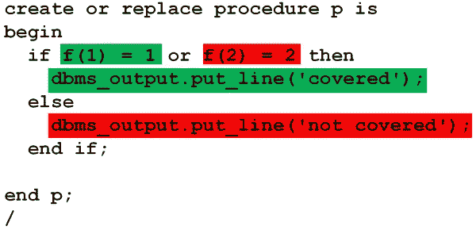

# PL/SQL 代码覆盖率:开发人员会喜欢的关于 Oracle Database 12c 第 2 版第 12 部分的 12 件事

> 原文：<https://medium.com/oracledevs/pl-sql-code-coverage-12-things-developers-will-love-about-oracle-database-12c-release-2-part-12-1efeddb2c22b?source=collection_archive---------0----------------------->

在本系列中，我们已经介绍了许多新功能。如果有的话，你可以马上使用。其他部分你要等一会儿。

在任何情况下，当您升级到 12.2 时，您都需要测试所有代码，以确保它能按预期工作。这就带来了一个问题:

"测试实际上运行了我多少代码？"

覆盖度量将对此有很大帮助。



对测试进行简单的行级分析是不够的。要了解原因，请考虑以下代码:

我们有一个返回参数并调用 dbms_output 的基本函数。

该过程在一条 if 语句中调用该函数两次:

```
create or replace function f (p int) 
  return int as 
begin 
  dbms_output.put_line('Executed: ' || p); 
  return p; 
end; 
/ create or replace procedure p is 
begin 
  if f(1) = 1 or f(2) = 2 then 
    dbms_output.put_line('this'); 
  else 
    dbms_output.put_line('that'); 
  end if; 
end p; 
/
```

由于短路求值，f(2)永远不会执行！您可以从输出中看到这一点:

```
SQL> exec p; Executed: 1 this
```

在生产线上工作的任何人都会错误地将此报告为完全覆盖。

为了克服这一点，你需要“基本块”执行的细节。

那么什么是“基本块”呢？

这是一段你要么完全运行要么根本不运行的代码。代码总是恰好属于一个基本块。例如:

```
if f(1) = 1 or f(2) = 2 then 
  dbms_output.put_line('this'); 
else 
  dbms_output.put_line('that'); 
end if;
```

有四个基本块。一个用于对 f 的每次调用，两个用于对 dbms_output.put_line 的调用。

新的代码覆盖率功能对这些基本块进行测量和报告。

使用它很容易。首先，您需要创建覆盖率表来存储指标:

```
exec dbms_plsql_code_coverage.create_coverage_tables;
```

然后在测试之前调用 start_coverage，在测试之后调用 stop_coverage:

```
declare 
  run_id pls_integer; 
begin 
  run_id := dbms_plsql_code_coverage.start_coverage('TEST'); 
  p; 
  dbms_plsql_code_coverage.stop_coverage; 
end; 
/
```

然后，您可以通过查询保存这些详细信息的 dbmspcc*表来获取指标:

```
select owner, name, type, 
       round( ( sum(covered)/count(*) * 100), 2) pct_covered 
from   dbmspcc_runs r 
join   dbmspcc_units u 
on     r.run_id = u.run_id 
join   dbmspcc_blocks b 
on     r.run_id = b.run_id 
and    u.object_id = b.object_id 
where  r.run_comment = 'TEST' 
group by owner, name, type; OWNER NAME  TYPE       PCT_COVERED 
----- ----- ---------- ----------- 
CHRIS P     PROCEDURE           50 
CHRIS F     FUNCTION           100
```

这一切都很好。但是总有一些你的测试没有覆盖到的代码。可能是弃用了，所以不需要测试。或者是“以防万一”的代码，以涵盖理论上可能但实际上不可能的情况。比如臭名昭著的“when others”异常处理程序。

您希望从报告中排除这些部分。幸运的是，您可以使用 coverage pragma。通过将行标记为“不可行”,您可以从报告中过滤掉这些行:

```
create or replace procedure p is 
begin 
  if f(1) = 1 or f(2) = 2 then 
    dbms_output.put_line('this'); 
  else 
    pragma coverage ('NOT_FEASIBLE'); 
    dbms_output.put_line('that'); 
  end if; 
end p; 
/
```

重新运行测试，您可以在报告中隐藏不可测试的部分！

```
select owner, name, type, 
       round( ( sum(covered)/count(*) * 100), 2) pct_covered 
from   dbmspcc_runs r 
join   dbmspcc_units u 
on     r.run_id = u.run_id 
join   dbmspcc_blocks b 
on     r.run_id = b.run_id 
and    u.object_id = b.object_id 
where  r.run_comment = 'TEST' 
and    b.not_feasible = 0 
group  by owner, name, type; OWNER NAME TYPE      PCT_COVERAGE 
----- ---- --------- ------------ 
CHRIS P    PROCEDURE        66.67 
CHRIS F    FUNCTION           100
```

如果你真的想的话，你可以通过将代码封装在两个覆盖 pragmas 中来排除整个代码段。第一个起始不可行开始，第二个不可行结束:

```
begin S
  pragma coverage ('NOT_FEASIBLE_START'); 
  a_section(); 
  of_untestable_code(); 
  pragma coverage ('NOT_FEASIBLE_END'); 
end; 
/
```

*全文原载于 2016 年 11 月 10 日*[*【blogs.oracle.com】*](https://blogs.oracle.com/sql/12-things-developers-will-love-about-oracle-database-12c-release-2)*。*