# 玩路径

> 原文：<https://medium.com/androiddevelopers/playing-with-paths-3fbc679a6f77?source=collection_archive---------2----------------------->

我最近在一个应用程序中帮助制作了一个英雄动画——不幸的是我还不能分享这个动画……但是我想分享我在制作它时学到的东西。在本帖中，我将介绍由[戴夫“蜜蜂炸弹”威特](https://beesandbombs.tumblr.com/)制作的这个令人着迷的动画，它展示了许多相同的技术:

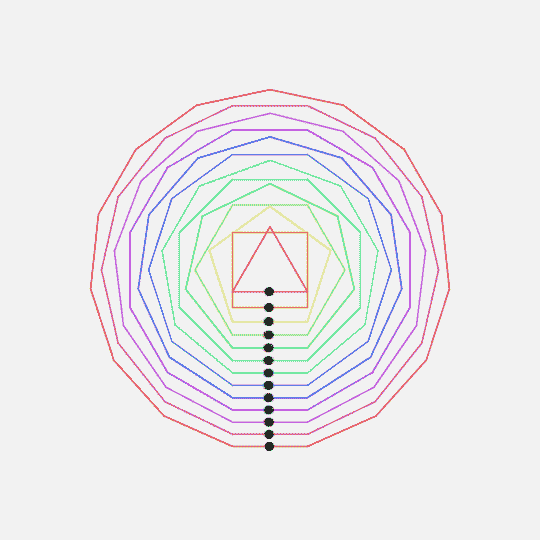

[*Polygon Laps*](https://beesandbombs.tumblr.com/post/161295765794/polygon-laps) *by beesandbombs 🐝💣*

当我看到这个的时候，我的第一个想法(对于任何了解我的工作的人来说，这可能并不奇怪)是伸手去拿一个`[AnimatedVectorDrawable](https://developer.android.com/reference/android/graphics/drawable/AnimatedVectorDrawable.html)`(此后称为`AVD`)。`AVD` s 很棒，但并不适合所有情况——具体来说，我们有以下要求:

*   我知道我们需要画一个多边形，但是我们还没有决定具体的形状。`AVD`是“预先烘焙”的动画，因此改变形状需要重新制作动画。
*   “进度跟踪”方面的一部分，我们想只画多边形的一部分。`AVD`它们是‘一劳永逸’的，也就是说，你不能把它们一笔勾销。
*   我们想围绕多边形移动另一个对象。这绝对可以用`AVD` s 实现…但是同样需要大量的前期工作来预先计算构图。
*   我们希望控制对象在多边形周围移动的进度，与显示的多边形部分分开。

相反，我选择将它实现为由`[Path](https://developer.android.com/reference/android/graphics/Path.html)`对象组成的自定义`[Drawable](https://developer.android.com/reference/android/graphics/drawable/Drawable.html)`。`Path` s 是一个形状的基本代表(在引擎盖下使用！)和 Android 的`[Canvas](https://developer.android.com/reference/android/graphics/Canvas.html)`API 为创建有趣的效果提供了丰富的支持。在浏览这些之前，我想对罗曼·盖伊的这篇出色的文章大声欢呼，这篇文章展示了我在这篇文章中运用的许多技巧:

[](http://www.curious-creature.com/2013/12/21/android-recipe-4-path-tracing/) [## Android 配方#4，路径跟踪

### 几个月前我离开了 Android 团队，但我仍然有许多视觉效果和演示想写…

www.curious-creature.com](http://www.curious-creature.com/2013/12/21/android-recipe-4-path-tracing/) 

## 极坐标

通常当定义 2d 形状时，我们在(x，y)坐标中工作，技术上称为笛卡尔坐标。它们通过沿 x 轴和 y 轴距离原点的距离来指定点，从而定义形状。另一种方法是极坐标系统，该系统通过原点的角度(θ)和半径(r)来定义点。

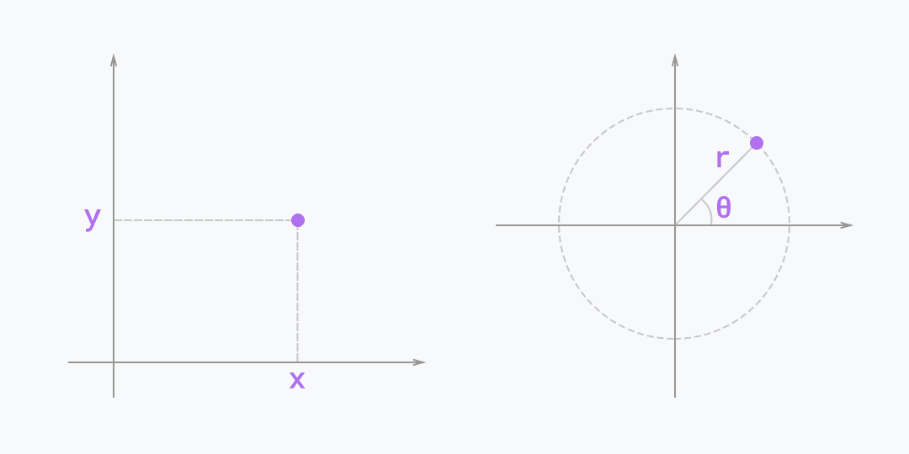

*Cartesian coordinates (left) vs polar coordinates (right)*

我们可以使用以下公式在极坐标和笛卡尔坐标之间进行转换:

```
val x = radius * Math.cos(angle);
val y = radius * Math.sin(angle);
```

我强烈推荐这篇文章来学习更多关于极坐标的知识:

 [## 极坐标🌀

### 寻找迷惑自己的新方法

瓦伦. ca](http://varun.ca/polar-coords/) 

要生成正多边形(即每个内角都相同)，极坐标非常有用。您可以计算产生所需边数所需的角度(因为内角总共为 360°)，然后使用半径相同的该角度的倍数来描述每个点。然后，您可以将这些点转换成图形 API 工作的笛卡尔坐标。这里有一个函数创建一个描述给定边数和半径的多边形的`Path`:

```
fun createPath(sides: Int, radius: Float): Path {
  val path = Path()
  val angle = 2.0 * Math.PI / sides
  path.moveTo(
      cx + (radius * Math.cos(0.0)).toFloat(),
      cy + (radius * Math.sin(0.0)).toFloat())
  for (i in 1 until sides) {
    path.lineTo(
        cx + (radius * Math.cos(angle * i)).toFloat(),
        cy + (radius * Math.sin(angle * i)).toFloat())
    }
  path.close()
  return path
}
```

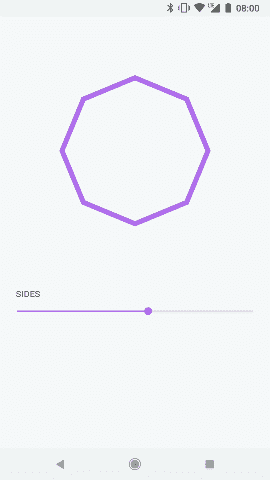

因此，为了重新创建我们的目标组合，我们可以创建一个具有不同边数、半径和颜色的多边形列表。`Polygon`是一个简单的类，它保存这些信息并计算`Path`:

```
private val polygons = listOf(
  Polygon(sides = 3, radius = 45f, color = 0xffe84c65.toInt()),
  Polygon(sides = 4, radius = 53f, color = 0xffe79442.toInt()),
  Polygon(sides = 5, radius = 64f, color = 0xffefefbb.toInt()),
  ...
)
```

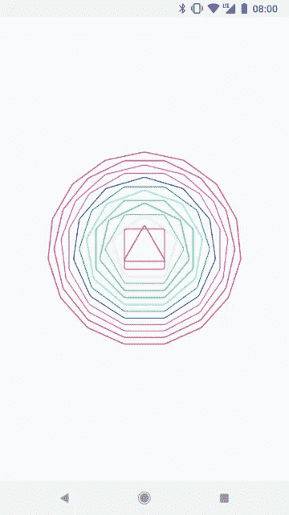

## 有效路径绘画

使用`[Canvas.drawPath(path, paint)](https://developer.android.com/reference/android/graphics/Canvas.html#drawPath(android.graphics.Path,%20android.graphics.Paint))`绘制路径很简单，但是`[Paint](https://developer.android.com/reference/android/graphics/Paint.html)`参数[支持](https://developer.android.com/reference/android/graphics/Paint.html#setPathEffect(android.graphics.PathEffect))一个`[PathEffect](https://developer.android.com/reference/android/graphics/PathEffect.html)`，我们可以用它来改变*如何*绘制路径。例如，我们可以用一个`[CornerPathEffect](https://developer.android.com/reference/android/graphics/CornerPathEffect.html)`来圆化我们多边形的角，或者用一个`[DashPathEffect](https://developer.android.com/reference/android/graphics/DashPathEffect.html)`来只画出`Path`的一部分(参见前面提到的[帖子](http://www.curious-creature.com/2013/12/21/android-recipe-4-path-tracing/)的“路径追踪”部分，了解更多关于这种技术的细节):

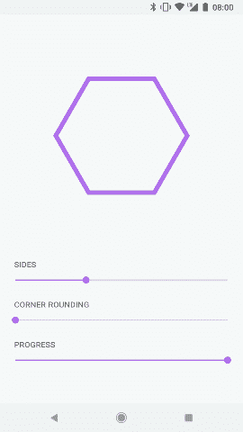

> 另一种绘制路径分段的技术是使用`[PathMeasure#getSegment](https://developer.android.com/reference/android/graphics/PathMeasure.html#getSegment(float%2C%20float%2C%20android.graphics.Path%2C%20boolean))`，它将一部分复制到一个新的`Path`对象中。我使用破折号技术来制作`interval`和`phase`参数的动画，以实现有趣的可能性。

通过将控制这些效果的参数公开为我们的 drawable 的属性，我们可以轻松地将它们制作成动画:

```
object PROGRESS : FloatProperty<PolygonLapsDrawable>("progress") {
  override fun setValue(pld: PolygonLapsDrawable, progress: Float) {
    pld.progress = progress
  }
  override fun get(pld: PolygonLapsDrawable) = pld.progress
}...ObjectAnimator.ofFloat(polygonLaps, PROGRESS, 0f, 1f).apply {
  duration = 4000L
  interpolator = LinearInterpolator()
  repeatCount = INFINITE
  repeatMode = RESTART
}.start()
```

例如，以下是制作同心多边形路径进度动画的不同方式:

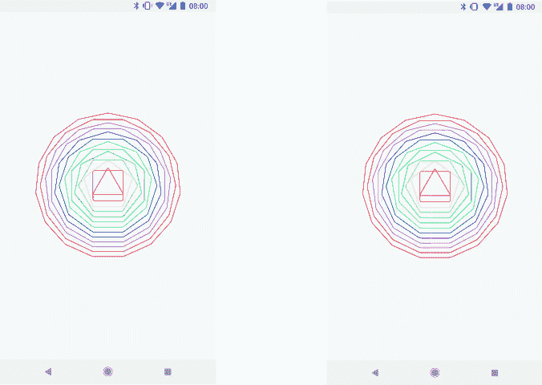

## 坚持走这条路

为了沿着路径绘制对象，我们可以使用一个`[PathDashPathEffect](https://developer.android.com/reference/android/graphics/PathDashPathEffect.html)`。这沿着一条路径“压印”另一个`Path`,所以例如沿着一个多边形压印蓝色的圆可能看起来像这样:

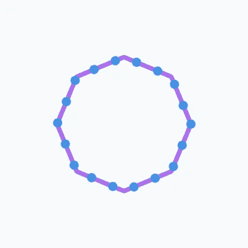

`PathDashPathEffect`接受`advance`和`phase`参数——即印记之间的间隙和在第一个印记之前沿路径移动的距离。通过将推进设置为整个路径的长度(通过`[PathMeasure#getLength](https://developer.android.com/reference/android/graphics/PathMeasure.html#getLength())`获得)，我们可以绘制一个单独的图章。通过制作阶段动画(这里由一个`dotProgress`参数[0，1]控制)，我们可以让这个单独的图章沿着路径移动。

```
val phase = dotProgress * polygon.length
dotPaint.pathEffect = PathDashPathEffect(pathDot, polygon.length,
    phase, TRANSLATE)
canvas.drawPath(polygon.path, dotPaint)
```

我们现在已经有了创作作品的所有材料。通过向每个多边形添加另一个参数，即每个点在每个动画循环中应该完成的“圈数”,我们得出:

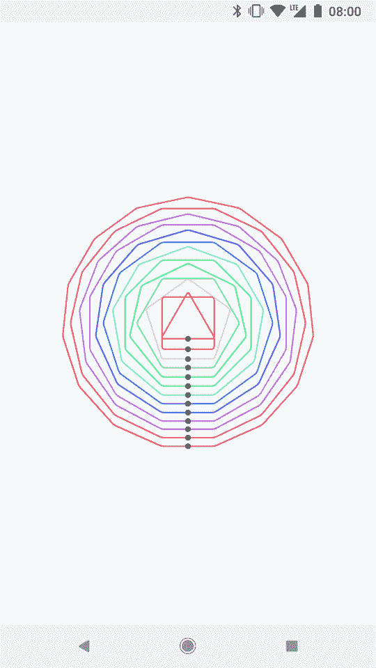

A re-creation of the original gif as an Android drawable

您可以在此处找到此绘图的来源:

[https://gist . github . com/nick butcher/b 41 da 75 b 8 B1 fc 115171 af 86 c 63796 c5b # file-polygonapsdrawable-kt](https://gist.github.com/nickbutcher/b41da75b8b1fc115171af86c63796c5b#file-polygonlapsdrawable-kt)

## 展示一些风格

眼尖的你们可能已经注意到了`PathDashPathEffect` : `[Style](https://developer.android.com/reference/android/graphics/PathDashPathEffect.Style.html)`的最终参数。此枚举控制如何在绘制的每个位置变换图章。为了说明该参数的工作原理，下面的示例使用了一个三角形图章而不是圆形图章，并显示了`translate`和`rotate`样式:

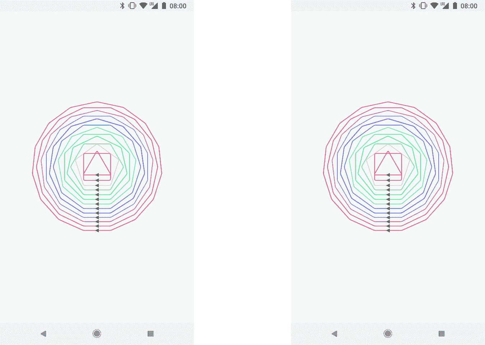

*Comparing* `*translate*` *style (left) with* `*rotate*` *(right)*

注意，使用`translate`时，三角形图章总是在同一方向(指向左边)，而使用`rotate`样式时，三角形旋转以保持与路径相切。

还有一个最后的`style`叫做`morph`，它实际上是*转换*图章。为了说明这种行为，我将图章改为下面的一行。注意线*在穿过拐角时如何弯曲*:

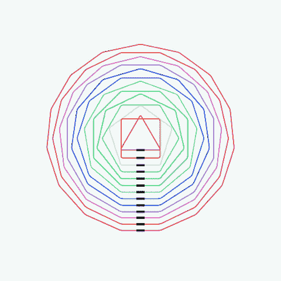

Demonstrating `PathDashPathEffect.Style.MORPH`

这是一个有趣的效果，但似乎在某些情况下很难实现，比如在道路的起点或急转弯处。

> 请注意，您可以使用一个`ComposePathEffect`来组合`PathEffect` s，这就是路径戳如何通过组合一个`PathDashPathEffect`和一个`CornerPathEffect`来跟随圆角的。

## 说得离题了

虽然以上是我们重新创建多边形重叠部分所需的全部内容，但我最初的挑战实际上需要更多的工作。使用`PathDashPathEffect`的缺点是邮票只能是单一的形状和颜色。我正在创作的作品需要更复杂的标记，所以我不得不超越路径标记技术。取而代之的是，我使用一个`Drawable`来计算对于一个给定的进度，它需要沿着`Path`画在哪里。

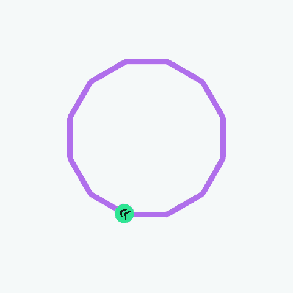

*Moving a* `*VectorDrawable*` *along a path*

为了实现这一点，我再次使用了`PathMeasure`类，它提供了一个`[getPosTan](https://developer.android.com/reference/android/graphics/PathMeasure.html#getPosTan(float%2C%20float%5B%5D%2C%20float%5B%5D))`方法来获得位置坐标和沿`Path`的给定距离的切线。有了这些信息(和一些数学知识)，我们可以平移和旋转画布，在正确的位置和方向绘制我们的`marker`:

```
pathMeasure.setPath(polygon.path, false)
pathMeasure.getPosTan(markerProgress * polygon.length, pos, tan)
canvas.translate(pos[0], pos[1])
val angle = Math.atan2(tan[1].toDouble(), tan[0].toDouble())
canvas.rotate(Math.toDegrees(angle).toFloat())
marker.draw(canvas)
```

## 找到你的路

希望这篇文章展示了使用路径创建和操作的自定义 drawable 如何有助于构建有趣的图形效果。创建一个自定义的 drawable 可以让你最终控制改变和动画的不同组成部分独立。这种方法还允许您动态地提供值，而不必准备预先录制的动画。Android 的`Path`API 和内置效果给我留下了非常深刻的印象，所有这些都是从 API 1 开始提供的。