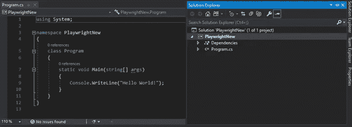
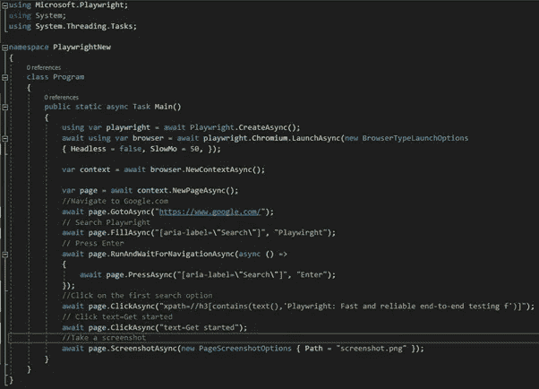
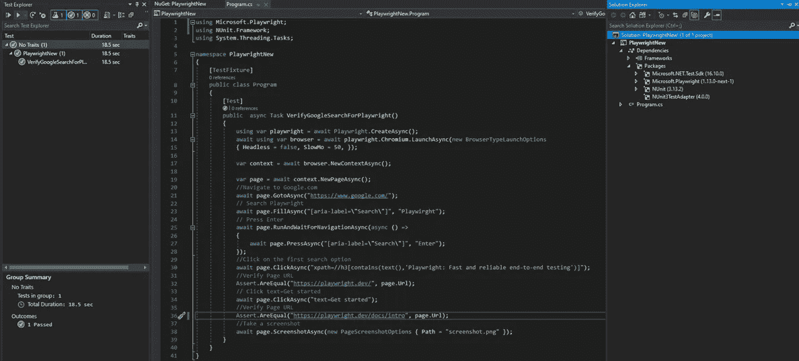

# 剧作家:使用 C#语言支持的现代网络应用端到端测试

> 原文：<https://medium.com/version-1/playwright-a-modern-end-to-end-testing-for-web-app-with-c-language-support-c55e931273ee?source=collection_archive---------0----------------------->

剧作家是一个开源的浏览器自动化库。这是一个基于 JavaScript 的库，用于 Node.js。与其他浏览器自动化工具的主要区别之一是，剧作家是跨浏览器的。它可以使用 Chromium(谷歌 Chrome、微软 Edge)、WebKit(苹果 Safari)和 Mozilla Firefox 浏览器自动执行任务，所有这些都使用相同的 API。

[剧作家是微软](https://www.version1.com/about-us/our-technology-partnerships/microsoft/)创造的。它是基于 Puppeteer 开发的，并经过改进以执行自动 UI 测试。

在这篇博客中，我将讲述如何使用剧作家以及 C#和 Nunit 测试框架创建一个简单的测试。

**控制台应用程序的安装和创建:**

注意:在开始之前，请确保在从 npm 安装剧作家之前已经下载并安装了 Node.js。

[https://nodejs.org/en/download/](https://nodejs.org/en/download/)

**步骤 1:从 CLI 全局安装节点包管理器“剧作家”**

npm 安装剧作家

这将从 npm 和 chromium 浏览器中获得所有必要的文件，我们将在本博客的后面阶段使用 chromium 浏览器。

**步骤 2:使用 CLI 或 Visual Studio 创建一个控制台应用程序**

第三步:搜索微软。剧作家在 NuGet 包管理器中安装它

注意:请确保选中“包括预发布”复选框。

**步骤 4:添加以下代码，该代码将在谷歌搜索中搜索剧作家并验证**

上述代码将打开 chromium-browser，然后它将搜索“剧作家”，然后它将导航到 URL 中的[https://playwright.dev/dotnet/docs/intro](https://playwright.dev/dotnet/docs/intro)页面。要运行它，只需点击菜单栏中的运行按钮。您将能够验证代码将被成功执行。注意:如果您遇到问题，请确保您已经完成了所有 4 个步骤。

**创建 NUNIT 测试:**

到目前为止，我们一直在讨论如何安装剧作家和如何开始。但是如果我们想要创建一个自动化测试套件，那么我们必须使用 Nunit 或者 Unittest 或者 Xnuit 包。下面是我使用 Nunit 框架的例子。

**步骤 1:从 Nuget 包管理器安装 Nunit 和 Nunit3TestAdaptor 包，通过 Assert 函数作为测试和验证运行:**

一旦你安装了上面的两个包，我们准备修改我们的第一个程序作为测试方法，然后运行它们。

确保将所有依赖项添加到下面的快照中，然后从测试资源管理器中运行测试。

步骤 2:将[Test]属性添加到您的方法中，将[TestFixture]添加到您的测试类中

**步骤 3:在测试中导航时，添加一些 Assert 方法来验证 ULRs】**

> 使用微软。剧作家；
> 使用努特语。框架；
> 使用系统。线程。任务；
> 
> 命名空间 Playwright new
> {
> 【Test fixture】
> 公共类程序
> {
> 【Test】
> 公共静态异步任务 VerifyGoogleSearchForPlaywright()
> {
> 使用 var 剧作家=等待剧作家。create async()；
> await 使用 var browser = await 剧作家。chromium . launch async(new browsertypelaunch options
> { Headless = false，SlowMo = 50，})；
> 
> var context = await 浏览器。NewContextAsync()；
> 
> var page = await context。new page async()；
> //导航到 Google.com
> 等待页面。goto async(" https://www . Google . com/")；
> //搜索剧作家
> 等待页面。fill async("[aria-label = \ " Search \ "]" Playwirght ")；
> //按回车键进入
> 等待页面。RunAndWaitForNavigationAsync(async()=>
> {
> await page。press async("[aria-label = \ " Search \ "]" " Enter ")；
> })；
> //点击第一个搜索选项
> 等待页面。click async(" XPath =//H3[contains(text()，'剧作家:快速可靠的端到端测试')]"；
> //验证页面 URL
> 断言。are equal(" https://剧作家. dev/"，页面。网址)；
> //点击 text =开始
> 等待页面。click async(" text = Get started ")；
> //验证页面 URL
> 断言。are equal(" https://剧作家. dev/docs/intro "，第页。网址)；
> //截图
> 等待页面。screenshot async(new page screenshot options { Path = " screen shot . png " })；
> }}}

让我们来谈谈测试中使用的不同方法。

**页。goto async(" https://www . Google . com/")；**
上述方法确实导航到所提供的 url。
**页。fill async("[aria-label = \ " Search \ "]" Playwirght ")；**
上面这个方法填充了你试图在文本框中搜索的值。
页面**页面。press async("[aria-label = \ " Search \ "]" " Enter ")；**
上面这个方法点击了回车键。
**页。click async(" text = Get started ")；**
上面这个方法做了一个点击动作。
**页。screenshot async(new page screenshot options { Path = " screen shot . png " })；**
对于以上这种方法截图并保存在 debug 文件夹下。注意:您可以根据需要更改路径。
**断言。are equal(" https://剧作家. dev/"，页面。网址)；**
上面这个断言比较了预期值和实际值。

**使用剧作家的好处。**

**支持多种语言:**剧作家 API 有多种语言版本。

*   JavaScript 和类型脚本
*   计算机编程语言
*   Java 语言(一种计算机语言，尤用于创建网站)
*   C#

**剧作家的主要特征:**

1.无头处决。

2.自动等待元素。

3.拦截网络活动。

4.模拟移动设备、地理位置、权限。

5.通过阴影穿透选择器支持 web 组件。

6.捕捉视频，截图和 HAR 文件。

7.上下文允许独立的会话。

8.并行执行。

9.命令行执行。

10.CICD 一体化。

11.剧作家检查员和剧作家记录器和代码生成器。

**概要:**

微软的剧作家被设计成高度模块化，专注于成为一个自动化驱动程序，可以很好地与你的测试堆栈的所有部分一起工作。由于不同的语言支持和自动等待特性，这无疑是另一个有趣的工具，可以与 Selenium 展开一场精彩的战斗。

**为了了解更多关于剧作家工具的信息，请访问下面的网址**

[**https://playwright.dev/**](https://playwright.dev/dotnet/docs/intro)

