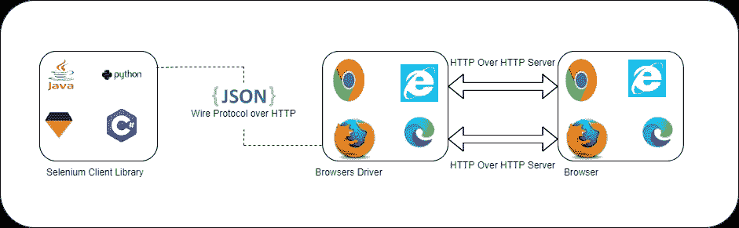
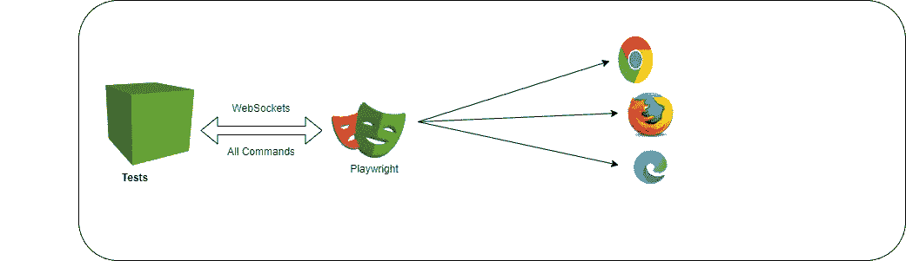
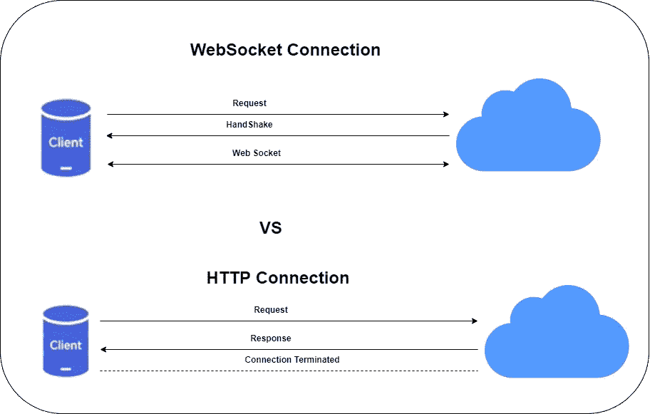

# 硒建筑与剧作家

> 原文：<https://medium.com/version-1/playwright-vs-selenium-which-is-faster-and-more-stable-c41ba1a89c0a?source=collection_archive---------1----------------------->

## **一般注意事项**

在本文中，我将解释两个流行的测试工具 Selenium 和剧作家的架构，以更好地理解哪种工具对于测试执行更稳定。

## 什么是剧作家？

剧作家是一个用于 web 自动化测试的开源工具，由[微软](https://www.version1.com/about-us/our-technology-partnerships/microsoft/)于 2020 年开发。剧作家是为 web 应用程序的端到端自动化测试而设计的。它非常快速地执行测试，这对测试复杂的测试项目非常有帮助。

**浏览器支持:**

剧作家支持多种浏览器如:
Chromium，Firefox，Web Kit。

**语言支持:**

剧作家支持 Java，Python，。Net C#和 JavaScript。

## **硒是什么？**

Selenium 是一个流行的开源自动化测试工具，用于跨不同浏览器验证 web 应用程序。

**浏览器支持:**

Selenium 支持多种浏览器如:
Chrome，Firefox，Internet Explorer，Safari。

**语言支持:**

Selenium 支持 Python、Java、JavaScript、C#、Ruby、Php

**硒与剧作家的建筑**

# **硒架构:**

Selenium architecture

Selenium 基于 HTTP 连接协议工作。这意味着在您触发测试之后，我们(客户端)编写的完整 Selenium 代码将被转换为 JSON 格式。生成的 JSON 通过 HTTP 协议发送给浏览器驱动(服务器)。

# **剧作家建筑:**

Playwright architecture

当剧作家工作在 Web socket 连接协议上时，这意味着一旦你将触发测试，代码将被转换成 JSON 格式，并将使用 Web socket 协议发送到服务器。

所以现在我们将看到 Web socket 连接协议和 HTTP 连接协议的区别:

HTTP VS Web Sockets Connection Diagram

Selenium 将每个命令作为单独的 HTTP 请求发送，并接收 JSON 响应。因此，每一个动作，比如打开浏览器、单击元素或在文本框中发送键，都作为一个单独的 HTTP 请求发送。此外，在每个请求完成后，服务器和客户端之间的连接将被终止，这需要为下一个请求重新建立。

每个请求后的连接终止会导致较慢的执行速度，从而导致分层。

**另一方面，剧作家**通过一个单一的 Web socket 连接来传递所有的请求，这个连接一直保持到测试执行完成。这减少了故障点，并允许在单个连接上快速发送命令。

## 结论

从架构图中，我们清楚地了解到 Selenium 需要在每个请求之前建立连接，因此有些请求可能会花费更多时间来建立连接，从而导致碎片化。而剧作家通过 web 套接字连接，因此连接将一直保持到所有测试用例执行完成，这使得剧作家成为比 Selenium 更稳定的工具。

作者简介:
Shubham Pandey 是第一版的测试工程师。