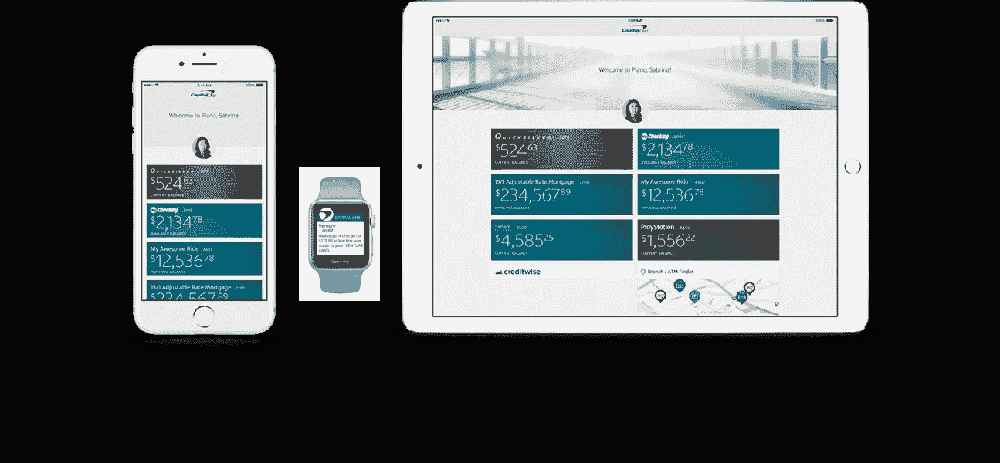
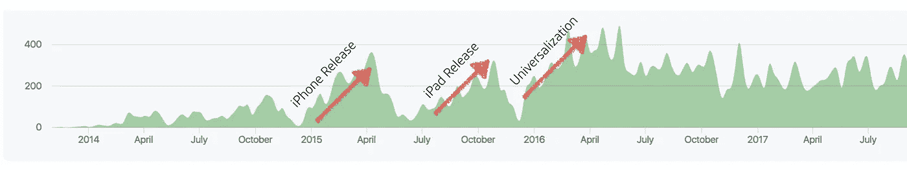
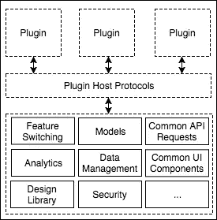
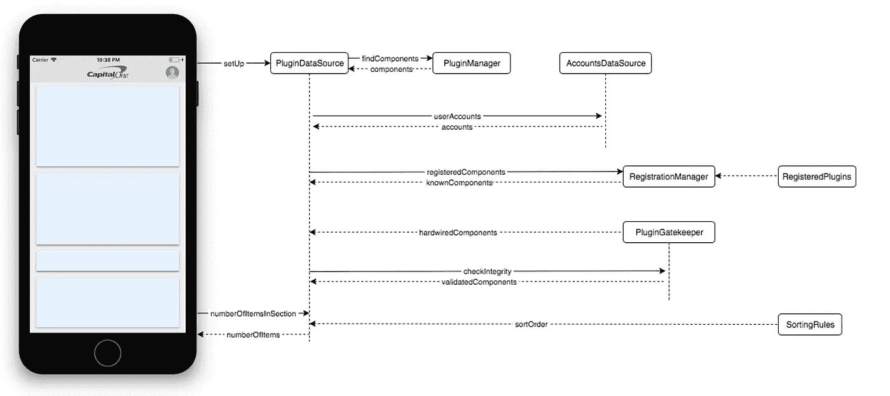
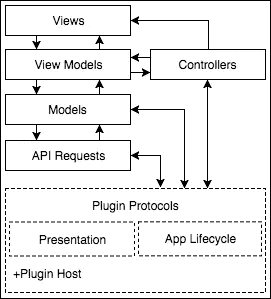
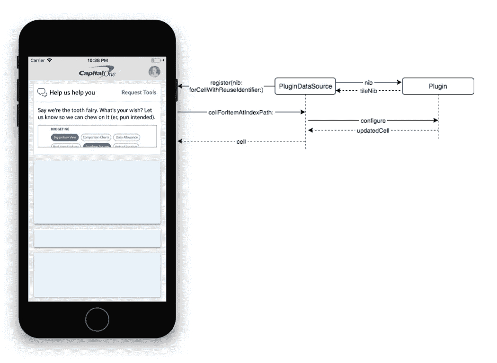
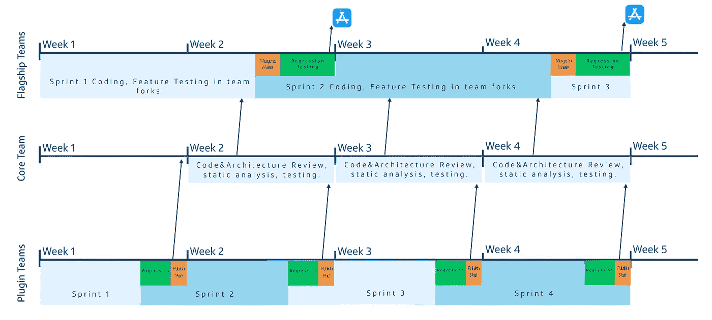

# Capital One 基于插件的架构和扩展 iOS 开发

> 原文：<https://medium.com/capital-one-tech/plugin-based-architecture-and-scaling-ios-development-at-capital-one-fb67561c7df6?source=collection_archive---------0----------------------->

企业领域最大的移动组织之一是如何在不影响质量的情况下，每隔一周发布一次旗舰应用的新版本的？拥有数千万用户的活跃用户群，约 100 名软件和质量保证工程师在同一个 iOS 代码库中工作；每年发布更多的功能，而且做得更频繁，这无疑是一个不小的成就。

我们目前的 iOS 应用程序的历史始于 2014 年，当时我们决定在内部构建一个完全原生的服务应用程序。我们重组了我们的开发基础设施，引进了世界一流的人才，并专注于在后端使用现代 API 基础设施为我们的用户构建出色的移动体验。我们的努力取得了成果，2015 年我们发布了旗舰 iPhone 和 iPad 应用程序以及 Apple Watch 扩展。

到 2016 年，这两款应用都受到了我们用户的热烈欢迎，我们的工作开始获得[全行业的赞誉](https://drivenxdesign.com/APPS16/project.asp?ID=14771)。在技术、团队构成和应用规模方面也发生了很大变化。我们将我们的 iPhone 应用程序转换为通用程序，并取消了独立的 iPad 应用程序。我们的组织规模每年都在翻倍，我们面临着许多其他成长中的 iOS 组织所面临的相同挑战:构建时间、合并冲突和工程师的相互碰撞。拥有超过 350，000 行的代码库，我们开始碰壁。

今天，我想谈谈一个架构，它帮助我们克服了这些问题，使我们能够以最小的回归风险并行地构建和测试功能。一年多来，我们一直在这个架构上成功地构建和快速迭代某些特性，同时显著地扩大了平台贡献者的数量。

# 代码不断增长

查看下面的代码提交数量与项目时间表，您可以看到我们在 2015 年年中经历了一个上升期，同时向应用程序的第一个版本进军。今年晚些时候，就在 iPad 应用发布之前，另一个高潮也随之而来。然后，我们会看到圣诞节和新年前夕的下降，在此期间，我们历史上没有生产发布。进入 2016 年，提交量会更大，因为我们有更多的人为代码库做出贡献，也因为我们正在合并 iPhone 和 iPad 代码库。之后我们会看到一个平台期，这有几个原因。

*Contributions to master branch, excluding merge commits, since the inception of the flagship app.*

首先，我们用 Swift 编写应用程序的赌注得到了回报。它不仅帮助我们吸引和雇佣最优秀的人才，而且由于它的类型安全和编译时检查，这款应用比我们以前开发的任何应用都更加稳定。然而，与此同时，构建时间比预期的要长。一些开发人员报告在干净的构建上有 30 分钟的等待时间，任意的 Xcode 崩溃也是一个问题。Swift 不是向后兼容的，也不符合 ABI 标准，所以每次我们不得不迁移到新版本时，都要付出相当大的努力。如果你仔细观察图表，你不会看到 2016 年圣诞假期有所下降，因为一群雄心勃勃的工程师正在努力将我们的代码库从 Swift 2.3 移植到 Swift 3.0！

这并不是说斯威夫特是唯一的因素。让将近 100 个人在同一个代码库上工作意味着当某个东西坏了，它对每个人都坏了。有更多的合并冲突需要解决。更多的特性意味着现在要运行更多的回归测试，这需要更多的时间。不幸的是，每个新版本都增加了更多的回归。

面对这些挑战，我们很容易举手投降。然而，随着工程团队的扩大，我们决心保持我们的速度并提高代码质量。我们开始尝试一些实践。我们使用了所有可用的监控工具来找出哪些功能没有按时交付，它们延迟了多长时间，以及延迟的原因是什么。通过这种方式，我们能够确定常见的棘手问题，如 API 可用性和合同一致性，建立标准，与后端团队合作并获得他们的认可，并将健康检查机制集成到我们和他们的软件交付流程中，从而改进我们的评估。

我们还投资于我们的构建基础设施——增加容量、优化构建脚本，并缩短提交 PR 和完成所需测试之间的时间。我们通过在 CI/CD 周期中为不同的目的开发和维护多组测试来重新关注我们的测试自动化工作。在这种方式下，我们所谓的“冒烟测试”使用模拟 API 响应，并由每个 PR 提交触发。关键测试每天在主分支上运行，我们的任务是在同一天修复表面缺陷。然后，我们有一组更全面的测试，每晚在主分支和单独的团队分支上运行。我们改进了单元测试的覆盖率，将它作为一个指标整合到每个 PR 提交中，甚至自动化了一些测试的创建，比如易访问性测试。我们甚至深入研究了如何改进 Swift 构建时间，并提出了一些有趣的观察和解决方法。

# 克服障碍的架构设计

尽管我们的努力产生了显著的影响，但我们开始观察到证据表明，单靠这些努力是不够的。如果这种趋势持续下去，我们可能无法在保持速度和质量的同时，满足向移动组织添加更多功能和工程师的需求。我们开始重新思考我们的移动开发方法。我们需要一种新的机制来支持移动组织未来几年的发展，提供保护，并支持实验。我们需要未雨绸缪，在问题发生之前主动提出解决方案。

我们制作了一些想法的原型，在实践中进行了测试，评估了利弊。经过无数次迭代，我们最终开发了一个基于插件的架构，以及一个满足我们目标的合作伙伴模型。这种架构是可扩展的和稳定的，它允许我们创建有价值的内容，并将内部和外部开发团队集成到软件开发生命周期中，而不会影响速度或质量。

下面是它在高层次上的工作方式。

把旗舰应用程序想象成一个容器，把功能想象成独立开发的独立插件。在应用程序和插件之间有一个定义明确的接口。通过遵守大量的协议，插件与应用程序进行通信，而不知道它的任何实现细节。这是应用程序级别的封装。

The flagship app acts as a container and its services are made available through protocols.

我们的平台架构团队为特性团队提供一个初始项目，该项目带有所有必要的核心网络、持久性、UI 库、单元和 UI 测试，以及必要的元数据。starter 项目已经符合协议，并且有其函数的存根实现。这个项目编译成一个框架，所以当特性准备好发布时，所有者团队发布他们框架的新版本。然后，我们的团队每周一次推出所有插件的新版本，执行自动化测试、静态分析、安全扫描，然后将这些插件集成到旗舰应用程序中。这个过程中的所有步骤都是完全自动化的。该功能与远程配置相关联，我们可以随时打开或关闭它。一旦该功能发布，我们将监控指标并收集反馈。然后，功能团队迭代该功能，我们分阶段逐步将其发布给更大的用户群。

在过去的 18 个月里，我们已经成功地开发并试验了该架构的许多特性。因为我们能够以有节制的方式快速发布功能，并将分析流纳入我们的管道，我们立即开始分析用户参与模式。这有助于我们重复我们的想法，我们已经发布了许多工具，帮助我们的用户更好地控制他们的财务生活。

# 插件交互

让我们来看看这些插件在它的生命周期中是如何与旗舰应用交互的。该应用程序的主屏幕有一个集合视图，显示客户的帐户和各种优惠。或者像信息传递这样的事情。插件通过数据源和委托模式暴露在同一个集合视图中。在设置阶段，所有的框架都被分析以确定哪些是插件。然后，这些插件被初始化，并检查它们的权限、真实性和完整性。规则引擎决定组件的显示顺序，然后插件数据源聚集插件和帐户信息，并将其提供给集合视图。

*Components participating in the view controller lifecycle.*

既然集合视图知道要显示多少项，并且我们的插件已经被识别和初始化，我们可以看看每个单元格是如何呈现的。

A plugin is built as a standalone component that does not know the implementation details of its container app.

插件数据源要求每个插件提供一个视图作为它们的入口点。为此，我们有一个框架，提供可以根据需要定制的模板化瓦片。这些单幅图块随后会在集合视图中注册。当集合视图为特定插件请求一个单元格时，插件数据源会通知插件，以便它可以配置自己的图块，并在必要时开始预取数据。一些插件在它们的磁贴上动态显示数据，它们可以通过插件数据源请求集合视图更新它们的 UI。

Plugins configure and update their collection view cells.

现在插件可见了，它们可以开始接收用户事件了。他们可以选择处理 UI 手势来提供自定义行为，如水平滚动或点击。默认情况下，每个用户事件都被记录为一个事件，并且组件会收到一个点击手势的通知。该组件可以通过请求呈现自定义视图控制器来响应点击，之后该组件拥有用户体验。我们提供标准控件，以便在交互的任何时候，用户都可以导航回应用程序的主屏幕。

# 专为增长而设计

那么，这种架构如何支持我们组织的发展呢？

通常，团队在两周的冲刺中前进，所有的特性进入一个单独的回购，每个团队拥有这个回购的一个分支。在冲刺阶段，每个团队在他们的团队分叉中发展，执行评审和测试。在 sprint 接近尾声时，团队回购中经过验证的代码被合并到单个回购中，我们在其中执行集成和回归测试。这种模式的缺点是增加更多的团队会导致我们触及边界，因为每个团队都在相同的代码库上工作。

旗舰团队在两周的冲刺中，在相同的代码库上工作。插件团队在一周的冲刺中在孤立的代码库上工作。

另一方面，插件架构允许团队在独立的代码库上工作。插件团队建立在我们提供给他们的独立工具上。在这个工具中，我们公开了一些公共设施，如核心网络、数据管理、实用程序库、UI 控件和设计组件。插件团队在一周的冲刺中前进，在每个周末，他们发布一个语义版本的框架。核心团队执行代码的自动化分析、安全扫描、测试和审查。在接下来的一周结束时，该功能将通过我们的依赖关系管理器集成到旗舰应用程序中。

这允许特性的开发和测试以分布式的方式并行发生，因此在加速交付速度的同时有助于组织的扩展。作为一个额外的好处，这种架构可以防止大量的控制器和分层违规，因为所有的功能都是沙盒化的，并且必须通过定义良好的接口相互交互以及与应用程序交互。

# 护栏

让我们看看我们如何降低风险，并为功能团队做好准备，以便他们可以将时间和精力集中在为我们的用户创造价值上。

## 设计方面

在设计方面，我们有许多协作会议，在此期间，我们的设计师会提供初步的设计咨询。这些对话强调了设计指导方针，并提倡重用设计组件框架和 UI 设计资源。有些特性需要独特的设计模式，有时这会导致特性团队为新的设计标准做出贡献，然后这些标准会被其他特性团队重用。一旦设计成熟并通过审核，开发人员就可以开始实现功能和用户体验流程。

## 工程方面

在工程方面，这需要三个阶段。

*   首先，我们组建一个功能团队，并让他们的项目起步。在内部，我们实践开源模型，并构建了许多核心框架，包括网络、数据持久性、UI 控件、设计组件、分析、功能标记和助手功能。我们公开这种开箱即用的功能，并提供一个已经与我们的移动编排层集成的模板项目。
*   第二，在开发阶段，我们提供支持，帮助识别依赖关系、后端集成的复杂性，并鼓励软件最佳实践，如干净的架构、防御性编码原则、可伸缩性和安全性。我们经验丰富的 DevOps pipeline 将林挺、静态分析、性能测试、安全扫描和代码覆盖率指标自动化到代码审查流程中，降低了人为错误的风险。
*   在最后一个阶段，当特性投入生产时，我们会密切地检测和监控特性的性能和健康指标。我们也有适当的系统来确保该特性由可用的、可访问的并且符合契约的 API 支持。我们通过使用大量内部工具和各种软件分析服务，在客户端和后端都做到了这一点。然后，我们分析趋势，并在必要时让自动化系统提醒利益相关方。

# 授权实验

每个特征都是从一个假设开始的。我们认为我们的用户有一个问题，我们已经确定这个问题值得解决。我们知道有多种方法可以解决这个问题，但我们不知道哪一种是最好的。然而，我们已经进行了内部和外部用户测试，所以我们有一些好主意。我们也定义了成功的样子。然后，我们实施这些解决方案中的一个，将其呈现给我们的用户，收集数据，分析数据，做出数据驱动的决策，并迭代我们的解决方案，直到我们确信我们已经创造了用户需要和想要的体验。

这种模式如此成功的主要原因之一是我们致力于以用户为中心的决策。开箱即用的工具包括由后端远程配置 API 支持的特性切换 SDK。通过分阶段展示这些功能，我们能够向部分用户发布这些功能，并观察参与模式。我们拥有内置的分析软件开发套件，能够近乎实时地安全记录和报告用户事件，因此我们可以进一步分析指标并微调我们的流量。因此，我们能够在工程师、设计师和用户之间创建一个积极的反馈回路，从而加快迭代速度，创造更好的用户体验。

# 结论

到目前为止，我们已经成功地运用我们的指导原则，通过雇佣和留住最优秀的人才，建立了一个世界级的工程组织；了解、采用和增加行业最佳实践；并保持在工具和技术的前沿。当我们的代码库变得如此之大，以至于我们开始观察到我们更快速地迭代功能的能力在减速，我们建立了一个架构，封装了我们代码库的复杂性，并定义了新的过程，帮助将新的开发人员和合作伙伴集成到软件交付生命周期中。多年来，我们通过并行开发和测试新功能，帮助扩大了我们组织的规模。我们还改进了我们经验丰富的工具和自动化管道，以商品化功能测试和用户参与度指标的收集。通过授权实验，在想法成为成熟的功能之前对其进行测试，现在速度更快，成本更低。

这是我有幸合作过的最有潜力的技术、架构和团队。看到我们接下来将取得的成就，我非常激动！

# 有关系的

*   [在边缘设计微体验](/capital-one-tech/designing-microexperiences-on-the-edge-for-mobile-eb4e6c3a3f2e)
*   [迭代交付和基于合同的实现](/capital-one-tech/iterative-delivery-and-contract-based-implementation-for-apis-behind-capital-ones-mobile-experiences-6abfb6ad49e1)
*   [移动编排——边缘创新](/capital-one-tech/mobile-orchestration-innovation-on-the-edge-9835e4cbd69e)
*   [Capital One 的移动边缘工程团队利用的 4 种弹性模式](/capital-one-tech/resiliency-patterns-at-the-edge-capital-one-a5b4d41d477e)

***披露声明:以上观点为作者个人观点。除非本帖中另有说明，否则 Capital One 不属于所提及的任何公司，也不被其认可。使用或展示的所有商标和其他知识产权都是其各自所有者的所有权。本文为 2018 首都一。***