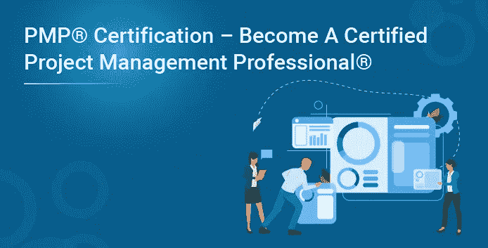
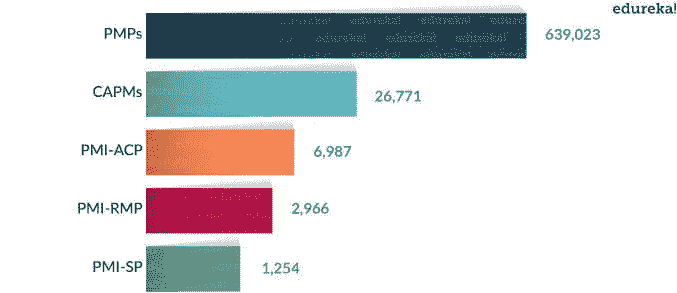
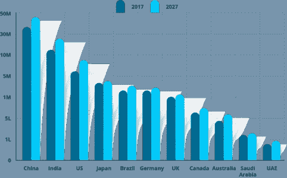
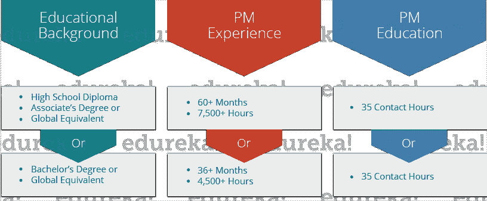
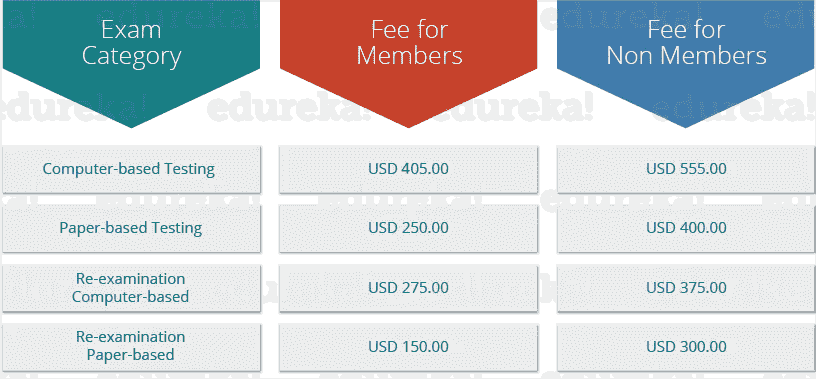
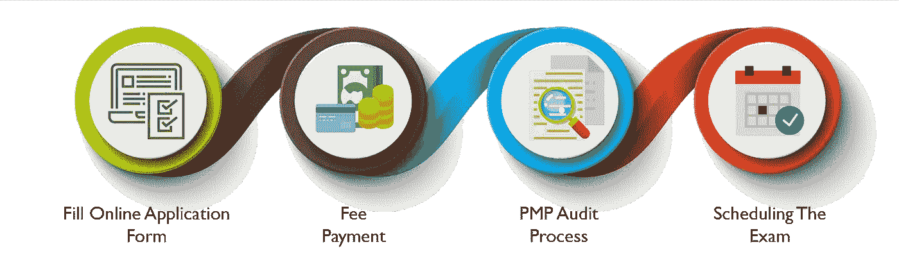

# PMP 认证——成为认证项目管理专家

> 原文：<https://medium.com/edureka/pmp-certification-b6b4dfd71e07?source=collection_archive---------4----------------------->

无论是哪种行业，项目管理都是决定项目成败的一个不可或缺的因素。随着时间的推移，全球各地的组织都在寻找不仅才华横溢、经验丰富，而且持有相关认证的专业人士。有“n”种认证可以让你进入认证专家的行列。通过这个博客，我将专门讨论 *PMP 认证*，这被认为是最有声望的认证。

以下是我今天要讨论的主题:

*   什么是 PMBOK *指南？*
*   什么是 PMI？
*   什么是 PMP 认证？
*   为什么 PMP 认证？
*   PMP 认证考试
*   PMP *认证考试的先决条件*
*   PMP 认证考试详情
*   PMP 认证费用结构
*   应用进程

在开始您的 PMP 认证之旅之前，让我们来看看 PMP 认证所围绕的几个术语。

# 什么是 PMBOK 指南？

**PMBOK*****Guide**代表**P**project**M**management**B**ody**O**f**K**knowledge。它是流程、最佳实践、术语和指南的完整集合，被全球公认为项目管理行业的标准和最佳实践。PMBOK 指南的第一版于 1996 年出版。最新的是第 6 版，2018 年 3 月发布。*

*每隔五到七年，PMI 都会进行一次**角色划分研究** (RDS)，这是一项针对项目管理社区的全球性调查，旨在确定自上次修订以来项目经理的日常任务是如何演变的。*

# *什么是 PMI？*

*PMI 代表**项目管理研究所**。这是一个非营利的项目管理专业成员协会，总部设在美国宾夕法尼亚州。PMI 的主要作用是积极参与该行业的宣传，开展研究，提供职业道路，并为项目管理制定专业标准。PMI 提供 8 种专业认证，PMP 认证是最受欢迎的一种。它们如下:*

*   *PMP (项目管理专业)*
*   *PgMP (项目管理专业)*
*   *PfMP (投资组合管理专业人士)*
*   *CAPM (项目管理认证助理)*
*   *PMI-PBA (商业分析专业 PMI)*
*   *PMI-ACP (PMI 敏捷认证从业者)*
*   *PMI-RMP (PMI 风险管理专家)*
*   *PMI-SP (PMI 调度专业)*

*下图显示了 PMP 认证相对于其他主要认证的受欢迎程度。*

**

# *什么是 PMP 认证？*

****项目管理专业认证*** *(PMP)是全球公认的项目管理专业认证项目，将专业人士的教育和项目管理经验合法化。**

*它是由美国项目管理研究所(PMI)提供的。在 IT 行业，术语项目管理指的是通过定义明确的阶段(称为启动、计划、执行、控制和结束)进行软件开发的系统方法。*

*目前，共有 729，552 名证书持有人活跃在全球 210 个国家和地区的 284 个特许分会。这本身就是一个非常大的数字。查看下图，了解过去几年 PMP 认证会员数量的增长情况。*

# *为什么选择 PMP 认证？*

*根据 PMI 2014 年的调查报告，到 2020 年，**项目管理专业人士**将会有大量的机会。这背后的原因是，当公司从各种文化背景中招聘项目经理时，对具有标准化技能的项目经理的需求最终会增加。这些项目经理将承担不同系统重组的项目，将战略愿景转化为实际目标，并确保有效和可接受的结果，同时平衡各种项目限制。*

*下图显示了到 2020 年各个国家的预期机会增长。*

**

*现在，如果你还不满意，那么看看下面几个更有趣的观点:*

1.  **跨多个行业的公用事业**
2.  **改善团队工作和人员定位**
3.  **提高风险管理技能**
4.  *为你提供持续学习的机会*
5.  **提高你解决问题的能力**
6.  **让你更有责任感**
7.  **提升你的领导素质**
8.  **为您提供超越非 PMP 的优势**
9.  **给你一个全球认可的平台**
10.  **提升你的薪水**

# *PMP 认证考试*

*在本节中，我将详细讨论 PMP 认证考试流程。所以，首先让我给你解释一下申请这个考试的先决条件。*

# *PMP 认证考试的先决条件*

*每个人都不能选择 PMP 认证。你需要满足一些先决条件才能参加这个认证项目。PMI 要求 PMP 认证的申请人必须拥有高中学历以及大专学历或全球同等学历。此外，候选人必须有超过 60 个月或 7，500 多个小时的项目管理经验。简而言之，前提条件如下:*

**

***注:***

*   **项目持续时间不得重叠**
*   **过去八年的项目经验**
*   **抽查 20%的申请**
*   **指定项目管理工作期间的指派无关紧要**

*有一些你不应该忽视的细节。第一，你一年只能参加三次 PMP 考试，你的项目管理经验不能超过 8 年。我要强调的第二件事是*“这门课不是给大一新生上的”。*所以，如果你是大一新生，你需要获得一定数量的 **PDU** (专业发展单位)才能申请 PMP 认证。*

# *PMP 认证考试详情*

*   *200 道选择题*
*   *4 小时完成考试*
*   *没有负分*
*   *随机插入试卷中的 25 个问题是没有评分的样题*
*   *这个结果是基于对 175 个问题的回答*
*   *要通过考试，你需要正确回答 106 个问题*
*   *考试前会有 15 分钟的考试形式演练*

*200 个问题中的每一个都基于“PMP 考试规范”，该规范本质上描述了 PMI 规定的五个绩效领域下的任务。这些领域及其在考试中的体重年龄是:*

**

# *PMP 认证费用结构*

*下面的表格描述了考试费的完全分解。*

**

****注:****

*   **PMI 会员费— 139 美元**
*   **当地 PMI 分会会员——每个分会都不同(5 美元— 15 美元)**
*   **一年只允许 3 次 PMP 考试**
*   **认证 PMP 必须在三年周期内获得 60 个专业发展单位(PDU)。PDU 可以通过多种途径获得。**

# *PMP 认证考试申请流程*

**

*上图描绘了 PMP 认证申请流程中涉及的四个步骤。我们来详细讨论一下:*

****注意*** *:在你开始填表之前，确保你符合条件。如果你不是，我建议你不要申请，因为这会浪费你的时间、精力和金钱。此外，检查你是否缺少什么要求。如果你是，请在申请前满足他们。**

1.  ***填写在线申请表:**这个申请需要很多资料。分为三个部分:
    **第一步:**概况
    **第二步:**项目管理经验
    **第三步:**35 小时联系培训项目详情
    这种申请需要大量的资料以及时间。未完成的申请表可以保存，以后再完成。您可以在 90 天内完成表格的填写，在此期间，PMI 会不断提醒您完成表格。因此，您需要提供一个有效的电子邮件 id。你必须记住的一件事是，一旦你开始填满它，它就不能被取消。
    在提交申请之前，请仔细检查您提供的详细信息，否则以后更改会很麻烦。
    *注:一旦您提交了您的申请，PMI 将需要 5-7 个工作日来审核您的申请。如果你的申请中有什么遗漏，PMI 会通过电子邮件通知你。**
2.  ***费用支付:**一旦收到并接受您的申请，PMI 将向您发送一封确认电子邮件，要求您支付费用。如果你不符合审计的要求，你会收到退款。*
3.  ***PMP *在提交给 PMI 的所有申请中，只有一小部分被选中。应用程序选择是随机进行的。如果您被选中进行审核，PMI 将会通知您。一旦您收到确认邮件，在 90 天内，您需要提交所需的文件。一旦您的文件被提交，在 6-7 个工作日内，审核过程将开始。此外，您的资格期限将从您的审计通过之日开始。****
4.  ***安排考试:**如果您的审核通过，PMI 会给您发送一封带有唯一代码的电子邮件。使用此代码通过 **Prometric** 网站安排考试。你将有一年时间通过考试。如果你需要重新安排考试时间，你可以在考试前两天这样做。*

*至此，我们已经结束了这篇关于 PMP 认证的博客。我希望你能够理解 PMP 认证的细节、要求和好处。*

*如果你想查看更多关于人工智能、DevOps、道德黑客等市场最热门技术的文章，那么你可以参考 [Edureka 的官方网站。](https://www.edureka.co/blog/?utm_source=medium&utm_medium=content-link&utm_campaign=pmp-certification/)*

**原载于 2017 年 6 月 30 日*[*【https://www.edureka.co】*](https://www.edureka.co/blog/pmp-certification/)*。**