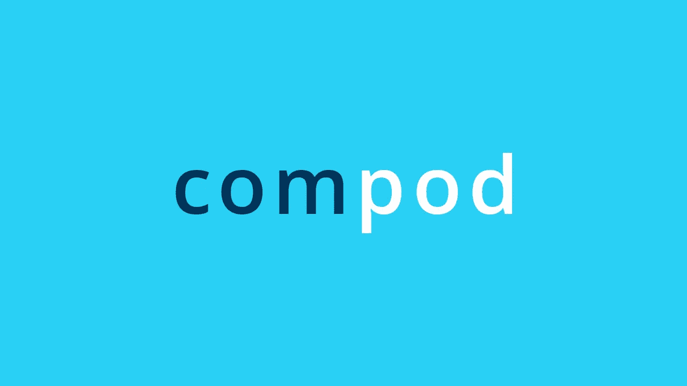

# Podcast: Få verdifull innsikt med datavisualisering

> 原文：<https://medium.com/compendium/podcast-f%C3%A5-verdifull-innsikt-med-datavisualisering-5b703d9c7985?source=collection_archive---------0----------------------->

Hvordan utnytte data for å optimalisere egen virksomhet? Mange virksomheter sitter på enorme datamengder, men mangler en plan for hvordan data kan benyttes til å få verdifull innsikt som er viktig for å kunne ta strategiske beslutninger og se frem i tid. Så hvor begynner man? Og hva bør man fokusere på?

I denne podcasten snakker [Filip Van Laenen](https://medium.com/u/5e463e07259f?source=post_page-----5b703d9c7985--------------------------------) , fagdirektør for applikasjonsutvikling i Computas, med UX-designer Marte Rimer og Tech lead Jo Inge Stubbe om deres erfaringer fra tidligere prosjekt. Her snakker vi bl.a. om hvordan det er å komme i gang med å utnytte data på tvers av kilder og systemer og underverker en god visualisering kan gjøre.

 [## ‎Computas AS on Apple Podcasts

### ‎Podcast by Computas AS

podcasts.apple.com](https://podcasts.apple.com/no/podcast/computas-as/id1251458781?mt=2) 