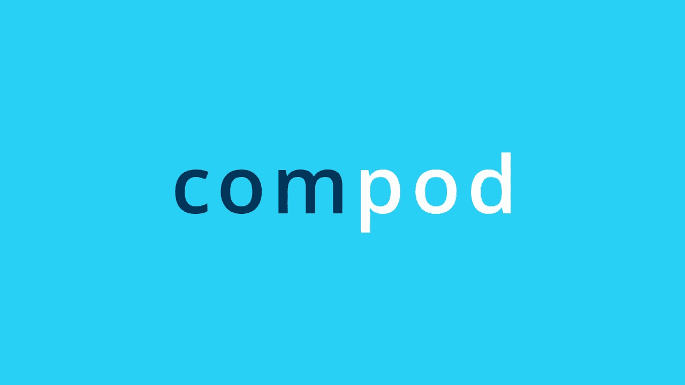

# Podcast: .NET 6

> 原文：<https://medium.com/compendium/podcast-net-6-443a6cf33590?source=collection_archive---------1----------------------->

I denne episoden snakker [Filip Van Laenen](https://medium.com/u/5e463e07259f?source=post_page-----443a6cf33590--------------------------------) med Johannes Holstad og Jørn Letnes om den kommende .NET 6-releasen, men bl.a. nye features i C# 10, hva som kommer i Visual Studio 2022, hva MAUI er for noe, og om det nå endelig betyr slutten for WinForms.

 [## ‎Computas AS on Apple Podcasts

### ‎Podcast by Computas AS

podcasts.apple.com](https://podcasts.apple.com/no/podcast/computas-as/id1251458781?mt=2) 