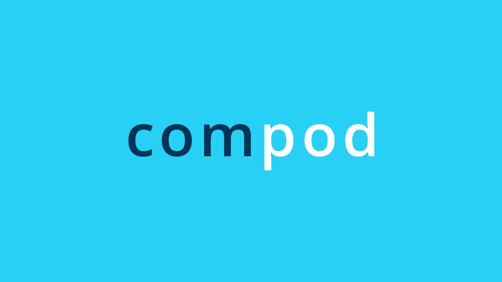

# Podcast: Python 3.9 og 3.10 — Hva er nytt?

> 原文：<https://medium.com/compendium/podcast-python-3-9-og-3-10-hva-er-nytt-8cd9db7bc80c?source=collection_archive---------1----------------------->

I de neste podcastene skal vi snakke om programmeringsspråkene Computas satser på i 2021\. Først ut er Python! Python er et av verdens aller mest populære programmeringsspråk. Språket er intuitivt, lett å lære og gratis å bruke. I denne podcasten snakker [Filip Van Laenen](https://medium.com/u/5e463e07259f?source=post_page-----8cd9db7bc80c--------------------------------) , [Anders Elton](https://medium.com/u/b9ea9988486c?source=post_page-----8cd9db7bc80c--------------------------------) og [Jostein Leira](https://medium.com/u/dbdba8526170?source=post_page-----8cd9db7bc80c--------------------------------) om viktige funksjoner og endringer i Python 3.9 og 3.10.

 [## ‎Computas AS on Apple Podcasts

### ‎Podcast by Computas AS

podcasts.apple.com](https://podcasts.apple.com/no/podcast/computas-as/id1251458781?mt=2) 