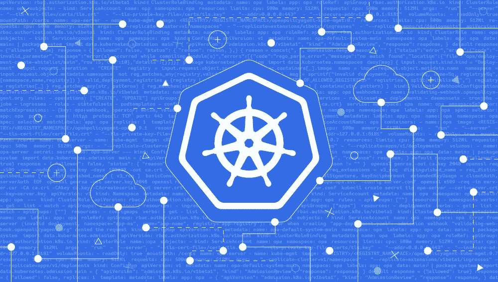
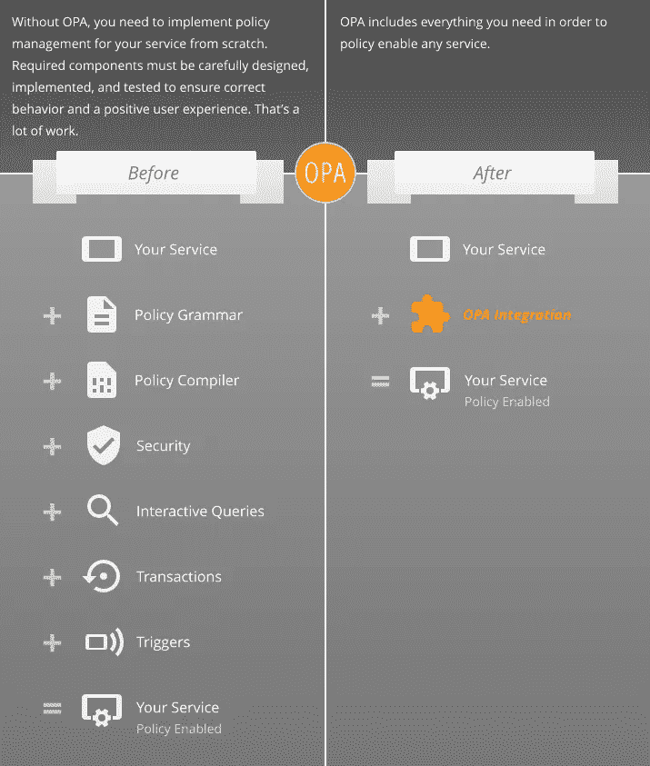
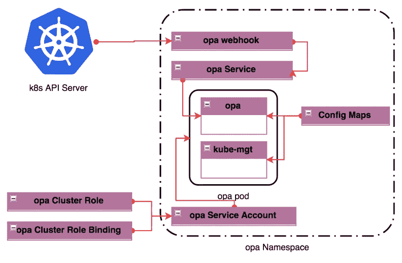
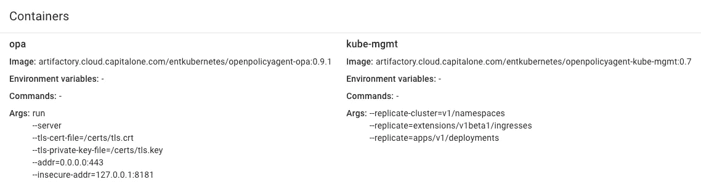
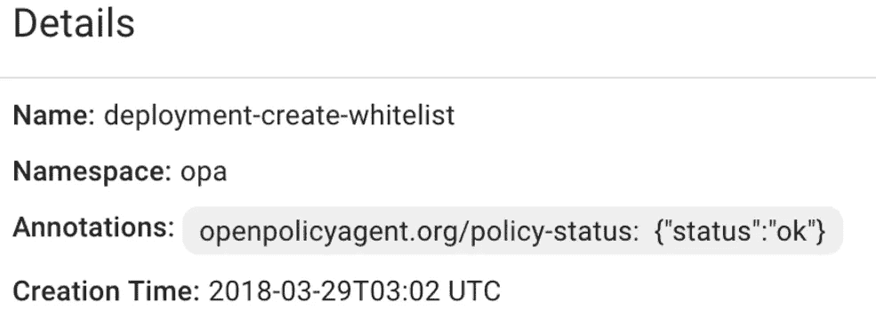

# 使用开放策略代理启用策略的 Kubernetes

> 原文：<https://medium.com/capital-one-tech/policy-enabled-kubernetes-with-open-policy-agent-3b612b3f0203?source=collection_archive---------0----------------------->

## 利用云计算和开发运维解决常见问题



迁移到公共云在很大程度上是为了解决所有应用程序团队共同关心的“基础架构供应”问题。云帮助组织极大地减少了对“[无差别的繁重工作](https://www.cio.co.nz/article/466635/amazon_cto_stop_spending_money_undifferentiated_heavy_lifting_/)”的需求，即交付应用程序和功能所需的直立服务器、网络和安全性。迁移到容器和 Kubernetes 可以被看作是下一次发展，允许开发团队专注于他们的工作，而不是基础设施。

解决这些共同需求也是 DevOps 持续旅程的一大部分。事实上，DevOps 完全是为了减少可变性和人为错误，提高可重复性，并实施由策略支持的实践，以可靠和高效地交付应用程序和功能。这在 Kubernetes 都很重要。而且，我们知道，通过云计算和开发运维解决功能团队的常见问题，可以让应用团队更快地交付，让业务更快地发展。

# 常见的应用问题

当我们采用现代方法来提供基础设施时，我们也使用模式来解决构建应用程序和交付服务和 API 的常见问题。就像十年前[面向方面编程(AOP)](https://en.wikipedia.org/wiki/Aspect-oriented_programming) 通过满足[横切关注点](https://en.wikipedia.org/wiki/Cross-cutting_concern)所做的一样，我们正在通过采用模式来解决现代应用程序的设计和构建，例如[12 因素](https://12factor.net/)方法。策略支持也是一个常见问题，我们可以利用它来更好地管理应用程序及其相关环境。

# 什么是政策？

如[开放策略代理文档网站](http://www.openpolicyagent.org/docs/)所示:

> “所有组织都有政策。策略对于组织的长期成功至关重要，因为它们编码了关于如何遵守法律要求、在技术限制内工作、避免重复错误等的重要知识。
> 
> 最简单的形式是，策略可以基于写下的规则或未言明但渗透到组织文化中的约定来手动应用。策略也可以通过应用程序逻辑来实施，或者在部署时静态配置。"

简而言之，策略是我们交付应用和基础设施的界限。这些界限决定了我们的可交付成果的验收标准，以及我们对完成的定义。衡量我们的部分标准是我们满足这些政策要求的程度，以及我们在客户使用我们的解决方案时如何有效地让他们遵守政策。

# 满足常见问题的自动化策略

成功的 DevOps 公式的一部分是确保我们在推动计算环境的变化时遵循内部政策和程序。并非所有的策略实施都是通过自动化开发运维管道完成的。例如，像[云保管人](https://www.capitalone.io/)(开源规则引擎)这样的工具被用于自动化策略的实施，以维护管理良好且安全的云。这些政策旨在为云的使用设置护栏，而不会对云用户产生负面影响。

# 通用策略启用的情况

对于其他应用程序设置，应考虑通过云托管或类似工具实施的自动化策略实施类型。在规定的策略内执行是云原生应用程序的一个常见问题。[开放策略代理(OPA)](https://www.openpolicyagent.org/) 是一种通用的策略启用方法。

根据文档，开放策略代理(OPA)是:

> “…一个轻量级通用策略引擎，可以与您的服务放在同一位置。您可以将 OPA 集成为 sidecar、主机级守护进程或库。
> 
> 服务通过执行查询将策略决策卸载给 OPA。OPA 评估策略和数据以产生查询结果(这些结果被发送回客户端)。策略是用高级声明性语言编写的，可以通过文件系统或定义良好的 API 加载到 OPA 中。"



OPA handles the heavy-lifting of policy decisions, and removes the need for custom programming in each application/service. Image Source: openpolicyagent.org

# 在 Kubernetes 中实现准入控制策略

随着我们转向容器和容器编排平台，还需要自动化的策略执行。作为我们企业 Kubernetes 平台团队的技术主管，我一直在研究和开发集群中管理策略的模式。

Kubernetes 中的一个策略控制点是[准入控制](https://kubernetes.io/docs/reference/access-authn-authz/admission-controllers/)。使用 Kubernetes 准入控制器，我们可以在相关对象(提供所需集群状态的意图)被持久存储到 [etcd](https://coreos.com/etcd/) 键/值对象存储之前，拦截对 Kubernetes API 服务器的请求。

> 我研究过的模式可以在这里[找到](https://www.openpolicyagent.org/docs/kubernetes-admission-control.html)，它的同伴 GitHub repos [在这里](https://github.com/open-policy-agent/opa)和[在这里](https://github.com/open-policy-agent/kube-mgmt)。

# 实现 Kubernetes 部署许可控制器

(我将关注的 OPA 用例是控制容器图像的来源，作为 Kubernetes 部署清单的一部分。)

作为良好治理和法规遵从性立场的一部分，理解、指导甚至控制 Kubernetes 工作负载的映像源非常重要。通过 OPA 和 Kubernetes 验证准入控制器，事件驱动和动态配置的基于自动化策略的决策可以防止不需要的映像部署到您的集群中。在这个解决方案中，`opa`服务连接到 Kubernetes `ValidatingAdmissionWebhook`，并监听来自 Kubernetes API 服务器的部署`CREATE`和`UPDATE`事件。

该解决方案包括创建一个由以下对象组成的 Kubernetes 对象图:



OPA Solution Kubernetes Object Graph

在一般操作中，OPA 服务器是一个 RESTful 服务器，它公开服务来产生和使用事件数据和策略。由于 OPA 是与域无关的，任何数据都可以发送到 OPA 服务器，由任何策略进行评估，只要策略与传入的事件数据相匹配。

在我的示例解决方案中，OPA 策略作为 Kubernetes ConfigMap 资源存储在`opa`名称空间中。策略被称为`kube-mgmt`的 sidecar 工作负载存储在`opa`容器中。`kube-mgmt`读取应用于`opa`名称空间的配置映射，并编译它们以验证正确的语法。

编译成功后，策略由`kube-mgmt`存储在`opa`容器中。此外，`kube-mgmt`被配置为在事件不包含评估策略中定义的逻辑所需的所有数据的情况下，定期提取`opa`服务可能需要的资源元数据，以正确评估 API 服务器事件。`kube-mgmt`扫描的资源是用 Kubernetes 部署清单中的容器规范参数配置的。



opa and kube-mgmt workloads in opa pod

# 逐步准备 OPA 工件

首先，我们为解决方案应用名称空间和授权资源，如下所示。`opa` ServiceAccount 使用`opa` ClusterRoleBinding 绑定到`opa` ClusterRole，以访问其中包含的权限。

```
apiVersion: v1
kind: Namespace
metadata:
  name: opa
  labels:
    app: opa
---
apiVersion: v1
kind: ServiceAccount
metadata:
  name: opa
  namespace: opa
  labels:
    app: opa
---
kind: ClusterRole
apiVersion: rbac.authorization.k8s.io/v1beta1
metadata:
  name: opa
  labels:
    app: opa
rules:
  - apiGroups: [""]
    resources:
      - namespaces
    verbs:
      - get
      - list
      - watch
  - apiGroups: ["extensions"]
    resources:
      - ingresses
    verbs:
      - get
      - list
      - watch
  - apiGroups: ["apps"]
    resources:
      - deployments
    verbs:
      - get
      - list
      - watch
  - apiGroups: [""]
    resources:
      - configmaps
    verbs:
      - get
      - list
      - patch
      - watch
---
apiVersion: rbac.authorization.k8s.io/v1beta1
kind: ClusterRoleBinding
metadata:
  name: opa
  labels:
    app: opa
roleRef:
  apiGroup: rbac.authorization.k8s.io
  kind: ClusterRole
  name: opa
subjects:
- kind: ServiceAccount
  name: opa
  namespace: opa
```

接下来，我们构建 OPA 秘密和服务器配置文件，并将`opa-server`秘密应用于`opa`名称空间:

```
openssl genrsa -out ca.key 2048openssl req -x509 -new -nodes -key ca.key -days 100000 -out ca.crt -subj "/CN=admission_ca"cat >server.conf <<EOF
[req]
req_extensions = v3_req
distinguished_name = req_distinguished_name
[req_distinguished_name]
[ v3_req ]
basicConstraints = CA:FALSE
keyUsage = nonRepudiation, digitalSignature, keyEncipherment
extendedKeyUsage = clientAuth, serverAuth
EOFopenssl genrsa -out server.key 2048openssl req -new -key server.key -out server.csr -subj "/CN=opa.opa.svc" -config server.confopenssl x509 -req -in server.csr -CA ca.crt -CAkey ca.key -CAcreateserial -out server.crt -days 100000 -extensions v3_req -extfile server.confkubectl create secret tls opa-server --cert=server.crt --key=server.key
```

接下来，我们使用以下命令部署 OPA 解决方案容器、服务和默认策略配置图:`kubectl apply -f admission-controller.yaml`

下面可以看到 YAML:

```
kind: Service
apiVersion: v1
metadata:
  name: opa
  namespace: opa
  labels:
    app: opa
spec:
  selector:
    app: opa
  ports:
  - name: https
    protocol: TCP
    port: 443
    targetPort: 443
---
apiVersion: apps/v1
kind: Deployment
metadata:
  labels:
    app: opa
  name: opa
  namespace: opa
spec:
  selector:
    matchLabels:
      app: opa
  replicas: 1
  template:
    metadata:
      labels:
        app: opa
      name: opa
    spec:
      serviceAccountName: opa
      containers:
        - name: opa
          image: <REGISTRY>/<REGISTRY_NAMESPACE>/openpolicyagent-opa:0.9.1
          resources:
            limits:
              cpu: 500m
              memory: 512Mi
            requests:
              cpu: 500m
              memory: 512Mi
          args:
            - "run"
            - "--server"
            - "--tls-cert-file=/certs/tls.crt"
            - "--tls-private-key-file=/certs/tls.key"
            - "--addr=0.0.0.0:443"
            - "--insecure-addr=127.0.0.1:8181"
          volumeMounts:
            - readOnly: true
              mountPath: /certs
              name: opa-server
        - name: kube-mgmt
          image: <REGISTRY>/<REGISTRY_NAMESPACE>/openpolicyagent-kube-mgmt:0.7
          resources:
            limits:
              cpu: 500m
              memory: 512Mi
            requests:
              cpu: 500m
              memory: 512Mi
          args:
            - "--replicate-cluster=v1/namespaces"
            - "--replicate=extensions/v1beta1/ingresses"
            - "--replicate=apps/v1/deployments"
      volumes:
        - name: opa-server
          secret:
            secretName: opa-server
---
kind: ConfigMap
apiVersion: v1
metadata:
  name: opa-default-system-main
  namespace: opa
  labels:
    app: opa
data:
  main: |
    package systemimport data.kubernetes.admissionmain = {
      "apiVersion": "admission.k8s.io/v1beta1",
      "kind": "AdmissionReview",
      "response": response,
    }default response = {"allowed": true}response = {
        "allowed": false,
        "status": {
            "reason": reason,
        },
    } {
        reason = concat(", ", admission.deny)
        reason != ""
    }
```

此 YAML 的最后一部分应用包含主 OPA 策略和默认响应的 ConfigMap。该策略用作策略评估的入口点，如果策略与入站数据不匹配，则返回`allowed:true`。

# 准入控制器 Webhook

OPA 准入控制器是一个验证准入控制器，作为服务器 [webhook](https://en.wikipedia.org/wiki/Webhook) 工作。当向 Kubernetes API 服务器发出请求以创建一个受策略准入控制的对象(比如一个部署资源)时，webhook 触发，`opa`和`kube-mgmt`容器协同工作，用策略评估 API 服务器事件和资源数据，以执行准入审查。

如下所示，YAML 设置 webhook 来监听 Kubernetes API 服务器`CREATE`和`UPDATE`事件，以获取包含的资源列表，而不考虑 API 组或 API 版本。YAML 文件底部的`namespaceSelector`允许我们从这个验证解决方案中排除某些敏感的名称空间。

我们`base64`对来自之前 [OpenSSL](https://www.openssl.org/) 操作的`ca.crt`文件进行编码，并将其添加到`webhook-configuration.yaml`中。这将允许 webhook 安全地与`opa`服务进行通信。

> **注意:**与大多数集中管理的 Kubernetes 秘密不同，OPA 秘密只在 webhook 和`opa`服务之间使用。因此，这些秘密是等幂的，并且与集群秘密和 CA 解耦，并且可以根据需要重新生成以重新配置 OPA 解决方案。

```
kind: ValidatingWebhookConfiguration
apiVersion: admissionregistration.k8s.io/v1beta1
metadata:
  name: opa-validating-webhook
  namespace: opa
  labels:
    app: opa
webhooks:
  - name: validating-webhook.openpolicyagent.org
    rules:
      - operations: ["CREATE", "UPDATE"]
        apiGroups: ["*"]
        apiVersions: ["*"]
        resources:
          - pods
          - services
          - replicasets
          - deployments
          - daemonsets
          - cronjobs
          - jobs
          - ingresses
          - roles
          - statefulsets
          - podtemplates
          - configmaps
          - secrets
    clientConfig:
      caBundle: ${base64 ca.crt}
      service:
        namespace: opa
        name: opa
    namespaceSelector:
      matchExpressions:
      - {key: opa-webhook, operator: NotIn, values: [ignore]}
```

在 clientConfig 部分，引用了`opa`名称空间和服务。`CREATE`和`UPDATE`操作将导致这个 webhook 触发。

# 减压阀:农产品加工政策语言

减压阀是 OPA 的本地查询语言。它类似于 Datalog，但也支持结构化文档，如 YAML 和 JSON。OPA 用来审查资源的策略是在减压阀编写的，通常保存为`*.rego`文件。

下面是`deployment_create_whitelist.rego`，它创建了一个可接受的注册中心的白名单，这将是 Kubernetes 部署规范中图像属性的一部分。`deny[msg]`块是这个策略的入口点，它从 API 服务器事件中提取数据。

```
package kubernetes.admission  

import data.kubernetes.namespaces  

deny[msg] {  
    input.request.kind.kind = "Deployment"  
    input.request.operation = "CREATE"  
    registry = input.request.object.spec.template.spec.containers[_].image  
    name = input.request.object.metadata.name  
    namespace = input.request.object.metadata.namespace  
    not reg_matches_any(registry,valid_deployment_registries)  
    msg = sprintf("invalid deployment, namespace=%q, name=%q, registry=%q", [namespace,name,registry])  
}  

valid_deployment_registries = {registry |  
    whitelist = "<COMMA_SEPARATED_LIST_OF_ALLOWED_REGISTRIES>"  
    registries = split(whitelist, ",")  
    registry = registries[_]  
}  

reg_matches_any(str, patterns) {  
    reg_matches(str, patterns[_])  
}  

reg_matches(str, pattern) {  
    contains(str, pattern)  
}
```

从事件中收集数据后，通过调用`reg_matches_any(…)`块将这些数据与白名单进行比较。调用堆栈使用`reg_matches(…)`块来检查注册表变量值(来自容器映像属性)是否包含注册表白名单中的值。如果没有找到白名单中的值，策略评估将使用`deny`进行响应，并返回在`msg`变量中构造的原因。

> **注意:**即使 webhook 为`CREATE`和`UPDATE` API 服务器事件触发，上面的策略仅用于评估部署`CREATE` API 服务器事件中的 JSON 有效负载。提醒一下，如果一个 API 服务器事件被发送到 OPA 进行评估，并且找不到匹配的策略，OPA 将用状态`allowed:true`进行响应。这将告诉 API 服务器继续对 etcd 进行写操作。

# 作为配置映射的策略

减压阀文件作为 ConfigMap 资源存储在 Kubernetes 集群中。当在`opa`名称空间中创建配置映射资源时，`kube-mgmt`边车容器读取配置映射，并编译策略。编译成功后，`kube-mgmt`边车将配置图标注为 ok 状态，如下所示。



接下来，`kube-mgmt` sidecar 将策略内容从 ConfigMap 加载到`opa`容器中作为策略。一旦策略被安装在`opa`容器中，就可以根据部署资源评估策略，在映像规范中查找白名单中的注册中心。如果映像规范中的注册中心不在策略的白名单中，那么部署将会失败，如下所示。

```
Error from server (invalid deployment, namespace="app-ns", name="app-name", registry="app-registry"): error when creating "app-deployment.yaml": admission webhook "validating-webhook.openpolicyagent.org" denied the request...
```

如果`kube-mgmt` sidecar 不能成功编译减压阀策略文件，那么它将用失败状态注释标记配置图，并且不将策略加载到`opa`容器中。

```
openpolicyagent.org/policy-status:  {"status":"error","error":{"code":"invalid_parameter","message":"error(s) occurred while compiling module(s)","errors":[{"code":"rego_parse_error","message":"no match found","location":{"file":"opa/deployment-create-whitelist/main","row":5,"col":10},"details":{}}]}}
```

# 其他使用案例

开放策略代理可用于评估许多 API 服务器事件的 JSON 负载，多个策略可用于评估同一个 API 事件。Kubernetes 的核心特征之一是它如何选择资源，由标签驱动。此外，集群内的治理和合规性可以通过正确标记资源来驱动。使用开放策略代理来评估 API 服务器事件有效负载以确保新的和重新配置的对象被正确标记是非常有意义的。这确保了如果没有正确的标记方案，就不会有工作负载被引入集群。

在幕后，开放策略代理是一个 RESTful 服务器，它接收数据和策略来评估这些数据。鉴于其与域无关的性质，开放策略代理可以部署到 Kubernetes 集群中，为需要数据验证的其他工作负载提供服务，而不仅仅是验证 Kubernetes 资源的用例。

# 技巧

在使用开放策略代理和 Kubernetes 验证准入控制器时，我们发现了一些潜在的问题，读者应该注意:

1.  因为 Kubernetes 资源删除是如何触发`UPDATE`事件的，所以需要仔细制定策略来考虑非删除`UPDATE`事件中不需要的行为。
2.  在节点上配置公司代理连接时，`.svc`可能需要添加到`NO_PROXY`环境导出中，以防止错误地将`opa.opa.svc`调用路由到集群外部。

# 结论

随着向云计算的转移，向 Kubernetes 的转移需要深思熟虑的设计，以确保包括治理、合规性和安全控制。使用策略来应用基于规则的资源控制是管理 Kubernetes 配置的一种动态方法。策略支持是寻求 Kubernetes 管理自动化的团队普遍关心的问题。

开放策略代理与领域无关的特性使其非常适合于策略管理和评估。结合 Kubernetes 验证准入控制器，开放策略代理可以减少不需要的资源配置进入 Kubernetes 集群的机会。开放策略代理是一个 RESTful 服务器，可以承担企业中的其他数据验证角色。

# 相关:

*   [将 Kubernetes ConfigMap 资源用于动态应用](/capital-one-tech/using-kubernetes-configmap-resources-for-dynamic-apps-9e23ef589121)

*以上观点为作者个人观点。除非本帖中另有说明，否则 Capital One 不隶属于所提及的任何公司，也不被其认可。使用或展示的所有商标和其他知识产权都是其各自所有者的所有权。本文为 2018 首都一。*