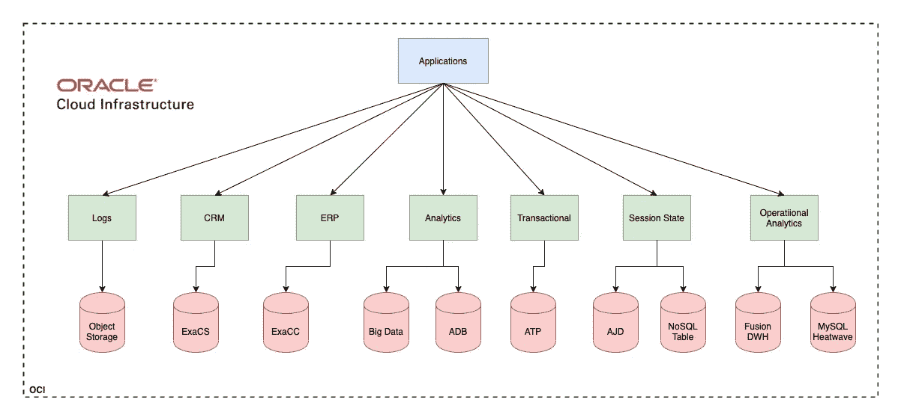
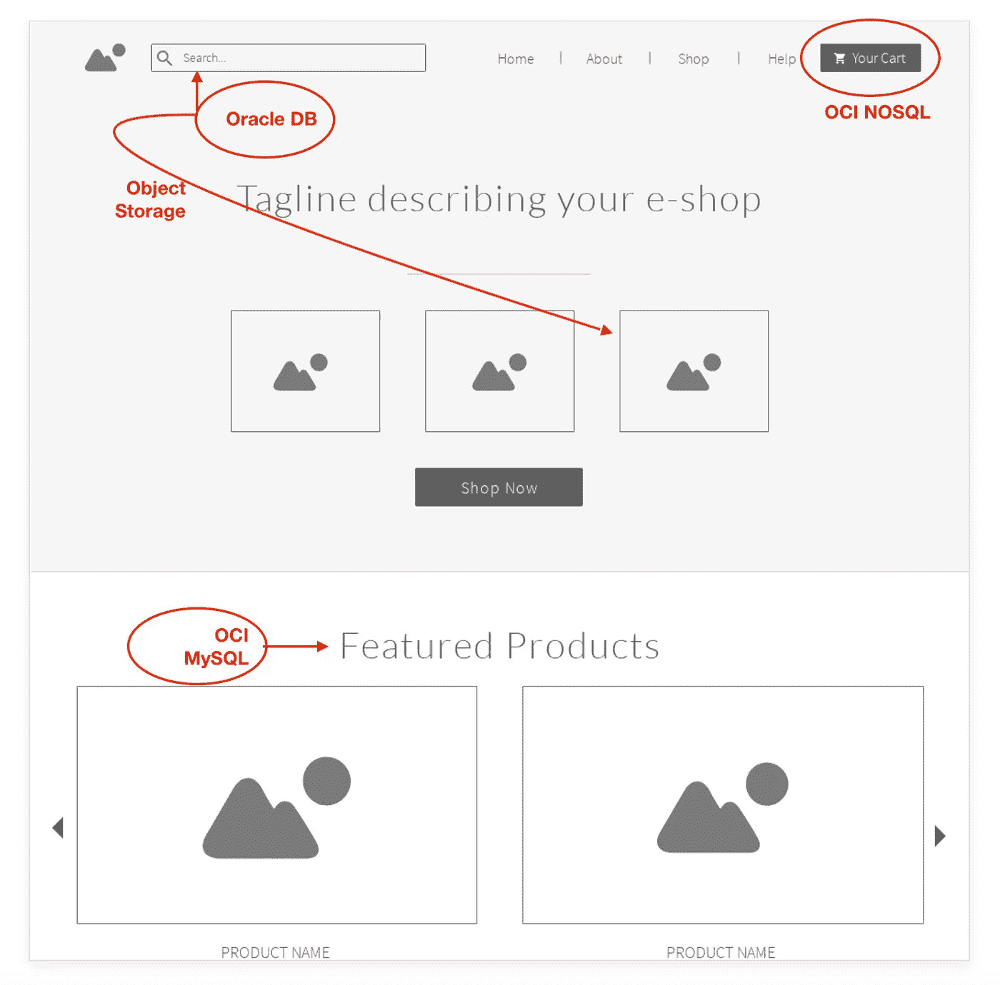
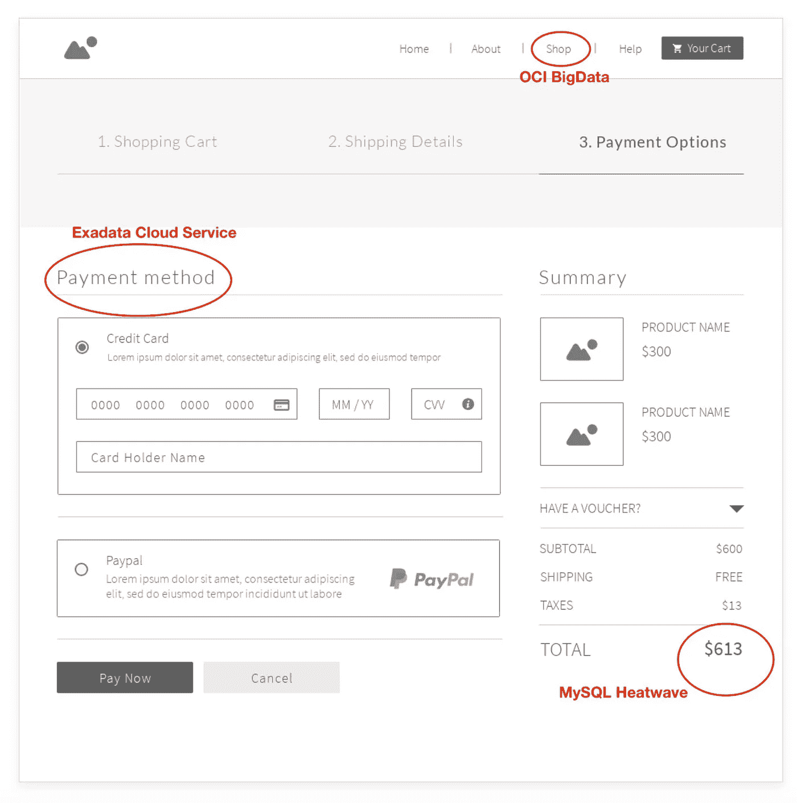

# Oracle 云基础设施数据服务的多语言持久性

> 原文：<https://medium.com/oracledevs/polyglot-persistence-with-oracle-cloud-infrastructure-data-services-372334fe1463?source=collection_archive---------2----------------------->

这是一篇联合文章，也出现在 OCI 的官方博客上

**简介**

多语言持久性是一个术语，您可能在最近讨论新的云计算范式时听到过很多。虽然这听起来相当复杂，但在计算环境中该术语的简单定义是“多语言持久性是指使用不同的数据存储来存储和处理应用程序不同功能的数据。例如，在线销售产品的电子商务网站将使用 NoSQL 商店来存储在网站上购物的用户的会话状态，而捕获信用卡信息的支付系统将它保存到像 Oracle 这样的关系数据库中。以类似的方式，您可以实现不同的服务来使用不同的数据存储，并避免构建一个单一的应用程序，其中一个数据库故障会导致整个业务瘫痪。对多语言数据存储的需求不仅是为了高可用性，也是为了满足互联网规模应用程序的可伸缩性需求。

**历史**

如果您在过去的 20 年中一直在企业数据市场工作或作为数据专业人员工作，您可能会很容易地使用多语言持久性，甚至不知道这个术语。过去，企业应用程序套件总是使用各种关系数据库、平面文件 NFS 存储和其他数据存储技术来存储和处理从不同源到目标系统的不同类型的数据。例如:一个组织的主要事务性数据库可能运行在 IBM 大型机中，辅助应用程序运行在 Microsoft SQL Server 上，ETL 后的一堆文件在被运行在 Oracle 数据库上的上游数据仓库使用之前暂存在 NAS 机器上。这是云时代之前多语言持久性的一个经典例子。没有专门的术语来描述它。

**多语言持久性和云**

先不说多语言持久性的定义，让我们来看看它在云计算时代意味着什么，在这个时代，微服务、无服务器、大数据、弹性等术语经常被当作时髦词汇来使用。在“云”中，您部署并运行不在您的数据中心托管的应用程序；随之而来的是更快地调配和使用数据的额外灵活性。传统企业有人力和资源来建立数据中心，并通过雇佣大量系统和网络运营人员来维护数据中心。然而，在 21 世纪初，许多公司开始出现，尽管他们开始建立自己的数据中心，但运营和建立数据中心对他们的核心业务没有利润。网飞就是一个很好的例子——网飞是内容的创造者和分发者，管理数据中心不是他们的强项，或者对他们来说没有任何逻辑上的商业意义。几年前，网飞完全从他们自己的 DC 迁移到了云上。慢慢地，许多新公司认为这种模式更有意义，以至于新的创业公司开始用云优先的方法构建他们的服务，这种方法现在被称为云原生。

随着大数据技术和互联网规模对象存储(有点类似于内部部署的文件存储)的出现，您突然有了更多选择来存储和处理数据。新增加的数据创建速度和数据量迅速淹没了关系数据库，扩展了容量，产生了一种新的 NoSQL 数据库；具有简单无模式模型的数据库，其中只有一个键和一个匹配值。随着这些新的计算范式导致了 NoSQL 数据库产品的爆炸式增长，如 MongoDB、Cassandra、Amazon DynamoDB 等。

那么这一切在哪里适合拥有多个数据存储呢？让我们把故事向前推进一点。所以现在，同样的初创公司或者我称之为“成长中的独角兽”开始在云中构建所有这些需要更多互联网规模受众的应用程序。随着互联网规模的扩大，产生了大量的数据，但这些数据并没有被能够从中获取价值的应用程序立即使用。关系数据库不适合这些类型的工作负载。因此，初创企业和规模化企业对不同的钉子采取了不同的方法。一种尺寸不适合所有人。这意味着拼车应用程序的前端使用 Kafka 将请求传输到 Hadoop hive store，并使用关系数据库来存储客户和司机资料，而列数据存储则用于执行分析。当然，这是对不同服务的复杂编排的简化视图，这些服务相互交互，并且每个服务都使用不同的数据存储来实现特定的功能。这就是多语言持久性的本质。

**多语言坚持与企业**

因此，初创企业和扩展企业肯定需要它们的多个数据源，但是您可能会问为什么企业需要不同的数据存储。答案是，在过去的十年中，企业计算和互联网规模计算在通过互联网增加利润和宣传传统产品方面出现了重叠。这些天，在你的 Instagram 或脸书 feed 上看到房屋贷款的广告并不少见。如今，要推出一个大公司提供的利基产品，你需要与初创公司相同的方法来处理和存储数据。企业最终面临着与初创公司相同的挑战，即最大限度地减少建立数据中心的资本支出。新的优先事项是专注于他们的核心产品，并有办法消费来自各种不同来源的大量数据。存储和处理所有这些数据意味着企业现在需要迎合互联网规模的受众。

**多语言持久性和 Oracle**

Oracle 一直被认为是企业应用程序，Oracle 数据库是四十多年来企业应用程序的主要数据存储。2018 年，甲骨文意识到这种不断增长的企业工作负载与互联网规模计算交织在一起，推出了第二代云产品，称为甲骨文云基础设施，缩写为 OCI。OCI 是建立在吸取了其他云的错误和缺点之上的。

OCI 提供了多种不同的数据存储产品，使多语言持久性原则现在可用于互联网规模的企业，以及企业应用程序的安全性和平衡性能。

**面向多语言持久性的 Oracle 云基础设施数据存储**

**OCI 数据商店产品**

OCI 有多种数据服务来构建云原生应用程序或运行整体应用程序，并为应用程序的每个模块提供不同的数据持久性数据存储。

**关系数据存储:**

1.  [Oracle 自主事务处理(ATP)数据库](https://docs.oracle.com/en-us/iaas/Content/Database/Concepts/adboverview.htm)
2.  [甲骨文自主数据仓库(ADB)数据库](https://docs.oracle.com/en-us/iaas/Content/Database/Concepts/adboverview.htm)
3.  [MySQL 数据库系统— OLTP](https://www.oracle.com/au/mysql/)
4.  [MYSQL 热浪— OLAP](https://www.oracle.com/au/mysql/heatwave/)
5.  [甲骨文数据库虚拟机系统](https://docs.oracle.com/en-us/iaas/Content/Database/Concepts/overview.htm)
6.  [甲骨文自主 JSON 数据库(AJD)](https://www.oracle.com/au/autonomous-database/autonomous-json-database/)
7.  [Oracle 数据库云服务器云服务](https://www.oracle.com/au/engineered-systems/exadata/cloud-service/)
8.  [Oracle 数据库云服务器@客户(ExaCC)](https://www.oracle.com/au/engineered-systems/exadata/cloud-at-customer/)
9.  [Oracle 融合分析数据仓库(融合 DWH)](https://www.oracle.com/au/business-analytics/fusion-analytics.html)

**NoSQL 数据仓库:**

[10。NoSQL 数据库—表格](https://www.oracle.com/au/database/nosql-cloud.html)

**对象存储:**

[11。OCI 对象存储桶](https://docs.oracle.com/en-us/iaas/Content/Object/Concepts/objectstorageoverview.htm)

**数据湖:**

[12。甲骨文大数据服务](https://www.oracle.com/au/big-data/)

# OCI 电子商务网站示例

下面的例子通过一个线框图表演示了如何使用不同的 OCI 数据存储产品，通过多语言持久性在 OCI 建立一个电子商务商店。该在线商店的不同微服务使用不同的存储选项来保存数据

Sample e-Commerce Homepage using OCI Data Services

Checkout page using OCI Data Services

**总结**

Oracle Cloud Infrastructure 提供了各种数据服务来创建云本地多语言应用程序，或者将企业应用程序提升和转移到云，并对其进行重构，以针对不同的功能使用不同的数据存储。