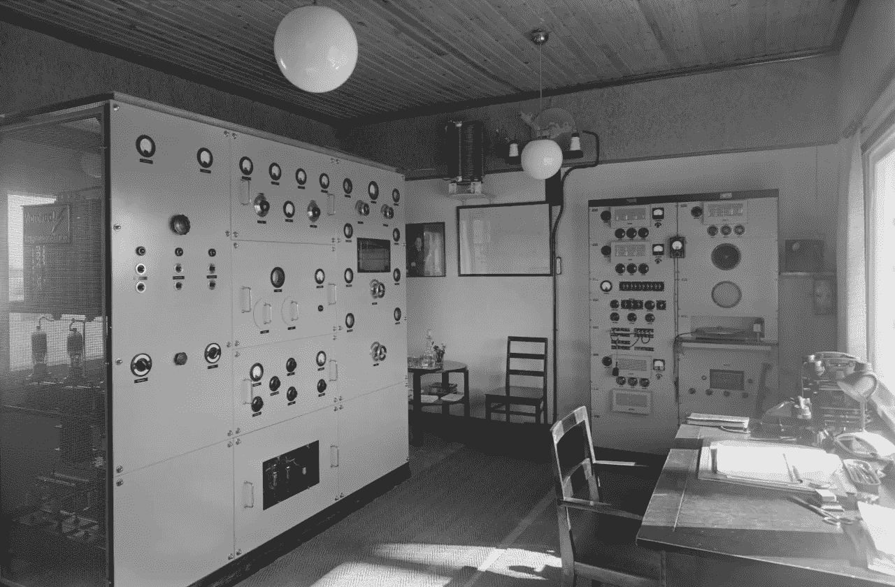

# 聚合物测试技巧

> 原文：<https://medium.com/google-developer-experts/polymer-testing-tips-f217ba94a64?source=collection_archive---------0----------------------->



在我的[上一篇文章](/@granze/polymer-unit-testing-d6a69910dc31)中，我写了如何开始在聚合物中进行单元测试。目标是设置测试环境，并使用最佳实践和利用 Polymer 提供的良好工具编写您的第一个测试。

在这篇文章中，我将涵盖更高级的主题，如用户交互模拟、持续集成的自动测试、在多种操作系统/浏览器上的测试以及更多有用的技巧。

# 模拟用户交互

[Iron Test Helpers](https://github.com/PolymerElements/iron-test-helpers) 提供了一组方法来模拟鼠标或键盘与元素的交互。

在下面的例子中，您希望确保您的开始按钮在单击后将被禁用，以避免用户单击它两次。为此，您只需要将一个监听器连接到按钮引用，并使用 **tap** 方法来模拟点击/轻击动作。

# 可访问性测试

在构建新元素或应用程序时，可访问性是需要记住的一个非常重要的方面。好消息是测试聚合物的可及性是小菜一碟。

在 WCT 中构建的 **a11ySuite()** 方法为给定的 *<测试夹具>* 运行可访问性审计。将元素引用作为参数传递给 a11Suite 方法，就完成了。那很容易，不是吗？

> 您可以使用可访问性开发工具 [Chrome 扩展](https://chrome.google.com/webstore/detail/accessibility-developer-t/fpkknkljclfencbdbgkenhalefipecmb)运行相同的测试。

# 测试阴影和阴暗的 DOM

不幸的是，并不是所有的浏览器都支持影子 DOM，因此 Polymer 默认使用 [Shady DOM](https://www.polymer-project.org/1.0/articles/shadydom.html) 。Shady DOM 兼容 Shadow DOM，但是渲染的 DOM 树不一样。因此，如果您想确保您的元素在这两种情况下都能正常工作，您需要正确地测试它。

为此，您只需要调用您的测试套件两次:一次像平常一样，另一次将 **dom=shadow** 作为查询参数传递。

# CI 集成和 Travis 徽章


WCT 需要一个真正的浏览器来运行，在过去，我想知道如何在像 Travis 这样的持续集成环境中运行我的聚合物测试。嗯，这比你想象的要简单，只需要在你的 **.travis.yml** 文件中增加几行就行了。

首先，您需要安装 Bower、web-component-tester 和您的元素依赖项。
既然 Travis 已经安装了 xvfb (X 虚拟帧缓冲区)和 Firefox，你只需要导出显示并启动 xvfb 即可。

# 使用 Sauce Labs 进行远程测试

[酱实验室](https://saucelabs.com/)允许你在云端的多个 OS/浏览器上运行测试，对于开源项目是免费的。要开始使用这项服务，你需要先在[注册](https://saucelabs.com/signup)。

WCT 有一个内置插件酱实验室，所以，你唯一需要做的事情，是通过一些选项给 WCT:

```
wct --sauce 'default' --sauce-username <username> --sauce-access-key <access-key>
```

在第一个选项中(*酱*)，你可以传递一个你想在其上运行测试的操作系统/浏览器列表，或者像上面的例子一样，你可以将值设置为‘default’来在预定义的浏览器中运行测试。

因为您必须通过测试认证，所以您还需要传递您的用户名和访问密钥。您可以在您的[用户设置页面](https://saucelabs.com/beta/user-settings)中找到这些信息。

如果您想指定自己的浏览器列表，一种简便的方法是将它们列在一个名为 **wct.conf.json** 的文件中，您可以将它放在项目的根目录中。

# 特拉维斯+酱实验室

如果您有兴趣了解如何将 Travis CI 与 Sauce Labs 集成，请观看以下 Polycasts 剧集中的 Rob Dodson。

# **了解更多信息**

本文中的大多数例子都取自我写的 **<翻转时钟>** 元素。我建议你在 Github 上浏览[代码](https://github.com/Granze/flip-clock)以获得更好的概述。

观看这些伟大的 Polycasts 剧集，你可以了解更多关于测试聚合物元素的知识。