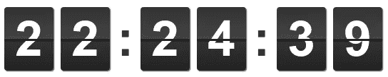
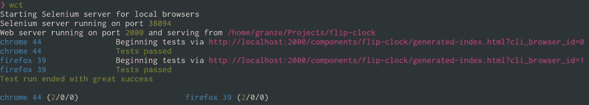

# 聚合物单元测试

> 原文：<https://medium.com/google-developer-experts/polymer-unit-testing-d6a69910dc31?source=collection_archive---------0----------------------->

在前端世界里，测试是一个怪异的话题。开发人员知道测试有多重要，但是他们中的许多人并不接受这种实践。这是因为测试通常被认为是耗时且困难的任务。

有时更难的部分是刚刚开始，这不仅仅是测试特有的。出于这个原因，在这篇文章中，我们将通过基础，留下更高级的主题和一些细节。一旦你掌握了核心概念，并且让你的第一次测试开始工作，我敢打赌你会更有动力去深入挖掘这个主题。

## Web 组件测试器

Polymer 附带了一个方便的工具，叫做 web-component-tester (WCT ),这将使测试你的元素变得非常容易。

如果您习惯于测试您的应用程序，您的第一个想法是您不想学习一个新工具，对吗？好消息是，你可能已经知道 WCT 赖以建立的工具。如果你已经熟悉了[摩卡](http://mochajs.org/)、[柴](http://chaijs.com/)和[兴农](http://sinonjs.org/)，你就可以开始了。如果您是测试新手，并且以前从未听说过这些名字，不要担心，请继续阅读。

# 设置

首先，你需要通过 NPM 全球安装 WCT。

```
npm install -g web-component-tester
```

作为测试套件，您可以使用。html 文件，如下所示:

The basic HTML page with the required dependencies

如您所见，您的测试套件看起来与您通常用来包含聚合物元素的 HTML 文件几乎相同。唯一的区别是您需要包含 **browser.js** ，它负责为您加载所有需要的库，以及 **test-fixture-mocha.js** ，我稍后会谈到它。

# 编写测试

在本文中，您将测试一个名为<flip-clock>的聚合物元素。</flip-clock>

[](https://github.com/Granze/flip-clock)

Check out the <flip-clock> source code on Github clicking on the image

您需要做的第一件事是将<flip-clock>元素导入页面。除此之外，还要导入<test-fixture>元素。</test-fixture></flip-clock>

> 元素可以简化一致重置测试套件 DOM 的工作。要使用它，将测试套件的 DOM 包装成一个模板。稍后你会发现为什么这个测试至关重要。

Elements import and instantiation

您已经准备好编写实际的测试了。

在一个脚本标签中添加 *describe* 函数和被测元素的名称，在本例中是< flip-clock >。在每个函数之前的*中，我们用其 *id* 引用我们的元素。正如您可能想象的那样，这个函数在每次测试之前都会被调用。
context*函数不是强制性的，但是它是一种对我们的测试进行分组的便捷方式。

```
describe('<flip-clock>', function() {
  var clock;

  beforeEach(function() {
    clock = fixture('clock');
  }); context('common tests', function() {

  });
});
```

该元素公开 showButtons 属性，其默认值为 *false* 。当*为真*时，命令按钮出现。为了切换它们的可见性，您需要在您的定制元素上添加 *show-button* 属性。

首先，在元素上设置 *show-buttons* 属性，然后确保 *showButtons* 属性为 true。之后，检查包含在带有*按钮*类的 *div* 中的按钮是否可见。

> 由于 WCT 使用 **Mocha** 和 **Chai** ，你可以在这些库提供的所有接口中进行选择。我个人比较喜欢柴的 *BDD* 风格搭配 [***期待***](http://chaijs.com/api/bdd/) 界面，不过你可以选择你最喜欢的那个。

```
*it*('should display the command buttons', function() {
  clock.setAttribute('show-buttons', 'true');
  expect(clock.showButtons).to.be.equal(true);
  expect(clock.querySelector('.buttons').attributes)
  .to.have.ownProperty('visible');
});
```

现在重复测试，不设置*显示按钮*属性。在这种情况下，我们预计 *showButtons* 属性为 false，按钮不可见。

```
*it*('should not display the command buttons', function() {
  expect(clock.showButtons).to.be.equal(false);
  expect(clock.querySelector('.buttons').attributes)
  .to.not.have.ownProperty('visible');
});
```

您将得到这样的代码:

The final result

# 运行测试

为此，在元素的根目录中打开一个终端，并使用 *wct* 命令*启动 web 组件测试器。它会自动在你机器上安装的所有浏览器中运行测试。*



哇，你的前两项测试刚刚通过！但是，如果您没有使用<test-fixture>元素，会发生什么呢？简短的回答是:第二次测试会失败。
这是因为您将 show-buttons 属性设置为 true，并且在下面的测试中，您期望 *showButtons* 为 false。
使用<文本夹具>(以及每个功能之前的*)你将在一个“干净的”元素上运行每个测试。*</test-fixture>

# 接下来呢？

看看 [Github](https://github.com/Granze/flip-clock) 上的<flip-clock>项目，了解更多关于这个元素是如何构建的，并检查我为这个元素编写的其他测试。
你可以在[库](https://github.com/PolymerElements/test-fixture)上找到更多关于<测试夹具>的信息。</flip-clock>

web 组件测试器 [README.md](https://github.com/Polymer/web-component-tester/blob/master/README.md) 也是一个很好的入门资源。