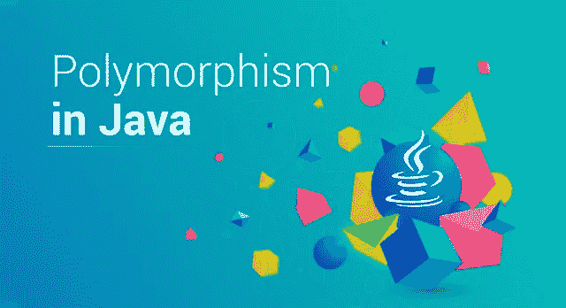
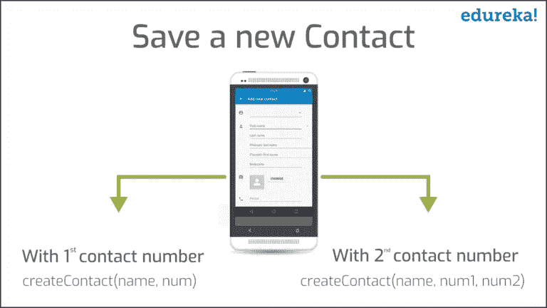

# 掌握 Java 中的多态性并举例说明

> 原文：<https://medium.com/edureka/polymorphism-in-java-9559e3641b9b?source=collection_archive---------0----------------------->



Polymorphism in Java — Edureka

在现实世界中，你可能见过变色龙按照自己的要求改变颜色。如果有人问，“它是怎么做到的？”，你可以简单的说“因为，它是多态的”。类似地，在编程领域，Java 对象拥有相同的功能，其中每个对象可以采用多种形式。这种特性在 Java 中被称为多态性，Poly 表示许多，morph 表示变化(或“形式”)。在本文中，让我们讨论一下面向对象编程的关键概念，即 Java 中的多态性。

以下是本文将要涉及的主题:

*   什么是多态性？
*   Java 中的多态性及其示例
*   Java 中多态性的类型

1.  静态多态性
2.  动态多态性

*   Java 中多态性的其他特征

# 什么是多态性？

**多态性**是一个实体采取几种形式的能力。在面向对象编程中，它指的是一个对象(或对一个对象的引用)采用不同形式的对象的能力。它允许向每个类发送一个公共的数据收集消息。多态鼓励称为“可扩展性”,这意味着一个对象或一个类可以扩展它的用途。


在上图中，你可以看到，*男子*只有一个，但他扮演着多重角色，比如——他是孩子的父亲，他是员工，销售人员等等。这就是所谓的 ***多态性*** 。

现在，让我们通过一个真实的例子来理解这一点，并看看这个概念如何适合面向对象编程。

# Java 中的多态性及其示例

让我们借助下面的问题陈述来理解这个(例子)。

> 考虑一个保存联系人的手机。假设一个人有两个联系号码。为了方便使用，你的手机提供了一种功能，你可以用同一个名字保存两个号码。

类似地，在 Java 中，一个对象只有一个，但是它可以根据程序的上下文采用多种形式。假设你想写一个函数保存同一个人的两个联系号码，可以像这样创建——**void create contact(String name，int number1，int number2)** 。

现在，没有必要让你的联系人列表中的每个人都有两个联系号码。他们中很少有人可能只有一个联系电话。在这种情况下，与其创建另一个不同名称的方法来保存联系人的一个号码，不如创建另一个相同名称的方法，即 **createContact()。**但是，不是取两个联系号码作为参数，而是只取一个联系号码作为参数即**void create contact(String name，int number1)** 。



在上图中可以看到， **createContact()** 方法有两个不同的定义。这里，要执行哪个定义取决于要传递的参数数量。如果传递了一个参数，那么在联系人下只保存一个联系人号码。但是，如果两个联系号码同时传递给这个方法，那么两个号码都将保存在同一个联系人下。*这也叫* ***法重载*** *。*

现在我们再举一个例子，深入理解多态性。

> 假设你去你家附近的购物中心买了一条牛仔裤。一周后，当你去附近的城镇旅行时，你发现了另一个购物中心。你走进商店，发现同一品牌的一款新品，你甚至更喜欢它。但是你决定从你家附近的商店购买它。一回到家，你又去你家附近的购物中心买那条很棒的牛仔裤，但是找不到。为什么？因为那是邻镇那家商店的特产。

现在将这个概念与像 Java 这样的面向对象语言联系起来，假设您有一个名为 XJeans 的类，它包含一个名为 **jeans()** 的方法。用这种方法，你可以得到一条 Allen Solly 牛仔裤。对于邻镇的牛仔裤，还有另外一类 **YJeans** 。XJeans 和 YJeans 类都扩展了父类 **ABCShoppingCenter** 。YJeans 类包含一个名为 **Jeans()** 的方法，使用该方法可以获得两种 jeans 变体。

```
classABCShoppingCenter {
public void jeans() {
System.out.println("Default AllenSolly Jeans");
}
}
class XJeans extends ABCShoppingCenter {
public void jeans() {
System.out.println("Default AllenSolly Jeans");
}
}
class YJeans extends ABCShoppingCenter { 
// This is overridden method
public void jeans() {
System.out.println("New variant of AllenSolly");
} 
}
```

因此，我们可以有一个单一的方法 jeans **()** ，而不是为每个新的变体创建不同的方法，这可以根据不同的子类来定义。因此，名为 **jeans()** 的方法有两个定义——一个只包含默认 jeans，另一个包含默认 jeans 和新变体。现在，调用哪个方法将取决于它所属的对象类型。如果您创建了 **ABCShoppingCenter** 类对象，那么将只有一条牛仔裤可用。但是如果你创建了 **YJeans** 类对象，扩展了 **ABCShoppingCenter** 类，那么你就可以拥有这两种变体。*这也叫* ***方法覆盖*** *。因此，多态通过降低复杂性来增加代码的简单性和可读性。这使得 Java 中的多态性成为一个非常有用的概念，它也可以应用于现实世界的场景中。*

我希望您对多态性的概念有所了解。现在，让我们继续这篇文章，理解 Java 中不同类型的**多态性。**

# Java 中多态性的类型

Java 支持两种类型的多态性，它们如下:

*   静态多态性
*   动态多态性

## 静态多态性

在编译时解析的多态性称为静态多态性。方法重载是编译时多态性的一个例子。

***例如***

**方法重载**是一个特性，它允许一个类有两个或更多的**方法**有相同的名字，但是有不同的参数列表。在下面的例子中，同一个方法 add()有两个定义。因此，哪个 add()方法将被调用是由编译时的参数列表决定的。这就是这也被称为编译时多态性的原因。

```
class Calculator
{
int add(int x, int y)
{
return x+y;
}
int add(int x, int y, int z) 
{
return x+y+z;
}
}
public class Test
{
public static void main(String args[])
{
Calculator obj = new Calculator();
System.out.println(obj.add(100, 200));
System.out.println(obj.add(100, 200, 300));
}
}
```

这就是静态多态的工作方式。现在，让我们来理解什么是 Java 中的动态多态。

## 动态多态性

动态多态性是在运行时解决对被覆盖方法的调用的过程，这就是为什么它被称为运行时多态性。方法重写是实现动态多态性的方法之一。在任何面向对象的编程语言中，**覆盖**是一个特性，它允许子类或子类提供一个**方法**的特定实现，该方法已经由它的一个超类或父类提供。

***例子***
在下面的例子中，你有两个类 **MacBook** 和 **iPad** 。 *MacBook* 是父类 *iPad* 是子类。子类正在覆盖父类的方法 **myMethod()** 。在这里，我已经将子类对象分配给父类引用，以确定在运行时将调用哪个方法。决定调用哪个版本的方法的是对象的类型(而不是引用的类型)。

```
class MacBook{
public void myMethod(){
System.out.println("Overridden Method");
}
}
public class iPad extends MacBook{
public void myMethod(){
System.out.println("Overriding Method");
}
public static void main(String args[]){
MacBook obj = new iPad();
obj.myMethod();
}
}
```

***输出:***

覆盖方法

当您叫用覆写方法时，物件会决定要执行哪个方法。因此，这个决定是在运行时做出的。

我已经列出了几个更重要的例子。

```
MacBook obj = new MacBook();
obj.myMethod();
// This would call the myMethod() of parent class MacBook

iPad obj = new iPad();
obj.myMethod();
// This would call the myMethod() of child class iPad

MacBook obj = new iPad();
obj.myMethod();
// This would call the myMethod() of child class iPad
```

在第三个例子中，要执行子类的方法，因为需要执行的方法是由对象的类型决定的。由于对象属于子类，所以调用子类版本的 **myMethod()** 。

## 动态多态性的优势

1.  动态多态性允许 Java 支持方法的覆盖，这是运行时多态性的核心。
2.  它允许一个类指定对它的所有派生方法通用的方法，同时允许子类定义一些或所有这些方法的具体实现。
3.  它还允许子类添加其特定的方法子类来定义相同的特定实现。

这都是关于不同类型的。现在让我们看看多态性的其他一些重要特征。

# Java 中多态性的其他特征

除了 Java 中这两种主要类型的多态性之外，Java 编程语言中还有其他一些表现出多态性的特征，比如:

*   强迫
*   运算符重载
*   多态参数

让我们来讨论其中的一些特征。

## **胁迫**

多态强制处理由编译器完成的隐式类型转换，以防止类型错误。一个典型的例子是整数和字符串的连接。

```
String str="string"=2;
```

## **操作员超载**

操作符或方法重载指的是同一符号或操作符的多态特征，根据上下文具有不同的含义(形式)。例如，加号(+)用于数学加法和字符串连接。在任一情况下，只有上下文(即参数类型)决定符号的解释。

```
String str = "2" + 2;
int sum = 2 + 2;
System.out.println(" str = %s\n sum = %d\n", str, sum);
```

**输出:**

```
str = 22
sum = 4
```

## **多态参数**

参数多态性允许类中的参数或方法的名称与不同的类型相关联。在下面的例子中，我已经将*内容*定义为一个*字符串*，随后定义为一个*整数*:

```
public class TextFile extends GenericFile{
private String content;
public String setContentDelimiter(){
int content = 100;
this.content = this.content + content;
}
}
```

**注意:** *多态参数的声明会导致一个被称为* **变量隐藏的问题。**

这里，参数的局部声明总是覆盖另一个同名参数的全局声明。为了解决这个问题，通常建议使用全局引用，如 *this* 关键字，在局部上下文中指向全局变量。

至此，我们结束了这篇关于 Java 多态性的文章。请留意本系列中的其他文章，它们将帮助您理解 Java 的各种概念。

如果你想查看更多关于人工智能、DevOps、道德黑客等市场最热门技术的文章，你可以参考 Edureka 的官方网站。

请留意本系列中的其他文章，它们将解释 Java 的各个方面。

> 1.[面向对象编程](/edureka/object-oriented-programming-b29cfd50eca0)
> 
> 2.[Java 中的继承](/edureka/inheritance-in-java-f638d3ed559e)
> 
> 3. [Java 教程](/edureka/java-tutorial-bbdd28a2acd7)
> 
> 4.[Java 中的抽象](/edureka/java-abstraction-d2d790c09037)
> 
> 5. [Java 字符串](/edureka/java-string-68e5d0ca331f)
> 
> 6. [Java 数组](/edureka/java-array-tutorial-50299ef85e5)
> 
> 7. [Java 合集](/edureka/java-collections-6d50b013aef8)
> 
> 8. [Java 线程](/edureka/java-thread-bfb08e4eb691)
> 
> 9.[Java servlet 简介](/edureka/java-servlets-62f583d69c7e)
> 
> 10. [Servlet 和 JSP 教程](/edureka/servlet-and-jsp-tutorial-ef2e2ab9ee2a)
> 
> 11.[Java 中的异常处理](/edureka/java-exception-handling-7bd07435508c)
> 
> 12.[高级 Java 教程](/edureka/advanced-java-tutorial-f6ebac5175ec)
> 
> 13. [Java 面试问题](/edureka/java-interview-questions-1d59b9c53973)
> 
> 14. [Java 程序](/edureka/java-programs-1e3220df2e76)
> 
> 15.科特林 vs 爪哇
> 
> 16.[依赖注入使用 Spring Boot](/edureka/what-is-dependency-injection-5006b53af782)
> 
> 17.[Java 中的可比](/edureka/comparable-in-java-e9cfa7be7ff7)
> 
> 18.[十大 Java 框架](/edureka/java-frameworks-5d52f3211f39)
> 
> 19. [Java 反射 API](/edureka/java-reflection-api-d38f3f5513fc)
> 
> 20.[Java 中的 30 大模式](/edureka/pattern-programs-in-java-f33186c711c8)
> 
> 21.[核心 Java 备忘单](/edureka/java-cheat-sheet-3ad4d174012c)
> 
> 22.[Java 中的套接字编程](/edureka/socket-programming-in-java-f09b82facd0)
> 
> 23. [Java OOP 备忘单](/edureka/java-oop-cheat-sheet-9c6ebb5e1175)
> 
> 24.[Java 中的注释](/edureka/annotations-in-java-9847d531d2bb)
> 
> 25.[Java 中的图书管理系统项目](/edureka/library-management-system-project-in-java-b003acba7f17)
> 
> 26.[爪哇树](/edureka/java-binary-tree-caede8dfada5)
> 
> 27.[Java 中的机器学习](/edureka/machine-learning-in-java-db872998f368)
> 
> 28.[Java 中的顶级数据结构&算法](/edureka/data-structures-algorithms-in-java-d27e915db1c5)
> 
> 29. [Java 开发者技能](/edureka/java-developer-skills-83983e3d3b92)
> 
> 30.[前 55 个 Servlet 面试问题](/edureka/servlet-interview-questions-266b8fbb4b2d)
> 
> 31. [](/edureka/java-exception-handling-7bd07435508c) [顶级 Java 项目](/edureka/java-projects-db51097281e3)
> 
> 32. [Java 字符串备忘单](/edureka/java-string-cheat-sheet-9a91a6b46540)
> 
> 33.[Java 中的嵌套类](/edureka/nested-classes-java-f1987805e7e3)
> 
> 34. [Java 集合面试问答](/edureka/java-collections-interview-questions-162c5d7ef078)
> 
> 34.[Python 中的机器学习分类器](/edureka/machine-learning-classifier-c02fbd8400c9)
> 
> 35. [Python Scikit-Learn 备忘单](/edureka/python-scikit-learn-cheat-sheet-9786382be9f5)
> 
> 36.[机器学习工具](/edureka/python-libraries-for-data-science-and-machine-learning-1c502744f277)
> 
> 37.[用于数据科学和机器学习的 Python 库](/edureka/python-libraries-for-data-science-and-machine-learning-1c502744f277)
> 
> 38.[Python 中的聊天机器人](/edureka/how-to-make-a-chatbot-in-python-b68fd390b219)
> 
> 39.[蟒蛇收藏](/edureka/collections-in-python-d0bc0ed8d938)
> 
> 40. [Python 模块](/edureka/python-modules-abb0145a5963)
> 
> 41. [Python 开发者技能](/edureka/python-developer-skills-371583a69be1)
> 
> 42.[哎呀面试问答](/edureka/oops-interview-questions-621fc922cdf4)
> 
> 43.[Python 开发者简历](/edureka/python-developer-resume-ded7799b4389)
> 
> 44.[Python 中的探索性数据分析](/edureka/exploratory-data-analysis-in-python-3ee69362a46e)
> 
> 45.[带 Python 的乌龟模块的贪吃蛇游戏](/edureka/python-turtle-module-361816449390)
> 
> 46. [Python 开发者工资](/edureka/python-developer-salary-ba2eff6a502e)
> 
> 47.[主成分分析](/edureka/principal-component-analysis-69d7a4babc96)
> 
> 48. [Python vs C++](/edureka/python-vs-cpp-c3ffbea01eec)
> 
> 49.[刺儿头教程](/edureka/scrapy-tutorial-5584517658fb)
> 
> 50. [Python SciPy](/edureka/scipy-tutorial-38723361ba4b)
> 
> 51.[最小二乘回归法](/edureka/least-square-regression-40b59cca8ea7)
> 
> 52. [Jupyter 笔记本小抄](/edureka/jupyter-notebook-cheat-sheet-88f60d1aca7)
> 
> 53. [Python 基础知识](/edureka/python-basics-f371d7fc0054)
> 
> 54. [Python 模式程序](/edureka/python-pattern-programs-75e1e764a42f)
> 
> 55.[Python 中的发电机](/edureka/generators-in-python-258f21e3d3ff)
> 
> 56. [Python 装饰师](/edureka/python-decorator-tutorial-bf7b21278564)
> 
> 57. [Python Spyder IDE](/edureka/spyder-ide-2a91caac4e46)
> 
> 58.[在 Python 中使用 Kivy 的移动应用](/edureka/kivy-tutorial-9a0f02fe53f5)
> 
> 59.[十大最佳学习书籍&练习 Python](/edureka/best-books-for-python-11137561beb7)
> 
> 60.[使用 Python 的机器人框架](/edureka/robot-framework-tutorial-f8a75ab23cfd)
> 
> 61.[使用 PyGame 的 Python 中的贪吃蛇游戏](/edureka/snake-game-with-pygame-497f1683eeaa)
> 
> 62. [Django 面试问答](/edureka/django-interview-questions-a4df7bfeb7e8)
> 
> 63.[十大 Python 应用](/edureka/python-applications-18b780d64f3b)
> 
> 64.[Python 中的哈希表和哈希表](/edureka/hash-tables-and-hashmaps-in-python-3bd7fc1b00b4)
> 
> 65. [Python 3.8](/edureka/whats-new-python-3-8-7d52cda747b)
> 
> 66. [Python Visual Studio](/edureka/python-visual-studio-cef3ad98a9e2)
> 
> 67.[Python 中的支持向量机](/edureka/support-vector-machine-in-python-539dca55c26a)

*原载于 2019 年 1 月 31 日*[*www.edureka.co*](https://www.edureka.co/blog/polymorphism-in-java/)*。*