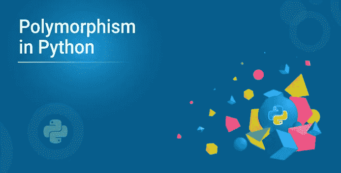
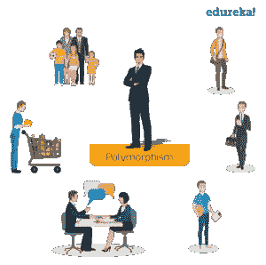

# 简化 Python 中的多态性

> 原文：<https://medium.com/edureka/polymorphism-in-python290fad16feb4-290fad16feb4?source=collection_archive---------3----------------------->



多态性定义了采取不同形式的能力。Python 中的多态性允许我们在子类中定义与其父类同名的方法。在本文中，我们将按照以下顺序详细介绍 Python 中的多态性:

*   什么是多态性？
*   Python 中的多态性
*   函数和对象的多态性
*   类方法的多态性
*   遗传多态性

# 什么是多态性？

多态取自希腊语 Poly(多)和 morphism(形式)。这意味着相同的函数名可以用于不同的类型。这使得编程更加直观和容易。

在 Python 中，我们有不同的方法来定义多态性。所以让我们继续，看看多态在 Python 中是如何工作的。

# Python 中的多态性

子类继承父类的所有方法。然而，在某些情况下，从父类继承的方法不太适合子类。在这种情况下，您必须在子类中重新实现该方法。



在 Python 中使用多态性有不同的方法。您可以使用不同的函数、类方法或对象来定义多态性。那么，让我们继续，详细了解一下这些方法。

# 函数和对象的多态性

您可以创建一个接受任何对象的函数，允许多态性。

让我们举一个例子，创建一个名为“ **func()** 的函数，它将接受一个我们命名为“obj”的对象。现在，让我们使用传递给它的' **obj** '对象给这个函数做些事情。在这种情况下，让我们调用方法 **type()** 和 **color()** ，每个方法都在两个类‘番茄’和‘苹果’中定义。现在，如果我们还没有“Tomato”和“Apple”类的实例，您必须创建它们:

```
**class** Tomato():
**def** type(self):
print("Vegetable")
**def** color(self):
print("Red")
**class** Apple():
**def** type(self):
print("Fruit")
**def** color(self):
print("Red")**def** func(obj):
obj.type()
obj.color()obj_tomato **=** Tomato()
obj_apple **=** Apple()
func(obj_tomato)
func(obj_apple)
```

**输出:**

```
Vegetable
Red
Fruit
Red
```

# 类方法的多态性

Python 以同样的方式使用两种不同的类类型。这里，您必须创建一个 for 循环，该循环遍历对象的元组。接下来，您必须调用这些方法，而不必关心每个对象是哪种类类型。我们假设这些方法实际上存在于每个类中。

这里有一个**示例**来展示类的多态性:

```
**class** India():
**def** capital(self):
print("New Delhi")**def** language(self):
print("Hindi and English")**class** USA():
**def** capital(self):
print("Washington, D.C.")**def** language(self):
print("English")
obj_ind **=** India()
obj_usa **=** USA()
**for** country **in** (obj_ind, obj_usa):
country.capital()
country.language()
```

**输出:**

```
New Delhi
Hindi and English
Washington, D.C.
English
```

# 遗传多态性

python 中的多态性定义了子类中与父类中的方法同名的方法。在继承中，子类从父类继承方法。此外，还可以修改子类中从父类继承的方法。

这主要用于从父类继承的方法不适合子类的情况。这个在子类中重新实现方法的过程称为方法重写。下面的例子展示了继承的多态性:

```
**class** Bird:
  **def** intro(self):
      print("There are different types of birds") **def** flight(self):
      print("Most of the birds can fly but some cannot")
**class** parrot(Bird):
  **def** flight(self):
      print("Parrots can fly")**class** penguin(Bird):
  **def** flight(self):
      print("Penguins do not fly")obj_bird **=** Bird()
obj_parr **=** parrot()
obj_peng **=** penguin()obj_bird.intro()
obj_bird.flight()obj_parr.intro()
obj_parr.flight()obj_peng.intro()
obj_peng.flight()
```

**输出:**

```
There are different types of birds
Most of the birds can fly but some cannot
There are different types of bird
Parrots can fly
There are many types of birds
Penguins do not fly
```

这些是在 Python 中定义多态性的不同方式。说到这里，我们的文章就到此为止了。我希望你理解了什么是多态，以及如何在 Python 中使用多态。

如果你想查看更多关于人工智能、DevOps、道德黑客等市场最热门技术的文章，那么你可以参考 [Edureka 的官方网站。](https://www.edureka.co/blog/?utm_source=medium&utm_medium=content-link&utm_campaign=polymorphism-in-python)

请留意本系列中的其他文章，它们将解释 Python 和数据科学的各个方面。

> *1。*[*Python 中的机器学习分类器*](/edureka/machine-learning-classifier-c02fbd8400c9)
> 
> *2。*[*Python Scikit-Learn Cheat Sheet*](/edureka/python-scikit-learn-cheat-sheet-9786382be9f5)
> 
> *3。* [*机器学习工具*](/edureka/python-libraries-for-data-science-and-machine-learning-1c502744f277)
> 
> *4。* [*用于数据科学和机器学习的 Python 库*](/edureka/python-libraries-for-data-science-and-machine-learning-1c502744f277)
> 
> *5。*[*Python 中的聊天机器人*](/edureka/how-to-make-a-chatbot-in-python-b68fd390b219)
> 
> *6。* [*Python 集合*](/edureka/collections-in-python-d0bc0ed8d938)
> 
> *7。* [*Python 模块*](/edureka/python-modules-abb0145a5963)
> 
> *8。* [*Python 开发者技能*](/edureka/python-developer-skills-371583a69be1)
> 
> *9。* [*哎呀面试问答*](/edureka/oops-interview-questions-621fc922cdf4)
> 
> *10。* [*一个 Python 开发者的简历*](/edureka/python-developer-resume-ded7799b4389)
> 
> *11。*[*Python 中的探索性数据分析*](/edureka/exploratory-data-analysis-in-python-3ee69362a46e)
> 
> *12。* [*蛇与蟒蛇的游戏*](/edureka/python-turtle-module-361816449390)
> 
> 13。 [*Python 开发者工资*](/edureka/python-developer-salary-ba2eff6a502e)
> 
> 14。 [*主成分分析*](/edureka/principal-component-analysis-69d7a4babc96)
> 
> *15。*[*Python vs c++*](/edureka/python-vs-cpp-c3ffbea01eec)
> 
> *16。* [*刺儿头教程*](/edureka/scrapy-tutorial-5584517658fb)
> 
> 17。[*Python SciPy*](/edureka/scipy-tutorial-38723361ba4b)
> 
> 18。 [*最小二乘回归法*](/edureka/least-square-regression-40b59cca8ea7)
> 
> 19。 [*Jupyter 笔记本小抄*](/edureka/jupyter-notebook-cheat-sheet-88f60d1aca7)
> 
> *20。* [*Python 基础知识*](/edureka/python-basics-f371d7fc0054)
> 
> *21。* [*Python 模式程序*](/edureka/python-pattern-programs-75e1e764a42f)
> 
> *22。*[*Python 中的*](/edureka/generators-in-python-258f21e3d3ff) 生成器
> 
> *23。* [*Python 装饰器*](/edureka/python-decorator-tutorial-bf7b21278564)
> 
> *24。*[](/edureka/spyder-ide-2a91caac4e46)*[*什么是 Python 中的套接字编程*](/edureka/socket-programming-python-bbac2d423bf9)*
> 
> **25。*[*Python 中使用 Kivy 的移动应用*](/edureka/kivy-tutorial-9a0f02fe53f5)*
> 
> **26。* [*十大最佳学习书籍&练习 Python*](/edureka/best-books-for-python-11137561beb7)*
> 
> **27。* [*机器人框架与 Python*](/edureka/robot-framework-tutorial-f8a75ab23cfd)*
> 
> **28。*[*Python 中的贪吃蛇游戏*](/edureka/snake-game-with-pygame-497f1683eeaa)*
> 
> **29。* [*Django 面试问答*](/edureka/django-interview-questions-a4df7bfeb7e8)*
> 
> **三十。* [*十大 Python 应用*](/edureka/python-applications-18b780d64f3b)*
> 
> *31。[*Python 中的哈希表和哈希表*](/edureka/hash-tables-and-hashmaps-in-python-3bd7fc1b00b4)*
> 
> *32。 [*Python 3.8*](/edureka/whats-new-python-3-8-7d52cda747b)*
> 
> **33。* [*支持向量机*](/edureka/support-vector-machine-in-python-539dca55c26a)*
> 
> **34。* [*Python 教程*](/edureka/python-tutorial-be1b3d015745)*
> 
> *35。[*Python Spyder*](/edureka/spyder-ide-2a91caac4e46)*

**原载于 2019 年 9 月 11 日*[*https://www.edureka.co*](https://www.edureka.co/blog/polymorphism-in-python/)*。**